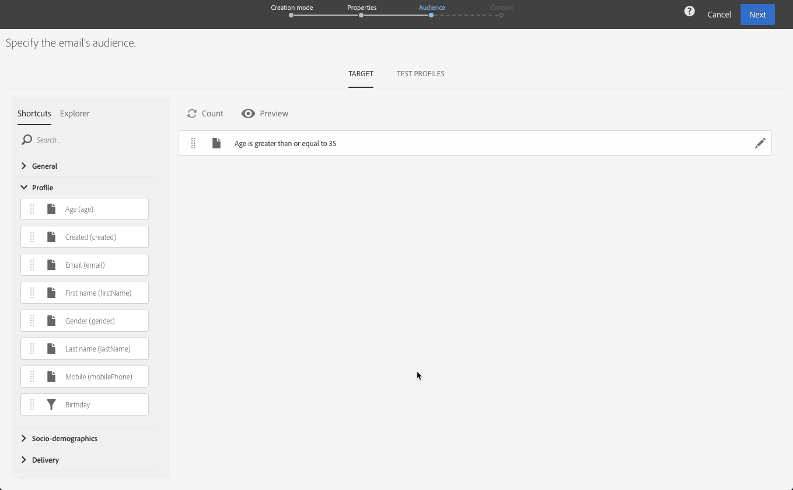

# 创建电子邮件{#creating-an-email}

您可以从营销活动、 [Adobe Campaign主页](../../start/using/marketing-activities.md#creating-a-marketing-activity)或营销活动列表中 [，创建电子邮件](../../start/using/interface-description.md#home-page)。 您还可以从工作流创建单发和重复发送的电子邮件。

1. 开始创建电子邮件营销活动后，请选择要使用的模板。

   默认情况下，您可以从多个模板中为每个营销活动进行选择。 这允许您根据需要预配置某些参数，并为交付分配品牌。 有关此内容的详细信息，请参阅 [管理模板](../../start/using/about-templates.md)。

   

   >[!NOTE]
   >
   >默认情况下，后续和A/B测试模板是隐藏的。 如果要显示左侧(侧 **[!UICONTROL Filter]** 面板)的框，请选中它们。

1. 输入电子邮件的常规属性。 您可以在“标签”字段中输入 **名称** ，然后编辑ID。 活动名称及其ID都显示在界面中，但邮件收件人看不到它们。

   您可以添加用户可在营销活动内容中看到的描述。

   

   >[!NOTE]
   >
   >您可以从主页或营销活动列表在父营销活动中创建电子邮件。 从已创建的营销活动中选择它。

1. 根据您的业务标准定义消息的目标。 请参阅 [管理配置文件](../../audiences/using/about-profiles.md)。

   您还可以定义将验证消息的测试配置文件。 请参阅 [管理测试配置文件](../../sending/using/managing-test-profiles-and-sending-proofs.md#managing-test-profiles)。

   

1. 使用电子邮件设计器定义消息内容、发送者姓名和主题并实现 [个性化](../../designing/using/overview.md)。 有关此方面的详细信息，请参阅关 [于电子邮件内容设计](../../designing/using/overview.md)。

   

   您可以使用预定义的内容模板或Dreamweaver或Adobe Experience Manager直接设计消息。 如果您不喜欢设计人员，还可以上传为您准备的内容，或从URL导入现有内容。 请参 [阅选择现有内容](../../designing/using/using-existing-content.md)。

1. 预览您的消息。 请参阅 [预览消息](../../sending/using/previewing-messages.md)。
1. 确认创建电子邮件。

   >[!NOTE]
   >
   >要保存电子邮件，您首先需要对内容进行一些编辑。 如果单击 **[!UICONTROL Cancel]** 此时，您将无法完成向导，并且将不会创建您的电子邮件。

   随后将显示电子邮件功能板。 它允许您检查消息并准 [备发送](../../sending/using/preparing-the-send.md)。

   使用 **[!UICONTROL Edit properties]** 右上角的按钮可以编辑电子邮件的属性。 例如，您可以配置电子邮件，以便在交付准备时间计算其标签。  本节中列出了可用 [的参数](../../administration/using/configuring-email-channel.md#list-of-email-properties)。

   

1. 计划发送。 请参 [阅计划消息](../../sending/using/about-scheduling-messages.md)。

   

1. 准备消息以分析其目标。 请参 [阅准备发送](../../sending/using/confirming-the-send.md)。

   

   >[!NOTE]
   >
   >您可以设置全局跨渠道疲劳规则，这些规则将自动从营销活动中排除过度征求的档案。 有关此问题的详细信息，请参阅 [疲劳规则](../../administration/using/fatigue-rules.md)。

1. 发送校样以检查和验证您的邮件并监控其收件箱呈现。 请参阅 [发送证明](../../sending/using/managing-test-profiles-and-sending-proofs.md#sending-proofs)。

   

1. 发送消息并通过消息功能板和日志检查其传送。 请参阅 [发送消息](../../sending/using/confirming-the-send.md)。

   

1. 通过传送报告衡量您的消息的影响。 有关报告的详细信息，请参 [阅此部分](../../reporting/using/about-dynamic-reports.md)。

**相关主题**:

* [创建电子邮件视频](https://helpx.adobe.com/campaign/kt/acs/using/acs-create-email-from-homepage-feature-video-use.html)
* [创建个性化的电子邮件](https://docs.campaign.adobe.com/doc/standard/getting_started/en/ACS_GettingStartedEmail.html) -分步指南
* [Adobe Campaign和Dreamweaver集成视频](https://helpx.adobe.com/campaign/kt/acs/using/acs-dreamweaver-integration-feature-video-use.html)
* [与Adobe Experience Manager集成](../../integrating/using/integrating-with-experience-manager.md)

