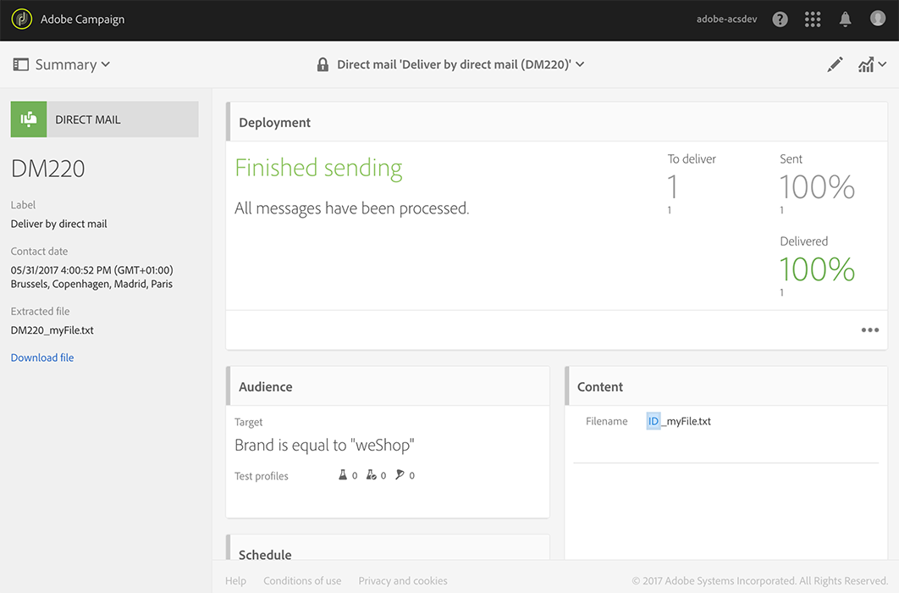

# Creating the direct mail{#creating-the-direct-mail}

创建直接邮寄邮件与创建常规电子邮件非常相似。以下步骤描述了特定于此渠道的配置。Refer to [Creating an email](../../channels/using/creating-an-email.md) for more information on other options.

1. 创建新的直接邮寄邮件。You can create one from the Adobe Campaign [home page](../../start/using/interface-description.md#home-page), in a [campaign](../../start/using/marketing-activities.md#creating-a-marketing-activity) or in a [marketing activity list](../../start/using/programs-and-campaigns.md#creating-a-campaign).

   >[!NOTE]
   >
   >您还可以在工作流中添加直接邮件活动。For more on this, refer to the [Workflows](../../automating/using/direct-mail-delivery.md) guide.

   

1. Choose either the out-of-the-box **[!UICONTROL Direct mail]** template or one of your own templates. For more information on templates, refer to the [Managing templates](../../start/using/about-templates.md) section.

   

1. 输入分发的常规属性。

   

1. 定义您希望包含在提取文件中的受众以及测试和陷印配置文件。See [Defining the direct mail audience](../../channels/using/defining-the-direct-mail-audience.md).

   

   >[!NOTE]
   >
   >受众定义与定义普通电子邮件受众非常相似。See [Creating audiences](../../audiences/using/creating-audiences.md).

1. 编辑文件的内容：要包括的每个配置文件、文件结构、页眉和页脚的列。See [Defining the direct mail content](../../channels/using/defining-the-direct-mail-content.md).

   

1. Click on the **[!UICONTROL Schedule]** section of the delivery dashboard to define the contact date. 对于直邮，联系日期为必填字段。For more information, refer to [Scheduling the send](../../sending/using/about-scheduling-messages.md).

   

1. If you added test profiles (refer to [Adding test and trap profiles](../../channels/using/defining-the-direct-mail-audience.md#adding-test-and-trap-profiles)), you can test your delivery before preparing the final file. 它允许您创建仅包含所选测试配置文件的示例文件。

   Click on **[!UICONTROL Test]** to generate the sample file. Click on **[!UICONTROL Summary]**, in the top left corner, then select **[!UICONTROL Proofs]**. On the left part of the screen, select the proof and click on **[!UICONTROL Download file]**.

   >[!NOTE]
   >
   >The **[!UICONTROL Export]** role is required to allow Adobe Campaign to export the file and make it available for download. 请联系您的管理员。

   

1. Once you have defined your delivery content, audience and contact date, click on the **[!UICONTROL Prepare]** button, on the delivery dashboard.

   

   应用Typology规则。例如，所有未指定的邮件都将从目标中排除。This is why you need to make sure you have checked the **[!UICONTROL Address specified]** box in your profiles' information (see [Recommendations](../../channels/using/about-direct-mail.md#recommendations)). If you have defined a **[!UICONTROL Maximum volume of message]** in the direct mail properties or at the template level, it will also be applied here.

   

   >[!NOTE]
   >
   >您可以设置全局跨渠道疲劳规则，它们会自动排除营销活动中已被过度授权的配置文件。See [Fatigue rules](../../administration/using/fatigue-rules.md).

1. Click on **[!UICONTROL Explore file]** to preview the first 100 lines of the file.

   

   可在屏幕左侧下载完整文件供本地下载。Downloading the file generates a log entry in the **[!UICONTROL Export audits]** menu. For more information on export audits, refer to the [Auditing exports](../../administration/using/auditing-export-logs.md) section.

   >[!NOTE]
   >
   >The **[!UICONTROL Export]** role is required to allow Adobe Campaign to export the file and make it available for download. 请联系您的管理员。

   If you need to change the delivery content, you only have to click on the **[!UICONTROL Regenerate file]** button to take the change into account. 无需重新准备。

   

1. To confirm that the file is final, click on **[!UICONTROL Confirm]** in the delivery dashboard.

   

您现在可以将提取文件发送到直接邮件提供商。为此，您有几个选项：

* 通过常规电子邮件发送并附加文件
* Send it via Campaign: perform your direct mail within a campaign [workflow](../../automating/using/direct-mail-delivery.md) and add a **[!UICONTROL Transfer file]** to send the file via FTP for example. See [Transfer file](../../automating/using/transfer-file.md).

提供商检索错误地址的列表，并将此信息发送到自动黑名单中列出错误地址的Adobe Campaign。See [Return to sender](../../channels/using/return-to-sender.md).
