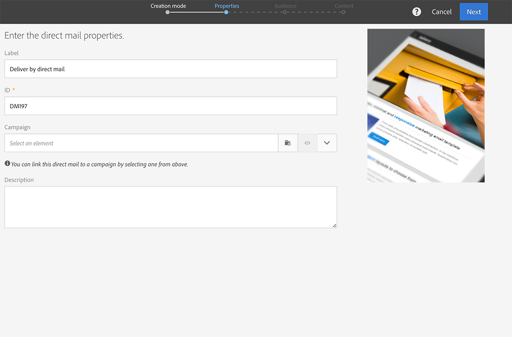

# 创建直邮{#creating-the-direct-mail}

创建直邮投放与创建常规电子邮件非常相似。以下步骤描述了特定于此渠道的配置。有关其他选项的更多信息，请参阅[创建电子邮件](../../channels/using/creating-an-email.md)。

>[!NOTE]
>
>您还可以在工作流中添加直邮活动。有关更多信息，请参阅[工作流](../../automating/using/direct-mail-delivery.md)指南。

1. 创建新直邮投放。您可以在 Adobe Campaign [主页](../../start/using/interface-description.md#home-page)的[营销策划](../../start/using/marketing-activities.md#creating-a-marketing-activity)或[营销活动列表](../../start/using/programs-and-campaigns.md#creating-a-campaign)中创建直邮。

   

1. 选择现成的 **[!UICONTROL Direct mail]** 模板或自己拥有的模板之一。有关模板的更多信息，请参阅[管理模板](../../start/using/marketing-activity-templates.md)一节。

   

1. 输入投放的常规属性。

   

1. 定义要包含在提取文件中的受众，以及测试和陷阱用户档案。请参阅[定义直邮受众](../../channels/using/defining-the-direct-mail-audience.md)。

   

   >[!NOTE]
   >
   >受众定义与定义常规电子邮件受众非常相似。请参阅[创建受众](../../audiences/using/creating-audiences.md)。

1. 编辑文件的内容：用于各个用户档案的列、文件结构、页眉和页脚。请参阅[定义直邮内容](../../channels/using/defining-the-direct-mail-content.md)

   

1. 单击投放仪表板的 **[!UICONTROL Schedule]** 部分，以定义联系日期。对于直邮，联系日期为必填项。有关更多信息，请参见[计划发送](../../sending/using/about-scheduling-messages.md)。

   

1. 如果添加了测试用户档案（请参阅[添加测试和陷阱用户档案](../../channels/using/defining-the-direct-mail-audience.md#adding-test-and-trap-profiles)），则可以在准备最终文件之前对投放进行测试。利用该功能，可创建仅包含选定测试用户档案的样例文件。

   单击 **[!UICONTROL Test]** 以生成样例文件。单击左上角的&#x200B;**[!UICONTROL Summary]**，然后选择&#x200B;**[!UICONTROL Proofs]**。 在屏幕的左侧，选择校样并单击 **[!UICONTROL Download file]**。

   >[!NOTE]
   >
   >必须具有 **[!UICONTROL Export]** 角色，才可让 Adobe Campaign 导出文件并提供导出文件下载。请联系您的管理员。

   

1. 定义投放内容、受众和联系日期后，单击投放仪表板上的 **[!UICONTROL Prepare]** 按钮。

   

   应用分类规则。例如，将所有非指定的邮政地址从目标中排除。因此，您需要确保勾选用户档案信息中的 **[!UICONTROL Address specified]** 方框（请参阅 [建议](../../channels/using/about-direct-mail.md#recommendations)）。如果您在直邮属性中或模板级别定义了 **[!UICONTROL Maximum volume of message]**，则也会应用到此处。

   

   >[!NOTE]
   >
   >您可以设置全局跨渠道疲劳规则，以便自动从营销方案中排除过度投放的用户档案。请参阅[疲劳规则](../../sending/using/fatigue-rules.md)。

1. 单击 **[!UICONTROL Explore file]** 以预览文件的前 100 行。

   

   可在屏幕左侧访问完整文件以进行本地下载。下载文件会在 **[!UICONTROL Export audits]** 菜单中生成日志条目。有关导出审核的更多信息，请参阅[审核导出](../../administration/using/auditing-export-logs.md)一节。

   >[!NOTE]
   >
   >必须具有 **[!UICONTROL Export]** 角色，才可让 Adobe Campaign 导出文件并提供导出文件下载。请联系您的管理员。

   如果需要更改投放内容，您只需单击 **[!UICONTROL Regenerate file]** 按钮，即可将更改考虑在内。无需进行准备。

   

1. 要确认该文件为最终文件，请单击投放仪表板中的 **[!UICONTROL Confirm]**。

   

现在，您已准备就绪，可将提取文件发送给直邮提供商。为此，您可使用以下几个选项：

* 通过定期电子邮件以附件形式发送
* 通过 Campaign 发送：例如，在营销策划[工作流](../../automating/using/direct-mail-delivery.md)中执行“直邮”，并添加 **[!UICONTROL Transfer file]** 以通过 FTP 发送文件。请参阅[传输文件](../../automating/using/transfer-file.md)。

提供商检索错误地址的列表，并将此信息发送到Adobe Campaign，会自阻止列表动错误地址。 请参阅[退回发件人](../../channels/using/return-to-sender.md)。
