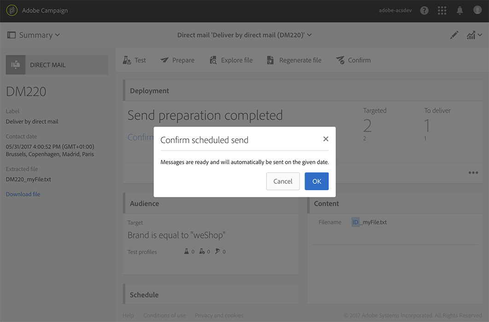

# 创建直邮{#creating-the-direct-mail}

创建直邮递送与创建常规电子邮件非常相似。 以下步骤介绍了特定于此渠道的配置。 有关其他 [选项的更多信息](../../channels/using/creating-an-email.md) ，请参阅创建电子邮件。

1. 创建新的直邮递送。 您可以从Adobe Campaign主页、营销活 [动中](../../start/using/interface-description.md#home-page)、营销活 [动](../../start/using/marketing-activities.md#creating-a-marketing-activity)[或营销活](../../start/using/programs-and-campaigns.md#creating-a-campaign)动列表中创建。

   >[!NOTE]
   >
   >您还可以在工作流中添加直邮活动。 有关详细信息，请参阅工作 [流指南](../../automating/using/direct-mail-delivery.md) 。

   

1. 选择现成模板或您自 **[!UICONTROL Direct mail]**己的模板之一。 有关模板的详细信息，请参阅管理模[板一节](../../start/using/marketing-activity-templates.md)。

   

1. 输入传送的常规属性。

   

1. 定义要包含在提取文件以及测试和陷印配置文件中的受众。 See [Defining the direct mail audience](../../channels/using/defining-the-direct-mail-audience.md).

   

   >[!NOTE]
   >
   >受众定义与定义常规电子邮件受众非常相似。 请参阅 [创建受众](../../audiences/using/creating-audiences.md)。

1. 编辑文件内容：列，以用于每个配置文件、文件结构、页眉和页脚。 See [Defining the direct mail content](../../channels/using/defining-the-direct-mail-content.md).

   

1. 单击交 **[!UICONTROL Schedule]**付功能板的部分以定义联系日期。 对于直邮，联系日期为必填。 有关详细信息，请参阅[安排发送](../../sending/using/about-scheduling-messages.md)。

   

1. 如果您添加了测试配置文件(请参 [阅添加测试和陷印配置文件](../../channels/using/defining-the-direct-mail-audience.md#adding-test-and-trap-profiles))，则可以在准备最终文件之前测试交付。 它允许您创建一个仅包含所选测试配置文件的示例文件。

   单击以 **[!UICONTROL Test]**生成示例文件。 单击**[!UICONTROL Summary]**&#x200B;左上角的，然后选择 **[!UICONTROL Proofs]**。 在屏幕的左侧，选择校样并单击**[!UICONTROL Download file]**。

   >[!NOTE]
   >
   >该 **[!UICONTROL Export]**角色是允许Adobe Campaign导出文件并供下载的必需角色。 请联系您的管理员。

   

1. 在定义了交付内容、受众和联系日期后，单击交付控制 **[!UICONTROL Prepare]**板上的按钮。

   

   应用类型学规则。 例如，所有未指定的邮政地址都会从目标中排除。 因此，您需要确保选中了配置文 **[!UICONTROL Address specified]**件信息中的框(请参阅[Recommendations](../../channels/using/about-direct-mail.md#recommendations))。 如果您已在直邮**[!UICONTROL Maximum volume of message]** 属性中或在模板级别定义了，则此处也将应用该属性。

   

   >[!NOTE]
   >
   >您可以设置全局跨渠道疲劳规则，这些规则将自动从营销活动中排除过度征求的档案。 请参阅 [疲劳规则](../../administration/using/fatigue-rules.md)。

1. 单击 **[!UICONTROL Explore file]**可预览文件的前100行。

   

   可在屏幕左侧访问完整文件以进行本地下载。 下载文件将在菜单中生成日志 **[!UICONTROL Export audits]**条目。 有关导出审核的详细信息，请参阅“审核[导出](../../administration/using/auditing-export-logs.md)”一节。

   >[!NOTE]
   >
   >该 **[!UICONTROL Export]**角色是允许Adobe Campaign导出文件并供下载的必需角色。 请联系您的管理员。

   如果需要更改分发内容，您只需单击该按 **[!UICONTROL Regenerate file]**钮即可将更改考虑在内。 不必再做准备了。

   

1. 要确认文件为最终文件，请在提交功 **[!UICONTROL Confirm]**能板中单击。

   

您现在可以将提取文件发送到直接邮件提供者。 对于此，您有几个选项：

* 通过定期电子邮件发送，并附加文件
* 通过Campaign发送：在营销活动工作流程中 [执行直邮](../../automating/using/direct-mail-delivery.md) ，并添 **[!UICONTROL Transfer file]**加一个FTP发送文件的示例。 请参阅[传输文件](../../automating/using/transfer-file.md)。

提供商会检索错误地址列表，并将此信息发送到Adobe Campaign,Adobe Campaign会自动将错误地址列入黑名单。 See [Return to sender](../../channels/using/return-to-sender.md).
