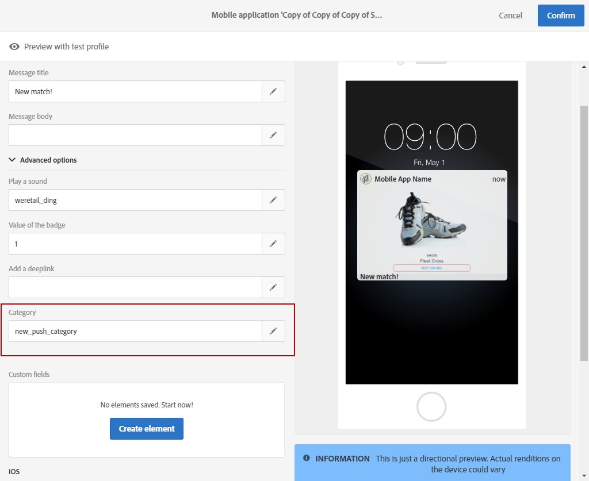

# 自定义推送通知{#customizing-a-push-notification}

要微调推送通知，Adobe Campaign允许您在设计推送通知时访问一组高级选项。

作为专家用户，要在Adobe Campaign中配置移动应用程序，请参阅以下技术说 [明了解Campaign Standard推送通知有效负荷结构](https://helpx.adobe.com/campaign/kb/understanding-campaign-standard-push-notifications-payload-struc.html)。

**相关内容：**

* [推送通知报告](../../reporting/using/push-notification-report.md)
* [在工作流中发送推送通知](../../automating/using/push-notification-delivery.md)

## 播放声音 {#play-a-sound}

该功 **[!UICONTROL Play a sound]** 能使应用程序能够在应用程序未运行时投放推送通知，在设备上播放声音。

音效会提醒用户推送通知，使其更加可见。 要在移动应用程序中包含声音，请执行以下操作：

1. 打开推送通知并访问 **[!UICONTROL Advanced options]** 部分。
1. 在字 **[!UICONTROL Play a sound]** 段中，输入在收到通知时由移动设备播放的声音文件的文件名（不带扩展名）。

   有关支持的媒体格式的更多信息，请 [参阅Apple](https://support.apple.com/kb/PH16864?locale=en_US) 和 [Android文档](https://developer.android.com/guide/topics/media/media-formats) 。

   

1. 如果文件是在手机应用程序的包中定义的，则在发送通知时播放声音文件。 否则，将播放设备的默认声音。

用户随后将收到推送通知和声音，但前提是手机未静音。

## 刷新标记值 {#refresh-the-badge-value}

徽章用于直接在应用程序图标上显示新的未读信息数。 当用户打开或从应用程序中读取新内容时，徽章值将消失。

在设备上收到通知时，它可以刷新或添加相关应用程序的标记值。 要从服务器端发送标记值，请执行以下操作：

1. 打开推送通知并访问 **[!UICONTROL Advanced options]** 部分。
1. 标记值必须是整数，并可以通过不同方式进行更新：

   * 要刷新标记，请在字段中输入 **[!UICONTROL Value of the badge]** 0。 这将从应用程序图标中删除该徽章。
   * 要添加标记值，请在字段中输入任意 **[!UICONTROL Value of the badge]** 数字。 用户收到推送通知后，此号码将自动显示在徽章中。
   * 如果字段为空或不包含整数，标记值将不会更改。
   在此，我们在字段中输 **[!UICONTROL Value of the badge]** 入了1，以告知用户他们的应用程序中有新信息。

   

1. 发送消息后，用户将收到推送通知，他们的应用程序将自动显示新标记值。

   

## 添加开发人员 {#add-a-deeplink}

利用Develink，您可以直接将用户带到应用程序内的内容（而不是打开Web浏览器页面）。

开发人员可以包含个性化数据以获得自定义应用程序内体验。 例如，收件人的名字会自动填写在应用程序将其定向到的页面上。

在推送通知中添加深层链接：

1. 打开推送通知并访问 **[!UICONTROL Advanced options]** 部分。
1. 在字段中输入链 **[!UICONTROL Add a deeplink]** 接。

   

1. 发送消息后，用户将收到推送通知并通过与通知交互（例如点击或单击行动动员按钮）访问应用程序中的特定页面。

   

## 定义操作 {#define-an-action}

您可以添加类别ID（如果在移动应用程序中可用），然后显示操作按钮。 这些通知为用户提供了一种更快的方式，无需在应用程序中打开或导航即可响应通知执行不同任务。

用户电话上显示的对话框需要决定继续。 当用户选择其中一个操作时，系统会通知应用程序，以便它能够执行任何关联的任务。

在推送通知中添加类别:

1. 打开推送通知并访问 **[!UICONTROL Advanced options]** 部分。
1. 在字段中输入预定义的类别 **[!UICONTROL Category]** 名称，以在收到推送通知时显示可操作的按钮。

   移动应用程序开发人员必须定义类别ID和按钮在应用程序中的预期行为。 有关此内容的详细信息，请参 [阅Apple Developer文档](https://developer.apple.com/library/content/documentation/NetworkingInternet/Conceptual/RemoteNotificationsPG/SupportingNotificationsinYourApp.html) (配&#x200B;**置类别和可操作通知部分** )或Android开发 [人员文档](https://developer.android.com/guide/topics/ui/notifiers/notifications.html)。

   

1. 发送推送通知后，用户将收到该通知，并必须使用之前配置的可操作按钮执行操作。

   

根据用户的操作，将通知应用程序以执行任何相关任务。

## 添加到期日期 {#add-expiration-date}

将过期日期设置为推送通知可设置特定的过期日期，在该日期，Apple(APNS)或Android([FCM](https://developer.apple.com/documentation/usernotifications/setting_up_a_remote_notification_server/sending_notification_requests_to_apns))将不再发送[消息](https://firebase.google.com/docs/cloud-messaging/concept-options)。

要向推送通知添加过期日期，请执行以下操作：

1. 选中该 **[!UICONTROL Expire message]** 选项。

   >[!NOTE]
   >
   >通过选 **[!UICONTROL Expire message]** 择选项，持续时间将自动设置为0。 如果不更改值，APNS和FCM将尝试立即发送消息。 如果失败，消息将不再发送。

1. 在字段中 **[!UICONTROL Duration]** ，选择推送通知的有效性。

   

1. 在发送推送通知后，如果用户由于电话未打开或没有信号而未立即收到该通知，则推送仍将在过期日期时间段内发送。

请注意，如果推送通知在过期日期之前尚未发送，则将丢弃该通知。

## 添加自定义字段 {#add-custom-fields}

自定义字段允许您以键值对的形式在有效负荷中传递自定义数据。 此选项可用于向应用程序传递预定义密钥以外的其他数据。

为此，请执行以下操作：

1. 打开推送通知并访问 **[!UICONTROL Advanced options]** 部分。
1. 在类别 **[!UICONTROL Custom fields]** 中，单击该 **[!UICONTROL Add an element]** 按钮。
1. 然后输 **[!UICONTROL Keys]** 入与每 **[!UICONTROL Values]** 个键关联的键。

   

1. 自定义字段的处理和用途完全由移动应用程序决定。 在以下推送通知中，应用程序已使用自定义字段显示推送通知的按钮标签。

   

## 添加富媒体内容 {#add-rich-media-content}

丰富媒体内容使您能够更好地参与用户活动，这意味着您的用户更倾向于打开您的推送通知。

您可以包含将在通知本身中播放或显示的图像、gif、音频或视频文件。 您的应用程序用户无需打开应用程序即可看到它。

要在推送通知中包含富媒体，请执行以下操作：

1. 打开推送通知并访问 **[!UICONTROL Advanced options]** 部分。
1. 在每个格式的字段中输入 **[!UICONTROL Rich media content URL]** 文件的URL: iOS和Android。

   对于iOS 10或更高版本，可插入图像、gif、音频和视频文件。 对于较早的iOS版本，将显示推送通知而不显示丰富内容。 有关如何在iOS设备上显示Adobe Campaign推送通知中的图像的详细步骤，请参阅此 [页](https://helpx.adobe.com/campaign/kb/display-image-push.html)。

   对于Android，只能包含图像。

   

1. 发送消息后，用户将收到您的推送通知并可以视图富媒体内容。

   

## 更改iOS的通知行为 {#change-the-notification-behavior-for-ios}

对于iOS 10或更高版本，推送通知部分还提 **[!UICONTROL Advanced options]** 供了两个其他选项： **[!UICONTROL Mutable content]** 和 **[!UICONTROL Content available]**。

当选 **[!UICONTROL Mutable content]** 中该选项和／或添加富媒体内容URL时，可变内容标志将在推送有效负荷中发送，并且允许由iOS SDK中提供的通知服务应用程序扩展修改推送通知内容。 有关此的详细信息，请参 [阅Apple开发人员文档](https://developer.apple.com/library/content/documentation/NetworkingInternet/Conceptual/RemoteNotificationsPG/ModifyingNotifications.html)。

然后，您可以利用移动应用程序扩展进一步修改从Adobe Campaign发送的推送通知的内容或演示。 例如，用户可以利用此选项：

* 解密以加密格式传送的数据
* 下载图像或其他媒体文件，并将它们作为附件添加到通知中
* 更改通知的正文或标题文本
* 向通知添加线程标识符

选中 **[!UICONTROL Content available]** 后，将在推送有效负荷中发送可用内容标志，以确保应用程序在收到推送通知后立即唤醒，这意味着应用程序将能够访问有效负荷数据。 即使应用程序在后台运行并且无需任何用户交互（例如点击推送通知），这也会起作用，但是，如果应用程序未运行，则这不适用。 有关此的详细信息，请参阅Apple [开发人员文档](https://developer.apple.com/library/content/documentation/NetworkingInternet/Conceptual/RemoteNotificationsPG/CreatingtheNotificationPayload.html)。

## 更改Android的通知行为 {#change-the-notification-behavior-for-android}

对于Android，您可以在富媒体内容URL字段中输入 **文件的URL** 。 而对于iOS版本，对于Android，只能包含图像，而不能包含gif、音频或视频文件。

通过 **[!UICONTROL High priority]** 此复选框，您可以设置推送通知的高优先级或普通优先级。 有关消息优先级的详细信息，请参阅Google开 [发人员文档](https://firebase.google.com/docs/cloud-messaging/concept-options#setting-the-priority-of-a-message)。

