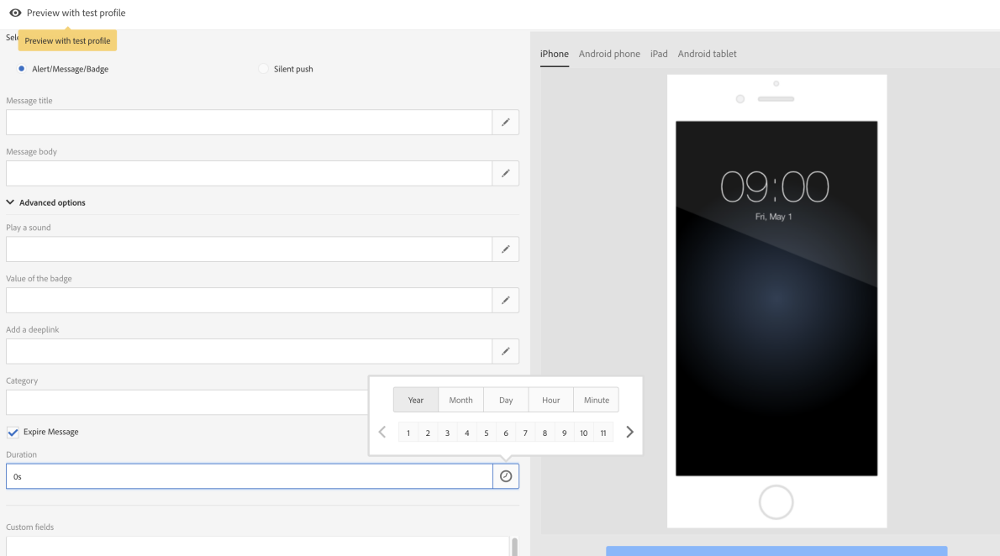

# 自定义推送通知{#customizing-a-push-notification}

要优化推送通知消息，可在设计推送通知消息时通过 Adobe Campaign 访问一组高级选项。

专家用户要在 Adobe Campaign 中配置移动应用程序，请参阅以下技术说明[了解 Campaign Standard 推送通知有效载荷结构](https://helpx.adobe.com/cn/campaign/kb/understanding-campaign-standard-push-notifications-payload-struc.html)。

**相关内容：**

* [推送通知报告](../../reporting/using/push-notification-report.md)
* [在工作流中发送推送通知](../../automating/using/push-notification-delivery.md)

## 播放提示音 {#play-a-sound}

利用 **[!UICONTROL Play a sound]** 功能，就算应用未运行，也可让设备在收到推送通知投放时，播放提示音。

提示音可提醒用户存在推送通知，使推送通知更加醒目。要在移动应用程序中包含提示音，请执行以下操作：

1. 打开推送通知并访问 **[!UICONTROL Advanced options]** 部分。
1. 在 **[!UICONTROL Play a sound]** 字段中，输入移动设备接收到通知时所播放之声音文件的文件名（不带扩展名）。

   有关所支持媒体格式的更多信息，请参阅 [Apple](https://support.apple.com/kb/PH16864?locale=zh_CN) 和 [Android](https://developer.android.com/guide/topics/media/media-formats) 文档。

   

1. 如果在手机应用程序资源包中定义了声音文件，则在投放通知时会播放该文件。您可以将其设置为&#x200B;**default**&#x200B;以播放设备的默认声音。

   如果&#x200B;**[!UICONTROL Play a sound]**&#x200B;字段留空，则不会播放任何声音。

用户随后将收到推送通知，但只有手机未静音时才会播放提示音。

## 刷新标记值 {#refresh-the-badge-value}

标记用于直接在应用程序图标上显示新的未读信息数。当用户打开或从应用程序中读取新内容时，标记值将消失。

在设备上收到通知时，可能会刷新或增加相关应用程序的标记值。要从服务器端发送标记值，请执行以下操作：

1. 打开推送通知并访问 **[!UICONTROL Advanced options]** 部分。
1. 标记值必须是整数，并可以通过不同方式进行更新：

   * 要刷新标记，请在 **[!UICONTROL Value of the badge]** 字段中输入 0。这将从应用程序图标中移除该标记。
   * 要添加标记值，请 在&#x200B;**[!UICONTROL Value of the badge]** 字段中输入任意数字。用户一旦收到推送通知，此数字就会自动显示在标记中。
   * 如果字段为空或不包含整数，将不会更改标记值。

   在此，我们在 **[!UICONTROL Value of the badge]** 字段中输入 1，以告知用户，其应用程序中有新信息。

   

1. 发送消息后，用户将收到推送通知，他们的应用程序将自动显示新标记值。

   

## 添加深层链接 {#add-a-deeplink}

利用深层链接，您可以直接将用户导向应用程序内的内容（而不是打开 Web 浏览器页面）。

深层链接可以包含用于自定义应用内体验的个性化数据。例如，收件人的名字会自动填写在应用程序所导向的页面上。

要在推送通知中添加深层链接：

1. 打开推送通知并访问 **[!UICONTROL Advanced options]** 部分。
1. 在 **[!UICONTROL Add a deeplink]** 字段中输入链接。

   

1. 发送消息后，用户将收到推送通知并可通过与通知交互（例如点击或单击行动号召按钮）访问应用程序中的特定页面。

   

## 定义操作 {#define-an-action}

您可以添加类别 ID（如果在移动应用程序中可用），然后显示操作按钮。这些通知为用户提供了一种更快的方式，无需在应用程序中打开或导航即可响应通知执行不同任务。

用户电话上显示的对话框要求决定是否继续。当用户选择其中一个操作时，系统会通知应用程序，以便其执行任何关联的任务。

在推送通知中添加类别：

1. 打开推送通知并访问 **[!UICONTROL Advanced options]** 部分。
1. 在 **[!UICONTROL Category]** 字段中输入预定义的类别名称，以在收到推送通知时显示可操作的按钮。

   移动应用程序开发人员必须定义类别 ID 和按钮在应用程序中的预期行为。有关更多信息，请参阅 [Apple 开发人员文档](https://developer.apple.com/library/content/documentation/NetworkingInternet/Conceptual/RemoteNotificationsPG/SupportingNotificationsinYourApp.html)（**配置类别和可操作通知**&#x200B;章节）或 [Android 开发人员文档](https://developer.android.com/guide/topics/ui/notifiers/notifications.html)。

   

1. 发送推送通知后，用户将收到该通知，并必须使用之前配置的可操作按钮执行操作。

   

根据用户的操作，将通知应用程序以执行任何相关任务。

## 添加到期日期 {#add-expiration-date}

通过为推送通知设置到期日期，在到达该日期后，Apple [(APNS)](https://developer.apple.com/documentation/usernotifications/setting_up_a_remote_notification_server/sending_notification_requests_to_apns) 或 Android [(FCM)](https://firebase.google.com/docs/cloud-messaging/concept-options) 将不再发送该消息。

要向推送通知添加到期日期，请执行以下操作：

1. 检查&#x200B;**[!UICONTROL Expire message]**&#x200B;选项：选择&#x200B;**[!UICONTROL Expire message]**&#x200B;选项后，持续时间将自动设置为0。 如果不更改该值，APNS 和 FCM 将尝试立即发送消息。如果失败，将不会重新发送消息。

1. 在 **[!UICONTROL Duration]** 字段中，选择推送通知的有效期。

   

1. 在发送推送通知后，如果用户由于手机未打开或没有信号而未立即收到该通知，则会在到达过期日期之前尝试重新发送。

请注意，如果到达过期日期时仍未发送推送通知，则将弃用该通知。

## 添加自定义字段 {#add-custom-fields}

利用自定义字段，可使用键值对的形式在有效载荷中传递自定义数据。此选项可用于向应用程序传递预定义键值以外的其他数据。

为实现此操作，请执行以下步骤：

1. 打开推送通知并访问 **[!UICONTROL Advanced options]** 部分。
1. 在 **[!UICONTROL Custom fields]** 类别中，单击 **[!UICONTROL Add an element]** 按钮。
1. 输入 **[!UICONTROL Keys]**，接着输入与各个键值关联的 **[!UICONTROL Values]**。

   

1. 自定义字段的处理和用途完全取决于移动应用程序。在以下推送通知中，应用程序已使用自定义字段显示推送通知的按钮标签。

   

## 添加富媒体内容 {#add-rich-media-content}

利用富媒体内容，可更好地吸引用户参与，这意味着用户将更倾向于打开您的推送通知。

您可以加入将在通知本身中播放或显示的图像、GIF 动图、音频或视频文件。您的应用程序用户无需打开应用程序即可查看这些内容。

要在推送通知中包含富媒体，请执行以下操作：

1. 打开推送通知并访问 **[!UICONTROL Advanced options]** 部分。
1. 在每种格式（iOS 和 Android）的 **[!UICONTROL Rich media content URL]** 字段中输入文件的 URL。

   对于 iOS 10 或更高版本，可插入图像、GIF 动图、音频和视频文件。对于较早的 iOS 版本，将显示不带富文本内容的推送通知。有关如何在 iOS 设备上显示 Adobe Campaign 推送通知中图像的详细步骤，请参阅此[页面](https://helpx.adobe.com/cn/campaign/kb/display-image-push.html)。

   对于 Android，只能包含图像。

   

1. 发送消息后，用户将收到您的推送通知并可以查看富媒体内容。

   

## 更改 iOS 的通知行为 {#change-the-notification-behavior-for-ios}

对于iOS 10或更高版本，推送通知的 **[!UICONTROL Advanced options]** 部分还提供了两个其他选项：**[!UICONTROL Mutable content]** 和 **[!UICONTROL Content available]**。

当选中 **[!UICONTROL Mutable content]** 选项和/或添加富媒体内容 URL 后，将在推送有效载荷中发送可变内容标志，并且允许同您过 iOS SDK 提供的通知服务应用程序扩展修改推送通知内容。有关更多信息，请参阅 [Apple 开发人员文档](https://developer.apple.com/library/content/documentation/NetworkingInternet/Conceptual/RemoteNotificationsPG/ModifyingNotifications.html)。

然后，您可以利用移动应用程序扩展进一步修改从 Adobe Campaign 发送之推送通知的内容或演示。例如，用户可以利用此选项：

* 解密以加密格式传送的数据
* 下载图像或其他媒体文件，并将它们作为附件添加到通知中
* 更改通知的正文或标题文本
* 向通知添加线程标识符

选中 **[!UICONTROL Content available]** 后，将在推送有效载荷中发送可用内容标志，以确保应用程序在收到推送通知后立即唤醒，这意味着应用程序将能够访问有效载荷数据。即使应用程序在后台运行并且没有进行任何用户交互（例如点击推送通知），此功能也会起效；但是，如果应用程序未运行，则此功能不适用。有关更多信息，请参阅 [Apple 开发人员文档](https://developer.apple.com/library/content/documentation/NetworkingInternet/Conceptual/RemoteNotificationsPG/CreatingtheNotificationPayload.html)。

## 更改 Android 的通知行为 {#change-the-notification-behavior-for-android}

对于 Android，您可以在 **Rich media content URL** 字段中输入文件的 URL。与 iOS 版本不同，Android 版本的推送通知只能包含图像，而不能包含 GIF 动图、音频或视频文件。

利用 **[!UICONTROL High priority]** 复选框，您可以设置推送通知的高优先级或普通优先级。有关消息优先级的更多信息，请参阅 [Google 开发人员文档](https://firebase.google.com/docs/cloud-messaging/concept-options#setting-the-priority-of-a-message)。

