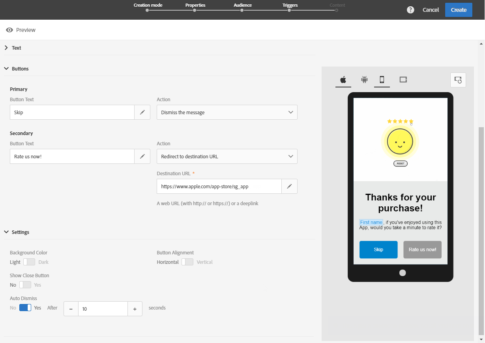

# 自定义应用程序内消息{#customizing-an-in-app-message}

要优化应用程序内消息，可在设计应用程序内消息时通过 Adobe Campaign 访问一组高级选项。

利用应用程序内内容编辑器，可以选择以下两种应用程序内消息模式之一：

* [Message Template](#customizing-with-a-message-template)：利用此模板，可使用图像或视频以及操作按钮全方位自定义应用程序内消息。
* [Custom Message](#customizing-with-a-custom-html-message)：利用此模板可导入自定义 HTML。

>[!NOTE]
>
> 仅 Android API 19 及更高版本支持应用程序内消息渲染。

**相关主题：**

* [发送应用程序内消息](../../channels/using/preparing-and-sending-an-in-app-message.md#sending-your-in-app-message)
* [应用程序内报告](../../reporting/using/in-app-report.md)
* [实施本地通知跟踪](../../administration/using/local-tracking.md)

## 使用消息模板进行自定义{#customizing-with-a-message-template}

### 布局{#layout}

**[!UICONTROL Layout]** 下拉列表提供了四个不同的选项，供您根据消息传递需求进行选择：

* **[!UICONTROL Full page]**：此类型的布局会覆盖受众设备的整个屏幕。

   此选项支持媒体（图像、视频）、文本和按钮组件。

* **[!UICONTROL Large modal]**：此布局显示在大型警报样式窗口中，背景中仍可看到您的应用程序。

   此选项支持媒体（图像、视频）、文本和按钮组件。

* **[!UICONTROL Small modal]**：此布局显示为一个小型警报类型窗口，背景中仍可看到您的应用程序。

   此选项支持媒体（图像、视频）、文本和按钮组件。

* **[!UICONTROL Alert]**：此类型的布局显示为本机操作系统警报消息。

   此选项仅支持文本和按钮组件。

* **[!UICONTROL Local notification]**：此类型的布局将显示为横幅消息。

   此选项仅支持声音、文本和目标。有关本地通知的更多信息，请参阅[自定义本地通知消息类型](#customizing-a-local-notification-message-type)。

每种类型的布局都可以在不同设备（如手机、平板电脑、平台 (如 Android 或 iOS)）上以不同的方向（如内容编辑器的右侧窗口中的横向或纵向）预览。

### 媒体{#media}

利用 **[!UICONTROL Media]** 下拉列表，可以向应用程序内消息中添加媒体，从而为最终用户创造有趣的体验。

1. 在图像和视频之间选择您的 **[!UICONTROL Media Type]**。
1. 对于 **[!UICONTROL Image]** 媒体类型，请根据支持的格式在 **[!UICONTROL Media URL]** 字段中输入 URL。

   如果需要，您还可以输入在设备脱机时用于访问 **[!UICONTROL Bundled image]** 的路径。

   

1. 对于 **[!UICONTROL Video]** 媒体类型，请在 **[!UICONTROL Media URL]** 字段中输入 URL。

   然后，输入从受众设备下载视频时或在用户点击播放按钮之前使用的 **[!UICONTROL Video poster]**。

   

### 文本{#text}

如果需要，您还可以向应用程序内消息添加消息标题和内容。为了更好地个性化您的应用程序内消息，您可以向内容添加各种个性化字段、内容块和动态文本。

1. 在 **[!UICONTROL Text]** 下拉列表中，为 **[!UICONTROL Message title]** 字段添加标题。

   

1. 在 **[!UICONTROL Message content]** 字段中添加您的内容。
1. 要进一步个性化您的文本，请单击  图标以添加个性化字段。

   

1. 键入消息内容，然后根据需要添加个性化字段。

   有关个性化字段的更多信息，请参阅[此章节](../../designing/using/personalization.md#inserting-a-personalization-field)。

   

1. 在预览窗口中查看消息内容。

   

### 按钮{#buttons}

最多可以向应用程序内消息添加两个按钮。

1. 在 **[!UICONTROL Buttons]** 下拉列表的 **[!UICONTROL Primary]** 类别中，输入第一个按钮的文本。

   

1. 选择要为主按钮分配的两个操作之一，**[!UICONTROL Dismiss]** 或 **[!UICONTROL Redirect]**。
1. 在 **[!UICONTROL Secondary]** 类别中，根据需要，通过输入文本向应用程序内添加第二个按钮。
1. 选择与第二个按钮关联的操作。
1. 如果选择了 **[!UICONTROL Redirect]** 操作，请在 **[!UICONTROL Destination URL]** 字段中输入 Web URL 或深层链接。

   

1. 如果选择了 **[!UICONTROL Redirect]** 操作，请在 **[!UICONTROL Destination URL]** 字段中输入 Web URL 或深层链接。
1. 在预览窗口中或单击预览按钮，查看消息内容。

   请参阅[预览应用程序内消息](#previewing-the-in-app-message)页面。

   

### 设置{#settings}

1. 在 **[!UICONTROL Settings]** 类别中，选择背景颜色（“亮”或“暗”）。
1. 选择显示或不显示带有 **[!UICONTROL Show close button]** 选项的关闭按钮，为用户提供一种关闭应用程序内消息的方式。
1. 使用 **[!UICONTROL Button alignment]** 选项，选择按钮的对齐方式（“水平”或“垂直”）。
1. 选择您的应用程序内消息是否会在几秒钟后自动消失。

   

## 自定义本地通知消息类型{#customizing-a-local-notification-message-type}

本地通知只能由应用程序在特定时间根据事件触发。即使没有互联网访问权限，本地通知也可以提醒用户，其应用程序中发生了一些情况。
要了解如何跟踪本地通知，请参阅此[页面](../../administration/using/local-tracking.md)。

要自定义本地通知，请执行以下步骤：

1. 在您的 **[!UICONTROL Content]** 页面中，从 **[!UICONTROL Layout]** 类别中选择 **[!UICONTROL Local notification]**

   

1. 在 **[!UICONTROL Text]** 类别下，键入您的 **[!UICONTROL Message title]** 和 **[!UICONTROL Message content]**。

   

1. 在 **[!UICONTROL Advanced option]** 类别下、**[!UICONTROL Wait to display]** 字段中，选择触发事件后在屏幕上显示本地通知的时长（以秒为单位）。
1. 在 **[!UICONTROL Sound]** 字段中，输入移动设备接收到本地通知时所播放之声音文件的文件名（带扩展名）。

   如果在手机应用程序资源包中定义了声音文件，则在投放通知时会播放该文件。否则，将播放设备的默认声音。

   

1. 指定一个目的地，在用户与 **[!UICONTROL Deeplink URL]** 字段中的本地通知交互时，将用户重定向。
1. 要以键值对的形式在有效载荷中传递自定义数据，可向本地通知添加自定义字段。在 **[!UICONTROL Custom fields]** 类别中，单击 **[!UICONTROL Create an element]** 按钮。
1. 输入 **[!UICONTROL Keys]**，接着输入与各个键值关联的 **[!UICONTROL Values]**。

   请注意，自定义字段的处理和用途完全取决于移动应用程序。

1. 在 **[!UICONTROL Apple options]** 类别中，填写 **[!UICONTROL Category]** 字段以为自定义操作添加类别 Id（如果 Apple 移动应用程序中可用）。

## 使用自定义 HTML 消息进行自定义{#customizing-with-a-custom-html-message}

>[!NOTE]
>
>自定义 HTML 消息不支持内容个性化。

利用 **[!UICONTROL Custom message]** 模式，可直接导入预配置的 HTML 消息之一。

要实现此目的，您只需从计算机中拖放或选择文件。

您的文件必须具有特定布局，您可通过单击 **Download the sample file** 选项找到该布局。

您还可以找到一系列用于确保在 Adobe Campaign 中成功导入的自定义 HTML 要求。

导入 HTML 后，您可以在预览窗口中找到不同设备上的文件预览。

## 预览应用程序内消息{#previewing-the-in-app-message}

在发送应用程序内消息之前，您可以使用测试用户档案进行测试，以查看定向受众在收到投放时将看到的内容。

1. 单击 **[!UICONTROL Preview]** 按钮。

   

1. 单击 **[!UICONTROL Select a test profile]** 按钮并选择一个测试用户档案，以开始预览您的投放。有关测试用户档案的更多信息，请参阅[此章节](../../audiences/using/managing-test-profiles.md)。
1. 在 Android、iPhone 手机甚至平板电脑等不同设备上查看您的消息。您还可以检查个性化字段是否可以检索正确的数据。

   

1. 现在，您可以发送消息并通过投放报告衡量其影响。有关报告的更多信息，请参考[此章节](../../reporting/using/in-app-report.md)。
