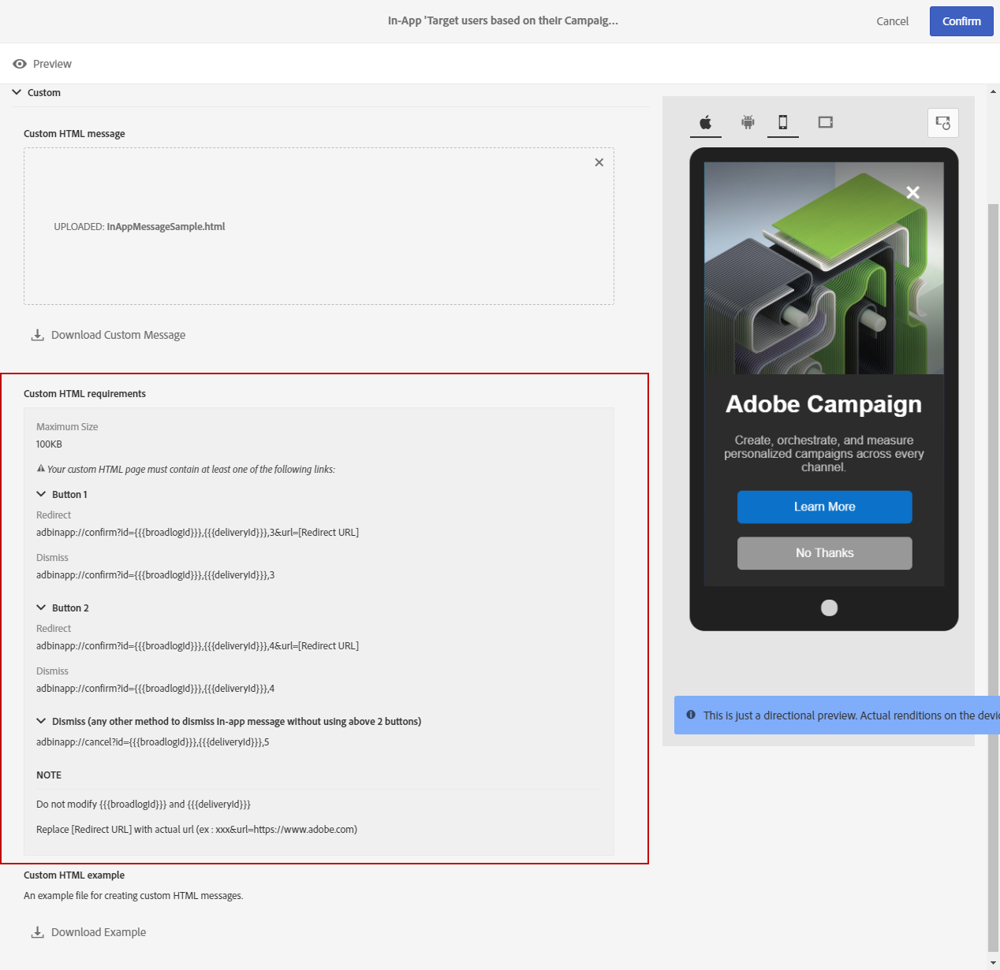

# 自定义应用程序内消息{#customizing-an-in-app-message}

要微调应用程序内消息，Adobe Campaign允许您在设计应用程序内应用程序时访问一组高级选项。

应用程序内内容编辑器允许您在两种应用程序内消息模式之间进行选择：

* [消息模板](../../channels/using/customizing-an-in-app-message.md#customizing-with-a-message-template)：此模板允许您使用图像或视频和操作按钮完全自定义应用程序内应用程序。
* [自定义消息](../../channels/using/customizing-an-in-app-message.md#customizing-with-a-custom-html-message)：此模板允许您导入自定义HTML。

**相关主题：**

* [发送应用程序内消息](../../channels/using/preparing-and-sending-an-in-app-message.md#sending-your-in-app-message)
* [应用程序内报告](../../reporting/using/in-app-report.md)

## 使用消息模板自定义 {#customizing-with-a-message-template}

### 布局 {#layout}

**[!UICONTROL Layout]** 下拉菜单提供了四种不同的选项，可根据您的消息需求进行选择：

* **[!UICONTROL Full page]**：此类型的布局涵盖了受众设备的整个屏幕。

   它支持媒体(图像、视频)、文本和按钮组件。

* **[!UICONTROL Large modal]**：此布局显示在大警报样式窗口中，您的应用程序仍在后台可见。

   它支持媒体(图像、视频)、文本和按钮组件。

* **[!UICONTROL Small modal]**：此布局显示为小警报类型窗口，您的应用程序仍在后台可见。

   它支持媒体(图像、视频)、文本和按钮组件。

* **[!UICONTROL Alert]**：此类型的布局显示为本机操作系统警告消息。

   它只能支持文本和按钮组件。

* **[!UICONTROL Local notification]**：此类型的布局显示为横幅消息。

   它只能支持声音、文本和目标。有关本地通知的详细信息，请参阅 [自定义本地通知消息类型](../../channels/using/customizing-an-in-app-message.md#customizing-a-local-notification-message-type)。

每种类型的布局都可以在手机、平板电脑、平台等不同设备上预览，如Android或iOS和方向，如内容编辑器的右窗口中的横向或portra。

### Media {#media}

**[!UICONTROL Media]** 下拉菜单允许您向应用程序内消息中添加媒体，为最终用户创建引人注目的体验。

1. 在图像和 **[!UICONTROL Media Type]** 视频之间选择您的图像。
1. 对于 **[!UICONTROL Image]** 媒体类型，请根据支持的格式在 **[!UICONTROL Media URL]** 字段中输入您的URL。

   如果需要，您还可以输入可 **[!UICONTROL Bundled image]** 在设备脱机时使用的路径。

   

1. 对于 **[!UICONTROL Video]** 媒体类型，在 **[!UICONTROL Media URL]** 字段中输入您的URL。

   然后，在用户设备上下载视频时或在用户点击播放按钮之前输入您 **[!UICONTROL Video poster]** 要使用的视频。

   

### 文本 {#text}

如果需要，您还可以向应用程序内消息添加消息标题和内容。为了更好地个性化应用程序内消息，您可以为内容添加不同的个性化字段、内容块和动态文本。

1. 在 **[!UICONTROL Text]** 下拉列表中，在 **[!UICONTROL Message title]** 字段中添加标题。

   

1. 在 **[!UICONTROL Message content]** 字段中添加内容。
1. 要进一步个性化您的文本，请单击  图标以添加个性化字段。

   

1. 键入消息内容并根据需要添加个性化字段。

   有关个性化字段的详细信息，请参阅本 [节](../../designing/using/inserting-a-personalization-field.md)。

   

1. 在预览窗口中检查消息内容。

   

### 按钮 {#buttons}

最多可向应用程序内消息添加两个按钮。

1. 在 **[!UICONTROL Buttons]** 下拉列表中，输入 **[!UICONTROL Primary]** 类别中第一个按钮的文本。

   

1. 选择两个动作 **[!UICONTROL Dismiss]** 中的哪 **[!UICONTROL Redirect]** 个，并将分配给主按钮。
1. **[!UICONTROL Secondary]** 在类别中，输入文本，根据需要向应用程序内应用程序添加第二个按钮。
1. 选择与第二个按钮关联的操作。
1. 如果选择 **[!UICONTROL Redirect]** 了此操作，请在 **[!UICONTROL Destination URL]** 字段中输入Web URL或取消链接。

   

1. 在 **[!UICONTROL Destination URL]** 字段中输入Web URL或取消链接，如果您选择了 **[!UICONTROL Redirect]** 操作，
1. 在预览窗口中或单击“预览”按钮，检查您的消息内容。

   请参阅 [预览应用程序内消息](../../channels/using/customizing-an-in-app-message.md#previewing-the-in-app-message) 页面。

   

### 设置 {#settings}

1. **[!UICONTROL Settings]** 在类别中，在浅色和深色之间选择背景颜色。
1. 选择显示或不显示关闭按钮， **[!UICONTROL Show close button]** 以向用户提供取消应用程序内消息的方法。
1. 选择按钮对齐是否为水平或垂直 **[!UICONTROL Button alignment]** 选项。
1. 选择您的应用程序内消息是否可以在几秒钟后自动消失。

   

## 自定义本地通知消息类型 {#customizing-a-local-notification-message-type}

本地通知只能由应用程序在特定时间触发，具体取决于活动。他们将提醒用户即使没有Internet访问权限，也会在其应用程序中发生一些事情。

自定义本地通知：

1. 在 **[!UICONTROL Content]** 您的页面中，选择 **[!UICONTROL Local notification]****[!UICONTROL Layout]** 类别中的

   

1. 在 **[!UICONTROL Text]** 类别下，键入 **[!UICONTROL Message title]** 您和 **[!UICONTROL Message content]**&#x200B;您的下拉列表。

   

1. 在 **[!UICONTROL Advanced option]** 该类别下，在 **[!UICONTROL Wait to display]** 字段中选择在触发活动后将在屏幕上显示本地通知的时间(以秒为单位)。
1. **[!UICONTROL Sound]** 在字段中输入在收到本地通知时移动设备要播放的声音文件的文件名。

   如果在手机应用程序的包中定义了该文件，则声音文件在发送通知时播放。否则，将播放设备的默认声音。

   

1. 指定要在用户与 **[!UICONTROL Deeplink URL]** 您的本地通知交互时重定向用户的目标。
1. 要以关键值对的形式传递有效负荷中的自定义数据，您可以向本地通知中添加自定义字段。**[!UICONTROL Custom fields]** 在类别中，单击 **[!UICONTROL Create an element]** 按钮。
1. 输入与 **[!UICONTROL Keys]** 每个键 **[!UICONTROL Values]** 关联的内容。

   请注意，自定义字段的处理和目的完全取决于移动应用程序。

1. **[!UICONTROL Apple options]** 在类别中，填写 **[!UICONTROL Category]** 字段以添加自定义操作的类别ID(如果在Apple移动应用程序中可用)。

## 使用自定义HTML消息进行自定义 {#customizing-with-a-custom-html-message}

>[!NOTE]
>
>自定义HTML消息不支持内容个性化。

**[!UICONTROL Custom message]** 此模式允许您直接导入预配置的HTML消息之一。

为此，您只需拖放或从计算机中选择文件。

您的文件必须具有特定布局，单击 **下载示例文件** 选项即可找到该布局。

您还可以找到自定义HTML要求列表，以便在Adobe Campaign中成功导入。

导入HTML后，您可以在预览窗口中的不同设备上找到文件的预览。

## 预览应用程序内消息 {#previewing-the-in-app-message}

在发送应用程序内消息之前，您可以测试测试配置文件，以检查目标受众何时收到您的交付内容。

1. 单击 **[!UICONTROL Preview]** 按钮。

   

1. 单击 **[!UICONTROL Select a test profile]** 按钮并选择其中一个测试配置文件以开始预览交付。有关测试配置文件的详细信息，请参阅此 [部分](../../sending/using/managing-test-profiles-and-sending-proofs.md)。
1. 在Android、iPhone手机甚至平板电脑等不同设备上检查消息。您还可以检查您的个性化字段是否检索正确的数据。

   

1. 现在，您可以通过发送报告发送消息并衡量其影响。For more on reporting, refer to [this section](../../reporting/using/in-app-report.md).

