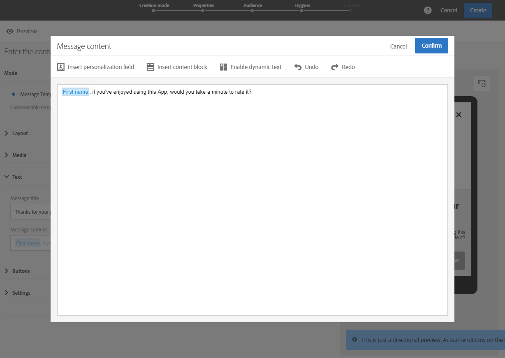

# Customizing an In-App message{#customizing-an-in-app-message}

要微调应用程序内消息，Adobe Campaign允许您在设计应用程序内应用程序时访问一组高级选项。

应用程序内内容编辑器允许您在两种应用程序内消息模式之间进行选择：

* [消息模板](../../channels/using/customizing-an-in-app-message.md#customizing-with-a-message-template)：此模板允许您使用图像或视频和操作按钮完全自定义应用程序内应用程序。
* [自定义消息](../../channels/using/customizing-an-in-app-message.md#customizing-with-a-custom-html-message)：此模板允许您导入自定义HTML。

**相关主题：**

* [发送应用程序内消息](../../channels/using/preparing-and-sending-an-in-app-message.md#sending-your-in-app-message)
* [应用程序内报告](../../reporting/using/in-app-report.md)

## Customizing with a message template {#customizing-with-a-message-template}

### Layout {#layout}

**[!UICONTROL Layout]** 下拉菜单提供了四种不同的选项，可根据您的消息需求进行选择：

* **[!UICONTROL Full page]**：此类型的布局涵盖了受众设备的整个屏幕。

   它支持媒体(图像、视频)、文本和按钮组件。

* **[!UICONTROL Large modal]**：此布局显示在大警报样式窗口中，您的应用程序仍在后台可见。

   它支持媒体(图像、视频)、文本和按钮组件。

* **[!UICONTROL Small modal]**：此布局显示为小警报类型窗口，您的应用程序仍在后台可见。

   它支持媒体(图像、视频)、文本和按钮组件。

* **[!UICONTROL Alert]**：此类型的布局显示为本机操作系统警告消息。

   它只能支持文本和按钮组件。

* **[!UICONTROL Local notification]**：此类型的布局显示为横幅消息。

   它只能支持声音、文本和目标。For more on local notification, refer to [Customizing a local notification message type](../../channels/using/customizing-an-in-app-message.md#customizing-a-local-notification-message-type).

每种类型的布局都可以在手机、平板电脑、平台等不同设备上预览，如Android或iOS和方向，如内容编辑器的右窗口中的横向或portra。

### Media {#media}

**[!UICONTROL Media]** 下拉菜单允许您向应用程序内消息中添加媒体，为最终用户创建引人注目的体验。

1. Select your **[!UICONTROL Media Type]** between image and video.
1. For the **[!UICONTROL Image]** media type, enter your URL in the **[!UICONTROL Media URL]** field based on the supported formats.

   If needed, you can also enter the path to a **[!UICONTROL Bundled image]** which can be used if the device is offline.

   

1. For the **[!UICONTROL Video]** media type, enter your URL in the **[!UICONTROL Media URL]** field.

   Then, enter your **[!UICONTROL Video poster]** to be used while the video is downloading on the audience devices or until users tap the play button.

   

### Text {#text}

如果需要，您还可以向应用程序内消息添加消息标题和内容。为了更好地个性化应用程序内消息，您可以为内容添加不同的个性化字段、内容块和动态文本。

1. In the **[!UICONTROL Text]** drop-down, add a title in the **[!UICONTROL Message title]** field.

   

1. Add your content in the **[!UICONTROL Message content]** field.
1. To further personalize your text, click the  icon to add personalization fields.

   

1. 键入消息内容并根据需要添加个性化字段。

   For more information on personalization field, refer to this [section](../../designing/using/inserting-a-personalization-field.md).

   

1. 在预览窗口中检查消息内容。

   

### Buttons {#buttons}

最多可向应用程序内消息添加两个按钮。

1. In the **[!UICONTROL Buttons]** drop-down, enter the text of your first button in the **[!UICONTROL Primary]** category.

   

1. Choose which of the two actions **[!UICONTROL Dismiss]** and **[!UICONTROL Redirect]** will be assigned to your primary button.
1. **[!UICONTROL Secondary]** 在类别中，输入文本，根据需要向应用程序内应用程序添加第二个按钮。
1. 选择与第二个按钮关联的操作。
1. If you chose the **[!UICONTROL Redirect]** action, enter your web URL or deeplink in the **[!UICONTROL Destination URL]** field.

   

1. Enter your web URL or deeplink in the **[!UICONTROL Destination URL]** field, if you chose the **[!UICONTROL Redirect]** action,
1. 在预览窗口中或单击“预览”按钮，检查您的消息内容。

   Refer to the [Previewing the In-App message](../../channels/using/customizing-an-in-app-message.md#previewing-the-in-app-message) page.

   

### Settings {#settings}

1. **[!UICONTROL Settings]** 在类别中，在浅色和深色之间选择背景颜色。
1. Choose to display or not a close button with the **[!UICONTROL Show close button]** option to provide users a way to dismiss the In-App message.
1. Select if your button alignment will be horizontal or vertical with the **[!UICONTROL Button alignment]** option.
1. 选择您的应用程序内消息是否可以在几秒钟后自动消失。

   

## Customizing a local notification message type {#customizing-a-local-notification-message-type}

本地通知只能由应用程序在特定时间触发，具体取决于活动。他们将提醒用户即使没有Internet访问权限，也会在其应用程序中发生一些事情。

自定义本地通知：

1. From your **[!UICONTROL Content]** page, select **[!UICONTROL Local notification]** in the **[!UICONTROL Layout]** category

   

1. Under the **[!UICONTROL Text]** category, type down your **[!UICONTROL Message title]** and **[!UICONTROL Message content]**.

   

1. Under the **[!UICONTROL Advanced option]** category, in the **[!UICONTROL Wait to display]** field, choose how long in seconds your local notification will be displayed on screen once your event is triggered.
1. **[!UICONTROL Sound]** 在字段中输入在收到本地通知时移动设备播放的声音文件的文件名。

   如果在手机应用程序的包中定义了该文件，则声音文件在发送通知时播放。否则，将播放设备的默认声音。

   

1. Specify a destination to redirect your users when they interact with your local notification in the **[!UICONTROL Deeplink URL]** field.
1. 要以关键值对的形式传递有效负荷中的自定义数据，您可以向本地通知中添加自定义字段。**[!UICONTROL Custom fields]** 在类别中，单击 **[!UICONTROL Create an element]** 按钮。
1. Enter your **[!UICONTROL Keys]** then the **[!UICONTROL Values]** associated with each key.

   请注意，自定义字段的处理和目的完全取决于移动应用程序。

1. **[!UICONTROL Apple options]** 在类别中，填写 **[!UICONTROL Category]** 字段以添加自定义操作的类别ID(如果在Apple移动应用程序中可用)。

## Customizing with a custom HTML message {#customizing-with-a-custom-html-message}

>[!NOTE]
>
>自定义HTML消息不支持内容个性化。

**[!UICONTROL Custom message]** 此模式允许您直接导入预配置的HTML消息之一。

为此，您只需拖放或从计算机中选择文件。

Your file must have a specific layout which can be found by clicking the **Download the sample file** option.

您还可以找到自定义HTML要求列表，以便在Adobe Campaign中成功导入。

导入HTML后，您可以在预览窗口中的不同设备上找到文件的预览。

## Previewing the In-App message {#previewing-the-in-app-message}

在发送应用程序内消息之前，您可以测试测试配置文件，以检查目标受众何时收到您的交付内容。

1. Click the **[!UICONTROL Preview]** button.

   

1. Click the **[!UICONTROL Select a test profile]** button and select one of your test profiles to start previewing your delivery. For more information on test profiles, refer to this [section](../../sending/using/managing-test-profiles-and-sending-proofs.md).
1. 在Android、iPhone手机甚至平板电脑等不同设备上检查消息。您还可以检查您的个性化字段是否检索正确的数据。

   

1. 现在，您可以通过发送报告发送消息并衡量其影响。For more on reporting, refer to [this section](../../reporting/using/in-app-report.md).

