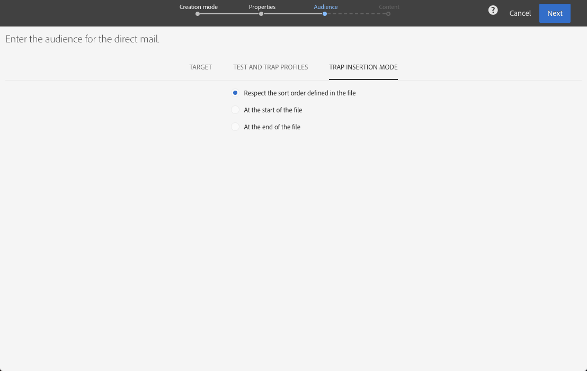

# 定义直邮受众{#defining-the-direct-mail-audience}

您可以在创建向导中定义受众，也可以通过单击投放仪表板的 **Audience** 部分定义受众。

## 定义主目标 {#defining-the-main-target}

对于直邮而言，定向的轮廓，指的是将要包含在提取文件中、发给直邮提供商的轮廓。

提取文件中会为每个定向轮廓添加一个新行。 对于 [Defining the extraction](../../channels/using/defining-the-direct-mail-content.md#defining-the-extraction) 屏幕中定义的每个收件人，都将包含轮廓的相关信息。

>[!IMPORTANT]
>
>确保您的轮廓包含邮政地址，因为此信息对于直邮服务提供商至关重要。 另外，请确保已勾选轮廓信息中的 **[!UICONTROL Address specified]** 方框。 请参阅[建议](../../channels/using/about-direct-mail.md#recommendations)。

## 添加测试和陷阱用户档案 {#adding-test-and-trap-profiles}

添加测试轮廓，以便使用少量轮廓对文件进行测试。 利用此功能，可在准备实际文件之前快速创建一个文件示例以测试和验证结构。 请参阅[管理测试轮廓](../../audiences/using/managing-test-profiles.md)。

陷阱的使用对于直邮投放至关重要。 利用此功能，可验证您的直邮提供商是否确实在发送邮件，以及他们是否未将您的客户清单发送给其他提供商。 请参阅[使用陷阱](../../sending/using/using-traps.md)。

直邮投放会在提取期间添加陷阱，并混在输出文档中。 默认情况下，会按照输出文件的排列顺序插入陷阱，但也您可以选择在文件末尾或开头插入。 定义受众时，从 **[!UICONTROL Trap insertion mode]** 选项卡中选择所需的选项。

