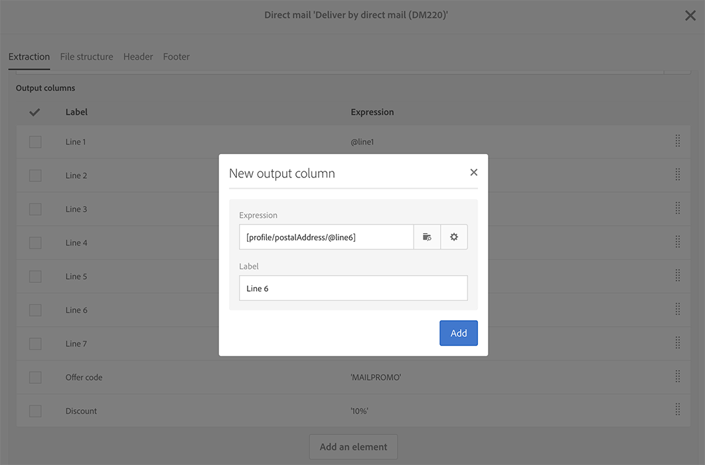

# 定义直邮内容{#defining-the-direct-mail-content}

您可以在创建向导的最后一个屏幕中定义其内容，也可以通过单击投放仪表板的 **Content** 部分定义其内容。

**[!UICONTROL Content]** 定义屏幕专用于直邮渠道。该屏幕包含四个选项卡：**[!UICONTROL Extraction]**、**[!UICONTROL File structure]**、**[!UICONTROL Header]** 和 **[!UICONTROL Footer]**。

## 定义提取{#defining-the-extraction}

1. 首先从定义提取文件的名称开始。单击 **[!UICONTROL Output file]** 字段右侧的按钮，输入所需的标签。您可以使用个性化字段、内容块和动态文本（请参阅[定义内容](../../designing/using/personalization.md#example-email-personalization)）。例如，您可以在标签中填写投放 ID 或提取日期。

   

1. 单击 **[!UICONTROL +]** 或 **[!UICONTROL Add an element]** 按钮以添加输出列。利用 **[!UICONTROL Output columns]** 可定义要导出到输出文件中的用户档案信息（列）。

   >[!IMPORTANT]
   >
   >确保您的用户档案包含邮政地址，因为此信息对于直邮服务提供商至关重要。另外，请确保已勾选用户档案信息中的 **[!UICONTROL Address specified]** 方框。请参阅[建议](../../channels/using/about-direct-mail.md#recommendations)。

   

1. 根据需要创建所需数量的列。您可以通过单击列的表达式和标签对列进行编辑。

>[!NOTE]
>
>有关输出列定义的更多信息，请参阅[提取文件](../../automating/using/extract-file.md)工作流活动一节。

## 定义文件结构{#defining-the-file-structure}

利用 **File structure** 选项卡，可为要导出的文件配置输出、日期和数字格式。

>[!NOTE]
>
>有关可用选项的详情，请参阅[提取文件](../../automating/using/extract-file.md)工作流活动一节。

## 定义页眉和页脚{#defining-the-header-and-footer}

有时您可能需要在提取文件的开头或结尾添加信息。为此，请使用 **[!UICONTROL Content]** 配置屏幕的 **[!UICONTROL Header]** 和 **[!UICONTROL Footer]** 选项卡。

例如，您可能希望在文件的页眉中包含发件人的信息（提供给直邮服务提供商）。可以使用投放上下文中提供的信息，将页脚和页眉个性化。请参阅[定义内容](../../designing/using/personalization.md#example-email-personalization)。

直邮属性或模板级别中的 **[!UICONTROL Send]** 部分定义了发件人的地址。

