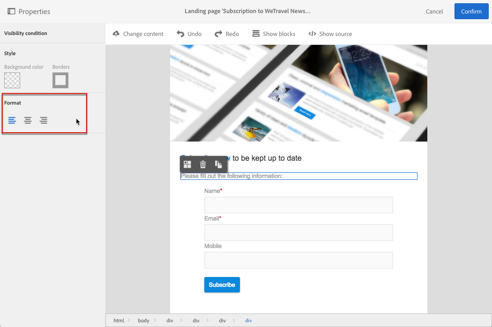

# 设计登陆页面{#designing-a-landing-page}

## 关于登陆页面内容设计 {#about-content-design}

登陆页面可创建为任意[营销活动](../../start/using/marketing-activities.md#about-marketing-activities)。

设计登陆页面时，您需要定义页面本身、确认页面和出错页面的内容。使用操作栏下的切换器，可一一显示和配置这些页面。

可通过Campaign内容编辑器设计登陆页面的内容。

>[!NOTE]
>
>对于电子邮件设计，如果您的实例安装在Adobe Campaign Standard 19.0版本之前，则仍可访问旧版电子邮件内容编辑器。 界面、使用原理和配置，基本上与下方所述的登陆页面相同。但是，从 19.0 版开始就弃用了旧版电子邮件内容编辑器，因此可能无法提供或维持该编辑器的所有功能。要通过具有扩展功能的拖放界面快速编辑电子邮件内容，请使用 [Email Designer](../../designing/using/designing-content-in-adobe-campaign.md)。

本页介绍登陆页面内容编辑器的特性。有关一个或多个营销活动通用操作的更多信息，请参阅&#x200B;**设计电子邮件内容**&#x200B;指南的以下章节：

* [插入个性化字段](../../designing/using/personalization.md#inserting-a-personalization-field)
* [添加内容块](../../designing/using/personalization.md#adding-a-content-block)
* [插入链接](../../designing/using/links.md#inserting-a-link)
* [插入图像](../../designing/using/images.md)
* [内容设计的常规最佳实践](../../designing/using/designing-content-in-adobe-campaign.md#content-design-best-practices)

>[!NOTE]
>如果您的登陆页面已预定义为 HTML 格式，则可以使用 **[!UICONTROL Change content]** 按钮直接将其导入。
>
>在 Adobe Campaign 中导入 HTML 页面之前，请确保该页面可在各种浏览器中正确打开并显示。如果 HTML 页包含 JavaScript 脚本，则需要在编辑器外执行这些脚本时不出错。通常应避免在消息内容中使用脚本，以确保电子邮件客户端能正确处理该消息。

## 登陆页面内容编辑器界面{#landing-page-content-editor-interface}

利用 Adobe Campaign 中的登陆页面内容编辑器，可轻松定义、修改和个性化内容。要访问该编辑器，请在登陆页面仪表板中单击 **[!UICONTROL Content]** 块。

内容编辑器分为三个不同的部分。利用这些部分，可查看和编辑内容。

1. 利用屏幕左侧的&#x200B;**面板**，可修改链接到选定块的常规选项。可修改的选项有：背景颜色、边框、文本对齐、可见性条件等。请参阅[插入个性化字段](../../designing/using/personalization.md#inserting-a-personalization-field)。
1. **操作栏**&#x200B;包含页面的常规选项。您可以选择模板并更改显示模式。
1. 在主&#x200B;**编辑区域**，您可以使用上下文工具栏直接与内容交互：在图像中插入链接、更改字体、删除字段等。

利用&#x200B;**操作栏**&#x200B;中的各个按钮，可与正在创建的内容交互。

<table> 
 <thead> 
  <tr> 
   <th> 图标  </th> 
   <th> 按钮名称  </th> 
   <th> 渠道  </th> 
   <th> 说明  </th> 
  </tr> 
 </thead> 
 <tbody> 
  <tr> 
   <td>    </td> 
   <td> 更改内容   </td> 
   <td> 登陆页面和电子邮件  </td> 
   <td> 用于选择现成的内容或导入自己的 HTML 内容。请参阅<a href="../../designing/using/using-existing-content.md">加载现有内容</a>。  </td> 
  </tr> 
  <tr> 
   <td>    </td> 
   <td> 撤消   </td> 
   <td> 所有  </td> 
   <td> 取消上次执行的操作。  </td> 
  </tr> 
  <tr> 
   <td>    </td> 
   <td> 重做   </td> 
   <td> 所有  </td> 
   <td> 重新执行您取消的上一个操作。  </td> 
  </tr> 
  <tr> 
   <td>    </td> 
   <td> 显示块   </td> 
   <td> 登陆页面和电子邮件  </td> 
   <td> 用于显示内容块周围的方框（对应于 <strong>&lt;div&gt;</strong> HTML 标签）。  </td> 
  </tr> 
  <tr> 
   <td>    </td> 
   <td> 显示源   </td> 
   <td> 登陆页面和电子邮件  </td> 
   <td> 用于显示页面的 HTML 源代码。  </td> 
  </tr> 
 </tbody> 
</table>

**工具栏**&#x200B;属于编辑器界面的上下文元素，可根据所选区域提供各种功能。工具栏中包含操作按钮和用于更改文本样式的按钮。执行的修改始终应用于所选区域。选择某个块后，可以对其进行删除或复制之类的操作。选择块内的文本后，可将其转换为链接或变为粗体。

>[!IMPORTANT]
>
>利用某些工具栏功能，可将 HTML 格式的格式化。但是，如果页面包含 CSS 样式表，则样式表中的&#x200B;**说明**&#x200B;优先级可能要高于通过&#x200B;**工具栏**&#x200B;指定的说明。

<table> 
 <thead> 
  <tr> 
   <th> 图标  </th> 
   <th> 按钮名称  </th> 
   <th> 上下文  </th> 
   <th> 说明  </th> 
  </tr> 
 </thead> 
 <tbody> 
  <tr> 
   <td>    </td> 
   <td> 链接到外部 URL   </td> 
   <td> 任意元素  </td> 
   <td> 用于添加指向某个 URL 的链接。有关如何配置链接的详细信息，请参阅<a href="../../designing/using/links.md#inserting-a-link">插入链接</a>一节。  </td> 
  </tr> 
  <tr> 
   <td>    </td> 
   <td> 链接到登陆页面   </td> 
   <td> 任意元素  </td> 
   <td> 用于访问 Adobe Campaign 登陆页面。有关如何配置链接的详细信息，请参阅<a href="../../designing/using/links.md#inserting-a-link">插入链接</a>一节。  </td> 
  </tr> 
  <tr> 
   <td>    </td> 
   <td> 订阅链接   </td> 
   <td> 任意元素  </td> 
   <td> 用于插入服务订阅链接。有关如何配置链接的详细信息，请参阅<a href="../../designing/using/links.md#inserting-a-link">插入链接</a>一节。  </td> 
  </tr> 
  <tr> 
   <td>    </td> 
   <td> 退订链接   </td> 
   <td> 任意元素  </td> 
   <td> 用于插入服务退订链接。有关如何配置链接的详细信息，请参阅<a href="../../designing/using/links.md#inserting-a-link">插入链接</a>一节。  </td> 
  </tr> 
  <tr> 
   <td>    </td> 
   <td> 删除链接   </td> 
   <td> 链接  </td> 
   <td> 用于在确认后删除链接以及与该链接关联的所有配置。  </td> 
  </tr> 
  <tr> 
   <td>    </td> 
   <td> 插入个性化字段   </td> 
   <td> 文本元素  </td> 
   <td> 用于向内容添加来自数据库的字段。请参阅<a href="../../designing/using/personalization.md#inserting-a-personalization-field">插入个性化字段</a>。  </td> 
  </tr> 
  <tr> 
   <td>    </td> 
   <td> 插入内容块   </td> 
   <td> 文本元素  </td> 
   <td> 用于向内容添加个性化块。请参阅<a href="../../designing/using/personalization.md#adding-a-content-block">添加内容块</a>。  </td> 
  </tr> 
  <tr> 
   <td>    </td> 
   <td> 启用动态内容   </td> 
   <td> 文本元素  </td> 
   <td> 用于在内容中插入动态内容。请参阅<a href="../../channels/using/designing-a-landing-page.md#defining-dynamic-content-in-a-landing-page">定义动态内容</a>。  </td> 
  </tr> 
  <tr> 
   <td>    </td> 
   <td> 禁用动态内容   </td> 
   <td> 文本元素  </td> 
   <td> 用于删除动态内容。  </td> 
  </tr> 
  <tr> 
   <td>    </td> 
   <td> 放大字体   </td> 
   <td> 文本元素  </td> 
   <td> 增加所选文本的大小（添加 <strong>&lt;span style="font-size:"&gt;</strong>）。  </td> 
  </tr> 
  <tr> 
   <td>    </td> 
   <td> 缩小字体   </td> 
   <td> 文本元素  </td> 
   <td> 减小所选文本的大小（添加 <strong>&lt;span style="font-size:"&gt;</strong>）。  </td> 
  </tr> 
  <tr> 
   <td>    </td> 
   <td> 粗体   </td> 
   <td> 文本元素  </td> 
   <td> 为所选文本添加粗体样式（在文本前后分别使用 <strong>&lt;strong&gt;</strong><strong>&lt;/strong&gt;</strong> 标记）。  </td> 
  </tr> 
  <tr> 
   <td>    </td> 
   <td> 斜体   </td> 
   <td> 文本元素  </td> 
   <td> 为所选文本添加斜体样式（在文本前后分别使用 <strong>&lt;em&gt;</strong><strong>&lt;/em&gt;</strong> 标记）。  </td> 
  </tr> 
  <tr> 
   <td>    </td> 
   <td> 下划线   </td> 
   <td> 文本元素  </td> 
   <td> 为所选文本加下划线（在文本前后分别使用<strong>&lt;span style="text-decoration: underline;"&gt;</strong>标记）。  </td> 
  </tr> 
  <tr> 
   <td>    </td> 
   <td> 更改背景颜色   </td> 
   <td> 文本元素  </td> 
   <td> 用于更改所选块的背景颜色（添加 style="background-color: rgba(170, 86, 255, 0.87)）。  </td> 
  </tr> 
  <tr> 
   <td>    </td> 
   <td> 更改字体颜色   </td> 
   <td> 文本元素  </td> 
   <td> 用于更改块中所有文本的颜色或仅更改块中选定文本的颜色（<strong>&lt;span style="color: #56ff56;"&gt;</strong>）。  </td> 
  </tr> 
  <tr> 
   <td>    </td> 
   <td> 图像   </td> 
   <td> 包含图像的块  </td> 
   <td> 用于使用本地保存的文件插入图像。  </td> 
  </tr> 
  <tr> 
   <td>    </td> 
   <td> 删除   </td> 
   <td> 任意块  </td> 
   <td> 删除块及其内容。  </td> 
  </tr> 
  <tr> 
   <td>    </td> 
   <td> 复制   </td> 
   <td> 任意块  </td> 
   <td> 复制块，包括链接到该块的所有样式。  </td> 
  </tr> 
 </tbody> 
</table>

## 管理登陆页面的结构和样式{#managing-landing-page-structure-and-style}

### 在内容编辑器中管理块 {#managing-blocks-in-the-content-editor}

不同的 HTML 内容元素在登陆页面中以块的形式显示，对应于 **&lt;div>**&#x200B;**&lt;/div>** 标签。选择要与其交互的块。随后该块周围会显示一个蓝色的方框。

如果选择某个块，则对应 HTML 元素的父对象将显示在编辑区域底部的痕迹导航中。

当鼠标指针悬停在某个痕迹导航元素上时，将高亮显示相关的元素。这样，您可以轻松地在不同块之间导航，并准确选择要修改的 HTML 元素。

使用面板和上下文工具栏中的选项来修改、删除或复制块。

对于包含文本的块，在块中再次单击可启用文本编辑模式。块周围的方框会变成绿色。然后，您可以选择或输入文本。使用面板和上下文工具栏中的选项，可添加链接或修改文本格式。

可以随时从面板中修改为块中某个元素（链接、个性化字段、内容块等）定义的参数。

### 在内容编辑器中添加边框和背景 {#adding-a-border-and-a-background-in-the-content-editor}

您还可以通过从图表中选择颜色以定义背景&#x200B;**颜色**。该颜色将应用于所选的块。

您可以向选定块添加&#x200B;**边框**。

### 在内容编辑器中更改文本样式 {#changing-the-text-style-in-the-content-editor}

要更改文本样式，必须单击文本块的内部。

要更改文本对齐方式，请在左侧的面板中选择以下三个图标之一：

* **左对齐**：将文本与选定块的左侧对齐（添加 style=&quot;text-align: left;&quot;）。
* **中心**：将选定块中的文本居中（添加 style=&quot;text-align: center;&quot;）。
* **右对齐**：将文本与选定块的右侧对齐（添加 style=&quot;text-align: right;&quot;）。

您还可以使用工具栏更改字体属性：调整字体大小、使文本变为粗体或斜体、添加下划线或更改文本的颜色。请参阅[此章节](../../channels/using/designing-a-landing-page.md#landing-page-content-editor-interface) 。

### 在登陆页面中插入图像 {#inserting-images-in-a-landing-page}

1. 在登陆页面内容中，选择包含图像的块。
1. 选择 **[!UICONTROL Insert]** 按钮。

   

1. 从上下文工具栏选择 **[!UICONTROL Local image]**。

   

1. 选择文件。

   

1. 根据需要调整图像属性。

   

## 在登陆页面中定义动态内容{#defining-dynamic-content-in-a-landing-page}

要在登陆页面中定义动态内容，请使用痕迹导航或直接单击某个元素以选择块。

某些块无法直接选择，例如图像。在这种情况下，请使用痕迹导航选择父块。然后，您可以修改此父元素所包含的所有元素，包括图像。该条件将应用于父块中的所有子元素。

有关痕迹导航的信息，请参阅[管理块](../../channels/using/designing-a-landing-page.md#managing-landing-page-structure-and-style)一节。

定义登陆页面中动态内容的后续步骤，与电子邮件的这些步骤有些相似。请参阅[此章节](../../designing/using/personalization.md#defining-dynamic-content-in-an-email)。

>[!NOTE]
>
>如果变体元素以红色列出，则表示尚未定义表达式。

您可以在块的各个动态内容之间导航。操作步骤：

1. 选择块。

   箭头显示在图像的右侧和左侧。

1. 单击向右箭头浏览可用的动态内容。

   

   到达最后一个或第一个可用的动态内容时，两个方向上对应的箭头会变暗。

   

1. 要删除应用于某个块的所有条件，请选择该块并单击 **[!UICONTROL Disable dynamic content]** 图标。
1. 选择想要保留的动态内容。

   

在面板中：

* 输入了表达式的内容不再以红色列出，而是以灰色显示。
* 当前选中的内容以蓝色显示。

