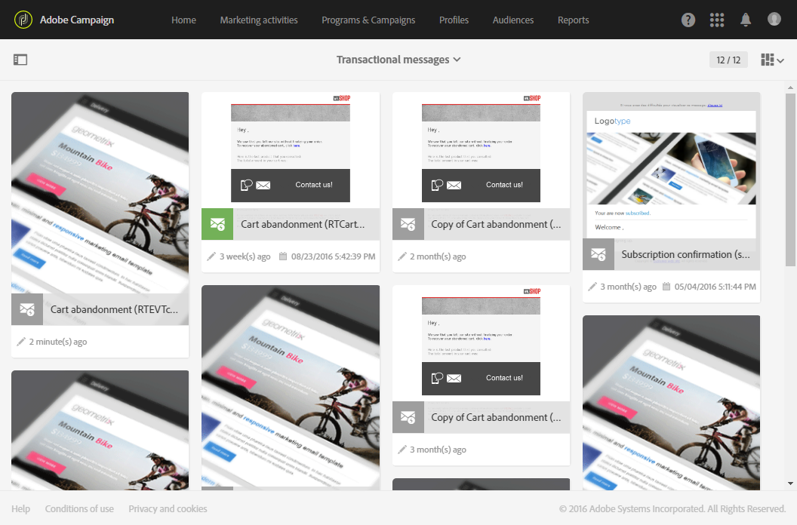
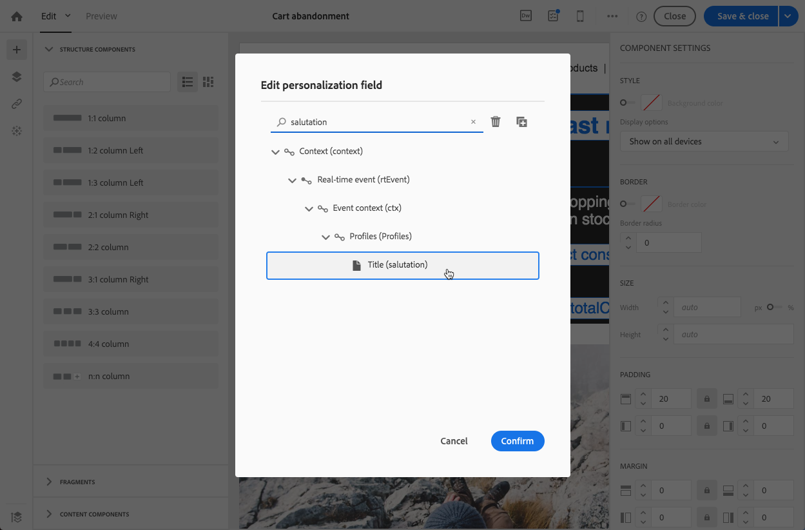
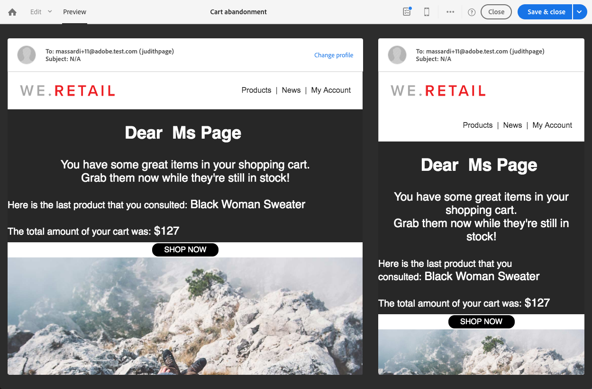
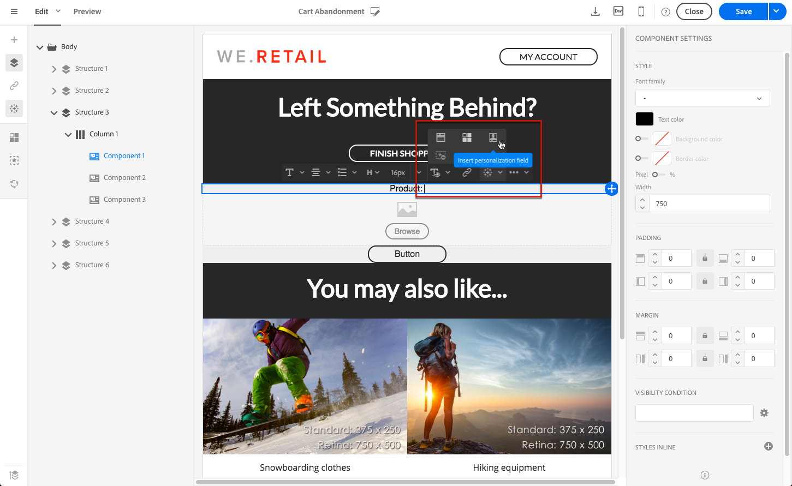

# 编辑事务性消息 {#editing-transactional-message}

创建并发布事件<!--(the cart abandonment example as explained in [this section](../../channels/using/getting-started-with-transactional-msg.md#transactional-messaging-operating-principle))-->后，将自动创建相应的事务性消息。

[配置事务事件](../../channels/using/configuring-transactional-event.md)和[发布事务事件](../../channels/using/publishing-transactional-event.md)部分介绍了配置和发布该事件的步骤。

访问、编辑和个性化此消息的步骤如下所述。

>[!IMPORTANT]
>
>只有具有[管理](../../administration/using/users-management.md#functional-administrators)角色的用户才能访问和编辑事务性消息。

消息准备就绪后，即可对其进行测试和发布。 请参阅[测试事务性消息](../../channels/using/testing-transactional-message.md)和[事务性消息生命周期](../../channels/using/publishing-transactional-message.md)。

## 访问事务性消息{#accessing-transactional-messages}

访问您创建的事务性消息:

1. 单击左上角的&#x200B;**[!UICONTROL Adobe Campaign]**&#x200B;徽标。
1. 选择&#x200B;**[!UICONTROL Marketing plans]** > **[!UICONTROL Transactional messages]** > **[!UICONTROL Transactional messages]**。

   

1. 单击您选择的消息进行编辑。

   

您还可以通过位于相应事务性消息配置屏幕左侧区域的链接直接访问事件。 请参阅[预览和发布事件](../../channels/using/publishing-transactional-event.md#previewing-and-publishing-the-event)

## 个性化事务型消息{#personalizing-a-transactional-message}

要编辑和个性化事务性消息，请按照以下步骤操作。

>[!NOTE]
>
>本节介绍如何编辑&#x200B;**基于事件的**&#x200B;事务性消息。 **基于用户档案的**&#x200B;事务性消息特性详细如下[。](#profile-transactional-message-specificities)
>
>创建基于事件的事务性消息的配置步骤显示在[本节](../../channels/using/configuring-transactional-event.md#event-based-transactional-messages)中。

例如，您希望向已将产品添加到购物车并离开网站的网站用户发送通知，而不进行购买。 此示例在[Transactional messaging操作原则](../../channels/using/getting-started-with-transactional-msg.md#transactional-messaging-operating-principle)部分中介绍。

1. 单击 **[!UICONTROL Content]** 块以修改消息的主题和内容。对于本示例，可选择包含图像和文本的任意模板。有关电子邮件内容模板的详细信息，请参阅[使用模板设计电子邮件](../../designing/using/using-reusable-content.md#designing-templates)。

   

1. 根据需要，添加主题并编辑消息内容。

   >[!NOTE]
   >
   >指向放弃购物车的链接是指向外部 URL 的链接，会将用户重定向到其购物车。此参数不在 Adobe Campaign 中管理。

1. 在本例中，您要添加在[创建事件](../../channels/using/configuring-transactional-event.md)时定义的三个字段：名字、查看的最后一个产品、购物车总金额。要实现此目的，请在消息内容中[插入个性化字段](../../designing/using/personalization.md#inserting-a-personalization-field)。

1. 通过 **[!UICONTROL Context]** > **[!UICONTROL Real-time event]** > **[!UICONTROL Event context]** 浏览这些字段。

   

1. 您还可以丰富消息的内容。 为此，请添加您链接到事件配置的表中的字段(请参阅[丰富事件](../../channels/using/configuring-transactional-event.md#enriching-the-transactional-message-content))。 在此示例中，从&#x200B;**[!UICONTROL Profile]**&#x200B;表中选择&#x200B;**[!UICONTROL Title (salutation)]**&#x200B;字段，直至&#x200B;**[!UICONTROL Context]** > **[!UICONTROL Real-time event]** > **[!UICONTROL Event context]**。

   

1. 插入所有需要的字段。

   

1. 选择为此事件定义的用户档案，预览消息。

   有关预览消息的详细步骤，请参阅[预览消息](../../sending/using/previewing-messages.md)一节。

   

   您可以检查个性化字段是否与在测试用户档案中输入的信息匹配。有关详细信息，请参阅[定义特定测试用户档案](../../channels/using/testing-transactional-message.md#defining-specific-test-profile)。

## 在事务型消息中使用产品清单{#using-product-listings-in-a-transactional-message}

在编辑交易电子邮件的内容时，您可以创建引用一个或多个数据集合的产品列表。 例如，在购物车废弃电子邮件中，您可以包含用户离开网站时购物车中的所有产品的列表，以及图像、价格和指向每个产品的链接。

>[!IMPORTANT]
>
>在通过[电子邮件设计器](../../designing/using/designing-content-in-adobe-campaign.md#email-designer-interface)界面编辑事务性电子邮件内容时，产品列表仅对电子邮件渠道可用。

要在事务型消息中添加已放弃产品的清单，请执行以下步骤。

您还可以观看[此视频集](https://experienceleague.adobe.com/docs/campaign-standard-learn/tutorials/designing-content/product-listings-in-transactional-email.html?lang=en#configure-product-listings-in-transactional-emails)，说明在交易电子邮件中配置产品列表所需的步骤。

>[!NOTE]
>
>Adobe Campaign 不支持嵌套产品清单，这意味着您不能将一个产品清单包含在另一个产品清单中。

### 定义产品清单{#defining-a-product-listing}

在事务型消息中使用产品清单之前，您需要在事件层级定义产品清单以及要显示的清单中各个产品的字段。有关更多信息，请参阅[定义数据集合](../../channels/using/configuring-transactional-event.md#defining-data-collections)。

1. 在事务型消息中，单击 **[!UICONTROL Content]** 块以修改电子邮件的内容。
1. 将结构组件拖放到工作区。有关此内容的详细信息，请参阅[定义电子邮件结构](../../designing/using/designing-from-scratch.md#defining-the-email-structure)。

   例如，选择一列结构组件并添加文本组件、图像组件和按钮组件。有关此内容的详细信息，请参阅[使用内容组件](../../designing/using/designing-from-scratch.md#about-content-components)。

1. 选择之前创建的结构组件，然后单击上下文工具栏中的 **[!UICONTROL Enable product listing]** 图标。

   

   结构组件以橙色框突出显示，且 **[!UICONTROL Product listing]** 设置显示在左侧面板中。

   

1. 选择集合元素的显示方式：

   * **[!UICONTROL Row]**：水平，表示每行显示一个元素，逐行排列。
   * **[!UICONTROL Column]**: 垂直，表示使用同一行将各个元素邻近放置。

   >[!NOTE]
   >
   >仅当使用多列结构组件（**[!UICONTROL 2:2 column]**、**[!UICONTROL 3:3 column]** 和 **[!UICONTROL 4:4 column]**）时，才可使用 **[!UICONTROL Column]** 选项。编辑产品清单时，仅填写第一列：不考虑其他列。有关选择结构组件的详细信息，请参阅[定义电子邮件结构](../../designing/using/designing-from-scratch.md#defining-the-email-structure)。

1. 选择配置与事务型消息相关的事件时创建的数据集合。您可以通过 **[!UICONTROL Context]** > **[!UICONTROL Real-time event]** > **[!UICONTROL Event context]** 节点找到该数据集合。

   

   有关配置事件的更多信息，请参阅[定义数据集合](../../channels/using/configuring-transactional-event.md#defining-data-collections)。

1. 使用 **[!UICONTROL First item]** 下拉列表选择电子邮件中显示清单的开头元素。

   例如，如果您选择“2”，则集合的第一个项将不会显示在电子邮件中。产品清单将从第二项开始。

1. 选择要在清单中显示的最大项数。

   >[!NOTE]
   >
   >如果希望垂直显示清单中的元素 (**[!UICONTROL Column]**)，则最大项数将根据选则的结构组件（2 列、3 列或 4 列）而有所限制。有关选择结构组件的更多信息，请参阅[编辑电子邮件结构](../../designing/using/designing-from-scratch.md#defining-the-email-structure)。

### 填充产品清单{#populating-the-product-listing}

要显示来自事务型电子邮件所链接事件的产品清单，请执行以下步骤。

有关在配置事件时创建集合和相关字段的更多信息，请参阅[定义数据集合](../../channels/using/configuring-transactional-event.md#defining-data-collections)。

1. 选择要插入的图像组件，选择 **[!UICONTROL Enable personalization]** 并单击 Settings 窗格中的铅笔。

   

1. 在打开的 **[!UICONTROL Image source URL]** 窗口中选择 **[!UICONTROL Add personalization field]**。

   前往 **[!UICONTROL Context]** > **[!UICONTROL Real-time event]** > **[!UICONTROL Event context]** 节点，打开与您创建的集合对应的节点（此处为 **[!UICONTROL Product list]**），然后选择之前定义的图像字段（此处为 **[!UICONTROL Product image]**）。单击 **[!UICONTROL Save]**。

   

   现在，您选择的个性化字段即已显示在设置窗格中。

1. 在所需位置，从上下文工具栏中选择&#x200B;**[!UICONTROL Insert personalization field]** 

   

1. 前往 **[!UICONTROL Context]** > **[!UICONTROL Real-time event]** > **[!UICONTROL Event context]** 节点，打开与您创建的集合对应的节点（此处为 **[!UICONTROL Product list]**），然后选择之前创建的字段（此处为 **[!UICONTROL Product name]**）。单击 **[!UICONTROL Confirm]**。

   

   现在，您选择的个性化字段即已显示在电子邮件内容中所需的位置。

1. 接下来以类似方式插入价格。
1. 选择一些文本，然后从上下文工具栏中选择&#x200B;**[!UICONTROL Insert link]** 

   

1. 在打开的 **[!UICONTROL Insert link]** 窗口中选择 **[!UICONTROL Add personalization field]**。

   前往 **[!UICONTROL Context]** > **[!UICONTROL Real-time event]** > **[!UICONTROL Event context]** 节点，打开与您创建的集合对应的节点（此处为 **[!UICONTROL Product list]**），然后选择之前创建的 URL 字段（此处为 **[!UICONTROL Product URL]**）。单击 **[!UICONTROL Save]**。

   >[!IMPORTANT]
   >
   >出于安全原因，请确保将个性化字段插入以适当静态域名开头的链接中。

   

   现在，您选择的个性化字段即已显示在设置窗格中。

1. 选择应用产品清单的结构组件，然后选择 **[!UICONTROL Show fallback]** 以定义默认内容。

   

1. 拖动一个或多个内容组件并根据需要对其进行编辑。

   

   如果触发事件时集合为空（例如，如果客户购物车中没有任何内容），将显示回退内容。

1. 在“设置”窗格中，编辑产品清单的样式。有关此方面的详细信息，请参阅[管理电子邮件样式](../../designing/using/styles.md)。
1. 使用链接了相关事务型事件并为其定义了集合数据的测试用户档案，预览电子邮件。例如，在要使用的测试用户档案的 **[!UICONTROL Event data]** 部分中添加以下信息：

   

   有关定义事务型消息中的测试用户档案的更多信息，请参阅[本章节](../../channels/using/testing-transactional-message.md#defining-specific-test-profile)。

## 基于用户档案的事务性消息特异性{#profile-transactional-message-specificities}

您可以根据客户营销用户档案发送事务性消息，这使您能够利用所有用户档案信息个性化消息内容、使用退订链接并应用[疲劳规则](../../sending/using/fatigue-rules.md)等营销类型规则。

* 有关基于事件的事务性消息和基于用户档案的之间差异的详细信息，请参见[此部分](../../channels/using/getting-started-with-transactional-msg.md#transactional-message-types)。

* 创建基于用户档案的事务性消息的配置步骤详见[本节](../../channels/using/configuring-transactional-event.md#profile-based-transactional-messages)。

<!--### Editing a profile transactional message {#editing-profile-transactional-message}-->

创建、编辑和个性化用户档案事务性消息的步骤与创建事件事务性消息的步骤基本相同。

下方列出了两者之间的差异。

1. [请转至创建的事务型消息以对其进行编辑。](#accessing-transactional-messages)
1. 在事务型消息中，单击 **[!UICONTROL Content]** 部分。除了事务电子邮件模板之外，您还可以选择任何针对&#x200B;**[!UICONTROL Profile]**&#x200B;资源的电子邮件模板。

   

1. 选择默认电子邮件模板。与所有营销电子邮件相似，它包含&#x200B;**退订链接**。

   

   有关模板的详细信息，请参阅[此部分](../../designing/using/using-reusable-content.md#content-templates)。

1. 此外，与基于实时事件的配置不同，您可以&#x200B;**直接访问所有用户档案信息**&#x200B;以个性化您的信息。 您可以像添加任何其他标准营销电子邮件一样添加[个性化字段](../../designing/using/personalization.md#inserting-a-personalization-field)。

1. 在发布消息之前保存更改。 有关更多信息，请参阅[发布事务型消息](../../channels/using/publishing-transactional-message.md#publishing-a-transactional-message)。

<!--### Monitoring a profile transactional message delivery {#monitoring-a-profile-transactional-message-delivery}

Once the message is published and your site integration is done, you can monitor the delivery.

1. To view the message delivery log, click the icon at the bottom right of the **[!UICONTROL Deployment]** block.

1. Click the **[!UICONTROL Execution list]** tab.

   

1. Select the latest execution delivery.

   An **execution delivery** is a non-actionable and non-functional technical message created once a month for each transactional message, and each time a transactional message is edited and published again

1. Select the **[!UICONTROL Sending logs]** tab. In the **[!UICONTROL Status]** column, **[!UICONTROL Sent]** indicates that a profile has opted in.

   

1. Select the **[!UICONTROL Exclusions logs]** tab to view recipients who have been excluded from the message target, such as addresses on denylist.

   

>[!NOTE]
>
>For more information on accessing and using the logs, see [Monitoring a delivery](../../sending/using/monitoring-a-delivery.md).

For any profile that has opted out, the **[!UICONTROL Address on denylist]** typology rule excluded the corresponding recipient.

This rule is part of a specific typology that applies to all transactional messages based on the **[!UICONTROL Profile]** table.

**Related topics**:

* [Integrate the event triggering](../../channels/using/getting-started-with-transactional-msg.md#integrate-event-trigger)
* [About typologies and typology rules](../../sending/using/about-typology-rules.md)-->
