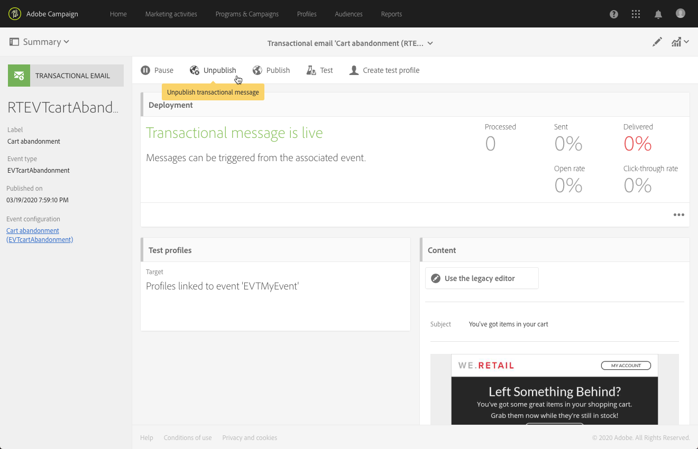

# 事件事务型消息{#event-transactional-messages}

您可以发送定向某个事件的事件事务型消息。此类事务型消息不包含用户档案信息：根据事件本身包含的数据定义投放目标。

创建并发布事件后（如[此章节](../../channels/using/getting-started-with-transactional-msg.md#transactional-messaging-operating-principle)所述的放弃购物车事件），将自动创建相应的事务型消息。

有关配置步骤，请参见[配置事件以发送事务型消息](../../administration/using/configuring-transactional-messaging.md#use-case--configuring-an-event-to-send-a-transactional-message)一节。

>[!NOTE]
>
>由于事件事务型消息不包含用户档案信息，所以就算使用用户档案扩充了内容，也不兼容疲劳规则。请参阅[疲劳规则](../../sending/using/fatigue-rules.md#choosing-the-channel)。

为了让事件触发发送事务型消息，您必须对消息进行个性化，然后测试并发布消息。

## 访问事务性消息{#accessing-transactional-messages}

访问您创建的事务性消息:

1. 单击左上角的&#x200B;**[!UICONTROL Adobe Campaign]**&#x200B;徽标。
1. 选择&#x200B;**[!UICONTROL Marketing plans]** > **[!UICONTROL Transactional messages]** > **[!UICONTROL Transactional messages]**。

   

1. 单击您选择的消息进行编辑。

>[!IMPORTANT]
>
>要访问事务型消息，您必须归属于 **[!UICONTROL Administrators (all units)]** 安全组。

## 个性化事务型消息{#personalizing-a-transactional-message}

在此示例中，您将通过添加您在创建事务性消息[时定义的三个字段，了解事件的个性化程度：first name, last product confisured, total cart amount.](../../administration/using/configuring-transactional-messaging.md#use-case--configuring-an-event-to-send-a-transactional-message)

为此，您将[在消息内容中插入个性化字段](../../designing/using/personalization.md#inserting-a-personalization-field)。

1. 单击 **[!UICONTROL Content]** 块以修改消息的主题和内容。对于本示例，可选择包含图像和文本的任意模板。有关电子邮件内容模板的更多信息，请参阅[使用模板进行设计](../../designing/using/using-reusable-content.md#designing-templates)。

   

1. 根据需要，添加主题并编辑消息内容。

   >[!NOTE]
   >
   >指向放弃购物车的链接是指向外部 URL 的链接，会将用户重定向到其购物车。此参数不在 Adobe Campaign 中管理。

1. 浏览&#x200B;**[!UICONTROL Context]** > **[!UICONTROL Real-time event]** > **[!UICONTROL Event context]**&#x200B;以获取个性化字段:first name, last product confisured, total cart amount.

   

1. 要扩充消息的内容，请从链接事件的表格中选择要添加的字段。在本例中，通过 **[!UICONTROL Context]** > **[!UICONTROL Real-time event]** > **[!UICONTROL Event context]** 选择 **[!UICONTROL Profile]** 表格中的 **[!UICONTROL Title (salutation)]** 字段。

   

1. 插入所有需要的字段。

   

1. 选择为此事件定义的用户档案，预览消息。

   有关预览消息的详细步骤，请参阅[预览消息](../../sending/using/previewing-messages.md)一节。

   

   您可以检查个性化字段是否与在测试用户档案中输入的信息匹配。有关更多信息，请参阅[定义事务型消息的测试用户档案](../../channels/using/event-transactional-messages.md#defining-specific-test-profile)。

## 在事务型消息中使用产品清单{#using-product-listings-in-a-transactional-message}

您可以在事务型电子邮件的内容中创建引用一个或多个数据集合的产品清单。例如，在购物车放弃电子邮件中，您可以加入用户离开网站时购物车中所有产品的清单，以及各个产品的图像、价格和链接。

请阅读[此视频](https://docs.adobe.com/content/help/zh-Hans/campaign-standard-learn/tutorials/designing-content/product-listings-in-transactional-email.translate.html)了解更多信息。

>[!IMPORTANT]
>
>只有通过 [Email Designer](../../designing/using/designing-content-in-adobe-campaign.md#email-designer-interface) 界面编辑事务型电子邮件时，才可使用产品清单。
>
>Adobe Campaign 不支持嵌套产品清单，这意味着您不能将一个产品清单包含在另一个产品清单中。

在以下示例中，您将学习在事务性消息中添加已放弃产品列表的步骤。

### 第1步：定义产品列表{#defining-a-product-listing}

在事务型消息中使用产品清单之前，您需要在事件层级定义产品清单以及要显示的清单中各个产品的字段。有关更多信息，请参阅[定义数据集合](../../administration/using/configuring-transactional-messaging.md#defining-data-collections)。

1. 在事务型消息中，单击 **[!UICONTROL Content]** 块以修改电子邮件的内容。
1. 将结构组件拖放到工作区。有关更多信息，请参阅[编辑电子邮件结构](../../designing/using/designing-from-scratch.md#defining-the-email-structure)。

   例如，选择一列结构组件并添加文本组件、图像组件和按钮组件。有关更多信息，请参阅[添加片段和组件](../../designing/using/designing-from-scratch.md#defining-the-email-structure)。

1. 选择之前创建的结构组件，然后单击上下文工具栏中的 **[!UICONTROL Enable product listing]** 图标。

   

   结构组件以橙色框突出显示，且 **[!UICONTROL Product listing]** 设置显示在左侧面板中。

   

1. 选择集合元素的显示方式：

   * **[!UICONTROL Row]**：水平，表示每行显示一个元素，逐行排列。
   * **[!UICONTROL Column]**: 垂直，表示使用同一行将各个元素邻近放置。

   >[!NOTE]
   >
   >仅当使用多列结构组件（**[!UICONTROL 2:2 column]**、**[!UICONTROL 3:3 column]** 和 **[!UICONTROL 4:4 column]**）时，才可使用 **[!UICONTROL Column]** 选项。编辑产品清单时，仅填写第一列：不考虑其他列。有关选择结构组件的更多信息，请参阅[编辑电子邮件结构](../../designing/using/designing-from-scratch.md#defining-the-email-structure)。

1. 选择配置与事务型消息相关的事件时创建的数据集合。您可以通过 **[!UICONTROL Context]** > **[!UICONTROL Real-time event]** > **[!UICONTROL Event context]** 节点找到该数据集合。

   

   有关配置事件的更多信息，请参阅[定义数据集合](../../administration/using/configuring-transactional-messaging.md#defining-data-collections)。

1. 使用 **[!UICONTROL First item]** 下拉列表选择电子邮件中显示清单的开头元素。

   例如，如果您选择“2”，则集合的第一个项将不会显示在电子邮件中。产品清单将从第二项开始。

1. 选择要在清单中显示的最大项数。

   >[!NOTE]
   >
   >如果希望垂直显示清单中的元素 (**[!UICONTROL Column]**)，则最大项数将根据选则的结构组件（2 列、3 列或 4 列）而有所限制。有关选择结构组件的更多信息，请参阅[编辑电子邮件结构](../../designing/using/designing-from-scratch.md#defining-the-email-structure)。

### 第2步：填充产品列表{#populating-the-product-listing}

要显示来自事务型电子邮件所链接事件的产品清单，请执行以下步骤。

有关在配置事件时创建集合和相关字段的更多信息，请参阅[定义数据集合](../../administration/using/configuring-transactional-messaging.md#defining-data-collections)。

1. 选择要插入的图像组件，选择 **[!UICONTROL Enable personalization]** 并单击 Settings 窗格中的铅笔。

   

1. 在打开的 **[!UICONTROL Image source URL]** 窗口中选择 **[!UICONTROL Add personalization field]**。

   前往 **[!UICONTROL Context]** > **[!UICONTROL Real-time event]** > **[!UICONTROL Event context]** 节点，打开与您创建的集合对应的节点（此处为 **[!UICONTROL Product list]**），然后选择之前定义的图像字段（此处为 **[!UICONTROL Product image]**）。单击 **[!UICONTROL Save]**。

   

   现在，您选择的个性化字段即已显示在设置窗格中。

1. 在所需位置，从上下文工具栏中选择&#x200B;**[!UICONTROL Insert personalization field]** 

   

1. 前往 **[!UICONTROL Context]** > **[!UICONTROL Real-time event]** > **[!UICONTROL Event context]** 节点，打开与您创建的集合对应的节点（此处为 **[!UICONTROL Product list]**），然后选择之前创建的字段（此处为 **[!UICONTROL Product name]**）。单击 **[!UICONTROL Confirm]**。

   

   现在，您选择的个性化字段即已显示在电子邮件内容中所需的位置。

1. 接下来以类似方式插入价格。
1. 选择一些文本，然后从上下文工具栏中选择&#x200B;**[!UICONTROL Insert link]** 

   

1. 在打开的 **[!UICONTROL Insert link]** 窗口中选择 **[!UICONTROL Add personalization field]**。

   前往 **[!UICONTROL Context]** > **[!UICONTROL Real-time event]** > **[!UICONTROL Event context]** 节点，打开与您创建的集合对应的节点（此处为 **[!UICONTROL Product list]**），然后选择之前创建的 URL 字段（此处为 **[!UICONTROL Product URL]**）。单击 **[!UICONTROL Save]**。

   >[!IMPORTANT]
   >
   >出于安全原因，请确保将个性化字段插入以适当静态域名开头的链接中。

   

   现在，您选择的个性化字段即已显示在设置窗格中。

1. 选择应用产品清单的结构组件，然后选择 **[!UICONTROL Show fallback]** 以定义默认内容。

   

1. 拖动一个或多个内容组件并根据需要对其进行编辑。

   

   如果触发事件时集合为空（例如，如果客户购物车中没有任何内容），将显示回退内容。

1. 在“设置”窗格中，编辑产品清单的样式。有关更多信息，请参阅[编辑电子邮件样式](../../designing/using/styles.md)。
1. 使用链接了相关事务型事件并为其定义了集合数据的测试用户档案，预览电子邮件。例如，在要使用的测试用户档案的 **[!UICONTROL Event data]** 部分中添加以下信息：

   

   有关定义事务型消息中的测试用户档案的更多信息，请参阅[本章节](../../channels/using/event-transactional-messages.md#defining-specific-test-profile)。

## 测试事务型消息{#testing-a-transactional-message}

您首先需要创建特定的测试用户档案，以便能够正确检查事务性消息。

### 定义特定测试用户档案{#defining-specific-test-profile}

定义将链接到事件的测试用户档案，以便预览消息并发送相关验证。

1. 在事务性消息仪表板中，单击&#x200B;**[!UICONTROL Create test profile]**&#x200B;按钮。

   

1. 在 **[!UICONTROL Event data used for personalization]** 部分中，指定要以 JSON 格式发送的信息。预览消息和测试用户档案接收校样时，将使用此内容。

   

   >[!NOTE]
   >
   >您还可以输入与用户档案表格有关的信息。请参阅[扩充事务型消息的内容](../../administration/using/configuring-transactional-messaging.md#enriching-the-transactional-message-content)。

1. 创建后，将在用户档案中预指定测试事务性消息。 单击消息的 **[!UICONTROL Test profiles]** 块，可查看校样的目标。

   

您还可以创建新的测试用户档案，或使用 **[!UICONTROL Test profiles]** 菜单中已存在的测试用户档案。操作步骤：

1. 单击左上角的 **[!UICONTROL Adobe Campaign]** 徽标，然后选择 **[!UICONTROL Profiles & audiences]** > **[!UICONTROL Test profiles]**。
1. 在&#x200B;**[!UICONTROL Event]**&#x200B;部分，选择您刚刚创建的事件。 在本例中，选择“购物车放弃 (EVTcartAbandonment)”。
1. 在 **[!UICONTROL Event data]** 文本框中指定要以 JSON 格式发送的信息。

   

1. 保存更改。
1. 访问您创建的消息并选择更新的测试用户档案。

**相关主题：**

* [管理测试用户档案](../../audiences/using/managing-test-profiles.md)
* [定义受众](../../audiences/using/creating-audiences.md)

### 发送验证{#sending-proof}

创建一个或多个特定测试用户档案并保存事务性消息后，可以发送验证进行测试。

有关发送校样的详细步骤，请参见[发送校样](../../sending/using/sending-proofs.md)一节。

## 发布事务型消息{#publishing-a-transactional-message}

检查事务型消息后，即可进行发布。

现在，一旦触发“购物车废弃”事件，就会自动提示发送消息，其中包含收件人的头衔和姓氏、购物车 URL、查看的最后一个产品或产品清单（如果您定义了产品清单）以及购物车总金额。

要访问有关事务型消息的报告，请使用 **[!UICONTROL Reports]** 按钮。请参阅[报告](../../reporting/using/about-dynamic-reports.md)。

### 暂停事务型消息发布{#suspending-a-transactional-message-publication}

例如，可以使用 **[!UICONTROL Pause]** 按钮暂停发布事务型消息，以修改消息中包含的数据。这样，就不会再处理事件，而是将其保留在 Adobe Campaign 数据库的队列中。

排队事件的保留期限，在 REST API 中定义（请参阅 [REST API 文档](../../api/using/get-started-apis.md)），如果您使用 Triggers 核心服务，则在触发器事件中定义（请参阅[使用 Campaign 和 Experience Cloud Triggers](../../integrating/using/about-adobe-experience-cloud-triggers.md)）。

单击 **[!UICONTROL Resume]** 后，将继续处理所有排队的事件（前提是它们未过期）。现在，它们包含暂停模板发布时执行的所有修改。

### 取消发布事务型消息{#unpublishing-a-transactional-message}

单击 **[!UICONTROL Unpublish]** 可取消事务型消息发布，但也会取消相应事件的发布，从 REST API 中删除与之前创建的事件对应的资源。

现在，即使是通过您的网站触发了事件，也不再发送相应的消息，也不会将消息存储在数据库中。

>[!NOTE]
>
>要再次发布消息，您需要返回到相应事件的配置，发布该配置，然后发布消息。有关更多信息，请参阅[发布事务型消息](#publishing-a-transactional-message)。

如果取消发布已暂停的事务型消息，则可能需要等待最多 24 小时，才能再次发布该消息。这是为了让 **[!UICONTROL Database cleanup]** 工作流清理发送到队列的所有事件。

有关暂停消息的详细步骤，请参阅[暂停事务型消息发布](#suspending-a-transactional-message-publication)一节。

**[!UICONTROL Database cleanup]** 工作流每天凌晨 4 点运行，可通过 **[!UICONTROL Administration]** > **[!UICONTROL Application settings]** > **[!UICONTROL Workflows]** 访问。

### 删除事务型消息{#deleting-a-transactional-message}

取消发布某条事务型消息后，或尚未发布该事务型消息时，可以从事务型消息列表中删除该消息。操作步骤：

1. 单击左上角的 **[!UICONTROL Adobe Campaign]** 徽标，然后选择 **[!UICONTROL Marketing plans]** > **[!UICONTROL Transactional messages]** > **[!UICONTROL Transactional messages]**。
1. 将鼠标指针悬停在您选择的消息上。
1. 单击 **[!UICONTROL Delete element]** 按钮。

但是，删除事务型消息只能在特定条件下完成：

* 确保事务型消息具有 **[!UICONTROL Draft]** 状态，否则您将无法删除它。**[!UICONTROL Draft]** 状态适用于尚未发布或[已取消发布](#unpublishing-a-transactional-message)（且[未暂停](#suspending-a-transactional-message-publication)）的消息。

* **事务型消息**：除非将其他事务型消息链接到相应的事件，否则如果事务型消息已取消发布，则还需要取消发布事件配置才能成功删除事务型消息。有关更多信息，请参阅[取消发布事件](../../administration/using/configuring-transactional-messaging.md#unpublishing-an-event)。

   >[!IMPORTANT]
   >
   >删除已发送通知的事务型消息，也会删除其发送和跟踪日志。

* **来自现成事件模板的事务型消息（内部事务型消息）**：如果内部事务型消息是唯一与相应内部事件关联的消息，则无法删除该消息。首先必须复制事务型消息或通过 **[!UICONTROL Resources]** > **[!UICONTROL Templates]** > **[!UICONTROL Transactional message templates]** 菜单创建另一个事务型消息。

## 事务型消息重试流程{#transactional-message-retry-process}

临时未投放的事务型消息将会自动重试，一直执行到投放过期为止。有关投放持续时间的更多信息，请参阅[有效性参数](../../administration/using/configuring-email-channel.md#validity-period-parameters)。

发送事务型消息失败时，可使用以下两个重试系统：

* 在事务型消息传递级别，如果将事务型消息放在分配给执行投放的事件之前，有可能会失败，这意味着，应放在事件接收和投放准备之间。请参阅[事件处理重试流程](#event-processing-retry-process)。
* 在发送流程级别，一旦将事件分配给执行投放，则事务型消息可能因临时错误而失败。请参阅[消息发送重试流程](#message-sending-retry-process)。

### 事件处理重试流程{#event-processing-retry-process}

如果无法将事件分配给执行投放，则延迟事件处理。随后执行重试，直到将其分配给新的执行投放为止。

>[!NOTE]
>
>延迟的事件不会显示在事务型消息发送日志中，因为并未将其分配给执行投放。

例如，无法将事件分配给执行投放，因为其内容不正确、存在访问权限或品牌策略问题，在应用类型规则时检测到错误等。在这种情况下，您可以暂停消息，编辑该消息以修复问题，然后再次发布。然后，重试系统会将其分配给新的执行投放。

### 消息发送重试流程{#message-sending-retry-process}

一旦将事件分配给执行投放，事务型消息就可能因临时错误而失败，例如，如果收件人邮箱已满。有关更多信息，请参阅[投放临时失败后重试](../../sending/using/understanding-delivery-failures.md#retries-after-a-delivery-temporary-failure)。

>[!NOTE]
>
>将事件分配给执行投放后，该执行投放的发送日志中会显示该事件，并且仅在此时显示。失败的投放显示在事务性消息发送日志的&#x200B;**[!UICONTROL Execution list]**&#x200B;选项卡中。

### 重试进程限制{#limitations}

**发送日志更新**

在重试流程中，不会立即更新新执行投放的发送日志（通过计划的工作流执行的更新）。这意味着即使新的执行投放已经处理了事务型事件，该消息仍然处于 **[!UICONTROL Pending]** 状态。

**失败的执行投放**

无法停止执行投放。但是，如果当前执行投放失败，则会在收到新事件后立即创建新执行投放，所有新事件都由此新执行投放进行处理。失败的执行投放不会处理任何新事件。

如果分配给执行投放的部分事件已延迟，并且该执行投放失败，则重试系统不会为新的执行投放分配延迟事件，这意味着这些事件丢失。
