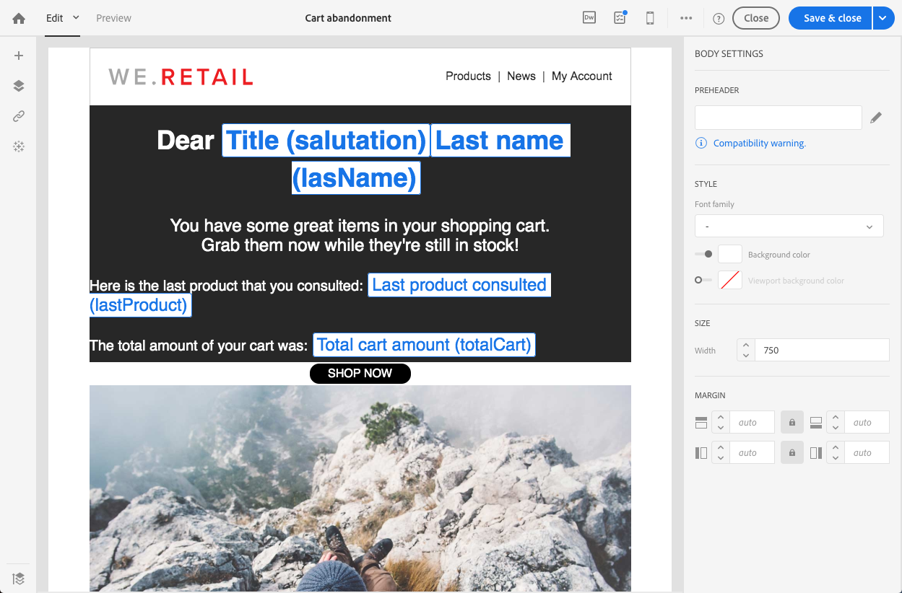

# Event transactional messages{#event-transactional-messages}

可以发送定位活动的活动事务消息。此类交易消息不包含配置文件信息：交付目标由活动本身包含的数据定义。

Once you have created and published an event (the cart abandonment as explained in [this section](../../channels/using/about-transactional-messaging.md#transactional-messaging-operating-principle)), the corresponding transactional message is created automatically.

[配置事件中显示配置步骤以发送事务消息](../../administration/using/configuring-transactional-messaging.md#use-case--configuring-an-event-to-send-a-transactional-message) 部分。

要使活动触发发送交易消息，您必须个性化消息，然后对其进行测试并发布。

>[!NOTE]
>
>To access the transactional messages, you must have administration rights or appear in the **[!UICONTROL Message Center agents]** (mcExec) security group. 活动交易消息不包含配置文件信息，因此它们与疲劳规则不兼容(即使是使用配置文件进行丰富的情况)。See [Fatigue rules](../../administration/using/fatigue-rules.md#choosing-the-channel).

## Defining a test profile in a transactional message {#defining-a-test-profile-in-a-transactional-message}

定义一个调整的测试配置文件，它允许您预览消息并发送一个证据来检查它。

### Creating a test profile within the transactional message {#creating-a-test-profile-within-the-transactional-----------message}

1. To access the message that you created, click the **[!UICONTROL Adobe Campaign]** logo, in the top left corner, then select **[!UICONTROL Marketing plans]** &gt; **[!UICONTROL Transactional messages]** &gt; **[!UICONTROL Transactional messages]**.

   

1. 创建将链接到活动的测试配置文件。

   

1. Specify the information to send in JSON format in the **[!UICONTROL Event data used for personalization]** section. 这是预览消息和测试配置文件收到凭据时将使用的内容。

   

   >[!NOTE]
   >
   >您还可以输入与配置文件表相关的信息。See [Enriching the transactional message content](../../administration/using/configuring-transactional-messaging.md#enriching-the-transactional-message-content).

1. 创建后，测试配置文件将在交易消息中预先指定。Click the **[!UICONTROL Test profiles]** block of the message to check the target of your proof.

   

### Creating a test profile outside the transactional message {#creating-a-test-profile-outside-the-transactional-----------message}

You can also create a new test profile or use one that already exists in the **[!UICONTROL Test profiles]** menu.

1. Click the **[!UICONTROL Adobe Campaign]** logo, in the top left corner, then select **[!UICONTROL Profiles & audiences]** &gt; **[!UICONTROL Test profiles]**.
1. In the **[!UICONTROL Event]** section of the page of the test profile that you have chosen, select the event that you have just created. 在此示例中，选择“购物车废弃(evtCarband Onnotation)”。
1. Specify the information to send in JSON format in the **[!UICONTROL Event data]** text box.

   

1. 保存更改。

您现在可以访问已创建的消息，并选择更新后的测试配置文件。

**相关主题：**

* [管理测试配置文件](../../sending/using/managing-test-profiles-and-sending-proofs.md)
* [定义受众](../../audiences/using/creating-audiences.md)

## Personalizing a transactional message {#personalizing-a-transactional-message}

要在交易消息中设置个性化，请按照以下步骤操作：

1. Click the **[!UICONTROL Content]** block to modify your message's subject and content. 对于此示例，导入包含图像、样式表和HTML文件的HTML模板。Importing HTML templates is presented in the [Loading an existing content](../../designing/using/selecting-an-existing-content.md) section.

   

1. 输入消息内容。在此示例中，我们添加了三个个性化字段：姓氏，上次产品咨询，总购物车金额。指向放弃购物车的链接是指向外部URL的链接，此链接会将人员重定向到其购物车。此参数不是在Adobe Campaign中管理的。

   To add fields that you defined when you created your event (see [Configuring an event](../../administration/using/configuring-transactional-messaging.md#use-case--configuring-an-event-to-send-a-transactional-message)), insert a personalization field in the message content. You can find the fields by selecting **[!UICONTROL Transactional event]** &gt; **[!UICONTROL Event context]**.

   

1. 要丰富消息的内容，请通过从链接活动的表格中选择字段来添加字段。In our example, select the **[!UICONTROL Title (salutation)]** field in the **[!UICONTROL Profile]** table.

   

   The steps for inserting a personalization field are detailed in the [Inserting a personalization field](../../designing/using/inserting-a-personalization-field.md) section.

   

1. 通过选择为此活动定义的配置文件来预览消息。

   The steps for previewing a message are detailed in the [Previewing messages](../../sending/using/preparing-the-send.md) section.

   

   您可以检查个性化字段是否匹配测试配置文件中输入的信息。For more on this, see [Defining a test profile in a transactional message](../../channels/using/event-transactional-messages.md#defining-a-test-profile-in-a-transactional-message).

## Using product listings in a transactional message {#using-product-listings-in-a-transactional-message}

您可以创建引用交易电子邮件内容中一个或多个数据集合的产品列表。例如，在放弃的电子邮件中，您可以在用户离开您的网站时，包含用户购物车中的所有产品的列表，其中包括图像、价格和指向每个产品的链接。

>[!CAUTION]
>
>Product listings are only available when editing transactional email messages through the [Email Designer](../../designing/using/about-email-content-design.md#about-the-email-designer) interface.

要在交易消息中添加放弃的产品列表，请按照以下步骤操作。

您还可以观看一组视频，解释在交易电子邮件中配置产品列表所需的步骤。For more on this, see [this page](https://helpx.adobe.com/campaign/kt/acs/using/acs-product-listings-in-transactional-emails-feature-video-setup.html).

>[!NOTE]
>
>Adobe Campaign不支持嵌套的产品列表，这意味着您不能在其他位置包含产品列表。

### Defining a product listing {#defining-a-product-listing}

在能够使用交易消息中的产品列表之前，您需要在活动级别定义产品列表以及要显示的列表的每个产品字段。For more on this, see [Defining data collections](../../administration/using/configuring-transactional-messaging.md#defining-data-collections).

1. In the transactional message, click the **[!UICONTROL Content]** block to modify the email content.
1. 将结构组件拖放到工作区。For more on this, see [Editing the email structure](../../designing/using/defining-the-email-structure.md#editing-the-email-structure).

   例如，选择一个列结构组件，并添加文本组件、图像组件和按钮组件。For more on this, see [Adding fragments and components](../../designing/using/defining-the-email-structure.md#adding-fragments-and-content-components).

1. Select the structure component you just created and click the **[!UICONTROL Enable product listing]** icon from the contextual toolbar.

   

   The structure component is highlighted with an orange frame and the **[!UICONTROL Product listing]** settings are displayed in the left palette.

   

1. 选择集合元素的显示方式：

   * **[!UICONTROL Row]**：水平，这意味着每个元素位于另一行下的一行。
   * **[!UICONTROL Column]**：垂直，这意味着同一行上另一个元素旁边的每个元素。
   >[!NOTE]
   >
   >**[!UICONTROL Column]** 此选项仅在使用多列结构组件( **[!UICONTROL 2:2 column]**&#x200B;和 **[!UICONTROL 3:3 column]****[!UICONTROL 4:4 column]** )时可用。编辑产品列表时，仅填写第一列：不会考虑其他列。For more on selecting structure components, see [Editing the email structure](../../designing/using/defining-the-email-structure.md#editing-the-email-structure).

1. 选择您在配置与交易消息相关的活动时创建的数据收集。You can find it under the **[!UICONTROL Context]** &gt; **[!UICONTROL Real-time event]** &gt; **[!UICONTROL Event context]** node.

   

   For more on configuring the event, see [Defining data collections](../../administration/using/configuring-transactional-messaging.md#defining-data-collections).

1. Use the **[!UICONTROL First item]** drop-down list to select which element will start the list displayed in the email.

   例如，如果您选择2，则不会在电子邮件中显示集合的第一个项目。产品列表将从第二个项目开始。

1. 选择要在列表中显示的最大项目数。

   >[!NOTE]
   >
   >If you want the elements of your list to be displayed vertically ( **[!UICONTROL Column]** ), the maximum number of items is limited according to the selected structure component (2, 3 or 4 columns). For more on selecting structure components, see [Editing the email structure](../../designing/using/defining-the-email-structure.md#editing-the-email-structure).

### Populating the product listing {#populating-the-product-listing}

要显示链接到交易电子邮件的活动的产品列表，请按照以下步骤操作。

For more on creating a collection and related fields when configuring the event, see [Defining data collections](../../administration/using/configuring-transactional-messaging.md#defining-data-collections).

1. Select the image component you inserted, select **[!UICONTROL Enable personalization]** and click the pencil in the Settings pane.

   

1. Select **[!UICONTROL Add personalization field]** in the **[!UICONTROL Image source URL]** window that opens.

   From the **[!UICONTROL Context]** &gt; **[!UICONTROL Real-time event]** &gt; **[!UICONTROL Event context]** node, open the node corresponding to the collection that you created (here **[!UICONTROL Product list]** ) and select the image field that you defined (here **[!UICONTROL Product image]** ). Click **[!UICONTROL Save]**.

   

   您选择的个性化字段现在显示在“设置”窗格中。

1. At the desired position, select **[!UICONTROL Insert personalization field]** from the contextual toolbar.

   

1. From the **[!UICONTROL Context]** &gt; **[!UICONTROL Real-time event]** &gt; **[!UICONTROL Event context]** node, open the node corresponding to the collection that you created (here **[!UICONTROL Product list]** ) and select the field that you created (here **[!UICONTROL Product name]** ). Click **[!UICONTROL Confirm]**.

   

   您选择的个性化字段现在电子邮件内容中的所需位置显示。

1. 以同样的方式插入价格。
1. Select some text and select **[!UICONTROL Insert link]** from the contextual toolbar.

   

1. Select **[!UICONTROL Add personalization field]** in the **[!UICONTROL Insert link]** window that opens.

   From the **[!UICONTROL Context]** &gt; **[!UICONTROL Real-time event]** &gt; **[!UICONTROL Event context]** node, open the node corresponding to the collection that you created (here **[!UICONTROL Product list]** ) and select the URL field that you created (here **[!UICONTROL Product URL]** ). Click **[!UICONTROL Save]**.

   >[!CAUTION]
   >
   >由于安全原因，请确保在链接中插入个性化字段，以从正确的静态域名开始。

   

   您选择的个性化字段现在显示在“设置”窗格中。

1. Select the structure component on which the product listing is applied and select **[!UICONTROL Show fallback]** to define a default content.

   

1. 拖动一个或多个内容组件，并根据需要对其进行编辑。

   

   如果事件被触发时集合为空，则将显示回退内容，例如，如果客户在购物车中没有任何内容。

1. 从设置窗格中，编辑产品列表的样式。For more on this, see [Editing email styles](../../designing/using/editing-email-styles.md).
1. 使用链接到相关交易事件并为其定义集合数据的测试配置文件预览电子邮件。For example, add the following information in the **[!UICONTROL Event data]** section for the test profile you want to use:

   

   For more on defining a test profile in a transactional message, see [this section](../../channels/using/event-transactional-messages.md#defining-a-test-profile-in-a-transactional-message).

## Testing a transactional message {#testing-a-transactional-message}

保存交易消息后，您现在可以发送一个证明来测试它。

The steps for sending a proof are detailed in the [Sending a proof](../../sending/using/managing-test-profiles-and-sending-proofs.md#sending-proofs) section.

## Publishing a transactional message {#publishing-a-transactional-message}

一旦您选中了交易消息，就可以发布。

现在，一旦“购物车废弃”事件被触发，它会自动提示包含接收者的标题和姓氏、购物车URL、上次产品咨询或产品列表(如果您定义了产品列表)的信息，以及要发送的总购物车金额。

To access reports concerning your transactional message, use the **[!UICONTROL Reports]** button. See [Reports](../../reporting/using/about-dynamic-reports.md).

## Suspending a transactional message publication {#suspending-a-transactional-message-publication}

You can suspend publishing your transactional message by using the **[!UICONTROL Pause]** button, for example, to modify the data contained in the message. 因此，活动不再处理，而是保留在Adobe Campaign数据库中的队列中。

The queued events are kept during a period of time that is defined in the REST API (see [REST API documentation](https://docs.campaign.adobe.com/doc/standard/en/api/ACS_API.html)) or in the trigger event if you are using the Triggers core service (see [Working with Campaign and Experience Cloud Triggers](../../integrating/using/about-adobe-experience-cloud-triggers.md)).

When clicking **[!UICONTROL Resume]**, all of the queued events (provided that they are not expired) are processed. 它们现在包含在模板发布被挂起时执行的所有修改。

## Unpublishing a transactional message {#unpublishing-a-transactional-message}

Clicking **[!UICONTROL Unpublish]** allows you to cancel the transactional message publication, but also the publication of the corresponding event, which deletes from the REST API the resource corresponding to the event that you previously created. 现在，即使活动通过您的网站触发，相应的消息也不会再发送，而且它们不会存储在数据库中。

>[!NOTE]
>
>要再次发布消息，您需要返回相应的活动配置，发布该消息，然后发布消息。For more on this, see [Publishing a transactional message](../../channels/using/event-transactional-messages.md#publishing-a-transactional-message).

如果您取消发布暂停的事务消息，则可能必须等待最长24小时才能再次发布。This is to let the **[!UICONTROL Database cleanup]** workflow clean all the events that were sent to the queue. The steps for pausing a message are detailed in the [Suspending a transactional message publication](../../channels/using/event-transactional-messages.md#suspending-a-transactional-message-publication) section.

**[!UICONTROL Database cleanup]** 该工作流每天在凌晨4am开始，可通过 **[!UICONTROL Administration]** &gt; **[!UICONTROL Application settings]** &gt;访问 **[!UICONTROL Workflows]**。

## Deleting a transactional message {#deleting-a-transactional-message}

By selecting a transactional message, you can delete it with the **[!UICONTROL Delete element]** button even if it has already been published. 但是，删除事务消息只能在某些条件下完成：

* **交易消息**：要删除交易消息，应取消发布消息，但不要暂停。

   如果未发布交易消息，则还需要取消发布活动配置以成功删除您的事务消息，除非其他事务消息链接到相应的活动。For more information on how to unpublish a transactional message, refer to this [section](../../channels/using/event-transactional-messages.md#unpublishing-a-transactional-message).

   >[!CAUTION]
   >
   >删除已经发送通知的事务消息也会删除其发送和跟踪日志。

* **现成活动模板中的事务消息(内部交易消息)**：要删除内部事务消息，应取消发布消息，但不要暂停。

   它还不应该是活动中唯一的事务消息，其他消息必须链接到相应的活动。

## Transactional message retry process {#transactional-message-retry-process}

临时未交付的交易消息会受到自动重试，直到交付过期为止。For more on the delivery duration, see [Validity period parameters](../../administration/using/configuring-email-channel.md#validity-period-parameters).

当无法发送交易消息时，有两个重试系统：

* 在交易消息级别，交易消息在将活动分配给执行交付之前可能失败，在活动接收和交付准备之间也是如此。See [Event processing retry process](../../channels/using/event-transactional-messages.md#event-processing-retry-process).
* 在发送过程级别，一旦将事件分配给执行交付，交易消息会因临时错误而失败。See [Message sending retry process](../../channels/using/event-transactional-messages.md#message-sending-retry-process).

### Event processing retry process {#event-processing-retry-process}

如果不能将该事件分配给执行交付，则会延迟事件处理。然后执行重试，直到将其分配给新的执行交付。

>[!NOTE]
>
>延迟的事件不会显示在发送日志的事务消息中，因为它尚未分配给执行交付。

例如，不能将该事件分配给执行交付，因为其内容不正确，存在访问权限或品牌的问题，在应用typology规则等时检测到错误。在这种情况下，您可以暂停消息，对其进行编辑以解决问题并再次发布。重试系统随后将将其分配给新的执行交付。

### Message sending retry process {#message-sending-retry-process}

将活动分配给执行交付后，如果收件人的邮箱已满，交易消息会因临时错误而失败。For more on this, see [Retries after a delivery temporary failure](../../sending/using/understanding-delivery-failures.md#retries-after-a-delivery-temporary-failure).

如果已将事务事件分配给已失败的执行交付，则推迟并稍后重试此事件。重试后，它将分配给新的执行交付。

>[!NOTE]
>
>将某个事件分配给执行交付时，该事件将显示在发送日志的发送日志中，并且仅此时显示。The failed deliveries are displayed in the **[!UICONTROL Execution list]** tab of the transactional message.

### Limitations {#limitations}

**发送日志更新**

在将事务事件分配给已失败的执行提交后，将延迟此事件并在几分钟后重试。重试后，它将分配给新的执行交付。

但是，新执行交付的发送日志不会立即更新(更新通过预定的工作流执行)。It means that the message could be in **[!UICONTROL Pending]** status even if the transactional event has been processed by the new execution delivery.

**执行失败**

无法停止执行分发。但是，如果当前执行交付失败，将在收到新活动后创建一个新的事件，并且新的执行过程将处理所有新事件。未执行的执行交付不会处理新活动。

如果已经为执行交付分配了一些事件，并且执行交付失败，则重试系统不会将延迟的事件分配给新执行交付，这意味着这些事件会丢失。
