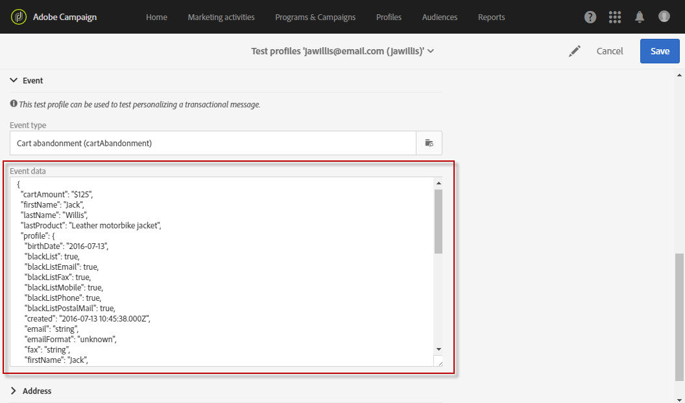
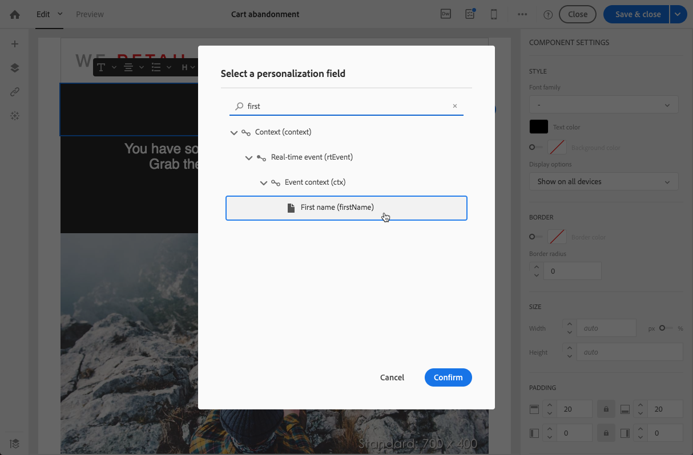

# 活动事务消息{#event-transactional-messages}

您可以发送针对活动的活动事务性消息。 此类事务性消息不包含配置文件信息：交付目标由事件本身包含的数据定义。

创建并发布活动后(本节所述的购物车放弃 )，将自动创建相应的交易消息。

配置事件以发送事务 [消息部分中介绍了配置步骤](../../administration/using/configuring-transactional-messaging.md#use-case--configuring-an-event-to-send-a-transactional-message) 。

为了使活动触发发送交易消息，您必须个性化消息，然后测试并发布消息。

>[!NOTE]
>
>要访问事务性消息，您必须具有管理权限或显示在(mcExec) **[!UICONTROL Message Center agents]** 安全组中。 事件事务消息不包含配置文件信息，因此它们与疲劳规则不兼容（即使在丰富了配置文件的情况下）。 请参阅 [疲劳规则](../../administration/using/fatigue-rules.md#choosing-the-channel)。

## 在事务消息中定义测试配置文件 {#defining-a-test-profile-in-a-transactional-message}

定义一个经过调整的测试配置文件，这样您就可以预览消息并发送证据进行检查。

### 在事务性消息中创建测试配置文件 {#creating-a-test-profile-within-the-transactional-----------message}

1. 要访问您创建的消息，请单击左 **[!UICONTROL Adobe Campaign]** 上角的标志，然后选择 **[!UICONTROL Marketing plans]** &gt; **[!UICONTROL Transactional messages]** &gt; **[!UICONTROL Transactional messages]**。

   

1. 创建将链接到活动的测试配置文件。

   

1. 在部分中指定要以JSON格式发送的 **[!UICONTROL Event data used for personalization]** 信息。 这是预览消息和测试配置文件收到证明时将使用的内容。

   

   >[!NOTE]
   >
   >您还可以输入与配置文件表相关的信息。 请参 [阅丰富交易消息内容](../../administration/using/configuring-transactional-messaging.md#enriching-the-transactional-message-content)。

1. 创建之后，测试配置文件将在事务消息中预先指定。 单击 **[!UICONTROL Test profiles]** 消息块以检查您的证明目标。

   

### 在事务性消息之外创建测试配置文件 {#creating-a-test-profile-outside-the-transactional-----------message}

您还可以创建新的测试配置文件，或使用菜单中已存在的测试配置 **[!UICONTROL Test profiles]** 文件。

1. 单击左 **[!UICONTROL Adobe Campaign]** 上角的徽标，然后选择 **[!UICONTROL Profiles & audiences]** &gt; **[!UICONTROL Test profiles]**。
1. 在您 **[!UICONTROL Event]** 选择的测试配置文件页面的部分，选择您刚刚创建的活动。 在此示例中，选择“购物车放弃(EVTcartEligation)”。
1. 在文本框中指定要以JSON格式发送 **[!UICONTROL Event data]** 的信息。

   

1. 保存更改。

您现在可以访问您创建的消息并选择更新的测试配置文件。

**相关主题：**

* [管理测试配置文件](../../sending/using/managing-test-profiles-and-sending-proofs.md)
* [定义受众](../../audiences/using/creating-audiences.md)

## 个性化交易消息 {#personalizing-a-transactional-message}

要在交易消息中设置个性化，请执行以下步骤：

1. 单击 **[!UICONTROL Content]** 该块以修改邮件的主题和内容。 对于此示例，导入包含图像、样式表和HTML文件的HTML模板。 导入HTML模板显示在加载现 [有内容部分](../../designing/using/using-existing-content.md) 。

   

1. 输入您的消息内容。 在此示例中，我们添加了三个个性化字段：last name, last product cansired, total cart amount. 指向放弃购物车的链接是指向外部URL的链接，该URL会将访客重定向到其购物车。 此参数在Adobe Campaign中未管理。

   要添加在创建活动时定义的字段(请参阅配 [置活动](../../administration/using/configuring-transactional-messaging.md#use-case--configuring-an-event-to-send-a-transactional-message))，请在消息内容中插入个性化字段。 您可以通过选择 **[!UICONTROL Transactional event]** &gt;来查找字 **[!UICONTROL Event context]**&#x200B;段。

   

1. 要丰富消息的内容，请从与活动关联的表中选择字段，以添加字段。 在我们的示例中，选择 **[!UICONTROL Title (salutation)]** 表中的字 **[!UICONTROL Profile]** 段。

   

   插入个性化字段的步骤在插入个性化字段一 [节中详细介绍](../../designing/using/personalization.md#inserting-a-personalization-field) 。

   

1. 通过选择您为此活动定义的配置文件来预览消息。

   预览消息的步骤在预览消息部分有 [详细介绍](../../sending/using/preparing-the-send.md) 。

   

   您可以检查个性化字段是否与测试配置文件中输入的信息匹配。 有关详细信息，请参 [阅在交易消息中定义测试配置文件](../../channels/using/event-transactional-messages.md#defining-a-test-profile-in-a-transactional-message)。

## 在交易消息中使用产品列表 {#using-product-listings-in-a-transactional-message}

您可以创建引用交易电子邮件内容中的一个或多个数据集合的产品列表。 例如，在购物车放弃电子邮件中，您可以包含用户离开网站时购物车中的所有产品的列表，其中包含图像、价格和指向每个产品的链接。

>[!CAUTION]
>
>只有在通过“电子邮件设计器”界面编辑交易电子邮件时，产品列 [表才可用](../../designing/using/overview.md#email-designer) 。

要在交易消息中添加已放弃产品的列表，请执行以下步骤。

您还可以观看一组视频，其中介绍了在交易电子邮件中配置产品列表所需的步骤。 有关此内容的详细信息，请参 [阅此页](https://helpx.adobe.com/campaign/kt/acs/using/acs-product-listings-in-transactional-emails-feature-video-setup.html)。

>[!NOTE]
>
>Adobe Campaign不支持嵌套的产品列表，这意味着您不能将产品列表包含在另一个产品列表中。

### 定义产品列表 {#defining-a-product-listing}

在事务性消息中使用产品列表之前，您需要在事件级别定义产品列表以及要显示的列表中每个产品的字段。 有关此功能的详细信息，请参 [阅定义数据集合](../../administration/using/configuring-transactional-messaging.md#defining-data-collections)。

1. 在事务性消息中，单击 **[!UICONTROL Content]** 该块以修改电子邮件内容。
1. 将结构组件拖放到工作区。 有关此内容的详细信息，请参 [阅编辑电子邮件结构](../../designing/using/designing-from-scratch.md#defining-the-email-structure)。

   例如，选择一列结构组件并添加文本组件、图像组件和按钮组件。 有关此方面的详细信息，请参 [阅添加片段和组件](../../designing/using/designing-from-scratch.md#defining-the-email-structure)。

1. 选择刚刚创建的结构组件，然后单击上 **[!UICONTROL Enable product listing]** 下文工具栏中的图标。

   

   结构组件以橙色框架高亮显示，设 **[!UICONTROL Product listing]** 置显示在左侧调色板中。

   

1. 选择集合元素的显示方式：

   * **[!UICONTROL Row]**:水平，表示位于另一行下的一行上的每个元素。
   * **[!UICONTROL Column]**:垂直，即同一行上的每个元素相邻。
   >[!NOTE]
   >
   >仅 **[!UICONTROL Column]** 当使用多列结构组件（、和）时， **[!UICONTROL 2:2 column]**&#x200B;此选项 **[!UICONTROL 3:3 column]****[!UICONTROL 4:4 column]** 才可用。 编辑产品列表时，仅填写第一列：其他列将不被考虑在内。 有关选择结构组件的详细信息，请参 [阅编辑电子邮件结构](../../designing/using/designing-from-scratch.md#defining-the-email-structure)。

1. 选择在配置与事务性消息相关的事件时创建的数据收集。 您可以在 **[!UICONTROL Context]** &gt; **[!UICONTROL Real-time event]** &gt;节点下 **[!UICONTROL Event context]** 找到。

   

   有关配置事件的详细信息，请参 [阅定义数据集合](../../administration/using/configuring-transactional-messaging.md#defining-data-collections)。

1. 使用下 **[!UICONTROL First item]** 拉列表选择哪个元素将开始电子邮件中显示的列表。

   例如，如果选择2，则集合的第一个项目将不会显示在电子邮件中。 产品列表将从第二个项目开始。

1. 选择要在列表中显示的最大项目数。

   >[!NOTE]
   >
   >如果希望垂直( **[!UICONTROL Column]** )显示列表的元素，则根据所选的结构组件（2、3或4列）限制最大项目数。 有关选择结构组件的详细信息，请参 [阅编辑电子邮件结构](../../designing/using/designing-from-scratch.md#defining-the-email-structure)。

### 填充产品列表 {#populating-the-product-listing}

要显示来自链接到交易电子邮件的活动的产品列表，请执行以下步骤。

有关在配置事件时创建集合和相关字段的详细信息，请参阅定 [义数据集合](../../administration/using/configuring-transactional-messaging.md#defining-data-collections)。

1. 选择您插入的图像组件，选择 **[!UICONTROL Enable personalization]** 并单击“设置”窗格中的铅笔。

   

1. 在打 **[!UICONTROL Add personalization field]** 开的窗 **[!UICONTROL Image source URL]** 口中选择。

   从 **[!UICONTROL Context]** &gt; **[!UICONTROL Real-time event]** &gt;节点 **[!UICONTROL Event context]** 中，打开与您创建的集合对应的节点(此处 **[!UICONTROL Product list]** )，然后选择您定义的图像字段(此处 **[!UICONTROL Product image]** )。 Click **[!UICONTROL Save]**.

   

   您选择的个性化字段现在显示在“设置”窗格中。

1. 在所需位置，从上下文工 **[!UICONTROL Insert personalization field]** 具栏中选择。

   

1. 从 **[!UICONTROL Context]** &gt; **[!UICONTROL Real-time event]** &gt;节点 **[!UICONTROL Event context]** 中，打开与您创建的集合对应的节点(此处 **[!UICONTROL Product list]** )，然后选择您创建的字段(此处 **[!UICONTROL Product name]** )。 Click **[!UICONTROL Confirm]**.

   

   您选择的个性化字段现在显示在电子邮件内容中的所需位置。

1. 以类似方式继续插入价格。
1. 选择一些文本，然后从上 **[!UICONTROL Insert link]** 下文工具栏中进行选择。

   

1. 在打 **[!UICONTROL Add personalization field]** 开的窗 **[!UICONTROL Insert link]** 口中选择。

   从 **[!UICONTROL Context]** &gt; **[!UICONTROL Real-time event]** &gt;节点 **[!UICONTROL Event context]** 中，打开与您创建的集合对应的节点(此处 **[!UICONTROL Product list]** )，然后选择您创建的URL字段(此处 **[!UICONTROL Product URL]** )。 Click **[!UICONTROL Save]**.

   >[!CAUTION]
   >
   >出于安全原因，请确保将个性化字段插入以正确的静态域名开头的链接中。

   

   您选择的个性化字段现在显示在“设置”窗格中。

1. 选择应用产品列表的结构组件，然后选择以 **[!UICONTROL Show fallback]** 定义默认内容。

   

1. 拖动一个或多个内容组件，并根据需要编辑它们。

   

   如果集合在触发事件时为空，将显示回退内容，例如，如果客户的购物车中没有任何内容。

1. 从“设置”窗格中，编辑产品列表的样式。 有关此内容的详细信息，请参阅 [编辑电子邮件样式](../../designing/using/styles.md)。
1. 使用链接到相关交易事件且您为其定义了收集数据的测试配置文件预览电子邮件。 例如，在要使用的测试配置文 **[!UICONTROL Event data]** 件的部分中添加以下信息：

   

   有关在事务性消息中定义测试配置文件的详细信息，请参 [阅此部分](../../channels/using/event-transactional-messages.md#defining-a-test-profile-in-a-transactional-message)。

## 测试交易消息 {#testing-a-transactional-message}

保存交易消息后，您现在可以发送证据来测试它。

发送证明的步骤详见发送 [证明部分](../../sending/using/managing-test-profiles-and-sending-proofs.md#sending-proofs) 。

## 发布交易消息 {#publishing-a-transactional-message}

检查交易消息后，即可发布它。

现在，一旦“购物车放弃”事件被触发，它会自动提示一条消息，其中包含收件人的标题和姓氏、购物车URL、上次咨询的产品或产品列表（如果您定义了产品列表）以及要发送的购物车总量。

要访问与交易消息相关的报告，请使用 **[!UICONTROL Reports]** 按钮。 请参阅 [报告](../../reporting/using/about-dynamic-reports.md)。

## 暂停交易消息发布 {#suspending-a-transactional-message-publication}

例如，可以使用按钮暂停发布 **[!UICONTROL Pause]** 事务性消息，以修改消息中包含的数据。 因此，不再处理这些事件，而是将其保留在Adobe Campaign数据库的队列中。

在REST API中定义的时间段内(请参阅 [REST API文档](https://docs.campaign.adobe.com/doc/standard/en/api/ACS_API.html))或在使用触发器核心服务的触发器事件中(请参阅 [Campaign和Experience Cloud触发器](../../integrating/using/about-adobe-experience-cloud-triggers.md))，将保留排队的事件。

单击时， **[!UICONTROL Resume]**&#x200B;将处理所有已排队的事件（前提是这些事件未过期）。 现在，它们包含暂停模板发布时执行的所有修改。

## 取消发布交易消息 {#unpublishing-a-transactional-message}

单击 **[!UICONTROL Unpublish]** 可取消事务消息发布，也可取消相应事件的发布，该事件从REST API中删除与您先前创建的事件对应的资源。 现在，即使事件通过您的网站触发，相应的消息也不再发送，也不会存储在数据库中。

>[!NOTE]
>
>要再次发布消息，您需要返回到相应的活动配置，发布消息，然后发布消息。 有关此内容的详细信息，请参 [阅发布交易消息](../../channels/using/event-transactional-messages.md#publishing-a-transactional-message)。

如果取消发布已暂停的事务性消息，则可能必须等待最多24小时才能再次发布该消息。 这样，工作流便 **[!UICONTROL Database cleanup]** 可清除发送到队列的所有事件。 暂停消息的步骤在暂停交易消息发 [布部分中有详细介绍](../../channels/using/event-transactional-messages.md#suspending-a-transactional-message-publication) 。

每 **[!UICONTROL Database cleanup]** 天凌晨4点运行的工作流可通过 **[!UICONTROL Administration]** &gt; **[!UICONTROL Application settings]** &gt;访问 **[!UICONTROL Workflows]**。

## 删除交易消息 {#deleting-a-transactional-message}

通过选择事务性消息，即使已发布该消息，您也 **[!UICONTROL Delete element]** 可以使用按钮将其删除。 但是，只有在某些情况下才能删除事务消息：

* **交易消息**:要删除事务性消息，应取消发布消息，而不应暂停消息。

   如果取消发布交易消息，则还需要取消发布活动配置以成功删除您的交易消息，除非将另一个交易消息链接到相应的事件。 有关如何取消发布交易消息的详细信息，请参阅此 [部分](../../channels/using/event-transactional-messages.md#unpublishing-a-transactional-message)。

   >[!CAUTION]
   >
   >删除已发送通知的交易消息也会删除其发送和跟踪日志。

* **来自现成活动模板的事务性消息（内部事务性消息）**:要删除内部事务消息，应取消发布消息，而不应暂停消息。

   它也不应该是事件中唯一的事务消息，其他消息必须链接到相应的事件。

## 事务消息重试过程 {#transactional-message-retry-process}

临时未传送的事务性消息可能会执行自动重试，直到传送过期。 有关交付持续时间的详细信息，请参 [阅有效性期间参数](../../administration/using/configuring-email-channel.md#validity-period-parameters)。

当事务消息无法发送时，有两个重试系统：

* 在事务消息处理级别，事务消息可在事件被分配到执行交付之前失败，这意味着在事件接收和交付准备之间。 请参阅 [事件处理重试过程](../../channels/using/event-transactional-messages.md#event-processing-retry-process)。
* 在发送处理级别，一旦事件被分配到执行交付，事务消息就可能由于临时错误而失败。 请参阅 [消息发送重试过程](../../channels/using/event-transactional-messages.md#message-sending-retry-process)。

### 事件处理重试进程 {#event-processing-retry-process}

如果事件无法分配给执行交付，则事件处理将被推迟。 然后，将执行重试，直到将其分配到新的执行交付。

>[!NOTE]
>
>延迟的事件不会显示在事务消息发送日志中，因为它尚未分配给执行交付。

例如，由于活动内容不正确、存在访问权限或品牌问题、在应用排版规则等时检测到错误，因此无法将活动分配给执行交付。 在这种情况下，您可以暂停消息，编辑该消息以解决问题，然后再次发布它。 然后，重试系统将其分配给新的执行交付。

### 消息发送重试进程 {#message-sending-retry-process}

一旦将事件分配到执行交付，例如，如果收件人的邮箱已满，则事务性消息可能会因临时错误而失败。 有关详细信息，请参阅 [交付临时失败后的重试](../../sending/using/understanding-delivery-failures.md#retries-after-a-delivery-temporary-failure)。

>[!NOTE]
>
>将事件分配给执行交付后，该事件将显示在该执行交付的发送日志中，并且仅在此时显示。 失败的提交会显示在事务 **[!UICONTROL Execution list]** 消息的选项卡中。

### 限制 {#limitations}

**发送日志更新**

在重试过程中，不会立即更新新执行交付的发送日志（更新是通过计划的工作流执行的）。 这意味着消息可能处于状态，即 **[!UICONTROL Pending]** 使事务事件已经由新的执行交付处理。

**执行交付失败**

无法停止执行交付。 但是，如果当前执行交付失败，则在收到新事件后立即创建新事件，并且所有新事件都由此新执行交付处理。 执行交付失败后，不会处理任何新事件。

如果已经分配给执行交付的某些事件已经被延迟并且如果该执行交付失败，则重试系统不将延迟的事件分配给新的执行交付，这意味着这些事件丢失。
