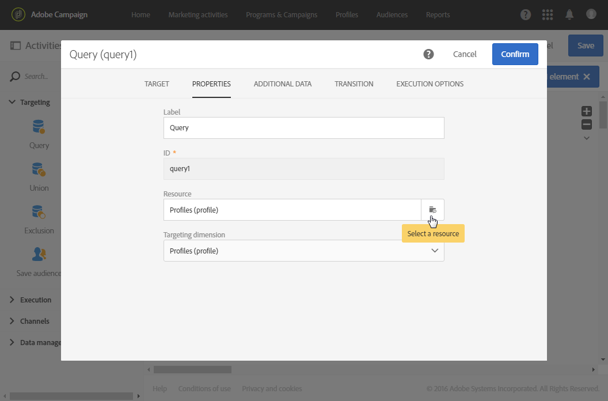
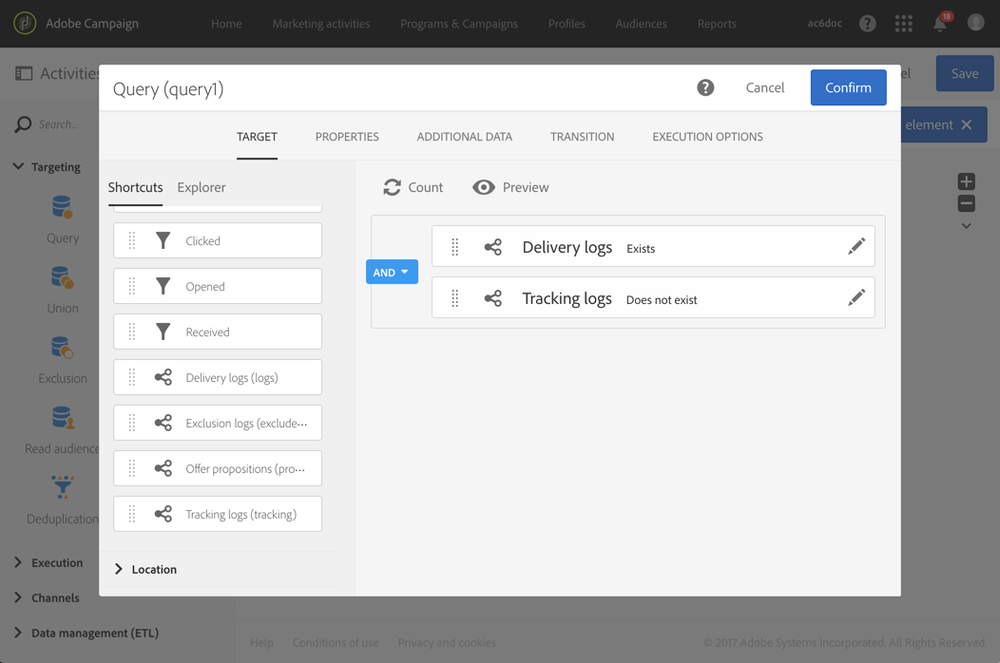

# 跟进消息 {#follow-up-messages}

后续消息是预定义的营销投放模板，可在工作流中用于向特定事务性消息的收件人发送其他通信。

让我们重用[Transactional messaging操作原则](../../channels/using/getting-started-with-transactional-msg.md#transactional-messaging-operating-principle)部分中描述的示例：购物车废弃电子邮件将发送给将产品添加到购物车的网站用户，但他们离开网站时并未进行购买。

您希望向收到购物车放弃通知但三天后未打开通知的所有客户发送友好提醒。 他们将收到一封跟进邮件，其内容基于发送的第一封电子邮件中使用的相同数据。

## 配置事件以发送后续消息{#configuring-an-event-to-send-a-follow-up-message}

要发送跟进消息，您首先需要相应地配置与已接收事件对应的事务性消息。

1. 使用您创建的事件配置发送事件事务性消息。 请参阅[配置事务事件](../../channels/using/configuring-transactional-event.md)。
1. 配置事件时，请在发布事件之前选中&#x200B;**[!UICONTROL Create follow-up delivery template for this event]**&#x200B;框。

   

1. [预览并发布事件](../../channels/using/publishing-transactional-event.md#previewing-and-publishing-the-event)。

发布事件后，将自动创建链接到新事件的事务性消息和后续投放模板。 发送后续消息的步骤详见[本节](#sending-a-follow-up-message)。

## 访问后续消息{#accessing-the-follow-up-messages}

要处理工作流中的事件，需要投放模板。 但是，在发布事件时，创建的[事务性消息](../../channels/using/editing-transactional-message.md)不能用作模板。 因此，您需要创建特定的后续投放模板，该事件类型旨在支持此并用作工作流中的模板。

要访问此模板，请执行以下操作：

1. 单击左上角的&#x200B;**[!UICONTROL Adobe Campaign]**&#x200B;徽标。
1. 选择&#x200B;**[!UICONTROL Resources]** > **[!UICONTROL Templates]** > **[!UICONTROL Delivery templates]**。
1. 选中左窗格中的&#x200B;**[!UICONTROL Follow-up messages]**&#x200B;框。

   

仅显示后续消息。

>[!IMPORTANT]
>
>只有具有[管理](../../administration/using/users-management.md#functional-administrators)角色的用户才能访问和编辑事务性消息。

## 发送后续消息{#sending-a-follow-up-message}

创建后续投放模板后，您可以在工作流中使用它发送后续消息。

<!--You need to set up a workflow targeting the event corresponding to the transactional message that was already received.-->

1. 访问营销活动列表并创建新工作流。

   请参阅[构建工作流](../../automating/using/building-a-workflow.md#creating-a-workflow)。

1. 将&#x200B;**[!UICONTROL Scheduler]**&#x200B;活动拖放到您的工作流中并将其打开。 将执行频率设置为每天一次。

   调度程序活动显示在[调度程序](../../automating/using/scheduler.md)部分。

1. 将&#x200B;**[!UICONTROL Query]**&#x200B;活动拖放到您的工作流中并将其打开。

   查询活动显示在[查询](../../automating/using/query.md)部分。

1. 要对查询资源以外的资源运行用户档案，请转到活动的&#x200B;**[!UICONTROL Properties]**&#x200B;选项卡，然后单击&#x200B;**[!UICONTROL Resource]**&#x200B;下拉列表。

   

   >[!NOTE]
   >
   >默认情况下，该活动预配置为搜索用户档案。

1. 选择要目标的事件，以便仅访问此事件中的数据。

   

1. 转到活动的&#x200B;**[!UICONTROL Target]**&#x200B;选项卡，将&#x200B;**[!UICONTROL Delivery logs (logs)]**&#x200B;元素从调色板拖放到工作区中。

   

   选择&#x200B;**[!UICONTROL Exists]**&#x200B;以目标收到电子邮件的所有客户。

   

1. 将&#x200B;**[!UICONTROL Tracking logs (tracking)]**&#x200B;元素从调色板移到工作区，然后选择&#x200B;**[!UICONTROL Does not exist]**&#x200B;以目标所有未打开电子邮件的客户。

   

1. 将您定位的事件（本例中为&#x200B;**购物车放弃**）从调色板拖放到工作区中。 然后定义一个规则，以目标三天前发送的所有消息。

   

   这意味着在执行工作流三天前收到事务性消息但尚未打开该工作流的所有收件人都将成为目标。

   单击&#x200B;**[!UICONTROL Confirm]**&#x200B;以保存查询。

1. 将&#x200B;**电子邮件投放**&#x200B;活动拖放到您的工作流中。

   电子邮件投放活动显示在[电子邮件投放](../../automating/using/email-delivery.md)部分。

   

   您还可以使用[SMS投放](../../automating/using/sms-delivery.md)或[推送通知投放](../../automating/using/push-notification-delivery.md)活动。 在这种情况下，请确保在创建渠道配置时选择&#x200B;**[!UICONTROL Mobile (SMS)]**&#x200B;或&#x200B;**[!UICONTROL Mobile application]**&#x200B;事件。 请参阅[创建事件](../../channels/using/configuring-transactional-event.md#creating-an-event)。

1. 打开&#x200B;**电子邮件投放**&#x200B;活动。 在创建向导中，选中&#x200B;**[!UICONTROL Follow-up messages]**&#x200B;框并选择发布投放模板后创建的后续事件。

   

1. 在后续消息内容中，您可以通过添加事件来利用个性化字段的内容。

   

1. 通过选择&#x200B;**[!UICONTROL Context]** > **[!UICONTROL Real-time event]** > **[!UICONTROL Event context]**，查找创建事件时定义的字段。 请参阅[个性化事务性消息](../../channels/using/editing-transactional-message.md#personalizing-a-transactional-message)。

   

   这意味着您可以利用第一次发送事件时使用的相同内容（包括丰富数据）来创建个性化的友好提醒。

1. 保存活动并开始工作流。

工作流一旦启动，每位在三天前收到购物车放弃通知但没有打开的客户，都会收到一条基于相同数据的跟进消息。

>[!NOTE]
>
>如果您在创建定位维度配置时选择了&#x200B;**[!UICONTROL Profile]**&#x200B;事件，则后续消息还将利用Adobe Campaign营销数据库。 请参阅[用户档案事务型消息](../../channels/using/editing-transactional-message.md#profile-transactional-message-specificities)。
