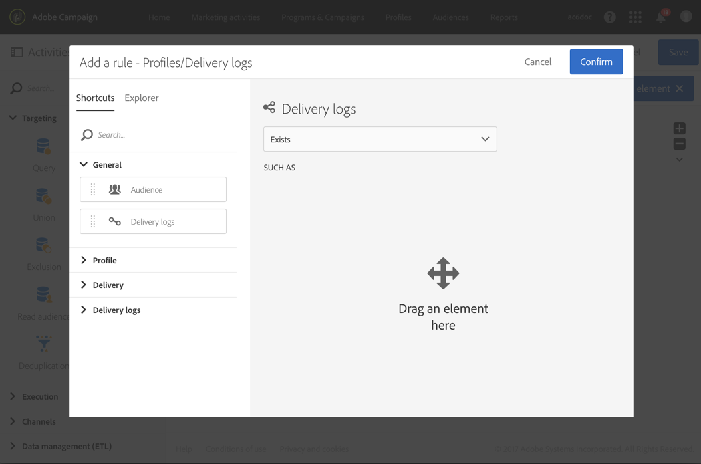

# 跟进消息{#follow-up-messages}

您可以向收到特定交易消息的客户发送跟进消息。 为此，您需要设置一个针对相应活动的工作流。

让我们重复使用“事务性消息传递”操 [作原则部分中描述的示例](../../channels/using/about-transactional-messaging.md#transactional-messaging-operating-principle) :购物车放弃电子邮件将发送给将产品添加到其购物车的网站用户，但是离开网站时并未完成购买。

您希望向收到购物车放弃通知但三天后未打开该通知的所有客户发送友好提醒。

然后，每位相关客户将收到一封后续消息，其依据的数据与发送的第一封电子邮件中使用的数据相同。

## 访问后续消息 {#accessing-the-follow-up-messages}

在您创建并发布活动(如上例所示  ，放弃购物车)后，将自动创建相应的交易消息和跟进消息。

配置事件以发送后续消 [息部分中介绍了配置步骤](../../administration/using/configuring-transactional-messaging.md#configuring-an-event-to-send-a-follow-up-message) 。

要处理工作流中的事件，需要提交模板。 但是，在发布活动时，创 [建的事务消息](../../channels/using/event-transactional-messages.md) ，不能用作模板。 因此，您需要创建一个特定的后续交付模板，该模板设计为支持此活动类型并在工作流中用作模板。

要访问此模板，请执行以下操作：

1. 单击左 **[!UICONTROL Adobe Campaign]**上角的徽标。
1. Select **[!UICONTROL Resources]**>**[!UICONTROL Templates]** > **[!UICONTROL Delivery templates]**.
1. 选中 **[!UICONTROL Follow-up messages]**左窗格中的框。

   

只显示后续消息。

>[!NOTE]
>
>要访问事务性消息，您必须是安全组的一 **[!UICONTROL Administrators (all units)]**部分。

## 发送跟进消息 {#sending-a-follow-up-message}

在创建后续交付模板后，您可以在工作流中使用它发送后续消息。

1. 访问营销活动列表并创建新的工作流。

   请参 [阅创建工作流](../../automating/using/building-a-workflow.md#creating-a-workflow)。

1. 将活动拖放到 **[!UICONTROL Scheduler]**您的工作流中并打开它。 将执行频率设置为每天一次。

   “调度程序”活动显示在“调 [度程序](../../automating/using/scheduler.md) ”部分。

1. 将活动拖放到 **[!UICONTROL Query]**您的工作流中并打开它。

   “查询”活动显示在“查询” [部分](../../automating/using/query.md) 。

1. 要在配置文件资源以外的资源上运行查询，请转到活动的选项卡， **[!UICONTROL Properties]**然后单击下**[!UICONTROL Resource]** 拉列表。

   

   >[!NOTE]
   >
   >默认情况下，活动已预配置为搜索配置文件。

1. 选择要定位的事件，以便仅访问此事件中的数据。

   

1. 转到活动的选项卡， **[!UICONTROL Target]**并将元素从调板拖**[!UICONTROL Delivery logs (logs)]** 放到工作区中。

   

   选择 **[!UICONTROL Exists]**以定位收到电子邮件的所有客户。

   

1. 将元 **[!UICONTROL Tracking logs (tracking)]**素从调色板移到工作区，然后选择**[!UICONTROL Does not exist]** 以定位所有未打开电子邮件的客户。

   

1. 将您定位的事件(本例中的“**购物车放弃** ”)从调色板拖放到工作区中。 然后定义一个规则，以定位三天前发送的所有消息。

   

   这意味着在工作流执行三天前收到交易邮件且尚未打开邮件的所有收件人均为目标收件人。

   单击 **[!UICONTROL Confirm]**以保存查询。

1. 将电子邮件分发活 **动拖放到您的** 工作流中。

   电子邮件发送活动显示在电子邮件 [发送部分](../../automating/using/email-delivery.md) 。

   

   您还可以使用 [SMS交付或移动](../../automating/using/sms-delivery.md) 应用 [程序交付活动](../../automating/using/push-notification-delivery.md) 。 在这种情况下，请确保在创建活动配 **[!UICONTROL Mobile (SMS)]**置时**[!UICONTROL Mobile application]** 选择或渠道。 请参 [阅创建活动](../../administration/using/configuring-transactional-messaging.md#creating-an-event)。

1. 打开电子 **邮件发送** 。 在创建向导中，选中 **[!UICONTROL Follow-up messages]**该框，然后选择发布活动后创建的后续交付模板。

   

1. 在后续消息内容中，您可以通过添加个性化字段来利用活动的内容。

   

1. 通过选择 **[!UICONTROL Context]**>**[!UICONTROL Real-time event]** >查找创建活动时定义的字段 **[!UICONTROL Event context]**。 请参[阅个性化交易消息](../../channels/using/event-transactional-messages.md#personalizing-a-transactional-message)。

   

   这意味着您可以利用在首次发送活动时使用的相同内容（包括丰富数据）来创建个性化的友好提醒。

1. 保存活动并启动工作流。

工作流启动后，每位在3天前收到购物车放弃通知但未打开的客户都会收到基于相同数据的跟进消息。

>[!NOTE]
>
>如果您在创建活 **[!UICONTROL Profile]**动配置时选择了定位维度，则后续消息还将利用Adobe Campaign营销数据库。 See[Profile transactional messages](../../channels/using/profile-transactional-messages.md).

