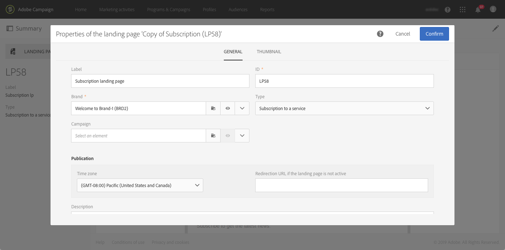
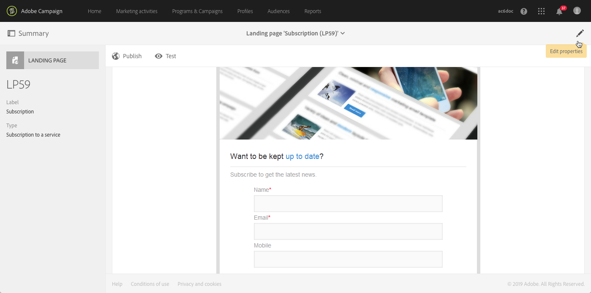

# 登陆页面快速入门 {#getting-started-with-landing-pages}

设置登陆页面的主要步骤如下：

在此页中，您可以找到各个步骤的信息以及对专用文档的引用，以便获取更多详细信息。

 [了解如何在视频中创建登陆页面](#video)

**相关主题：**

* [创建服务](../../audiences/using/creating-a-service.md)
* [设置双重选择加入流程](setting-up-a-double-opt-in-process.md)

## 登陆页面限制{#landing-page-limitations}

下方章节列出了您在开始设置登陆页面之前应了解的限制。

**编写和更新数据**

* 登陆页面被限制为仅使用 **[!UICONTROL Profile]** 和 **[!UICONTROL Subscription]** 资源。记录可通过 **[!UICONTROL Profile]** 保存和更新，还可订阅/退订 **[!UICONTROL Service]**。
要了解有关资源配置的更多信息，请参阅[配置资源的数据结构](../../developing/using/configuring-the-resource-s-data-structure.md)。

>[!IMPORTANT]
>
>登陆页面无法显示或更新来自非 **[!UICONTROL Profile]** 和 **[!UICONTROL Subscription]** 之任何其他资源的数据。

**预加载**

* 登陆页面不会自动显示记录列表，不会列出用户档案已订阅的服务。如需有关服务的更多信息，请参阅[此章节](../../audiences/using/creating-a-service.md)。

* 带有预填表单（数据随页面预加载）的登陆页面，只能通过 Adobe Campaign 电子邮件访问。无法从网站页面访问此类表单。

**协调**

* 协调行为如下：一旦找到匹配项，协调进程就会停止。这意味着，存在重复项时，只能对一个用户档案记录进行协调，而不能对多个记录进行协调。

例如，您希望向用户档案发送以下客户获取登陆页面，以便使用用户档案的移动号码更新 Campaign 数据库。

如果其中某个用户档案用新信息填充登陆页，但已存在重复的用户档案，则将更新为创建日期较早的匹配用户档案，因为用户档案的优先级取决于其创建日期。

此处只更新了第一个用户档案，因为它是最早的条目。

**测试登陆页面**

* 登陆页面只能用于用户档案，而不能用于测试用户档案，这意味着登陆页面不能通过电子邮件验证进行测试。

## 第 1 步 - 配置登陆页面模板 {#configure-the-landing-page-template}

在设置登陆页面之前，第一步是配置对应于您需求的登陆页面模板。模板准备就绪后，将使用所需的参数预配置基于该模板的所有登陆页面。

1. 从高级菜单中，通过 Adobe Campaign 徽标，选择 **[!UICONTROL Resources]**/**[!UICONTROL Templates]**/**[!UICONTROL Landing page templates]**，然后复制您要使用的模板。
1. 在模板属性中，指定登陆页面通常必须具有的所有参数。例如：定向维度、已识别或未识别访客的页面访问参数、特定于表单验证的访客操作、要用在内容中的品牌/徽标等。有关登录页属性的更多信息，请参阅[此章节](../../channels/using/configuring-landing-page.md)。
1. 保存您的修改。

有关登录页模板的更多信息，请参阅[此章节](../../channels/using/getting-started-with-landing-pages.md)。

## 第 2 步 - 创建和配置登陆页面 {#create-and-configure-the-landing-page}

使用上一步中定义的模板，在项目或营销策划中创建新的登陆页面。

1. 基于所需的模板创建登陆页面。
1. 输入登陆页面的常规参数（标签、说明等）。
1. 随后，可访问登陆页面仪表板。根据需要，编辑登陆页面的属性（请参阅[配置登陆页面](../../channels/using/configuring-landing-page.md)）。默认情况下，这些属性就是在登陆页面模板中配置的属性。
出于安全原因和平台性能的考虑，我们强烈建议您在登陆页面属性中设置过期日期。完成后，将在选定的日期自动取消发布登陆页面。有关有效性参数的更多信息，请参阅[此章节](../../channels/using/testing-publishing-landing-page.md#setting-up-validity-parameters)。

   

>[!NOTE]
>
>您的修改仅对正在编辑的登陆页面有效。如果要将这些修改应用于其他登陆页面，您可以在专用模板中执行这些修改，然后使用该模板创建其他登陆页面。

## 第 3 步 - 设计登陆页面 {#design-the-landing-page}

您现在可以定义登陆页面的内容。默认情况下，登陆页面包含三个可通过滚动箭头访问的页面：主内容页、确认页和错误页。

默认情况下，每个页面都配置了多个字段。您可根据需要，编辑其属性和映射。

您还可以配置确认按钮在被用户档案单击后的行为方式，并根据您的需求（图像、个性化字段等）将内容个性化。例如，您可以在登录页的确认页面上插入用户档案的名字，以感谢他们进行注册。

如需有关登录页设计的更多信息，请参阅[此章节](../../channels/using/designing-a-landing-page.md)。

## 第 4 步 - 测试登陆页面 {#test-the-landing-page}

定义登陆页面后，您可以模拟其上线之后的执行和行为方式。

>[!IMPORTANT]
>
>登陆页面测试只能使用用户档案进行，不能使用测试用户档案进行。提交表单后，所选用户档案的数据将实时更新。要避免修改真实的用户档案，请使用虚假客户的用户档案。

如果您对登陆页面的行为方式感到满意，可以将其发布以使其上线。

有关如何测试登陆页面的更多信息，请参阅[此章节](../../channels/using/testing-publishing-landing-page.md#testing-the-landing-page-)。

## 第 5 步 - 发布登陆页 {#publish-the-landing-page}

测试成功后，您可以使用仪表板操作栏中的 **[!UICONTROL Publish]** 按钮发布登陆页面。监视块可显示发布的进度和状态。

发布登陆页面后，即可使其上线并允许访问。发布后，您可以随时更新登录页：要实现此目的，您必须在每次修改后进行重新发布。您还可以随时取消发布登陆页面，使其不再可用。

发布后，您的登陆页面即可供使用。然后，您可以设置不同的机制，以便访问登陆页面从而将新的用户档案加入数据库，或获取关于现有用户档案的其他信息。

有关登录页发布的更多信息，请参阅[此章节](../../channels/using/testing-publishing-landing-page.md#publishing-a-landing-page)。

## 教程视频 {#video}

此视频演示如何创建和编辑登陆页面。

>[!VIDEO](https://video.tv.adobe.com/v/24093?quality=12)

其他Campaign Standard操作方法视频可在[此处](https://experienceleague.adobe.com/docs/campaign-standard-learn/tutorials/overview.html?lang=zh-Hans)获取。
