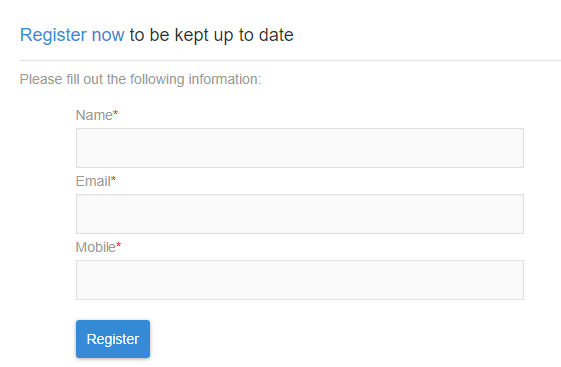

# 登陆页面快速入门 {#getting-started-with-landing-pages}

## 关于登陆页面 {#about-landing-pages}

活动附带有Web表单，这些表单可用于捕获有关受众的信息、将订阅优惠到服务、显示数据和扩展数据库。 登陆页还可用于获取或更新现有用户档案。

登陆页还可用于设置多次加入机制，使您能够保护平台免受错误或无效电子邮件地址或垃圾邮件程序的攻击。 有关详细信息，请参阅专 [用用例](../../channels/using/setting-up-a-double-opt-in-process.md)。

设置登陆页时的主要步骤如下：

在本页中，您将找到有关这些步骤中每个步骤的信息，以及对专用文档的引用，以了解更多详细信息。

**相关主题：**

* [创建登陆页教程视频](https://docs.adobe.com/content/help/en/campaign-learn/campaign-standard-tutorials/communication-channels/landing-pages/landing-page-create-and-edit.html)
* [创建服务](../../audiences/using/creating-a-service.md)
* [设置双重选择启用流程](setting-up-a-double-opt-in-process.md)

## 登陆页限制{#landing-page-limitations}

下面的部分列表了您在开始设置登陆页之前应了解的限制。

**编写和更新数据**

* 登陆页仅限于 **[!UICONTROL Profile]** 和 **[!UICONTROL Subscription]** 资源。 可以保存记录并从 **[!UICONTROL Profile]** 和订阅/退订更新到 **[!UICONTROL Service]**。
要了解有关资源配置的更多信息，请 [参阅配置资源的数据结构](../../developing/using/configuring-the-resource-s-data-structure.md)。

>[!CAUTION]
>
>登陆页无法显示或更新除和之外的任何其他资源中的 **[!UICONTROL Profile]** 数据 **[!UICONTROL Subscription]**。

**预加载**

* 登陆页无法自动显示记录列表，它无法列表用户档案已订阅的服务。 有关服务的详细信息，请参阅本 [页](../../audiences/using/creating-a-service.md)。

* 具有预填表单的登陆页（数据与页面预加载）只能通过Adobe Campaign电子邮件访问。 无法从网站页面访问此类表单。

**调解**

* 协调行为如下：一旦找到匹配项，协调进程就会停止。 这意味着，只能对一个用户档案记录进行协调，而不能对多个记录进行重复。

例如，您希望向用户档案发送以下客户获取登陆页，以便用用户档案的移动号码更新活动数据库。

如果您的某个用户档案用新信息填充登陆页，但已有重复用户档案，则将更新与最早创建日期的匹配用户档案，因为用户档案的优先级取决于其创建日期。

此处仅更新了第一个用户档案，因为它是最旧的条目。

**测试登陆页**

* 登陆页仅针对用户档案而不是测试用户档案，这意味着登陆页不能作为电子邮件验证的一部分进行测试。

## 第1步——配置登陆页模板 {#configure-the-landing-page-template}

在设置登陆页之前，第一步是配置与您的需求对应的登陆页模板。 模板准备就绪后，将使用所需的参数预配置基于该模板的所有登陆页。

1. 从高级菜单中，通过Adobe Campaign徽标，选 **[!UICONTROL Resources]** 择/ **[!UICONTROL Templates]** / **[!UICONTROL Landing page templates]**，然后重复要使用的模板。
1. 在模板属性中，指定登陆页必须具有的所有公用参数。 例如：定位维度、已识别或未识别访客的页面访问参数、访客特定于表单验证的操作、内容中使用的品牌／徽标等。 有关登陆页属性的详细信息，请参 [阅本节](../../channels/using/configuring-landing-page.md)
1. 保存修改。

有关登陆页模板的详细信息，请参阅 [此部分](../../channels/using/getting-started-with-landing-pages.md)。

## 第2步——创建和配置登陆页 {#create-and-configure-the-landing-page}

从上一步中定义的模板，在项目或活动中创建新的登陆页。

1. 根据所需的模板创建登陆页。
1. 输入登陆页的常规参数（标签、说明等）。
1. 然后您将访问登陆页仪表板。 根据需要编辑登陆页属性(请参 [阅配置登陆页](../../channels/using/configuring-landing-page.md))。 默认情况下，这些属性是在登陆页模板中配置的属性。
出于安全原因和平台性能的原因，我们强烈建议您在登陆页属性中设置过期日期。 完成后，登陆页将在选定日期自动取消发布。 For more on validity parameters, refer to [this section](../../channels/using/testing-publishing-landing-page.md#setting-up-validity-parameters).

   

   >[!NOTE]
   >
   >您的修改仅对正在编辑的登陆页有效。 如果要将这些修改应用于其他登陆页，您可以在专用模板中执行这些修改，然后从该模板创建其他登陆页。

## 第3步——设计登陆页 {#design-the-landing-page}

您现在可以定义登陆页的内容。 默认情况下，登陆页包含三个可通过滚动箭头访问的页面：主内容页、确认页和错误页。

默认情况下，每个页面上都配置了多个字段。 如有必要，您可以编辑其属性和映射。

您还可以配置确认按钮在用户档案单击后的行为方式，并根据您的需求(图像、个性化字段等)个性化内容。 例如，您可以在用户档案的确认页面上插入登陆页的名字，感谢他们注册。

有关登陆页设计的详细信息，请参 [阅本节](../../channels/using/designing-a-landing-page.md)。

## 第4步——测试登陆页 {#test-the-landing-page}

定义登陆页后，您可以模拟其在线可用时的执行和行为方式。

>[!CAUTION]
>
>登陆页测试只能用用户档案进行，不能用测试用户档案进行。 提交表单时，所选用户档案的数据将实际更新。 要避免修改真实用户档案，请使用假客户用户档案。

如果您对登陆页的行为方式感到满意，则可以发布它以使其联机可用。

有关如何测试登陆页的详细信息，请参 [阅本节](../../channels/using/testing-publishing-landing-page.md#testing-the-landing-page-)。

## 第5步——发布登陆页 {#publish-the-landing-page}

测试成功后，您可以使用登陆页中操作栏 **[!UICONTROL Publish]** 的按钮发布仪表板。 监视块显示发布的进度和状态。

发布登陆页后，即可在线访问。 发布后，您始终可以更新它：为此，您必须在每次修改后重新发布它。 您还可以随时取消发布登陆页，使其不再可用。

发布后，您的登陆页即可使用。 然后，您可以设置不同的机制，以便访问它以获取数据库中的新用户档案或获取有关现有用户档案的其他信息。

有关登陆页发布的详细信息，请参 [阅此部分](../../channels/using/testing-publishing-landing-page.md#publishing-a-landing-page)。
