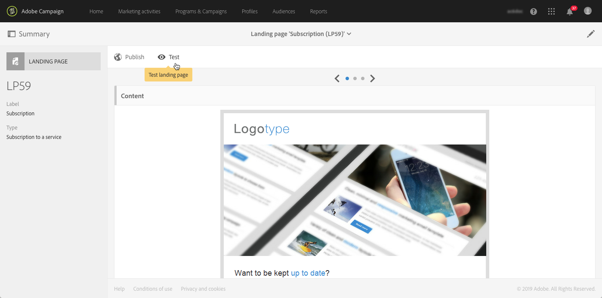

# 登陆页面快速入门 {#getting-started-with-landing-pages}

## 关于登陆页面 {#about-landing-pages}

Campaign附带登录页面，这些Web表单可用于捕获受众信息、提供服务订阅、显示数据和扩展数据库。 登录页面还可用于获取或更新现有配置文件。

登录页面还可用于设置双重选择加入机制，使您能够保护平台免受错误或无效电子邮件地址或垃圾邮件程序的攻击。 有关详细信息，请参阅专 [用用例](../../channels/using/setting-up-a-double-opt-in-process.md)。

设置登陆页面时的主要步骤如下：

在本页中，您将找到有关这些步骤中每个步骤的信息，以及对专用文档的引用，以了解更多详细信息。

**相关主题：**

* [创建登陆页面教程视频](https://docs.adobe.com/content/help/en/campaign-learn/campaign-standard-tutorials/communication-channels/landing-pages/landing-page-create-and-edit.html)
* [创建服务](../../audiences/using/creating-a-service.md)
* [设置双重选择启用流程](setting-up-a-double-opt-in-process.md)

## 登录页面限制{#landing-page-limitations}

以下部分列出了在开始设置登录页面之前您应了解的限制。

**编写和更新数据**

* 登录页面仅限于 **[!UICONTROL Profile]**和**[!UICONTROL Subscription]** 资源。 可以保存记录并从 **[!UICONTROL Profile]**订阅／取消订阅更新到**[!UICONTROL Service]**。
要了解有关资源配置的更多信息，请 [参阅配置资源的数据结构](../../developing/using/configuring-the-resource-s-data-structure.md)。

>[!CAUTION]
>
>登陆页面无法显示或更新除和之外的任何其他资源中的 **[!UICONTROL Profile]**数据**[!UICONTROL Subscription]**。

**预加载**

* 登陆页面无法自动显示记录列表，它无法列出已订阅配置文件的服务。 有关服务的详细信息，请参阅本 [页](../../audiences/using/creating-a-service.md)。

* 包含预填表单的登录页面（数据与页面预加载）只能从Adobe Campaign电子邮件中访问。 无法从网站页面访问此类表单。

**调解**

* 协调行为如下：一旦找到匹配项，协调进程就会停止。 这意味着，只能对一个配置文件记录进行协调，而不能对多个记录（如果有重复记录）进行协调。

例如，您希望将以下客户获取登录页发送到您的配置文件，以便使用配置文件的移动号码更新您的Campaign数据库。

如果您的其中一个配置文件用新信息填充了登录页面，但已有重复的配置文件，则将更新具有最早创建日期的匹配配置文件，因为仅根据配置文件的创建日期对配置文件进行优先级排序。

此处仅更新了第一个配置文件，因为它是最旧的条目。

**测试登陆页面**

* 登录页面仅对配置文件有效，而不对测试配置文件有效，这意味着登录页面不能作为电子邮件证明的一部分进行测试。

## 第1步——配置登陆页面模板 {#configure-the-landing-page-template}

在设置登陆页面之前，第一步是配置与您的需求对应的登陆页面模板。 模板准备就绪后，所有基于该模板的登录页面都将预先配置所需的参数。

1. 从高级菜单中，通过Adobe Campaign徽标，选 **[!UICONTROL Resources]**择/**[!UICONTROL Templates]** / **[!UICONTROL Landing page templates]**，然后复制要使用的模板。
1. 在模板属性中，指定登录页面必须具有的所有公用参数。 例如：定位维度、已识别或未识别访客的页面访问参数、访客对表单验证的特定操作、内容中使用的品牌／徽标等。 有关登录页面属性的详细信息，请参 [阅此部分](../../channels/using/configuring-landing-page.md)
1. 保存修改。

有关登录页面模板的详细信息，请参 [阅此部分](../../channels/using/getting-started-with-landing-pages.md)。

## 第2步——创建和配置登陆页面 {#create-and-configure-the-landing-page}

从上一步中定义的模板，在计划或营销活动中创建新的登录页面。

1. 根据所需的模板创建登陆页面。
1. 输入登录页面的常规参数（标签、说明等）。
1. 然后，您将访问登陆页面功能板。 根据需要编辑登录页面属性(请参 [阅配置登录页面](../../channels/using/configuring-landing-page.md))。 默认情况下，这些属性是在登陆页面模板中配置的属性。
出于安全原因和平台性能的考虑，我们强烈建议您在登录页面属性中设置到期日期。 完成后，登录页面将在选定日期自动取消发布。 For more on validity parameters, refer to [this section](../../channels/using/testing-publishing-landing-page.md#setting-up-validity-parameters).

   

   >[!NOTE]
   >
   >您的修改仅对正在编辑的登录页面有效。 如果要将这些修改应用到其他登录页面，您可以在专用模板中执行这些修改，然后从该模板创建其他登录页面。

## 第3步——设计登陆页面 {#design-the-landing-page}

您现在可以定义登陆页面的内容。 默认情况下，登录页面包含三个可通过滚动箭头访问的页面：主内容页、确认页和错误页。

默认情况下，每个页面上都配置了多个字段。 如有必要，您可以编辑其属性和映射。

您还可以配置在配置文件单击确认按钮后其行为方式，并根据您的需求（图像、个性化字段等）个性化内容。 例如，您可以在登录页面的确认页面上插入配置文件的名，以感谢他们注册。

有关登录页面设计的详细信息，请参 [阅此部分](../../channels/using/designing-a-landing-page.md)。

## 第4步——测试登陆页面 {#test-the-landing-page}

定义登陆页面后，您可以模拟登陆页面在线可用时的执行和行为方式。

>[!CAUTION]
>
>登录页面测试只能用配置文件进行，而不能用测试配置文件进行。 提交表单时，所选配置文件的数据将实际更新。 要避免修改真实的客户档案，请使用虚假的客户档案。

如果您对登录页面的行为方式感到满意，则可以发布它以使其联机可用。

有关如何测试登陆页面的详细信息，请参阅 [此部分](../../channels/using/testing-publishing-landing-page.md#testing-the-landing-page-)。

## 步骤发布登陆页面 {#publish-the-landing-page}

测试成功后，您可以使用功能板中操作栏 **[!UICONTROL Publish]**中的按钮发布登录页面。 监视块显示发布的进度和状态。

发布登录页面后，即可在线访问该页面。 发布后，您始终可以更新它：为此，您必须在每次修改后重新发布它。 您还可以随时取消发布登录页面，以便不再可用。

发布后，您的登录页面即可供使用。 然后，您可以设置不同的机制，以便访问该机制以在数据库中获取新配置文件或获取有关现有配置文件的其他信息。

有关登录页面发布的详细信息，请参 [阅此部分](../../channels/using/testing-publishing-landing-page.md#publishing-a-landing-page)。
