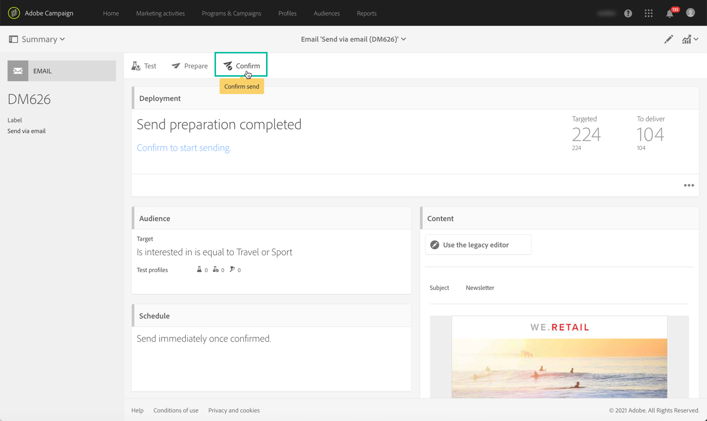

# 发送消息的关键步骤{#key-steps-to-send-a-message}

在此部分中，您将了解如何使用Adobe Campaign Standard创建个性化消息并将其发送给目标受众。

有关如何创建和配置每个通信渠道的具体信息，请参阅以下章节：

* [创建电子邮件](../../channels/using/creating-an-email.md)
* [创建短信](../../channels/using/creating-an-sms-message.md)
* [创建直邮投放](../../channels/using/creating-the-direct-mail.md)
* [创建推送通知](../../channels/using/preparing-and-sending-a-push-notification.md).
* [准备和发送应用程序内消息](../../channels/using/preparing-and-sending-an-in-app-message.md)

要了解投放最佳实践，请查阅 [投放最佳实践](../../sending/using/delivery-best-practices.md) 中。

## 创建消息

利用Campaign Standard [营销活动](../../start/using/marketing-activities.md) 创建电子邮件、短信、直邮、推送通知或应用程序内消息。

可以从营销活动列表或使用 [专用活动](../../automating/using/about-channel-activities.md).

## 定义受众

定义消息的收件人。 为此，请使用 [查询编辑器](../../automating/using/editing-queries.md) 从左窗格过滤数据库中包含的数据，并构建规则以定位受众。

可用的受众类型有以下几种：

* **[!UICONTROL Target]** 是您电子邮件的主要目标，
* **[!UICONTROL Test profiles]** 是用于测试和验证电子邮件的用户档案(请参阅 [管理测试用户档案](../../audiences/using/managing-test-profiles.md))。

## 设计和个性化内容

在 **[!UICONTROL Content]** 使用数据库中的字段阻止、设计和个性化消息的内容。 有关如何为特定渠道设计内容的更多信息，请参阅本页顶部列出的部分。

## 准备和测试

[准备](../../sending/using/preparing-the-send.md) 消息。 此过程会计算目标群体并准备个性化消息。

**检查并测试消息** 在使用Campaign Standard功能发送之前：预览、电子邮件渲染、校对等。 如需详细信息，请参阅[此部分](../../sending/using/previewing-messages.md)。

使用 **[!UICONTROL Schedule]** 块以定义消息的发送时间(请参阅 [计划消息发送](../../sending/using/about-scheduling-messages.md))。

## 发送和跟踪

消息准备就绪后，您可以确认发送。 的 **[!UICONTROL Deployment]** 块显示发送进度和结果。

有几个日志可帮助您监控消息的投放(请参阅 [监控投放](../../sending/using/monitoring-a-delivery.md))。 您还可以通过Campaign Standard [跟踪功能](../../sending/using/tracking-messages.md).

通过各种指标和图表衡量报文的有效性以及发送和营销活动的演变情况(请参阅 [访问报告](../../reporting/using/about-dynamic-reports.md))。

