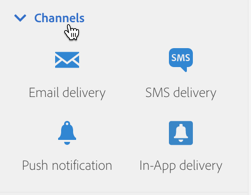

# 发送消息的关键步骤{#key-steps-to-send-a-message}

在本节中，您将学习如何使用Adobe Campaign Standard创建个性化消息并将其发送给目标受众。

有关如何创建和配置每个通信渠道的特定信息，请参阅以下部分：

* [创建电子邮件](../../channels/using/creating-an-email.md)
* [创建SMS](../../channels/using/creating-an-sms-message.md)
* [创建直邮投放](../../channels/using/creating-the-direct-mail.md)
* [创建推送通知](../../channels/using/preparing-and-sending-a-push-notification.md)。
* [准备和发送应用程序内消息](../../channels/using/preparing-and-sending-an-in-app-message.md)

要了解投放最佳做法，请查阅[投放最佳做法](../../sending/using/delivery-best-practices.md)部分。

## 创建您的消息

利用Campaign Standard [营销活动](../../start/using/marketing-activities.md)创建电子邮件、短信、直邮、推送通知或应用程序内消息。

可以从营销活动列表或使用[专用活动](../../automating/using/about-channel-activities.md)的工作流创建消息。

## 定义受众

定义消息的收件人。 为此，请使用左窗格中的[查询编辑器](../../automating/using/editing-queries.md)来过滤数据库中包含的数据并构建规则以目标受众。

可用受众有几种类型：

* **[!UICONTROL Target]** 是您电子邮件的主要目标,
* **[!UICONTROL Test profiles]** 是用于测试和验证电子邮件的用户档案(请参阅 [管理测试用户档案](../../audiences/using/managing-test-profiles.md))。

## 设计和个性化内容

在&#x200B;**[!UICONTROL Content]**&#x200B;块中，使用数据库中的字段设计和个性化消息内容。 有关如何为特定渠道设计内容的更多信息，请参阅本页顶部列出的部分。

## 准备和测试

[准](../../sending/using/preparing-the-send.md) 备消息。此过程会计算目标群并准备个性化信息。

**使用Campaign Standard功能发** 送邮件之前，请先检查并测试邮件：预览、电子邮件渲染、校样等如需详细信息，请参阅[此部分](../../sending/using/previewing-messages.md)。

使用&#x200B;**[!UICONTROL Schedule]**&#x200B;块定义何时发送您的消息（请参阅[计划消息](../../sending/using/about-scheduling-messages.md)）。

## 发送和跟踪

消息准备就绪后，您可以确认发送。 **[!UICONTROL Deployment]**&#x200B;块显示发送进度和结果。

有几个日志可帮助您监视消息的投放(请参阅[监视投放](../../sending/using/monitoring-a-delivery.md))。 您还可以借助Campaign Standard的[跟踪功能](../../sending/using/tracking-messages.md)跟踪投放收件人的行为。

通过各种指标和图表衡量消息的有效性以及发送和活动的演变（请参阅[访问报告](../../reporting/using/about-dynamic-reports.md)）。

