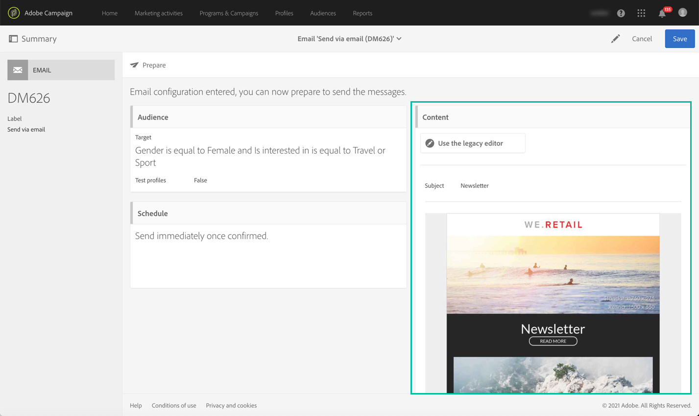

# 发送消息的关键步骤{#key-steps-to-send-a-message}

在此部分中，您将了解如何使用Adobe Campaign Standard创建个性化消息并将其发送给目标受众。

有关如何创建和配置每个通信渠道的特定信息，请参阅以下部分：

* [创建电子邮件](../../channels/using/creating-an-email.md)
* [创建短信](../../channels/using/creating-an-sms-message.md)
* [创建直邮投放](../../channels/using/creating-the-direct-mail.md)
* [创建推送通知](../../channels/using/preparing-and-sending-a-push-notification.md).
* [准备和发送应用程序内消息](../../channels/using/preparing-and-sending-an-in-app-message.md)

要了解投放的最佳实践，请查阅 [投放最佳实践](../../sending/using/delivery-best-practices.md) 部分。

## 创建您的消息

利用Campaign Standard [营销活动](../../start/using/marketing-activities.md) 创建电子邮件、短信、直邮、推送通知或应用程序内消息。

可以使用从营销活动列表或工作流创建消息 [专门的活动](../../automating/using/about-channel-activities.md).

## 定义受众

定义消息的收件人。 要执行此操作，请使用 [查询编辑器](../../automating/using/editing-queries.md) 从左窗格中过滤数据库中包含的数据，并构建规则以定向受众。

有多种类型的受众可用：

* **[!UICONTROL Target]** 是您电子邮件的主要目标，
* **[!UICONTROL Test profiles]** 是用于测试和验证电子邮件的配置文件(请参阅 [管理测试用户档案](../../audiences/using/managing-test-profiles.md))。

## 设计和个性化内容

在 **[!UICONTROL Content]** 使用数据库中的字段阻止、设计和个性化消息内容。 有关如何为特定渠道设计内容的更多信息，请参阅此页面顶部列出的部分。

## 准备和测试

[准备](../../sending/using/preparing-the-send.md) 消息。 此流程计算目标群体并准备个性化消息。

**检查并测试您的消息** 在使用Campaign Standard功能发送之前：预览、电子邮件渲染、验证等。 如需详细信息，请参阅[此小节](../../sending/using/previewing-messages.md)。

使用 **[!UICONTROL Schedule]** 阻止以定义发送消息的时间(请参阅 [计划消息发送](../../sending/using/about-scheduling-messages.md))。

## 发送和跟踪

消息准备就绪后，您可以确认发送。 此 **[!UICONTROL Deployment]** 块显示发送进度和结果。

有多个日志可帮助您监控消息的投放(请参阅 [监控投放](../../sending/using/monitoring-a-delivery.md))。 您还可以通过Campaign Standard的 [跟踪功能](../../sending/using/tracking-messages.md).

通过各种指标和图表，衡量报文的有效性，以及发送和促销活动的演变(请参阅 [访问报告](../../reporting/using/about-dynamic-reports.md))。

