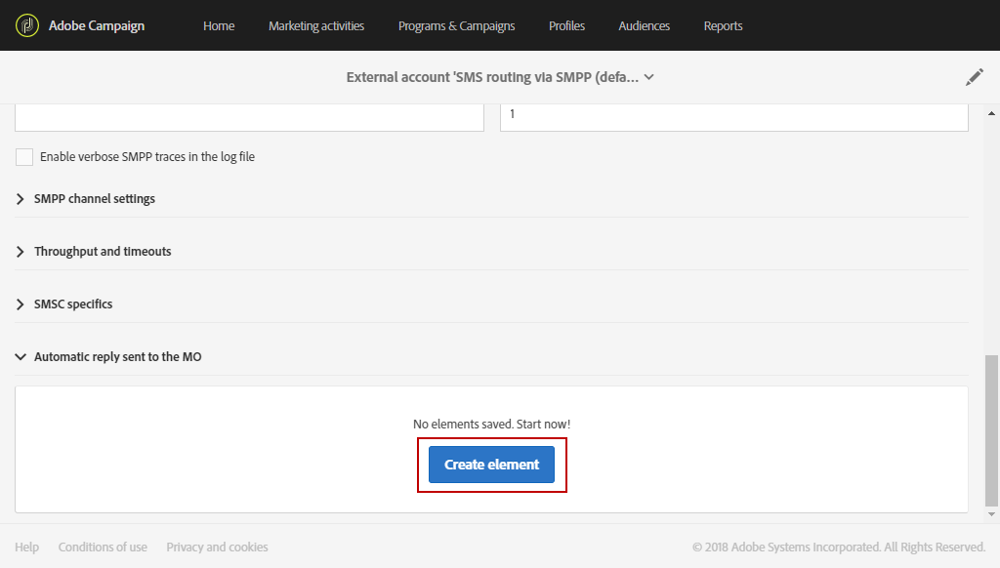

# 管理传入的短信{#managing-incoming-sms}

## 管理停止短信{#managing-stop-sms}

当某个用户档案回复通过 Campaign 发送的短信消息时，您可以配置自动发回给他的消息以及要自动执行的操作。

此配置在[SMS路由外部帐户](../../administration/using/configuring-sms-channel.md#defining-an-sms-routing)的&#x200B;**[!UICONTROL Automatic reply sent to the MO]**&#x200B;部分中定义。 MO表示“移动设备源”，这意味着您可以配置对发送短信的移动设备的自动回复。

为实现此操作，请执行以下步骤：

1. 从高级菜单中，通过Adobe Campaign徽标，选择&#x200B;**[!UICONTROL Administration > Application settings > External accounts]** ，然后选择&#x200B;**[!UICONTROL SMS routing via SMPP]**&#x200B;外部帐户。
1. 在&#x200B;**[!UICONTROL Automatic reply sent to the MO]**&#x200B;类别下，单击&#x200B;**[!UICONTROL Create element]**&#x200B;以开始配置自动回复。

   

1. 选择将触发此自动回复的关键词。 关键词不区分大小写。 例如，在此处，如果收件人发送关键词“STOP”，他们将收到自动回复。

   如果不管关键词是什么，要发送相同的回复，请将此列留空。

   

1. 在&#x200B;**[!UICONTROL Short code]**&#x200B;字段中，指定通常用于发送投放并用作发件人名称的数字。 您还可以决定将&#x200B;**[!UICONTROL Short code]**&#x200B;列留空，以发送相同的回复，而不管是什么短代码。

   

1. 在字段&#x200B;**[!UICONTROL Reply]**&#x200B;中键入要发送给收件人的答案。

   要在不发送回复的情况下执行操作，请将&#x200B;**[!UICONTROL Reply]**&#x200B;列留空。 例如，这允许您从隔离中删除回复了“STOP”以外消息的用户的电话号码。

   

1. 在&#x200B;**[!UICONTROL Additional action]**&#x200B;字段中，将操作链接到自动回复：

   * **[!UICONTROL Send to quarantine]**&#x200B;操作会自动隔离用户档案的电话号码。
   * **[!UICONTROL Remove from quarantine]**&#x200B;操作会将用户档案电话号码从隔离中删除。
   * 使用&#x200B;**[!UICONTROL None]**&#x200B;操作，您只能向收件人发送消息，而无需执行任何操作。

   例如，在以下配置中，如果收件人发送关键词“STOP”，他们将自动收到退订确认函，其电话号码将以&#x200B;**[!UICONTROL On denylist]**&#x200B;状态添加到隔离。 此状态仅指电话号码，其用户档案是为了允许用户继续接收电子邮件。

   

1. 单击 **[!UICONTROL Save]**。

1. 在短信投放&#x200B;**[!UICONTROL Properties]**&#x200B;的&#x200B;**[!UICONTROL Advanced parameters]**&#x200B;中，您可以设置一个特定的&#x200B;**[!UICONTROL Short code]**&#x200B;以自动排除选择退出的收件人。 有关此内容的详细信息，请参见[此部分](../../administration/using/configuring-sms-channel.md#configuring-sms-properties)。

现在，您的收件人可自动退订您的邮件，并通过此自动回复发送到隔离。 通过&#x200B;**[!UICONTROL Administration]** > **[!UICONTROL Channels]** > **[!UICONTROL Quarantines]**&#x200B;菜单提供的&#x200B;**[!UICONTROL Addresses]**&#x200B;表中列出了隔离的收件人。 有关隔离的更多信息，请参阅此[部分](../../sending/using/understanding-quarantine-management.md)。

如果需要，可以存储这些传入的短信。 有关此内容的详细信息，请参阅此[部分](#storing-incoming-sms)。

## 存储传入的SMS {#storing-incoming-sms}

在&#x200B;**[!UICONTROL SMS routing via SMPP]**&#x200B;外部帐户中，您可以选择存储传入消息，例如，当订阅者回复“STOP”短信消息以从收件人列表中删除时。

通过选中&#x200B;**[!UICONTROL SMPP channel settings]**&#x200B;类别中的&#x200B;**[!UICONTROL Store incoming MO in the database]**，所有短信都将存储在inSMS表中，并可通过工作流中的查询活动进行检索。

为实现此操作，请执行以下步骤：

1. 在&#x200B;**[!UICONTROL SMPP channel settings]**&#x200B;字段中，选中&#x200B;**[!UICONTROL Store incoming MO in the database]**。

   

1. 在&#x200B;**[!UICONTROL Marketing activities]**&#x200B;选项卡中，单击&#x200B;**[!UICONTROL Create]**，然后选择&#x200B;**[!UICONTROL Workflow]**。

   

1. 选择您的工作流类型。
1. 编辑工作流的属性，然后单击&#x200B;**[!UICONTROL Create]**。 有关创建工作流的更多信息，请参阅此[部分](../../automating/using/building-a-workflow.md)。
1. 拖放&#x200B;**[!UICONTROL Query]**&#x200B;活动并双击该活动。
1. 在查询的&#x200B;**[!UICONTROL Properties]**&#x200B;选项卡中，在&#x200B;**[!UICONTROL Resource]**&#x200B;字段中选择&#x200B;**[!UICONTROL Incoming SMS (inSMS)]**。

   

1. 然后，在&#x200B;**[!UICONTROL Target]**&#x200B;选项卡中，拖放&#x200B;**[!UICONTROL Incoming SMS attributes]**&#x200B;规则。

   

1. 在此，我们希望定位前一天开始的每个传入消息。 在&#x200B;**[!UICONTROL Field]**&#x200B;类别中，选择&#x200B;**[!UICONTROL Creation date (created)]**。
1. 在&#x200B;**[!UICONTROL Filter type]**&#x200B;中，选择&#x200B;**[!UICONTROL Relative]**，然后在&#x200B;**[!UICONTROL Level of precision]**&#x200B;中，选择&#x200B;**[!UICONTROL Day]**。

   

1. 然后，您可以选择从今天、前一天或最近几天检索数据。 配置查询后，单击&#x200B;**[!UICONTROL Confirm]**。

此查询将根据所选的时间范围检索收到的每条STOP消息。

例如，利用活动可构建群体，并更好地个性化投放。
