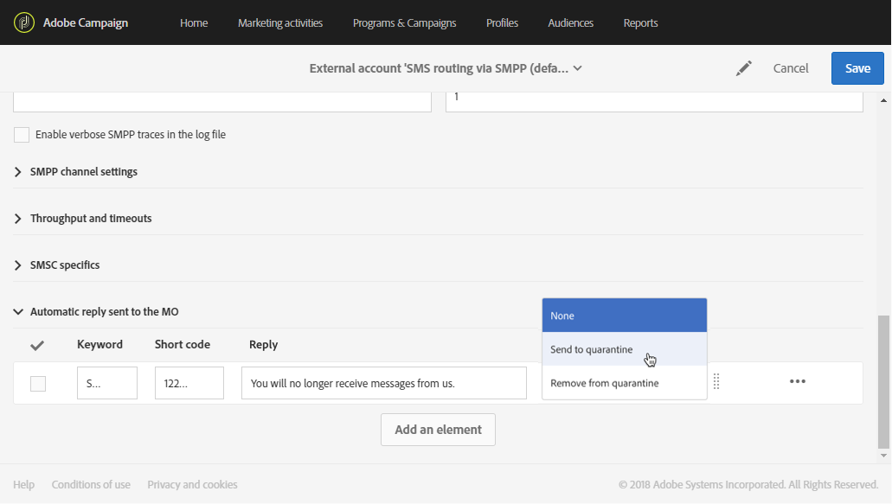

# 管理传入的短信{#managing-incoming-sms}

## 管理停止SMS {#managing-stop-sms}

当某个用户档案回复通过 Campaign 发送的短信消息时，您可以配置自动发回给他的消息以及要自动执行的操作。

此配置在SMS路由 **[!UICONTROL Automatic reply sent to the MO]** 外部帐户的 [一节中定义](../../administration/using/configuring-sms-channel.md#defining-an-sms-routing)。 MO代表“源于移动”，这意味着您可以配置对发送短信的移动设备的自动回复。

为实现此操作，请执行以下步骤：

1. From the advanced menu, via the Adobe Campaign logo, select **[!UICONTROL Administration > Application settings > External accounts]** then the **[!UICONTROL SMS routing via SMPP]** external account.
1. 在类别 **[!UICONTROL Automatic reply sent to the MO]** 下，单击 **[!UICONTROL Create element]** 开始以配置自动回复。

   

1. 选择触发此自动回复的关键字。 关键字不区分大小写。 例如，如果收件人在此发送关键字“STOP”，他们将收到自动回复。

   如果要发送相同的回复，无论关键字是什么，请将此列留空。

   

1. 在字 **[!UICONTROL Short code]** 段中，指定通常用于发送投放并用作发件人姓名的编号。 您还可以决定将列留 **[!UICONTROL Short code]** 空，以发送相同的回复，而不管是什么简短的代码。

   

1. 在字段中键入要发送给收件人的答案 **[!UICONTROL Reply]**。

   要在不发送回复的情况下执行操作，请将该列 **[!UICONTROL Reply]** 留空。 例如，这允许您从隔离中删除用“STOP”以外的消息回复的用户的电话号码。

   

1. 在该字 **[!UICONTROL Additional action]** 段中，将操作链接到自动回复：

   * 操作 **[!UICONTROL Send to quarantine]** 会自动隔离用户档案电话号码。
   * 该操 **[!UICONTROL Remove from quarantine]** 作会从用户档案中删除隔离电话号码。
   * 该 **[!UICONTROL None]** 操作允许您仅向收件人发送消息，而不携带操作。

   例如，在以下配置中，如果收件人发送关键字“STOP”，他们将自动收到退订确认，其电话号码将发送到状态为“STOP”的隔离 **[!UICONTROL On denylist]** 。 此状态仅指电话号码，用户档案是这样用户继续接收电子邮件。

   

您的收件人现在可以自动取消订阅您的消息，并通过此自动回复发送给隔离。 隔离的收件人列在可通过 **[!UICONTROL Addresses]** > >菜单访问 **[!UICONTROL Administration]** 的 **[!UICONTROL Channels]** 表中 **[!UICONTROL Quarantines]** 。 For more information on quarantines, refer to this [section](../../sending/using/understanding-quarantine-management.md).

如果需要，可以存储这些传入的SMS。 For more information on this, refer to this [section](#storing-incoming-sms).

## 存储传入的SMS {#storing-incoming-sms}

在外部帐户 **[!UICONTROL SMS routing via SMPP]** 中，您可以选择存储传入消息，例如当订阅者回复SMS消息“STOP”以从您的收件人列表中删除时。

通过 **[!UICONTROL Store incoming MO in the database]** 在类别 **[!UICONTROL SMPP channel settings]** 中进行检查，所有SMS都将存储在inSMS表中，并且可以通过工作流中的查询活动进行检索。

为实现此操作，请执行以下步骤：

1. In the **[!UICONTROL SMPP channel settings]** field, check **[!UICONTROL Store incoming MO in the database]**.

   

1. In the **[!UICONTROL Marketing activities]** tab, click **[!UICONTROL Create]** then select **[!UICONTROL Workflow]**.

   

1. 选择您的工作流类型。
1. 编辑工作流的属性，然后单击 **[!UICONTROL Create]**。 For more on workflows creation, refer to this [section](../../automating/using/building-a-workflow.md).
1. Drag and drop a **[!UICONTROL Query]** activity and double-click the activity.
1. 在查询 **[!UICONTROL Properties]** 的选项卡中，在字 **[!UICONTROL Incoming SMS (inSMS)]** 段中选 **[!UICONTROL Resource]** 择。

   

1. 然后，在选 **[!UICONTROL Target]** 项卡中拖放规 **[!UICONTROL Incoming SMS attributes]** 则。

   

1. 在此，我们希望目标前一天收到的每一条消息。 In the **[!UICONTROL Field]** category, select **[!UICONTROL Creation date (created)]**.
1. 在中 **[!UICONTROL Filter type]**，选 **[!UICONTROL Relative]** 择，然后 **[!UICONTROL Level of precision]**&#x200B;在中选择 **[!UICONTROL Day]**。

   

1. 然后，您可以选择从今天、前一天或前几天检索数据。 配 **[!UICONTROL Confirm]** 置查询时单击。

此查询将根据所选的时间范围检索收到的每条STOP消息。

例如，该活动可以帮您建立人口，并更好地个性化投放。
