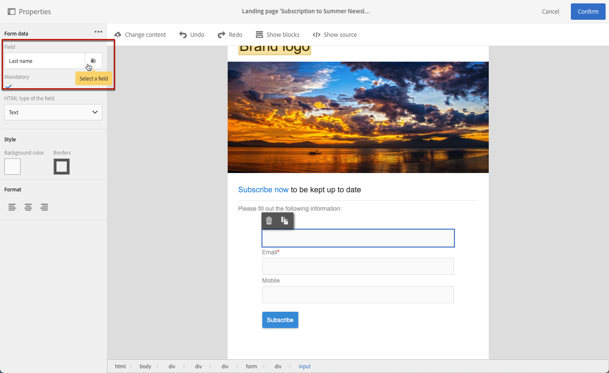
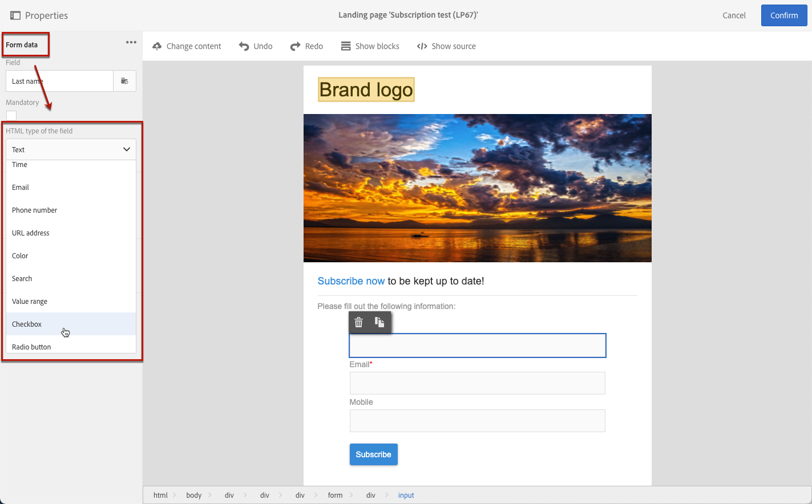
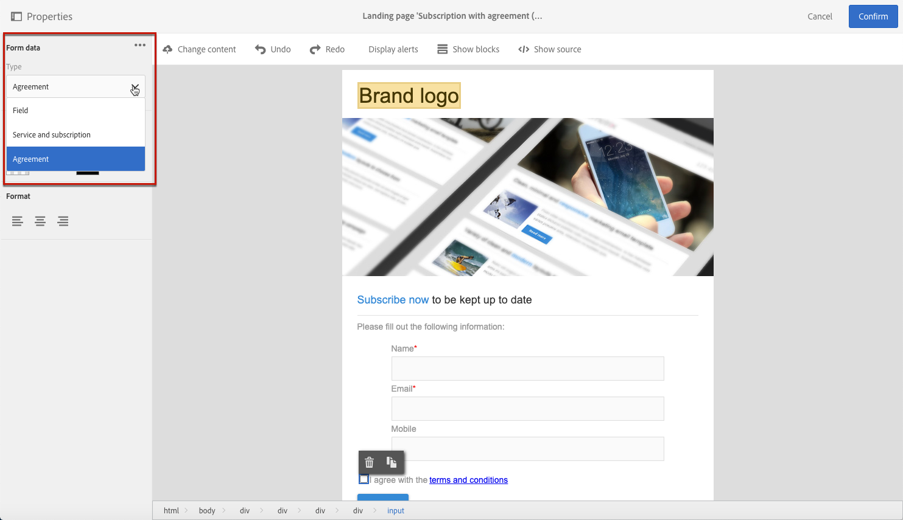
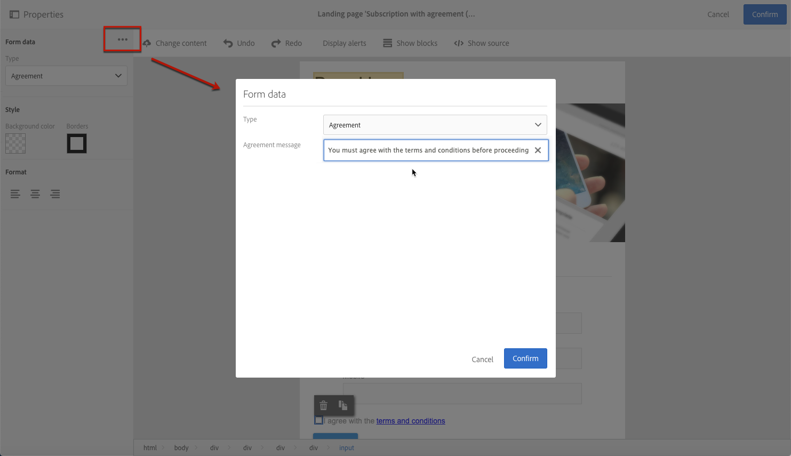

# 管理登陆页面表单数据{#managing-landing-page-form-data}

在登陆页面内容中，输入字段用于存储或更新来自Campaign数据库的数据。

要实现此目的，必须将这些字段映射到数据库字段。

您可以通过左侧面板上的&#x200B;**[!UICONTROL Form data]**&#x200B;部分定义和管理其映射。

## 映射表单字段 {#mapping-form-fields}

要根据需要更新Campaign数据库，请将相关数据库字段链接到登陆页面的输入区、单选按钮或复选框类型块。

为此请执行以下操作步骤：

1. 在登陆页面内容中选择块。

   >[!NOTE]
   >
   >内置登陆页面的默认字段已进行了预配置。您可以根据需要对其进行修改。

1. 访问左侧面板上的&#x200B;**[!UICONTROL Form data]**&#x200B;部分。

1. 要更改字段类型，请从&#x200B;**[!UICONTROL HTML type of the field]**&#x200B;下拉列表中选择一个值。

   

   >[!NOTE]
   >
   >有关在登陆页中使用复选框类型的更多信息，请参阅[更新多个服务订阅](#multiple-subscriptions)和[协议复选框](#agreement-checkbox)部分。

1. 如果选择与&#x200B;**[!UICONTROL Field]**&#x200B;区域中当前选择的数据库字段不兼容的字段类型，将显示一条警告消息。 要获得最佳映射，请选择适当的值。

   

1. 使用&#x200B;**[!UICONTROL Field]**&#x200B;区域选择将链接到表单字段的数据库字段。

   

   >[!NOTE]
   >
   >登陆页面只能映射到&#x200B;**[!UICONTROL Profiles]**&#x200B;或&#x200B;**[!UICONTROL Service]**&#x200B;资源。

   在此示例中，将登陆页面的&#x200B;**Name**&#x200B;字段映射到&#x200B;**[!UICONTROL Profiles]**&#x200B;资源的&#x200B;**[!UICONTROL Last name]**&#x200B;字段。

   

1. 需要时，可勾选 **[!UICONTROL Mandatory]** 选项。在这种情况下，仅当用户填写此字段后才能提交登陆页面。

   

   如果未填写必填字段，则用户提交页面时会显示错误消息。

1. 单击&#x200B;**[!UICONTROL Confirm]**&#x200B;保存更改。

<!--If you choose a mandatory **[!UICONTROL Checkbox]**, make sure that it is of **[!UICONTROL Field]** type.-->

## 数据存储与协调{#data-storage-and-reconciliation}

利用数据协调参数，可定义在用户提交数据后如何管理在登陆页面中输入的数据。

操作步骤：

1. 编辑通过登陆页面仪表板中的  图标访问的登陆页面属性，并显示 **[!UICONTROL Job]** 参数。

   

1. 选择&#x200B;**[!UICONTROL Reconciliation key]**：此数据库字段用于确定访客是否具有Adobe Campaign数据库中已知的配置文件。 例如电子邮件、名字、姓氏等。 协调密钥允许您根据下面定义的&#x200B;**[!UICONTROL Update strategy]**&#x200B;参数更新或创建用户档案。

1. 定义 **[!UICONTROL Form parameter mapping]**：利用此部分可映射登陆页面字段参数和协调键中使用的参数。

1. 选择&#x200B;**[!UICONTROL Update strategy]**：如果协调键值取回了现有的数据库配置文件，您可以选择使用在表单中输入的数据来更新此配置文件，或者改为阻止此更新。

   

## 多个服务订阅 {#multiple-subscriptions}

您可以在单个登陆页面上使用多个复选框，以允许用户订阅或取消订阅多项服务。

为此请执行以下操作步骤：

1. 设计登陆页面时：

   * 选择一个块，然后从&#x200B;**[!UICONTROL Form data]**&#x200B;部分中选择&#x200B;**[!UICONTROL Checkbox]**&#x200B;作为字段类型。

     

   * 如果您熟悉HTML，还可以使用&#x200B;**[!UICONTROL Show source]**&#x200B;按钮手动插入复选框。

     

     这允许您在页面上方便的位置插入复选框。

     

1. 确保在内容中选中复选框。 **[!UICONTROL Type]**&#x200B;下拉列表显示在左侧面板的&#x200B;**[!UICONTROL Form data]**&#x200B;部分中。 从列表中选择&#x200B;**[!UICONTROL Service and subscription]**。

   

1. 从&#x200B;**[!UICONTROL Behavior]**&#x200B;下拉列表中选择一个选项。

   

1. 从相应的列表中选择[服务](../../audiences/using/creating-a-service.md)。

   

1. 确保取消选中&#x200B;**[!UICONTROL Mandatory]**&#x200B;选项。 否则，您的用户将别无选择。

   

1. 要添加更多复选框以订购其他服务，请根据需要重复上述步骤。

   

发布登陆页面后，用户可以选中多个复选框以订阅同一页面中的多个新闻稿。

## “协议”复选框 {#agreement-checkbox}

您可以添加一个复选框，要求在提交登陆页面之前对配置文件进行检查。

例如，这允许您在提交表单之前请求用户同意隐私策略，或让他们接受您的条款和条件。

>[!IMPORTANT]
>
>用户必须选中此复选框。 如果未选择，他们将无法提交登陆页面。

要插入并配置此复选框，请执行以下操作：

1. 设计登陆页面时：

   * 选择一个块，然后从&#x200B;**[!UICONTROL Form data]**&#x200B;部分中选择&#x200B;**[!UICONTROL Checkbox]**&#x200B;作为字段类型。

     

   * 如果您熟悉HTML，还可以使用&#x200B;**[!UICONTROL Show source]**&#x200B;按钮手动插入复选框。

     

     <!--Manually insert a checkbox, such as in the example below:

      <!--Click **[!UICONTROL Hide source]**.-->

1. 确保选中复选框。

   

1. **[!UICONTROL Type]**&#x200B;下拉列表显示在左侧面板的&#x200B;**[!UICONTROL Form data]**&#x200B;部分中。 从列表中选择&#x200B;**[!UICONTROL Agreement]**。

   

   >[!NOTE]
   >
   >**[!UICONTROL Agreement]**&#x200B;元素未映射到Campaign数据库的字段。

1. 单击&#x200B;**[!UICONTROL Form data]**&#x200B;旁边的图标以访问复选框高级属性。

1. 您可以根据需要编辑消息。

   

   如果用户未在提交表单前选中复选框，则此文本将显示为警告。

   >[!NOTE]
   >
   >默认情况下，此操作是强制性的，无法更改。

1. 单击 **[!UICONTROL Confirm]**。

现在，每次显示登陆页面时，用户都必须在提交表单之前选中此复选框。 如果不能，将显示警告，在激活复选框之前，用户将无法提交表单。