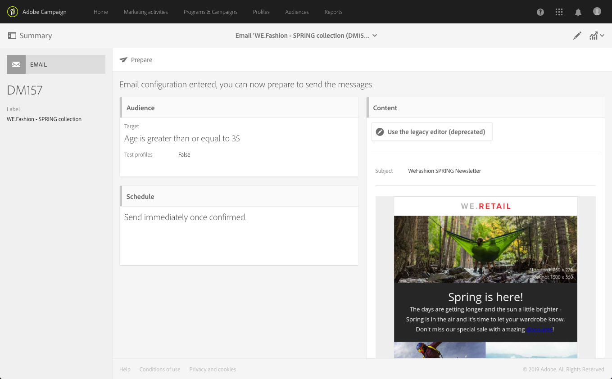

# 消息仪表板{#message-dashboard}

消息仪表板是由不同图标（重组为操作栏）和各种功能块组成的工作区，这些功能块允许您建立消息的参数并发送消息。 这些要素如下所述。

## 灰条 {#gray-bar}

灰色栏可重组链接到消息的各种图标。

* **[!UICONTROL Summary]**:显示/隐藏有关消息的主要信息。
* **[!UICONTROL Edit properties]**:允许您编辑消息的高 [级参数](../../administration/using/configuring-email-channel.md#list-of-email-properties)。
* **[!UICONTROL Reports]**:允许您访问与消息相关的报告。

**相关主题：**

* [配置渠道](../../administration/using/about-channel-configuration.md)
* [访问报告](../../reporting/using/about-dynamic-reports.md)

## 操作栏 {#action-bar}

操作栏具有不同的图标，允许您与消息进行交互。

根据已设置的参数和进度，某些图标可能不可用。

* **[!UICONTROL Show proofs]**:显示/隐藏已发送的校样列表（如果存在）。仅在发送校样后，才会启用此按钮。

   有关校样的更多信息，请参阅[发送校样](../../sending/using/sending-proofs.md)。

* **[!UICONTROL Send a test]**:允许您选择要使用的批准模式： **[!UICONTROL Email rendering]** （仅限电子邮件），或 **[!UICONTROL Proof]** 同时使用两者。有关测试用户档案的更多信息，请参阅[发送校样](../../sending/using/sending-proofs.md)。 仅在创建测试用户档案后，才会启用此按钮。

* **[!UICONTROL Prepare send]**:开始准备发送。出现&#x200B;**[!UICONTROL Deployment]**&#x200B;块，并显示准备结果。 仅在输入目标后，才会显示此按钮。 您可以使用相应的按钮随时停止准备。 有关消息准备的更多信息，请参阅[准备发送](../../sending/using/preparing-the-send.md)。

* **[!UICONTROL Confirm send]**:确认发送消息。发送统计信息显示在&#x200B;**[!UICONTROL Deployment]**&#x200B;块中。 此按钮仅在准备发送后显示。 您可以随时使用&#x200B;**停止发送**&#x200B;和&#x200B;**[!UICONTROL Pause]**&#x200B;按钮停止或暂停发送。 有关确认发送的更多信息，请参阅[发送消息](../../sending/using/confirming-the-send.md)。

## 块 {#blocks}

主屏幕由不同块组成。 在块内单击以访问相应的参数屏幕：

* **[!UICONTROL Deployment]**:用于跟踪消息准备或发送的进度。单击此块右下方的按钮以访问发送和分析日志。 仅在准备发送后，才会显示此块。 有关更多信息。 请参阅[确认发送](../../sending/using/confirming-the-send.md)。
* **[!UICONTROL Audience]**:用于建立消息的主目标和测试用户档案。请参阅[创建受众](../../audiences/using/creating-audiences.md)。
* **[!UICONTROL Schedule]**:用于指定消息的发送日期。请参阅[计划](../../sending/using/about-scheduling-messages.md)。
* **[!UICONTROL Content]**:用于定义消息的内容并进行预览。请参阅[发送消息的关键步骤](../../channels/using/key-steps-to-send-a-message.md)。

## 警告 {#warnings}

在某些情况下，消息仪表板顶部的黄色横幅中可能会显示警告。

以下是可显示的消息列表：

* *“此电子邮件已启用SMTP测试模式选项：不会发送任何消息。”*

   有关更多信息，请参阅[此章节](../../administration/using/configuring-email-channel.md#smtp-test-mode)。

* *&quot;已禁用路由外部帐户。&quot;*

   有关更多信息，请参阅[外部帐户](../../administration/using/external-accounts.md)。

* *“无法发送消息，因为当前IP关联未由任何发送进程处理。”*

   如果您看到此消息，则在IP关联定义级别或发送流程级别会出现问题。 请联系您的Adobe管理员。

* *“这是一个现成的事务型消息模板。如果要修改它，必须复制它并处理副本。&quot;*

   其中一些现成的事务型消息模板是内置登陆页面模板。 有关更多信息，请参阅[此章节](../../channels/using/landing-page-templates.md)。

* *“此消息是技术事务型消息模板。您无法修改或发布它。&quot;*

   此警告显示在不可编辑的空事务型消息模板中。 有关事务型消息的更多信息，请参阅[此部分](../../channels/using/getting-started-with-transactional-msg.md)。
