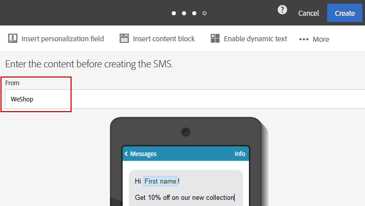

# 个性化短信消息{#personalizing-sms-messages}

个性化短信消息的原理与电子邮件[相同](../../designing/using/personalization.md#inserting-a-personalization-field)。但是，您必须了解音译选项，因为这些选项会影响编码，从而影响要发送的短信消息数量。有关更多信息，请参阅[音译和短信长度](../../administration/using/configuring-sms-channel.md#sms-encoding--length-and-transliteration)一节。

这里，我们以一个包含个性化字段的短信消息为例，它会根据是否选择音译，生成不同数量的发送：

**Hey &lt; FirstName > &lt; LastName >, new products now available.Come and check them out in store!**

* 对于名为“John Smith”的收件人，由于其中不包含特殊字符，Adobe Campaign 将选择 GSM 编码，该编码将对每条短信消息最多授权 160 个字符。因此，该消息将通过单条短信发送。
* 对于名为“Raphaël Forêt”的收件人，字符“ë”和“ê”不能使用 GSM 编码。根据是否启用了音译，Adobe Campaign 可以选择两种行为：

   * 如果授权了音译，则“ë”、“ê”将被“e”取代，这意味着可在短信中使用 GSM 编码，因此最多授权 160 个字符。此消息将作为单条短信消息发送，但稍微有一些变化。
   * 如果不授权音译，Adobe Campaign 将选择以二进制格式 (Unicode) 发送消息：因此，所有字符都将以该格式发送。由于 Unicode 格式的短信消息长度限制为 70 个字符，因此 Adobe Campaign 必须分两部分发送该消息。

>[!NOTE]
>
>自动选择最佳编码的算法，需要针对每条消息逐条执行。通过这种方式，只将需要 Unicode 编码的个性化消息以 Unicode 发送，其他所有消息都将使用 GSM 编码。

## 短信发送方{#sms-sender}

>[!IMPORTANT]
>
>请参见您所在国家/地区有关修改发件人地址的法律。您还应与短信服务提供商进行核实，了解他们是否提供此功能。

利用 **[!UICONTROL From]**，可使用字符串将短信消息发送者的名称个性化。该名称在收件人的手机显示为短信消息的发送者。

如果此字段为空，则将显示所用外部帐户中提供的源号码。如果未提供源号码，则将使用短代码。有关专用于短信投放的外部帐户，请参阅[定义短信路由](../../administration/using/configuring-sms-channel.md#defining-an-sms-routing)一节。

