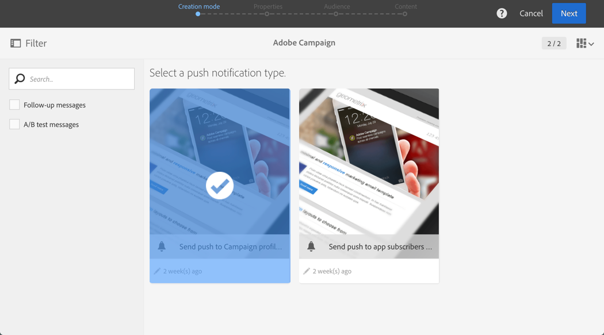
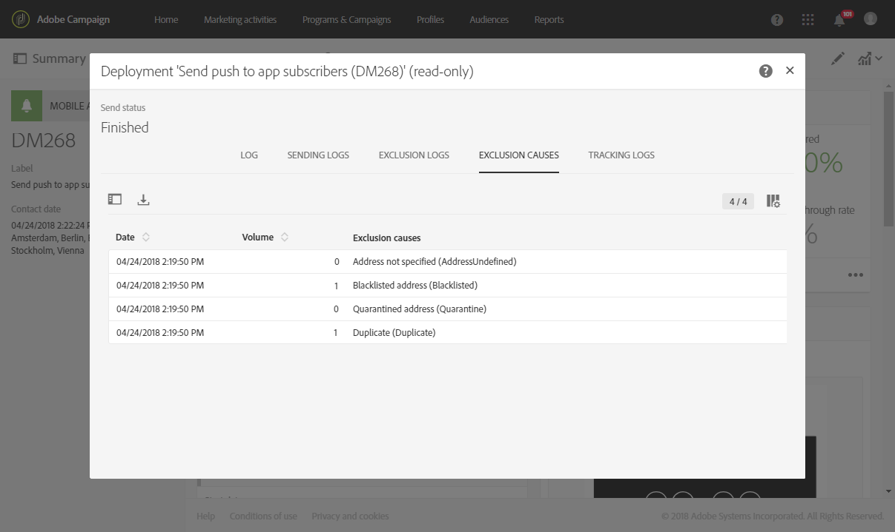

# 准备和发送推送通知{#preparing-and-sending-a-push-notification}

## 准备通知{#preparing-the-notification}

创建具有Adobe Campaign的推送通知的步骤有：

1. 在&#x200B;**[!UICONTROL Marketing activities]**&#x200B;窗口中，[创建新的营销活动](../../start/using/marketing-activities.md#creating-a-marketing-activity)。

   请注意，也可以从[活动](../../start/using/marketing-activities.md#creating-a-marketing-activity)或Adobe Campaign[主页](../../start/using/interface-description.md#home-page)创建单个推送通知。

   您还可以在工作流中使用推送通知投放活动。 此活动显示在[推送通知投放](../../automating/using/push-notification-delivery.md)部分。

1. 选择 **[!UICONTROL Push notification]**。
1. 选择模板。

   

   默认情况下，您可以选择以下两个模板之一：

   * **[!UICONTROL Send push to Campaign profiles]**:使用此模板目标订阅了您的移动应用程序并选择接收推送通知的Adobe CampaignCRM用户档案。您可以在推送通知中插入[个性化](../../designing/using/personalization.md#inserting-a-personalization-field)字段，如收件人的名字。
   * **[!UICONTROL Send push to app subscribers]**:使用此模板向所有已选择接收来自您的应用程序的通知的已知和匿名移动应用程序用户发送推送通知。您可以使用从移动应用程序收集的数据个性化这些信息。

   您还可以选择多语言模板。 有关详细信息，请参阅[创建多语言推送通知](../../channels/using/creating-a-multilingual-push-notification.md)。

   有关模板的详细信息，请参阅[管理模板](../../start/using/marketing-activity-templates.md)部分。

1. 输入您的推送通知属性，并在&#x200B;**[!UICONTROL Associate a Mobile App to a delivery]**&#x200B;字段中选择您的移动应用程序。

   请注意，下拉框将同时显示SDK V4和Experience PlatformSDK应用程序。

   

   您可以将推送通知链接到活动。 为此，请从已创建的活动中选择它。

1. 在下面的屏幕中，您可以指定受众，例如，所有订阅特定移动应用程序的VIP客户。 有关详细信息，请参阅[创建受众](../../audiences/using/creating-audiences.md)。

   您的受众将根据上一步中选择的移动应用程序自动过滤。

   

1. 您现在可以自定义推送通知。 首先，选择消息样式：**[!UICONTROL Alert/Message/Badge]**&#x200B;或&#x200B;**[!UICONTROL Silent push]**。 [关于推送通知](../../channels/using/about-push-notifications.md)部分介绍了推送通知类型。

   编辑推送通知的内容并定义高级选项。 请参阅[自定义推送通知](../../channels/using/customizing-a-push-notification.md)。

   

   此处配置的推送通知内容和选项将以有效负荷的形式传递到您的移动应用程序。 [了解Campaign Standard推送通知有效负荷结构](https://helpx.adobe.com/cn/campaign/kb/understanding-campaign-standard-push-notifications-payload-struc.html)技术说明中介绍了有效负荷的详细结构。

1. 单击 **[!UICONTROL Create]**.

   

1. 在发送通知之前，您可以使用测试用户档案测试通知，然后在发送投放之前准确查看收件人将看到的内容。 从投放摘要中选择&#x200B;**[!UICONTROL Audiences]**，然后单击&#x200B;**[!UICONTROL Test profiles]**&#x200B;选项卡。

   有关发送测试的详细信息，请参阅[测试用户档案](../../sending/using/sending-proofs.md)。

1. 选择测试用户档案并单击&#x200B;**[!UICONTROL Preview]**&#x200B;以显示通知：内容通过测试用户档案数据进行个性化。
1. 检查不同设备上的推送通知布局：选择iPhone、Android手机、iPad或Android平板电脑进行预览渲染。

   

1. **[!UICONTROL Estimated Payload Size]**&#x200B;是基于测试用户档案数据的估计。 实际有效负荷大小可能不同。 消息的限制为4KB。

   >[!CAUTION]
   >
   >如果有效负荷大小超过4KB限制，则不会传递消息。

请注意，个性化数据会影响消息的大小。

## 发送通知{#sending-the-notification}

通过定义受众条件，可将推送通知发送到Adobe Campaign中的选定受众。 对于以下示例，我们选定的受众由4个目标移动应用程序订阅者组成。

1. 单击&#x200B;**[!UICONTROL Prepare]**&#x200B;计算目标并生成通知。

   

1. 准备成功完成后，**[!UICONTROL Deployment]**&#x200B;窗口将显示以下KPI:**[!UICONTROL Target]**&#x200B;和&#x200B;**[!UICONTROL To deliver]**。 请注意，由于排除，**[!UICONTROL To deliver]**&#x200B;计数低于&#x200B;**[!UICONTROL Targeted]**&#x200B;计数，可通过单击&#x200B;**[!UICONTROL Deployment]**&#x200B;窗口底部的按钮查看。

   

1. 在&#x200B;**[!UICONTROL Exclusion logs]**&#x200B;选项卡中，您可以找到所有从发送的列表中排除的消息的目标以及此排除的原因。

   在此，我们可以看到我们的移动App订户被排除，因为该地址在阻止列表器上，而其他订户被排除，因为用户档案是重复。

   

1. 单击&#x200B;**[!UICONTROL Exclusion causes]**&#x200B;选项卡以显示被排除消息的卷。

   

1. 您现在可以单击&#x200B;**[!UICONTROL Confirm]**&#x200B;开始发送推送通知。
1. 通过消息仪表板和日志，检查投放的状态。有关详细信息，请参阅[发送消息](../../sending/using/confirming-the-send.md)和[投放日志](../../sending/using/monitoring-a-delivery.md#delivery-logs)。

   在此示例中，消息仪表板显示Adobe Campaign尝试发送两个推送通知：一个已成功交付到设备，另一个失败。 要了解投放出错的原因，请单击&#x200B;**[!UICONTROL Deployment]**&#x200B;窗口底部的按钮。

   

1. 在&#x200B;**[!UICONTROL Deployment]**&#x200B;窗口中，单击&#x200B;**[!UICONTROL Sending logs]**&#x200B;选项卡以访问已发送推送通知的列表及其状态。 对于此投放，成功发送了一个推送通知，而另一个由于设备令牌错误而失败。 此订户随后将被添加到该阻止列表中，以免更多投放。

   >[!NOTE]
   >
   >原因可能是Adobe Campaign下游的故障。 如果apns和fcm等提供商出现故障，原因也将反映出这一点。 有关提供程序故障的详细信息，请参阅[Apple](https://developer.apple.com/library/content/documentation/NetworkingInternet/Conceptual/RemoteNotificationsPG/CommunicatingwithAPNs.html)和[Android](https://firebase.google.com/docs/cloud-messaging/http-server-ref)文档。

   

您现在可以使用动态报告衡量推送通知投放的影响。

**相关主题：**

* [推送通知报告](../../reporting/using/push-notification-report.md)
* [在工作流中发送推送通知](../../automating/using/push-notification-delivery.md)
