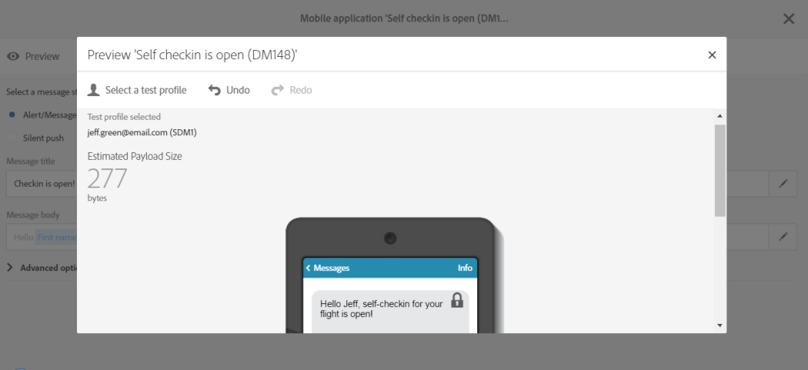

# 准备和发送推送通知{#preparing-and-sending-a-push-notification}

## 准备通知 {#preparing-the-notification}

使用Adobe Campaign创建推送通知的步骤如下：

1. 从 **[!UICONTROL Marketing activities]** 窗口， [创建新的营销活动](../../start/using/marketing-activities.md#creating-a-marketing-activity).

   请注意，也可以通过 [营销活动](../../start/using/marketing-activities.md#creating-a-marketing-activity) 或从Adobe Campaign [主页](../../start/using/interface-description.md#home-page).

   您还可以在工作流中使用推送通知投放活动。 此活动将在 [推送通知投放](../../automating/using/push-notification-delivery.md) 中。

1. 选择 **[!UICONTROL Push notification]**。
1. 选择模板。

   

   默认情况下，您可以选择以下两个模板之一：

   * **[!UICONTROL Send push to Campaign profiles]**:使用此模板可定向已订阅您移动应用程序并选择接收推送通知的Adobe Campaign CRM用户档案。 您可以插入 [个性化](../../designing/using/personalization.md#inserting-a-personalization-field) 字段，例如收件人的名字。
   * **[!UICONTROL Send push to app subscribers]**:使用此模板可向选择从您的应用程序接收通知的所有已知和匿名移动应用程序用户发送推送通知。 您可以使用从移动应用程序收集的数据对这些消息进行个性化设置。

   您还可以选择多语言模板。 有关更多信息，请参阅 [创建多语言推送通知](../../channels/using/creating-a-multilingual-push-notification.md).

   有关模板的更多信息，请参阅 [管理模板](../../start/using/marketing-activity-templates.md) 中。

1. 在 **[!UICONTROL Associate a Mobile App to a delivery]** 字段。

   请注意，下拉列表将同时显示SDK V4和Experience PlatformSDK应用程序。

   {{$include /help/_includes/channel-activities-name-id-fields.md}}

   

   您可以将推送通知链接到营销策划。 为此，请从已创建的营销活动中选择它。

1. 在以下屏幕中，您可以指定受众，例如订阅了特定移动应用程序的所有VIP客户。 有关此内容的更多信息，请参阅 [创建受众](../../audiences/using/creating-audiences.md).

   系统将根据在上一步中选择的移动应用程序自动筛选受众。

   

1. 您现在可以自定义推送通知。 首先，选择消息样式： **[!UICONTROL Alert/Message/Badge]** 或 **[!UICONTROL Silent push]**. 有关推送通知类型的介绍，请参阅 [关于推送通知](../../channels/using/about-push-notifications.md) 中。

   编辑推送通知的内容并定义高级选项。 请参阅 [自定义推送通知](../../channels/using/customizing-a-push-notification.md).

   

   此处配置的推送通知内容和选项将以有效负载的形式传递到您的移动设备应用程序。 有效载荷的详细结构在 [了解Campaign Standard推送通知有效载荷结构](../../administration/using/push-payload.md) 技术说明。

1. 单击 **[!UICONTROL Create]**。

   

1. 在发送通知之前，您可以使用测试用户档案对其进行测试，然后在发送投放之前准确查看收件人将看到的内容。 选择 **[!UICONTROL Audiences]** 从投放摘要中，单击 **[!UICONTROL Test profiles]** 选项卡。

   有关发送测试的更多信息，请参阅 [测试用户档案](../../sending/using/sending-proofs.md).

1. 选择测试用户档案并单击 **[!UICONTROL Preview]** 要显示通知，请执行以下操作：内容会使用测试用户档案数据进行个性化。
1. 检查不同设备上的推送通知布局：选择iPhone、Android手机、iPad或Android平板电脑以预览渲染。

   

1. 的 **[!UICONTROL Estimated Payload Size]** 是基于测试用户档案数据的估计值。 实际有效负载大小可能有所不同。 消息的限制为4KB。

   >[!CAUTION]
   >
   >如果负载大小超过4KB限制，则不会发送消息。

请注意，个性化数据会影响消息的大小。

## 发送通知 {#sending-the-notification}

可通过定义受众标准，将推送通知发送到Adobe Campaign中的选定受众。 在以下示例中，我们选定的受众由4个目标移动设备应用程序订阅者组成。

1. 单击 **[!UICONTROL Prepare]** 来计算目标并生成通知。

   

1. 成功完成准备工作后， **[!UICONTROL Deployment]** 窗口显示以下KPI: **[!UICONTROL Target]** 和 **[!UICONTROL To deliver]**. 请注意， **[!UICONTROL To deliver]** 计数小于 **[!UICONTROL Targeted]** 一个原因是排除项，可通过单击  按钮 **[!UICONTROL Deployment]** 窗口。

   

1. 在 **[!UICONTROL Exclusion logs]** 选项卡上，您可以找到从已发送目标中排除的所有消息列表以及排除该消息的原因。

   在此，我们可以看到我们的一个移动设备应用程序订阅者被排除，因为该地址在阻止列表上，而其他订阅者则因为该用户档案是重复的。

   

1. 单击 **[!UICONTROL Exclusion causes]** 选项卡来显示排除的消息量。

   

1. 您现在可以单击 **[!UICONTROL Confirm]** 开始发送推送通知。
1. 通过消息仪表板和日志，检查投放的状态。有关此内容的更多信息，请参阅 [发送消息](../../sending/using/confirming-the-send.md) 和 [投放日志](../../sending/using/monitoring-a-delivery.md#delivery-logs).

   在此示例中，消息仪表板显示Adobe Campaign尝试发送两个推送通知：一个已成功传送到设备，另一个失败。 要了解投放出现错误的原因，请单击  按钮 **[!UICONTROL Deployment]** 窗口。

   

1. 从 **[!UICONTROL Deployment]** 窗口，单击 **[!UICONTROL Sending logs]** 选项卡，访问已发送推送通知的列表及其状态。 对于此投放，成功发送了一条推送通知，而另一条由于设备令牌错误而失败。 随后，该订阅者将从进一步投阻止列表放添加到中。

   >[!NOTE]
   >
   >原因可能是下游到Adobe Campaign的故障。 如果apns和fcm等提供商出现故障，原因也将反映出这一点。 有关提供程序失败的更多信息，请参阅 [Apple](https://developer.apple.com/library/content/documentation/NetworkingInternet/Conceptual/RemoteNotificationsPG/CommunicatingwithAPNs.html) 和 [Android](https://firebase.google.com/docs/cloud-messaging/http-server-ref) 文档。

   

现在，您可以使用动态报告衡量推送通知投放的影响。

**相关主题：**

* [推送通知报告](../../reporting/using/push-notification-report.md)
* [在工作流中发送推送通知](../../automating/using/push-notification-delivery.md)
