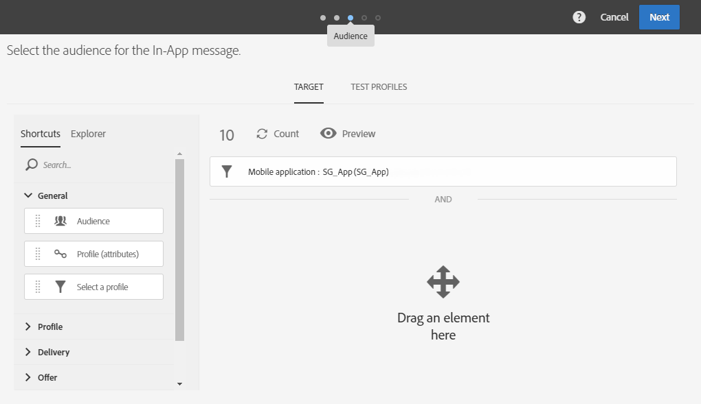

# 准备和发送应用程序内消息{#preparing-and-sending-an-in-app-message}

Adobe Campaign 提供两种类型的应用程序内消息：

* **[!UICONTROL Target users based on their Campaign profile (inAppProfile)]**：利用此消息类型，可定向订阅了您移动应用程序的 Adobe Campaign 用户档案（CRM 用户档案）。此消息类型可在 Adobe Campaign 中使用可用的用户档案属性进行个性化，但需要在 Mobile SDK 与 Campaign 的应用程序内消息传递服务之间进行安全握手，以确保包含个人和敏感信息的消息仅供授权用户使用。

   要在用户设备上下载此消息类型，Mobile SDK 必须发送关联字段，这些字段用于将移动用户档案连接到 Adobe Campaign 中的 CRM 用户档案。有关支持应用程序内消息所需 SDK API 的更多信息，请参阅本[页面](Https://aep-sdks.gitbook.io/docs/using-mobile-extensions/adobe-campaign-standard/adobe-campaign-standard-api-reference)。

* **[!UICONTROL Target all users of a Mobile app (inAppBroadcast)]**：利用此消息类型，可向移动应用程序的所有用户（当前或将来）发送消息，即使他们当前在 Adobe Campaign 中没有用户档案。因此，在自定义消息时不可能进行个性化，因为用户档案甚至可能不存在于 Adobe Campaign 中。
* **[!UICONTROL Target users based on their Mobile profile (inApp)]**：利用此消息类型，可定向在 Adobe Campaign 中具有移动用户档案的移动应用程序所有已知或匿名用户。此消息类型可仅使用非个人属性和非敏感属性进行个性化，并且不需要 Mobile SDK 与 Adobe Campaign 的应用程序内消息传递服务之间进行安全握手。

   有关如何处理个人和敏感数据的更多信息，请参阅[处理具有个人和敏感数据的移动用户档案字段](../../channels/using/about-in-app-messaging.md#handling-mobile-profile-fields-with-personal-and-sensitive-data)。

## 准备应用程序内消息 {#preparing-your-in-app-message}

>[!CAUTION]
>
>应用程序内个性化依赖于关联字段，该字段通常为 CRM ID 和/或移动应用程序登录 ID。与 Adobe Campaign 搭配使用时，您应自行负责保护此关联字段的安全。如果您无法保持关联字段的安全，则您的个性化信息可能很容易被攻击。如果您未能遵循安全关联字段构成、管理和保护实践，那么对于因未经授权的访问或使用任何用户档案数据而造成的损害，Adobe 概不负责。

使用 Adobe Campaign 创建独立应用程序内消息的步骤如下所示：

1. 从 Adobe Campaign 主页中，单击 **[!UICONTROL In-App messaging]** 卡。

   您还可以通过单击 **[!UICONTROL Create]** 按钮，从 **Marketing activities** 选项卡，创建应用程序内消息。

   请注意，还可以从营销策划、Adobe Campaign 主页或工作流创建应用程序内消息。

1. 选择 **In-App message**。

   

1. 根据您的受众定向需求，选择适当的模板。

   

   默认情况下，您可以选择以下三个现成模板之一：

   * **[!UICONTROL Target users based on their Campaign CRM profile (inAppProfile)]**
   * **[!UICONTROL Target all users of a Mobile app (inAppBroadcast)]**
   * **[!UICONTROL Target users based on their Mobile profile (inApp)]**

1. 输入应用程序内消息属性，然后在 **[!UICONTROL Associate a Mobile App to a delivery]** 字段中选择您的移动应用程序。

   如果在下拉列表中未看到任何应用程序，请确保您的移动应用程序位于 **已配置** 状态。 应用程序 **准备配置** 状态不会显示在列表中。 有关移动应用程序配置的更多信息，请参阅[此页面](../../administration/using/configuring-a-mobile-application.md#channel-specific-config)。

   

1. 选择为应用程序内消息定向的受众。您的受众会根据与此投放关联的移动应用程序进行预筛选。

   请注意，使用 **[!UICONTROL Broadcast an In-App message (inAppBroadcast)]** 无需此步骤，因为它已经定向了移动应用程序的所有用户。

   

1. 在 **[!UICONTROL Triggers]** 选项卡中，拖放触发消息的事件。通过选择触发器，您可以选择用户执行哪种操作会显示应用程序内消息。

   提供了四种类别事件:

   * **[!UICONTROL Mobile Application events]**：在您的移动应用程序中实现的自定义事件。

      有关事件创建的更多信息，请参阅[此页面](../../administration/using/configuring-a-mobile-application.md)。

   * **[!UICONTROL Life Cycle events]**：Adobe Mobile SDK 支持的现成生命周期事件。

      有关生命周期事件的更多信息，请参阅[本页面](https://experienceleague.adobe.com/docs/mobile-services/android/metrics.html)。

   * **[!UICONTROL Analytics Events]**：根据移动应用程序中的感知方式，支持以下三种类别：Adobe Analytics、上下文数据或视图状态。

      请注意，这些事件仅在您拥有 Adobe Analytics 许可证时才可用。

   * **[!UICONTROL Places]**：以下三个类别利用实时位置数据来提供与上下文相关的移动体验：Places 上下文数据、Places 自定义元数据或 Places 事件类型。

      有关 Adobe Places 的更多信息，请参阅 [Places 文档](https://experienceleague.adobe.com/docs/places/using/home.html)。
   

1. 如果您使用 **[!UICONTROL Analytics Events]**、Adobe Analytics和视图状态事件将根据在数据收集UI的Analytics扩展中配置的报表包自动填充，而上下文数据事件必须手动添加。

   请注意，这些事件仅在您拥有 Adobe Analytics 许可证时才可用。

   

1. 如果您使用 **[!UICONTROL Places]** 触发器，将根据在 Adobe Places 中创建的所有库及其兴趣点自动填充 Places 上下文数据、Places 自定义元数据或 Places 事件类型。

   请注意，此触发器将仅应用于数据收集UI中Places扩展中选定库中的目标点设备。 有关 Places 扩展及其安装方法的详细信息，请参阅此[文档](https://experienceleague.adobe.com/docs/places/using/places-ext-aep-sdks/places-extension/places-extension.html)。

1. 在 **[!UICONTROL Frequency & duration]** 选项卡中，选择触发器的频率、开始和结束日期、在一周中的哪一天以及在一天中的哪个时间激活应用程序内消息。

   

1. 编辑消息内容并定义高级选项请参阅[自定义应用程序内消息](../../channels/using/customizing-an-in-app-message.md)。

   

1. 单击 **[!UICONTROL Create]**。

您的应用程序内消息现已准备好发送到定向受众。

**相关主题：**

* [自定义应用程序内消息](../../channels/using/customizing-an-in-app-message.md)
* [应用程序内报告](../../reporting/using/in-app-report.md)
* [在工作流中发送应用程序内消息](../../automating/using/in-app-delivery.md)

## 预览应用程序内消息 {#previewing-the-in-app-message}

在发送应用程序内消息之前，您可以使用测试用户档案进行测试，以查看定向受众在收到投放时将看到的内容。

1. 单击 **[!UICONTROL Preview]** 按钮。

   

1. 单击 **[!UICONTROL Select a test profile]** 按钮并选择一个测试用户档案，以开始预览您的投放。有关测试用户档案的更多信息，请参阅[此章节](../../audiences/using/managing-test-profiles.md)。
1. 在 Android、iPhone 手机甚至平板电脑等不同设备上查看您的消息。您还可以检查个性化字段是否可以检索正确的数据。

   

1. 现在，您可以发送消息并通过投放报告衡量其影响。

## 发送应用程序内消息 {#sending-your-in-app-message}

您完成准备投放并执行批准步骤后，即可发送消息。

1. 单击 **[!UICONTROL Prepare]** 以计算目标并生成消息。

   

1. 成功完成准备工作后，**部署**&#x200B;窗口会显示以下 KPI：**Target** 和 **To deliver**。

   您可以单击 ，打开 Deployment 窗口以查看投放中潜在排除或错误。

   

1. 单击 **[!UICONTROL Confirm]** 以开始发送应用程序内消息。

   

1. 通过消息仪表板和日志，检查投放的状态。有关更多信息，请参阅此](../../sending/using/monitoring-a-delivery.md)章节[。

   **[!UICONTROL Delivered]** 和 **[!UICONTROL Sent]** KPI 计数基于成功从 Campaign 发送到消息投放服务的内容。请注意，这些 KPI 并不表示从消息投放服务成功接收或下载消息的移动设备计数。

   

1. 通过投放报告衡量应用程序内消息的影响。有关报告的更多信息，请参考[此章节](../../reporting/using/in-app-report.md)。

1. 发送应用程序内消息后，您可以选择停用投放。 例如，如果您要停止特定投放，或要使用相同触发器运行新投放，则此操作会非常有用。

   单击 **[!UICONTROL Deactivate]** then **[!UICONTROL Ok]** 以启动停用请求。

   

1. 发送请求后，您的投放将被停用，并且不会发送任何其他消息。

   请注意，您的此投放报告仍将可访问。

   

**相关主题：**

* [应用程序内报告](../../reporting/using/in-app-report.md)
* [在工作流中发送应用程序内消息](../../automating/using/in-app-delivery.md)
