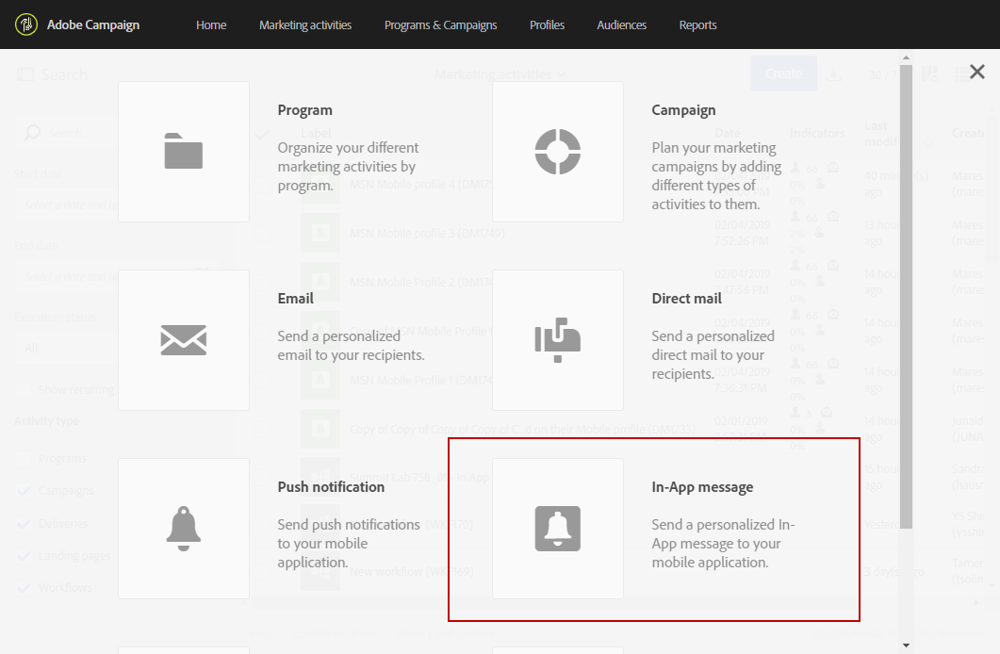
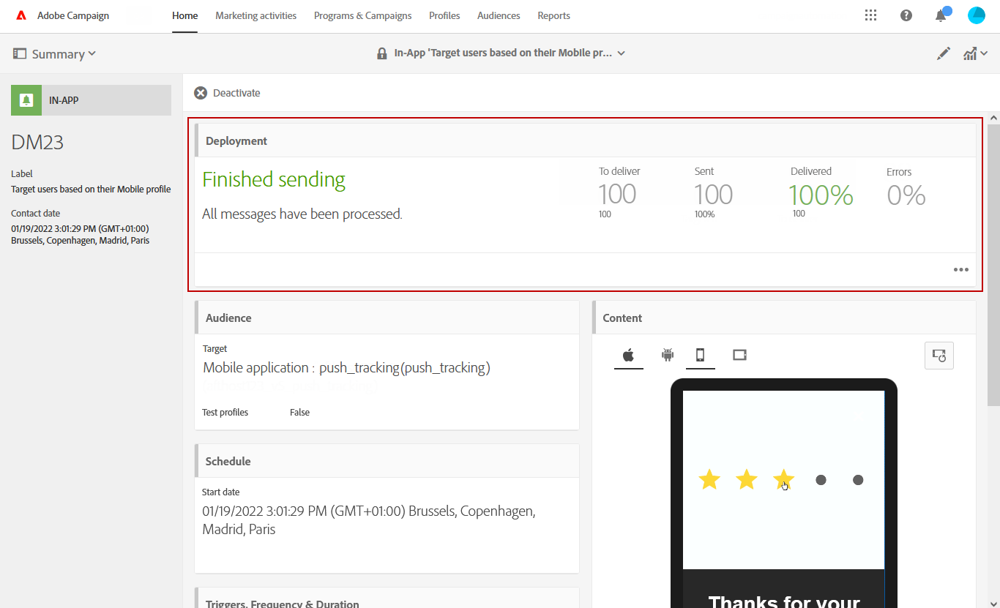

# 准备和发送应用程序内消息{#preparing-and-sending-an-in-app-message}

>[!NOTE]
>
>应用程序内个性化依赖于链接字段，该字段通常为CRM ID和／或移动应用程序登录ID。 与Adobe Campaign相关时，您应自行负责保护此链接字段。 如果您无法保持链接字段的安全，则您的个性化信息可能很脆弱。 如果您未能遵循安全链接字段构成、管理和保护实践，则Adobe不承担因未经授权的访问或使用任何用户档案数据而造成的损害的责任。

Adobe Campaign中提供三种类型的应用程序内消息：

* **[!UICONTROL Target users based on their Campaign profile (inAppProfile)]**: 此消息类型允许您目标订阅了您的移动应用程序的Adobe Campaign用户档案(CRM用户档案)。 此消息类型可在Adobe Campaign中以所有可用的用户档案属性进行个性化，但需要Mobile SDK与活动的应用程序内消息传递服务之间进行安全握手，以确保包含个人和敏感信息的消息仅由授权用户使用。

   要在用户设备上下载此消息类型，Mobile SDK必须发送链接字段，这些字段用于将移动用户档案连接到Adobe Campaign中的CRM用户档案。 有关支持应用程序内所需的SDK API的详细信息，请参阅本 [页](https://aep-sdks.gitbook.io/docs/using-mobile-extensions/adobe-campaign-standard/adobe-campaign-standard-api-reference)。

* **[!UICONTROL Target all users of a Mobile app (inAppBroadcast)]**: 此消息类型允许您向移动应用程序的所有用户（当前或将来）发送消息，即使他们没有Adobe Campaign用户档案。 因此，在自定义消息时不可能进行个性化，因为用户档案中甚至不存在用户Adobe Campaign。
* **[!UICONTROL Target users based on their Mobile profile (inApp)]**: 此消息类型允许您目标具有移动用户档案的移动应用程序的所有已知或匿名用户。 此消息类型可仅使用非个人属性和非敏感属性进行个性化，并且不需要Mobile SDK与Adobe Campaign的应用程序内消息传递服务之间的安全握手。

   有关如何处理个人和敏感数据的更多信息，请参 [阅使用个人和敏感用户档案处理移动字段](#handling-mobile-profile-fields-with-personal-and-sensitive-data)。

## 使用个人和敏感数据处理移动用户档案字段 {#handling-mobile-profile-fields-with-personal-and-sensitive-data}

In Adobe Campaign, mobile profile attributes data sent from mobile device are stored in **[!UICONTROL Subscriptions to an application (appSubscriptionRcp)]** resource which allows you to define the data that you want to collect from your applications&#39; subscribers.

需要扩展此资源以收集您打算从移动设备发送到Adobe Campaign的数据。 要执行此操作，请参阅 [本页](../../developing/using/extending-the-subscriptions-to-an-application-resource.md) ，了解详细步骤。

为了更安全地实现应用程序内消息的个性化，需要相应地配置此资源中的移动配置文件字段。在您的 **[!UICONTROL Subscriptions to an application (appSubscriptionRcp)]**&#x200B;新移动用户档案字段创建时，请检查 **[!UICONTROL Personal and Sensitive]** 以使它们在应用程序内消息个性化期间不可用。

>[!NOTE]
>
>如果此表中已有具有自定义资源扩展的现有实施，我们建议您在将字段用于个性化应用程序内消息之前，对这些字段进行适当的标签。

配置和 **[!UICONTROL Subscriptions to an application]** 发布自定义资源后，您可以使用模板开始准备应用程序内 **[!UICONTROL Target users based on their Mobile profile (inApp)]** 投放。 只有非个人和非敏感字段才可从资源中 **[!UICONTROL Subscriptions to an application (appSubscriptionRcp)]** 进行个性化。

If you require personalization with **Personal and Sensitive** fields, we recommend using the **[!UICONTROL Target users based on their Campaign profile (inAppProfile)]** template which has additional security mechanism to ensure that your users&#39; PII data remains secure.

## 准备应用程序内消息 {#preparing-your-in-app-message}

创建具有Adobe Campaign的独立应用程序内消息的步骤有：

1. 从Adobe Campaign主页中，单 **[!UICONTROL In-App messaging]** 击卡。

   您还可以通过单击按钮从“营销活动 **”选项卡** ，创建应用程 **[!UICONTROL Create]** 序内。

   请注意，还可以从活动、Adobe Campaign主页或工作流中创建应用程序内消息。

1. 选择 **应用程序内消息**。

   

1. 根据您的受众定位需求选择适当的模板。

   

   默认情况下，您可以选择以下三个现成模板之一：

   * **[!UICONTROL Target users based on their Campaign CRM profile (inAppProfile)]**
   * **[!UICONTROL Target all users of a Mobile app (inAppBroadcast)]**
   * **[!UICONTROL Target users based on their Mobile profile (inApp)]**

1. 输入应用程序内消息属性，然后在字段中选择您的移动应用 **[!UICONTROL Associate a Mobile App to a delivery]** 程序。 请注意，如果未配置带有Adobe Campaign Standard的移动应用程序，该应用程序将不会显示在列表中。 有关移动应用程序配置的详细信息，请参 [阅此页](https://helpx.adobe.com/campaign/kb/configuring-app-sdk.html#ChannelspecificapplicationconfigurationinAdobeCampaign)。

   

1. 选择要为应用程序内消息目标的受众。 您的受众会根据与此投放关联的移动应用程序进行预过滤。

   请注意，此步骤不是移动应用程 **[!UICONTROL Broadcast an In-App message (inAppBroadcast)]** 序所需的，因为它目标了移动应用程序的所有用户。

   

1. 在选 **[!UICONTROL Triggers]** 项卡中，拖放将触发消息的事件。 通过选择触发器，您可以选择用户执行的操作，以显示应用程序内消息。

   提供四类别事件:

   * **[!UICONTROL Mobile Application events]**: 在您的移动应用程序中实现的自定义事件。

      有关事件创建的更多信息，请参 [阅此页](https://helpx.adobe.com/campaign/kb/configuring-app-sdk.html)。

   * **[!UICONTROL Life Cycle events]**: Adobe Mobile SDK支持的现成生命周期事件。

      有关生命周期事件的详细信息，请参 [阅本页](https://docs.adobe.com/content/help/en/mobile-services/android/metrics.html)。

   * **[!UICONTROL Analytics Events]**: 根据移动应用程序中所指导的内容，支持以下三种类别: AdobeAnalytics、上下文数据或视图状态。

      请注意，这些事件仅在您有AdobeAnalytics许可证时可用。

   * **[!UICONTROL Places]**: 以下三个类别利用实时位置数据来提供基于情境的移动体验： 放置上下文数据、放置自定义元数据或放置事件类型。

      有关Adobe Places的更多信息，请参阅Places [文档](https://placesdocs.com/)。
   

1. 如果您使用Adobe **[!UICONTROL Analytics Events]** Launch，将根据在Adobe Experience Platform启动中的Analytics扩展中配置的报表包自动填充Adobe Analytics和视图状态事件，而必须手动添加上下文数据事件。

   请注意，这些事件仅在您有AdobeAnalytics许可证时可用。

   

1. 如果您使用触 **[!UICONTROL Places]** 发器，将根据在Adobe Places中创建的所有库及其兴趣点自动填充“放置上下文事件类型”、“放置自定义元数据”或“放置位置”。

   请注意，此触发器将仅应用于Experience Platform Launch中“位置”扩展中所选库中的“感兴趣点”。 有关Places扩展及其安装方法的详细信息，请参阅本 [文档](https://docs.adobe.com/content/help/en/places/using/places-ext-aep-sdks/places-extension/places-extension.html)。

1. 在选 **[!UICONTROL Frequency & duration]** 项卡中，选择触发器的频率、开始和结束日期、星期的日期以及将激活应用程序内消息的一天的时间。

   

1. 编辑消息内容并定义高级选项。 See [Customizing an In-App message](https://helpx.adobe.com/campaign/standard/channels/using/customizing-a-push-notification.html).

   

1. 单击 **[!UICONTROL Create]**.

您的应用程序内消息现已准备好发送到目标受众。

**相关主题：**

* [自定义应用程序内消息](../../channels/using/customizing-an-in-app-message.md)
* [应用程序内报告](../../reporting/using/in-app-report.md)
* [在工作流中发送应用程序内消息](../../automating/using/in-app-delivery.md)

## 发送应用程序内消息 {#sending-your-in-app-message}

准备完投放并执行批准步骤后，即可发送消息。

1. 单击 **[!UICONTROL Prepare]** 以计算目标并生成消息。

   

1. 成功完成准备工作后，**部署**&#x200B;窗口会显示以下 KPI：**目标**&#x200B;和&#x200B;**要交付的内容**。

   您可以单击投放中的潜在排  除或错误按钮，检查“部署”窗口。

   

1. 单 **[!UICONTROL Confirm]** 击以开始发送应用程序内消息。

   

1. 通过消息投放和日志检查仪表板的状态。 For more on this, refer to this [section](../../sending/using/monitoring-a-delivery.md).

   **[!UICONTROL Delivered]** KPI **[!UICONTROL Sent]** 计数基于成功从活动发送到消息投放服务的内容。 请注意，这些KPI并不表示从消息投放服务成功接收或下载消息的移动设备计数。

   

1. 通过投放报告衡量您的应用程序内消息的影响。 For more on reporting, refer to [this section](../../reporting/using/in-app-report.md).

**相关主题：**

* [应用程序内报告](../../reporting/using/in-app-report.md)
* [在工作流中发送应用程序内消息](../../automating/using/in-app-delivery.md)

