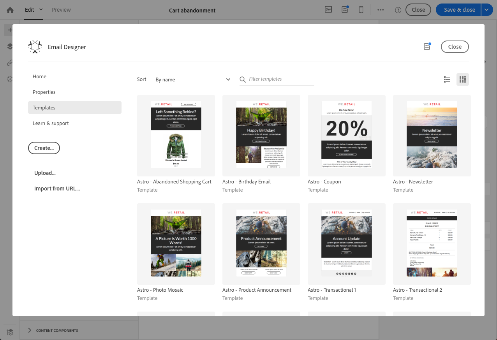
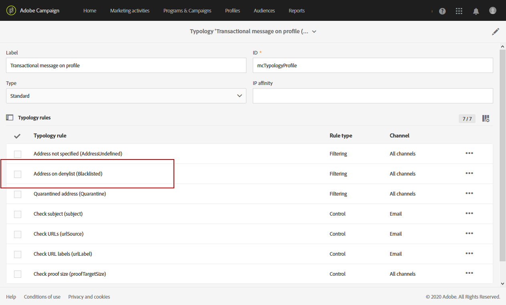

# 用户档案交易消息{#profile-transactional-messages}

您可以根据客户营销用户档案发送事务性消息，这允许您：

* 应用营销类型规则, **[!UICONTROL Address on block list]** 如 [疲劳规则](../../sending/using/fatigue-rules.md)。
* 在消息中包含退订链接。
* 将事务性消息添加到全局投放报告。
* 在客户旅程中利用事务性消息。

创建并发布事件后(根据上面的示例放弃购 [物车](../../channels/using/about-transactional-messaging.md#transactional-messaging-operating-principle) )，将自动创建相应的事务性消息。

配置事件以发送 [用户档案事务性消息部分中介绍了配置步骤](../../administration/using/configuring-transactional-messaging.md#use-case--configuring-an-event-to-send-a-transactional-message) 。

为了让事件触发发送事务性消息，您必须对消息进行个性化设置，然后测试并发布消息。

>[!NOTE]
>
>要访问事务性消息，您必须是安全组的一 **[!UICONTROL Administrators (all units)]** 部分。
>
>疲劳规则与用户档案事务性消息兼容。 请参 [阅疲劳规则](../../sending/using/fatigue-rules.md)。

## 发送用户档案事务性消息 {#sending-a-profile-transactional-message}

创建、个性化和发布用户档案事务性消息的步骤与创建事件事务性消息的步骤相同。 See [Event transactional messages](../../channels/using/event-transactional-messages.md).

差异如下所列。

1. 转至创建的事务性消息进行编辑。
1. 在事务性消息中，单击该 **[!UICONTROL Content]** 部分。 除了事务模板之外，您还可以选择任何电子邮件模板定位 **[!UICONTROL Profile]**。

   

1. 选择默认电子邮件模板。

   与所有营销电子邮件相似，它包含一个退订链接。

   

   此外，与基于实时事件的配置不同，您可以直接访问所有用户档案信息，以个性化您的信息。 请参 [阅插入个性化字段](../../designing/using/personalization.md#inserting-a-personalization-field)。

1. 保存更改并发布消息。 请参 [阅发布事务性消息](../../channels/using/event-transactional-messages.md#publishing-a-transactional-message)。

## 监视用户档案事务性消息投放 {#monitoring-a-profile-transactional-message-delivery}

发布消息并完成网站集成后，您可以监控投放。

1. 要视图消息投放日志，请单击块右下方的图 **[!UICONTROL Deployment]** 标。

   有关访问日志的详细信息，请参 [阅监视投放](../../sending/using/monitoring-a-delivery.md)。

1. 选择选 **[!UICONTROL Sending logs]** 项卡。 在列 **[!UICONTROL Status]** 中， **[!UICONTROL Sent]** 指示用户档案已选择加入。

   

1. 选择选 **[!UICONTROL Exclusions logs]** 项卡以视图已从消息目标（如块列表上的地址）中排除的收件人。

   

对于选择退出的用户档案, **[!UICONTROL Address on block list]** 类型规则将排除相应收件人。

此规则是特定类型学的一部分，该类型学应用于基于表的所有 **[!UICONTROL Profile]** 事务性消息。

**相关主题**:

* [站点集成](../../administration/using/configuring-transactional-messaging.md#integrating-the-triggering-of-the-event-in-a-website)
* [类型](../../sending/using/about-typology-rules.md)

