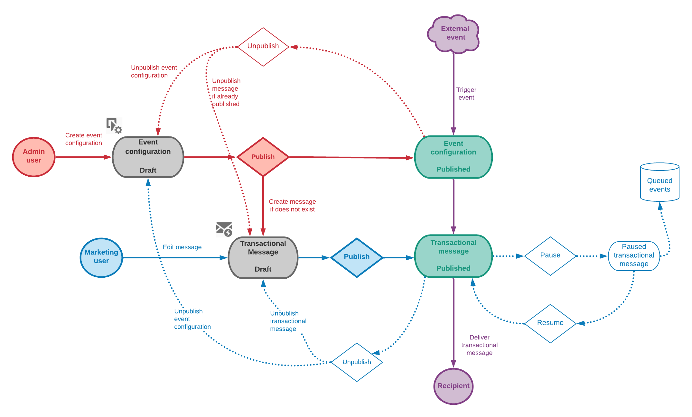

# 发布事务事件{#publishing-transactional-event}

完成[配置](../../channels/using/configuring-transactional-event.md)后，事件即可发布。 预览、发布、取消发布和删除事件的步骤如下所述。

>[!IMPORTANT]
>
>只有[职能管理员](../../administration/using/users-management.md#functional-administrators) <!--being part of the **[!UICONTROL All]** [organizational unit](../../administration/using/organizational-units.md) -->具有发布事件配置的适当权限。

[本节](../../channels/using/publishing-transactional-message.md)提供了一个图表，用于说明整个事务消息发布过程，包括发布和取消发布事件配置。

完成发布后：
* 相应的事务性消息会自动创建。 请参阅[编辑事务性消息](../../channels/using/editing-transactional-message.md)。
* 将部署网站开发人员将使用的API，并且现在可以发送事务事件。 请参阅[集成触发事件](../../channels/using/getting-started-with-transactional-msg.md#integrate-event-trigger)。

## 预览和发布事件{#previewing-and-publishing-the-event}

在能够使用事件之前，您必须预览并发布它。

1. 单击&#x200B;**[!UICONTROL API preview]**&#x200B;按钮，查看网站开发人员在发布前将使用的REST API的模拟。

   发布事件后，此按钮还允许您在生产中查看API的预览。 请参阅[集成触发事件](../../channels/using/getting-started-with-transactional-msg.md#integrate-event-trigger)。

   

   >[!NOTE]
   >
   >REST API根据所选渠道和所选定位维度而有所不同。 有关各种配置的详细信息，请参阅[本节](../../channels/using/configuring-transactional-event.md#transactional-event-specific-configurations)。

1. 单击&#x200B;**[!UICONTROL Publish]**&#x200B;以开始发布。

   

   将部署网站开发人员将使用的API，并且现在可以发送事务事件。

1. 您可以在相应的选项卡中视图发布日志。

   

   >[!IMPORTANT]
   >
   >每次修改事件时，必须再次单击&#x200B;**[!UICONTROL Publish]**&#x200B;以生成将由网站开发人员使用的更新的REST API。

   发布事件后，将自动创建链接到新事件的[事务性消息](../../channels/using/editing-transactional-message.md)。

1. 您可以通过左侧区域的链接直接访问此事务性消息。

   

   >[!NOTE]
   >
   >要使事件触发发送事务性消息，您必须修改并发布刚创建的消息。 请参阅[编辑](../../channels/using/editing-transactional-message.md)和[发布事务性消息](../../channels/using/publishing-transactional-message.md)部分。 您还必须[将此触发事件](../../channels/using/getting-started-with-transactional-msg.md#integrate-event-trigger)集成到您的网站中。

1. Adobe Campaign开始收到与此事件配置相关的事件后，可单击&#x200B;**[!UICONTROL History]**&#x200B;部分下的&#x200B;**[!UICONTROL Latest transactional events]**&#x200B;链接，访问第三方服务发送并由Adobe Campaign处理的最新事件。

事件（JSON格式）从最新到最旧列出。 此列表允许您检查事件的内容或状态等数据，以便进行控制和调试。

## 取消发布事件{#unpublishing-an-event}

通过&#x200B;**[!UICONTROL Unpublish]**&#x200B;按钮可以取消事件的发布，该发布从REST API中删除与您先前创建的事件对应的资源。

现在，即使是通过您的网站触发了事件，也不再发送相应的消息，也不会将消息存储在数据库中。

>[!NOTE]
>
>如果您已发布相应的事务性消息，则事务性消息发布也会被取消。 请参阅[取消发布事务性消息](../../channels/using/publishing-transactional-message.md#unpublishing-a-transactional-message)。

单击&#x200B;**[!UICONTROL Publish]**&#x200B;按钮以生成新的REST API。

<!--## Transactional messaging publication process {#transactional-messaging-pub-process}

The chart below illustrates the transactional messaging publication process.

For more on publishing, pausing and unpublishing a transactional message, see [this section](../../channels/using/publishing-transactional-message.md).-->

## 删除事件{#deleting-an-event}

事件取消发布后，或者事件尚未发布后，您可以从事件配置列表中删除该。 操作步骤：

1. 单击左上角的 **[!UICONTROL Adobe Campaign]** 徽标，然后选择 **[!UICONTROL Marketing plans]** > **[!UICONTROL Transactional messages]** > **[!UICONTROL Event configuration]**。
1. 将鼠标悬停在您选择的事件配置上，然后选择&#x200B;**[!UICONTROL Delete element]**&#x200B;按钮。

   

   >[!NOTE]
   >
   >确保事件配置具有&#x200B;**[!UICONTROL Draft]**&#x200B;状态，否则将无法删除它。 **[!UICONTROL Draft]**&#x200B;状态适用于尚未发布或已[未发布](#unpublishing-an-event)的事件。

1. 单击 **[!UICONTROL Confirm]** 按钮。

   

>[!IMPORTANT]
>
>删除已发布且已使用的事件配置也会删除相应的事务性消息及其发送和跟踪日志。
