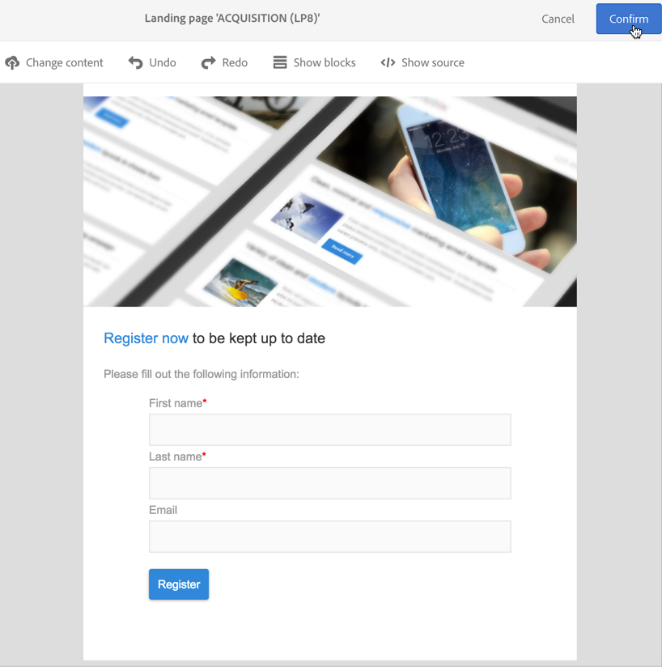

# 设置双重选择加入流程{#setting-up-a-double-opt-in-process}

## 关于双重选择加入{#about-double-opt-in}

双重选择加入机制属于发送电子邮件的最佳实践。该功能可保护平台，避免错误或无效的电子邮件地址、防护垃圾邮件程序，并防止可能的垃圾邮件投诉。

其原理是，在将访客作为“用户档案”存储到 Campaign 数据库中之前，先向访客发送一封电子邮件以确认其协议：访客填写在线登陆页面，然后会收到一封电子邮件，并必须单击其中的确认链接才能最终确定订阅。

要设置此功能，您需要：

1. 创建并发布登陆页面，以便访客注册和订阅。此登陆页面可从网站获取。填写并提交此登陆页的访客将存储在数据库中，但会添加到阻止列表中，以便在最终验证之前不接收任何通信(请参阅活动&lt;a1/阻止列表>中的“管理”)。
1. 自动创建并发送带确认链接的选择加入电子邮件。此电子邮件将定向提交登陆页面的群体。该电子邮件将基于允许定向“选择退出”用户档案的电子邮件模板。
1. 重定向至确认登陆页面。此最终登陆页面将提供一个确认按钮：访客必须单击该按钮。您可以设计一封欢迎电子邮件，在确认完成后发送，例如，在电子邮件中为新收件人提供特殊优惠。

必须按特定顺序在 Adobe Campaign 中设置这些步骤，才能正确启用所有参数。

## 第 1 步：创建确认登陆页面{#step-1--create-the-confirmation-landing-page}

要设置双重选择加入机制，首先要创建确认登录页：当访客单击确认电子邮件以进行注册时，将显示此页。

要创建并配置此登陆页面，您需要：

1. 根据 **[!UICONTROL Profile acquisition (acquisition)]** 模板设计[新登陆页面](../../channels/using/getting-started-with-landing-pages.md)。输入标签“**CONFIRMATION**”。

   如果您需要使用[服务](../../audiences/using/about-subscriptions.md)，还可以使用 **[!UICONTROL Subscription (sub)]** 模板。

1. 编辑登陆页面属性，在 **[!UICONTROL Access and loading]** 部分中，取消选中 **[!UICONTROL Authorize unidentified visitors]** 选项，并选择 **[!UICONTROL Preload visitor data]**（此选项不是强制选项）。

   

1. 在 **[!UICONTROL Job]** > **[!UICONTROL Additional data]** 部分中，单击 **[!UICONTROL Add an element]** 并输入以下上下文路径：

   /context/profile/blackList

   将值设置为 **false**，然后单击 **[!UICONTROL Add]**。

   

   为了能够发送电子邮件，此上阻止列表下文将删除“开启”字段。 我们稍后会看到第一个登陆页面之前已将确认前的此字段设置为 **true**，以防止向未确认的用户档案发送电子邮件。有关更多信息，请参阅[第 3 步：创建客户获取登陆页面](#step-3--create-the-acquisition-landing-page)。

1. 自定义登陆页面的内容：您可以显示个性化数据，例如将确认按钮的标签更改为“Click here to confirm my subscription”。

   

1. 调整确认页面的内容，以告知订阅者，他们现在已经注册。

   

1. [测试和发布](../../channels/using/testing-publishing-landing-page.md)登陆页面。

## 第 2 步：创建确认电子邮件{#step-2--create-the-confirmation-email}

创建确认登陆页面后，即可设计确认电子邮件：此电子邮件将自动发送给验证客户获取登陆页面的每位访客。此验证被视为事件，而电子邮件是事务型消息，链接到允许定向选择退出群体的特定分类规则。

创建这些元素的步骤如下所示。您需要先创建这些元素，然后再创建客户获取登陆页面本身，因为其中将会应用此电子邮件模板。

### 创建事件{#create-the-event}

确认电子邮件属于[事务型消息](../../channels/using/getting-started-with-transactional-msg.md)，因为它对表单验证事件作出反应。您必须先创建事件，然后再创建事务型消息模板。

1. 从 Adobe Campaign 徽标访问 **[!UICONTROL Marketing plans]** > **[!UICONTROL Transactional messages]** > **[!UICONTROL Event configuration]** 菜单以创建事件，然后输入标签“**CONFIRM**”。
1. 选择 **[!UICONTROL Profile]** 定向维度并单击 **[!UICONTROL Create]**。

   

1. 在 **[!UICONTROL Fields]** 部分中，单击 **[!UICONTROL Create element]** 并在数据结构中添加 **[!UICONTROL email]** 以启用协调。
1. 在 **[!UICONTROL Enrichment]** 部分中，单击 **[!UICONTROL Create element]** 并选择 **[!UICONTROL Profile]** 目标资源。然后，您可以在 **[!UICONTROL Join definition]** 部分映射 **[!UICONTROL email]** 字段，或任何其他复合协调键值，具体取决于您的需要。

   

   如果您需要使用服务，请添加 **[!UICONTROL Service]** 目标资源并映射 **[!UICONTROL serviceName]** 字段。有关更多信息，请参见 。

1. 在下拉列表中选择 **[!UICONTROL Profile]** 作为 **[!UICONTROL Targeting enrichment]**。
1. 单击 **[!UICONTROL Publish]** 以发布事件。

事件准备就绪。现在，您可以设计电子邮件模板。此模板必须包含指向之前创建的 **CONFIRMATION** 登陆页面的链接。有关更多信息，请参阅[设计确认消息](#design-the-confirmation-message)。

### 创建分类{#create-the-typology-rule}

您需要通过复制现成的分类创建特定的[分类](../../sending/using/about-typology-rules.md)。该类型学允许向尚未确认其同意且仍处于用户档案状态的发送阻止列表消息。 默认情况下，排版会排除退出(即阻止列表)用户档案。 要创建此分类，请执行以下步骤：

1. 通过 Adobe Campaign 徽标，选择 **[!UICONTROL Administration]** > **[!UICONTROL Channels]** > **[!UICONTROL Typologies]** 并单击 **[!UICONTROL Typologies]**。
1. 复制现成的分类&#x200B;**[!UICONTROL Transactional message on profile (mcTypologyProfile)]**。
1. 确认复制后，编辑新的分类并输入标签 **TYPOLOGY_PROFILE**。
1. 删除&#x200B;**Address on 阻止列表 On Pack**&#x200B;规则。
1. 单击 **[!UICONTROL Save]**。

现在，可将此分类与确认电子邮件关联。

### 设计确认消息{#design-the-confirmation-message}

确认电子邮件是基于之前所创建事件的事务型消息。请按照以下步骤创建此消息：

1. 通过 Adobe Campaign 徽标，选择 **[!UICONTROL Marketing plans]** > **[!UICONTROL Transactional messages]** 并单击 **[!UICONTROL Transactional messages]**。
1. 编辑 **CONFIRM** 电子邮件模板并对其进行个性化。您可以上传现有内容，也可以使用现成模板。
1. 添加指向 **CONFIRMATION** 登陆页免的链接，然后单击 **[!UICONTROL Confirm]** 以保存修改。

   

1. 编辑电子邮件模板的属性。在 **[!UICONTROL Advanced parameters]** > **[!UICONTROL Preparation]** 部分中，选择之前创建的 **TYPOLOGY_PROFILE** 分类。
1. 保存并发布事务型消息。

## 第 3 步：创建客户获取登陆页面{#step-3--create-the-acquisition-landing-page}

您必须创建初始客户获取登陆页面：此选择加入表单将发布在您的网站上。

要创建并配置此登陆页面，您需要：

1. 根据 **[!UICONTROL Profile acquisition (acquisition)]** 模板设计[新登陆页面](../../channels/using/getting-started-with-landing-pages.md)。输入标签“**ACQUISITION**”。
1. 编辑登陆页面属性：在 **[!UICONTROL Job]** > **[!UICONTROL Additional data]** 部分中，单击 **[!UICONTROL Add an element]**，输入以下上下文路径：

   /context/用户档案/blackList

   并将值设置为 **true**。

   这是强制添加到阻止列表并避免向未确认其协议的访客发送消息的必备选项。 确认后，“CONFIRMATION”登陆页面的验证会将此字段设置为 **false**。有关更多信息，请参阅[第 1 步：创建客户获取登陆页面](#step-1--create-the-confirmation-landing-page)。

1. 在 **[!UICONTROL Job]** > **[!UICONTROL Specific actions]** 部分，选择选项 **[!UICONTROL Start sending messages]**。
1. 在关联的下拉列表中，选择之前创建的 **CONFIRM** 事务型消息模板。

   

1. 根据您的品牌和需要获取的数据，自定义登录页的内容。您可以显示个性化数据，例如，将确认按钮的标签更改为 **Confirm my subscription**。

   

1. 自定义确认页面，以告知订阅者，他们需要验证订阅。

   

1. [测试和发布](../../channels/using/testing-publishing-landing-page.md)登陆页面。

双重选择加入机制现已配置完成。您可以从发布此 **[!UICONTROL ACQUISITION]** 登陆页面开始，从头到尾运行和测试整个过程。此 URL 会显示在登陆页面的仪表板中。
