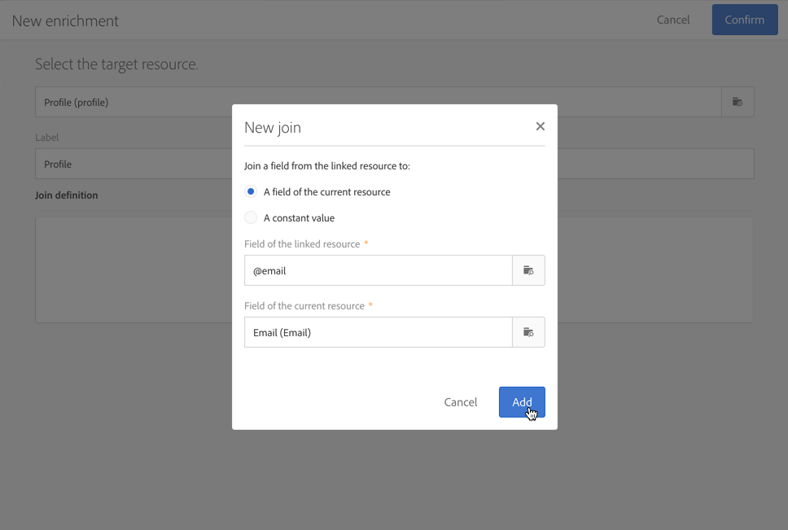

# Setting up a double opt-in process{#setting-up-a-double-opt-in-process}

## About double opt-in {#about-double-opt-in}

在发送电子邮件时，双击机制是最佳实践。它可以保护平台免受错误或无效的电子邮件地址、垃圾邮件的侵害，并防止垃圾邮件投诉。

其原则是发送电子邮件以确认访客协议，然后将其作为“配置文件”存储到Campaign数据库中：访客填写一个在线登录页面，然后收到一封电子邮件，并必须单击确认链接以完成其订阅。

要设置此设置，您需要：

1. 创建和发布登陆页面，以便访客可以注册和订阅。此登陆页面可从网站获得。Visitors who fill in and submit this landing page will be stored in the database but ‘blacklisted', in order not to receive any communication before the final validation (see [Managing blacklisting in Campaign](../../audiences/using/about-opt-in-and-opt-out-in-campaign.md)).
1. 创建并发送自动参与电子邮件，其中含有确认链接。此电子邮件将锁定提交登陆页面的人群。它将基于允许“选择退出”配置文件的电子邮件模板。
1. 重定向到确认登陆页面。此最终登陆页面将给出确认按钮：访客必须单击它。您可以在确认完成后设计欢迎电子邮件，例如在电子邮件中为新收件人添加一个特殊选件。

必须按照特定的顺序在Adobe Campaign中设置这些步骤，才能正确启用所有参数。

## Step 1: Create the confirmation landing page {#step-1--create-the-confirmation-landing-page}

设置双击机制的过程始于确认登陆页面的创建：当访客单击确认电子邮件以注册时，将显示此页面。

要创建和配置此登陆页面，您需要：

1. Design a [new landing page](../../channels/using/about-landing-pages.md) based on the **[!UICONTROL Profile acquisition (acquisition)]** template. Enter the label '**CONFIRMATION**'.

   If you need to use [services](../../audiences/using/about-subscriptions.md), you can also use the **[!UICONTROL Subscription (sub)]** template.

1. Edit the landing page properties and under the **[!UICONTROL Access and loading]** section, unselect the option **[!UICONTROL Authorize unidentified visitors]**, select **[!UICONTROL Preload visitor data]** (this one is not mandatory).

   

1. In the **[!UICONTROL Job]** &gt; **[!UICONTROL Additional data]** section, click **[!UICONTROL Add an element]** and enter the following context path:

   /context/profile/blackList

   Set the value to **false** and click **[!UICONTROL Add]**.

   

   此上下文删除黑名单字段，以便能够发送电子邮件。We will see later that the first landing page was setting this field to **true** before confirmation, to prevent from sending emails to non-confirmed profiles. For more on this, see [Step 3: Create the acquisition landing page](../../channels/using/setting-up-a-double-opt-in-process.md#step-3--create-the-acquisition-landing-page).

1. 自定义登陆页面的内容：您可以显示个性化数据，并将确认按钮的标签更改为“单击此处确认我的订阅”。

   

1. 调整确认页面的内容以通知用户已注册。

   

1. [测试和发布](../../channels/using/sharing-a-landing-page.md) 登陆页面。

## Step 2: Create the confirmation email {#step-2--create-the-confirmation-email}

创建确认登陆页面后，您可以设计确认电子邮件：此电子邮件将自动发送给验证购置登陆页面的每位访客。此验证被视为事件，电子邮件是一封交易消息，链接到特定类型的规则，该规则允许选择退出人群。

创建这些元素的步骤如下所述。在创建赢取登陆页面之前，您需要按照其需要进行跟进，因为该电子邮件模板将在其中引用。

### Create the event {#create-the-event}

The confirmation email is a [transactional message](../../channels/using/about-transactional-messaging.md) as it reacts to an event: the validation of the form. 您必须先创建活动，然后创建交易消息的模板。

1. Create an event, from the **[!UICONTROL Marketing plans]** &gt; **[!UICONTROL Transactional messages]** &gt; **[!UICONTROL Event configuration]** menu, accessible from the Adobe Campaign logo, and enter the label '**CONFIRM**'.
1. Select the **[!UICONTROL Profile]** targeting dimension and click **[!UICONTROL Create]**.

   

1. In the **[!UICONTROL Fields]** section, click **[!UICONTROL Create element]** and add the **[!UICONTROL email]** in the data structure to enable reconciliation.
1. In the **[!UICONTROL Enrichment]** section, click **[!UICONTROL Create element]** and select the target resource **[!UICONTROL Profile]**. You can then map on the **[!UICONTROL email]** in the **[!UICONTROL Join definition]** section, or any other composite reconciliation key, depending on your needs.

   

   If you need to use services, you can also add the **[!UICONTROL serviceName]**.

1. Select **[!UICONTROL Profile]** as the **[!UICONTROL Targeting enrichment]** in the dropdown list.
1. Click **[!UICONTROL Publish]** to publish the event.

活动已准备就绪。您现在可以设计电子邮件模板。This template must include a link to the **CONFIRMATION** landing page created before. For more on this, see [Design the confirmation message](../../channels/using/setting-up-a-double-opt-in-process.md#design-the-confirmation-message).

### Create the typology rule {#create-the-typology-rule}

You need to create a specific [typology rule](../../administration/using/about-typology-rules.md), by duplicating an out-of-box one. 此规则允许向尚未确认其协议且仍列入黑名单的配置文件发送消息。默认情况下，字型规则排除退出(即列入黑名单)配置文件。要创建此字型规则，请执行以下步骤：

1. From the Adobe Campaign logo, select **[!UICONTROL Administration]** &gt; **[!UICONTROL Channels]** &gt; **[!UICONTROL Typologies]** and click **[!UICONTROL Typologies]**.
1. Duplicate the out-of-box typology **[!UICONTROL Transactional message on profile (mcTypologyProfile)]**.
1. Once duplication confirmed, edit the new typology and enter the label **TYPOLOGY_PROFILE**.
1. Remove the **blacklisted address** rule.
1. Click **[!UICONTROL Save]**.

此字型现在可与确认电子邮件关联。

### Design the confirmation message {#design-the-confirmation-message}

确认电子邮件是基于之前创建的活动的交易消息。请按照以下步骤创建此消息：

1. From the Adobe Campaign logo, select **[!UICONTROL Marketing plans]** &gt; **[!UICONTROL Transactional messages]** and click **[!UICONTROL Transactional messages]**.
1. Edit the **CONFIRM** email template and personalize it. 您可以上传现有内容或使用现成模板。
1. Add a link to the **CONFIRMATION** landing page, and click **[!UICONTROL Confirm]** to save modifications.

   

1. 编辑电子邮件模板属性。In the **[!UICONTROL Advanced parameters]** &gt; **[!UICONTROL Preparation]** section, select the **TYPOLOGY_PROFILE** typology created before.
1. 保存并发布交易消息。

## Step 3: Create the acquisition landing page {#step-3--create-the-acquisition-landing-page}

您必须创建初始赢取登陆页面：此插件表单将发布到您的网站上。

要创建和配置此登陆页面，您需要：

1. Design a [new landing page](../../channels/using/about-landing-pages.md) based on the **[!UICONTROL Profile acquisition (acquisition)]** template. Enter the label '**ACQUISITION**'.
1. Edit the landing page properties: in the **[!UICONTROL Job]** &gt; **[!UICONTROL Additional data]** section, click **[!UICONTROL Add an element]** and enter the following context path:

   /context/profile/blackList

   and set the value to **true**.

   强制列入黑名单并避免向未确认其协议的访客发送消息。The validation of the CONFIRMATION landing page will set this field to **false** after confirmation. For more on this, see [Step 1: Create the confirmation landing page](../../channels/using/setting-up-a-double-opt-in-process.md#step-1--create-the-confirmation-landing-page).

1. In the **[!UICONTROL Job]** &gt; **[!UICONTROL Specific actions]** section, select the option **[!UICONTROL Start sending messages]**.
1. In the associated drop-down list, choose the **CONFIRM** transactional message template you created.

   

1. 根据您的品牌和您需要获取的数据自定义登陆页面的内容。You can display personalized data and change the label of the confirmation button to **Confirm my subscription** for example.

   

1. 自定义确认页面，告知新订户他需要验证订阅。

   

1. [测试和发布](../../channels/using/sharing-a-landing-page.md) 登陆页面。

现在已配置双击机制。You can run and test the procedure from end to end, starting from the public URL of this **[!UICONTROL ACQUISITION]** landing page. 此URL显示在登陆页面功能板中。
