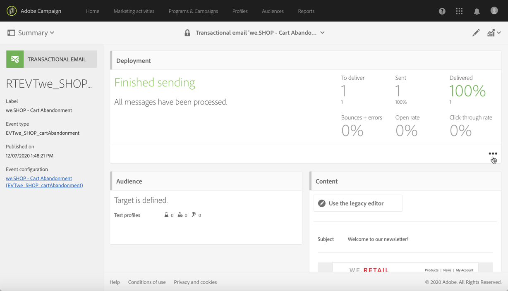

# 事务消息执行和监视{#transactional-messaging-execution}

## 事务性消息执行投放{#transactional-message-execution-delivery}

发布消息并完成网站集成后，当触发事件时，该消息将分配给执行投放。

**执行投放**&#x200B;是每月为每个事务性消息创建一次的不可操作且非功能的技术消息，每次编辑并再次发布事务性消息。

**相关主题**：
* [发布事务型消息](../../channels/using/publishing-transactional-message.md#publishing-a-transactional-message)
* [集成事件触发](../../channels/using/getting-started-with-transactional-msg.md#integrate-event-trigger)

## 事务消息重试进程{#transactional-message-retry-process}

临时未投放的事务型消息将会自动重试，一直执行到投放过期为止。有关投放持续时间的更多信息，请参阅[有效性参数](../../administration/using/configuring-email-channel.md#validity-period-parameters)。

发送事务型消息失败时，可使用以下两个重试系统：

* 在事务型消息传递级别，如果将事务型消息放在分配给执行投放的事件之前，有可能会失败，这意味着，应放在事件接收和投放准备之间。请参阅[事件处理重试流程](#event-processing-retry-process)。
* 在发送流程级别，一旦将事件分配给执行投放，则事务型消息可能因临时错误而失败。请参阅[消息发送重试流程](#message-sending-retry-process)。

### 事件处理重试流程{#event-processing-retry-process}

当事件被触发时，它被分配给执行投放。 如果无法将事件分配给执行投放，则延迟事件处理。随后执行重试，直到将其分配给新的执行投放为止。

>[!NOTE]
>
>延迟的事件不会显示在事务型消息发送日志中，因为并未将其分配给执行投放。

例如，无法将事件分配给执行投放，因为其内容不正确、存在访问权限或品牌策略问题，在应用类型规则时检测到错误等。在这种情况下，您可以暂停消息，编辑该消息以修复问题，然后再次发布。然后，重试系统会将其分配给新的执行投放。

### 消息发送重试流程{#message-sending-retry-process}

一旦将事件分配给执行投放，事务型消息就可能因临时错误而失败，例如，如果收件人邮箱已满。有关更多信息，请参阅[投放临时失败后重试](../../sending/using/understanding-delivery-failures.md#retries-after-a-delivery-temporary-failure)。

>[!NOTE]
>
>将事件分配给执行投放后，该执行投放的发送日志中会显示该事件，并且仅在此时显示。失败的投放显示在事务性消息发送日志的&#x200B;**[!UICONTROL Execution list]**&#x200B;选项卡中。

### 重试进程限制{#limitations}

**发送日志更新**

在重试流程中，不会立即更新新执行投放的发送日志（通过计划的工作流执行的更新）。这意味着即使新的执行投放已经处理了事务型事件，该消息仍然处于 **[!UICONTROL Pending]** 状态。

**失败的执行投放**

无法停止执行投放。但是，如果当前执行投放失败，则会在收到新事件后立即创建新执行投放，所有新事件都由此新执行投放进行处理。失败的执行投放不会处理任何新事件。

如果已分配给执行投放的某些事件已作为重试过程的一部分被推迟，并且如果该执行投放失败，则重试系统不会将延迟的事件分配给新的执行投放，这意味着这些事件丢失。 检查[投放日志](#monitoring-transactional-message-delivery)以查看可能已受影响的收件人。

## 监视事务性消息{#monitoring-transactional-message-delivery}

要监视事务性消息，您需要访问相应的[执行投放](#transactional-message-execution-delivery)。

1. 要查看消息投放日志，请单击 **[!UICONTROL Deployment]** 块右下方的图标。

   

1. 单击&#x200B;**[!UICONTROL Execution list]**&#x200B;选项卡。

   

1. 选择您选择的执行投放。

   

1. 再次单击&#x200B;**[!UICONTROL Deployment]**&#x200B;块右下方的图标。

   

   对于每个执行投放，您可以咨询投放日志，就像对标准投放一样。 有关访问和使用日志的详细信息，请参阅[监视投放](../../sending/using/monitoring-a-delivery.md)。

### 基于用户档案的事务性消息特异性{#profile-transactional-message-monitoring}

对于基于用户档案的事务性消息，您可以监视以下用户档案信息。

选择 **[!UICONTROL Sending logs]** 选项卡。在 **[!UICONTROL Status]** 列中，**[!UICONTROL Sent]** 表示用户档案已选择加入。

选择&#x200B;**[!UICONTROL Exclusions logs]**&#x200B;选项卡以视图已被排除在消息目标之外的收件人，如地址阻止列表。

对于选择退出的任何用户档案，**[!UICONTROL Address on denylist]** 分类规则将排除对应的收件人。

此规则属于特定分类的一部分，该特定分类会基于 **[!UICONTROL Profile]** 表应用到所有事务型消息。

**相关主题**：

* [关于分类和分类规则](../../sending/using/about-typology-rules.md)
* [监控投放](../../sending/using/monitoring-a-delivery.md)
