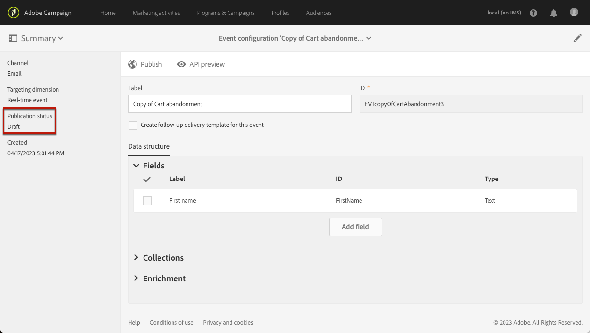
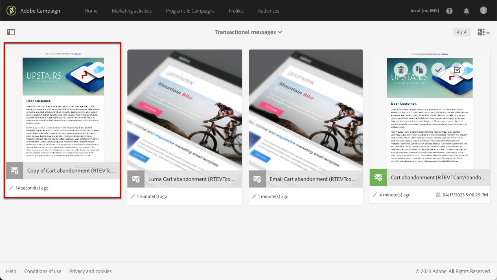
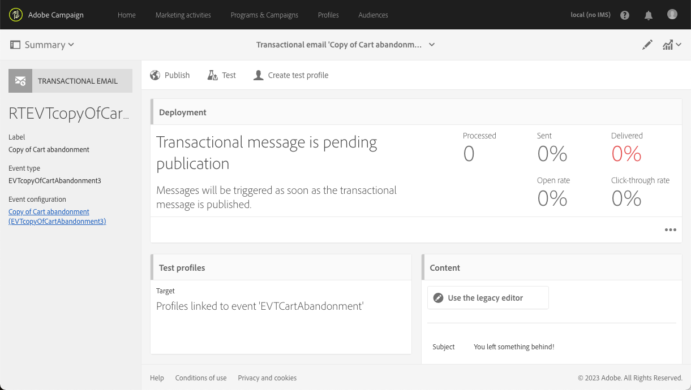

# 事务性事件改进 {#transactional-event-improvements}

>[!AVAILABILITY]
>
>这些功能目前仅适用于一组组织（限量发布）。 有关更多信息，请与您的 Adobe 代表联系。

目前，在Adobe Campaign Standard中，没有Administrator安全组的用户无法访问、创建或发布事务型事件，从而导致需要配置和发布事件但缺少Administrator权限的业务用户出现问题。 此外，也不可能重复事务性事件。

我们已对事务性消息传递访问控制实施了以下改进：

* 已添加名为&#x200B;**MC用户**&#x200B;的新&#x200B;**[!UICONTROL Role]**，以允许非管理员用户管理事务性事件配置。 **MC用户**&#x200B;角色授予这些用户访问、创建、发布和取消发布事务性事件和消息的能力。

* 执行投放（即每次再次编辑和发布事务性消息时创建的技术消息，或默认为每月创建一次）现在设置为创建事件的用户所属的安全组的&#x200B;**[!UICONTROL Organizational unit]**，而不是限制到&#x200B;**消息中心代理(mcExec)**&#x200B;安全组的&#x200B;**[!UICONTROL Organizational unit]**。

* **管理员**&#x200B;现在可以复制已发布的事务性事件，以及具有&#x200B;**MC用户**&#x200B;角色的用户，前提是这些用户与创建该事件的用户处于同一&#x200B;**组织单位**&#x200B;层次结构中。

## 分配MC用户角色 {#assign-role}

要将&#x200B;**MC用户**&#x200B;角色分配给您的安全组，请执行以下操作：

1. 创建新的&#x200B;**[!UICONTROL Security group]**&#x200B;或更新现有的一个。 [了解详情](../../administration/using/managing-groups-and-users.md)。

1. 单击&#x200B;**[!UICONTROL Create element]**&#x200B;将角色分配给您的安全组。

   

1. 选择MC用户&#x200B;**[!UICONTROL Role]**&#x200B;并单击&#x200B;**[!UICONTROL Confirm]**。

   >[!IMPORTANT]
   >
   > 在将MC用户角色分配给操作员时请务必谨慎，因为这样操作员就可以取消发布事件。

   

1. 配置完毕后，单击&#x200B;**[!UICONTROL Save]**。

链接到此&#x200B;**[!UICONTROL Security group]**&#x200B;的用户现在可以访问、创建和发布事务性事件和消息。

## 分配MC用户安全组 {#assign-group}

1. 在Admin Console中，选择&#x200B;**产品**&#x200B;选项卡。

1. 选择&#x200B;**Adobe Campaign Standard**，然后选择您的实例。

1. 从&#x200B;**产品配置文件**&#x200B;列表中，选择&#x200B;**MC用户**&#x200B;组。

1. 单击&#x200B;**添加用户**，然后输入要添加到此产品配置文件的配置文件的名称、用户组或电子邮件地址。

1. 添加后，单击&#x200B;**保存**。

添加到此&#x200B;**[!UICONTROL Security group]**&#x200B;的用户现在可以访问、创建和发布事务性事件和消息。

## 复制事务性事件 {#duplicate-transactional-events}

如果事件已&#x200B;**发布**，具有&#x200B;**管理员**&#x200B;安全组<!--([Functional administrators](../../administration/using/users-management.md#functional-administrators)?)-->的用户现在可以复制事件配置。

此外，具有&#x200B;**MC用户**&#x200B;角色的非管理员用户现在可以访问事件配置，但其复制权限由其所属的&#x200B;**组织单位**&#x200B;决定。 如果当前用户和创建事件的用户属于同一组织单位层次结构，则允许重复。

例如，如果属于“France Sales”组织单位的用户创建了事件配置：

* 组织单位为“Paris Sales”的其他用户将能够复制此事件，因为“Paris Sales”是“France Sales”组织单位的一部分。

* 但是，组织单位为“旧金山销售额”的用户将无法这样做，因为“旧金山销售额”位于“美国销售额”组织单位下，该组织单位与“法国销售额”组织单位不同。

要复制事件配置，请执行以下步骤。

1. 单击左上角的&#x200B;**Adobe**&#x200B;徽标，然后选择&#x200B;**[!UICONTROL Marketing plans]** > **[!UICONTROL Transactional messages]** > **[!UICONTROL Event configuration]**。

1. 将鼠标悬停在您选择的已发布事件配置上，然后选择&#x200B;**[!UICONTROL Duplicate element]**&#x200B;按钮。

   

   >[!CAUTION]
   >
   >无法复制未发布的事件配置。 [了解详情](publishing-transactional-event.md)

1. 系统会自动显示重复的事件。 它包含与为原始事件定义的配置相同的配置，但具有&#x200B;**[!UICONTROL Draft]**&#x200B;状态。

   

1. 将自动创建相应的事务型消息。 要访问它，请转到&#x200B;**[!UICONTROL Transactional messages]** > **[!UICONTROL Transactional messages]**。

   

1. 打开新复制的邮件。 它包含您为原始消息定义的相同设计，但具有&#x200B;**[!UICONTROL Draft]**&#x200B;状态，即使原始事务型消息已发布。

   

1. 您现在可以编辑此消息并使其个性化。 请参阅[编辑事务型消息](../../channels/using/editing-transactional-message.md)。

## 影响 {#impacts}

下表概述了这些改进的影响：

| 对象 | 在此更改之前 | 进行此更改后 |
|:-: | :--: | :-:|
| 事务性事件 | 只有&#x200B;**管理员**&#x200B;安全组中的用户可以创建和发布事件。 | **MC用户**&#x200B;角色允许用户创建和发布事件。 |
| 交易型消息 | 事务性消息设置为&#x200B;**消息中心代理(mcExec)**&#x200B;安全组的&#x200B;**组织单位**。 | 事务型消息设置为创建事务型事件/消息的用户所属安全组的&#x200B;**组织单位**。 |
| 执行投放 | 执行投放设置为&#x200B;**消息中心代理(mcExec)**&#x200B;安全组的&#x200B;**组织单位**。 | 执行投放设置为创建事务性事件/消息的用户所属的安全组的&#x200B;**组织单位**。 |
| 已发布的事务性事件 | 任何用户都不能重复。 | <ul><li>具有&#x200B;**管理员**&#x200B;安全组的用户可以复制已发布的事件。</li> <li>具有&#x200B;**MC用户**&#x200B;角色的用户可以复制已发布的事件，前提是它们与创建事件的用户处于相同的&#x200B;**组织单位**&#x200B;层次结构中。</li></ul> |

<!--Transactional Message Templates| Transactional Message templates are set to the Organizational unit **All**. | Transaction Message Template will be set to the **Organizational unit** of the security group to which the user creating the message template belongs.-->