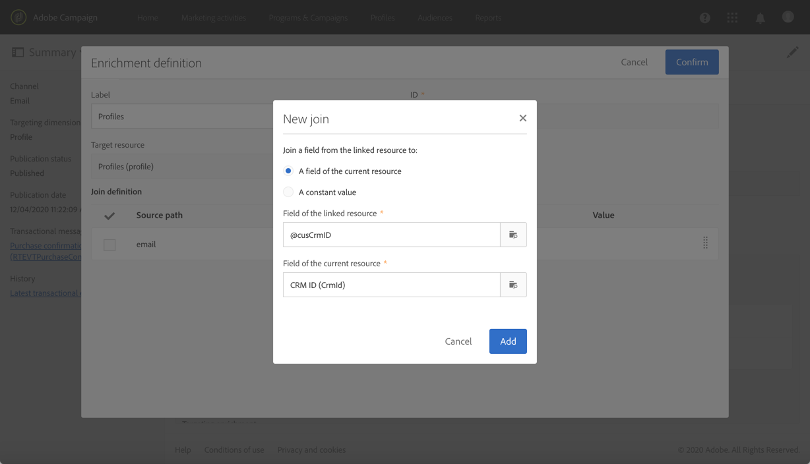

# 事务性消息传递用例 {#transactional-messaging-use-case}

在此示例中，您希望使用Adobe Campaign事务型消息传递功能，在您网站上的每次购买后发送一封确认电子邮件，通过客户的CRM ID来识别客户。

先决条件如下：

* 确保 **[!UICONTROL Profile]** 资源已扩展，并且新字段对应于CRM ID。

* 创建并发布与购买对应的自定义资源，并将其链接到 **[!UICONTROL Profile]** 资源。 这样，您将能够从此资源检索信息以扩充消息内容。

有关扩展、创建和发布资源的更多信息，请参阅 [此部分](../../developing/using/key-steps-to-add-a-resource.md).

以下介绍了实施此用例的主要步骤。

>[!NOTE]
>
>有关事务性消息传递一般流程的图形表示，请参阅 [此模式](../../channels/using/getting-started-with-transactional-msg.md#key-steps).

## 第1步 — 创建和发布事件配置 {#create-event-configuration}

1. 使用 **[!UICONTROL Email]** 渠道。 请参阅[创建事件](../../channels/using/configuring-transactional-event.md#creating-an-event)。

1. 选择 **[!UICONTROL Profile]** 定向维度以创建 [基于用户档案的事务型消息](../../channels/using/configuring-transactional-event.md#profile-based-transactional-messages).

1. 定义可用于个性化事务型消息的属性。 在此示例中，添加“CRM ID”和“产品标识符”字段。 请参阅 [定义事件属性](../../channels/using/configuring-transactional-event.md#defining-the-event-attributes).

   

1. 要使用有关客户购买的信息扩充消息内容，请创建以 **[!UICONTROL Purchase]** 资源。 请参阅 [丰富活动内容](../../channels/using/configuring-transactional-event.md#enriching-the-transactional-message-content).

   

1. 在之前添加到事件的“产品标识符”字段与 **[!UICONTROL Purchase]** 资源。

   

1. 由于基于用户档案的事件必须使用此功能，因此您还必须创建一个扩充，以 **[!UICONTROL Profile]** 资源。

1. 在之前添加到消息的“CRM ID”字段与 **[!UICONTROL Profile]** 扩展的资源。 <!--What's the purpose to have created a CRM ID for this event and to have the CRM ID as a join condition? could it be any other field provided you created it in the event?-->

   

1. 在 **[!UICONTROL Targeting enrichment]** ，选择 **[!UICONTROL Profile]** 资源，在投放执行期间用作消息目标。

   

1. 预览和发布事件。 请参阅[预览和发布事件](../../channels/using/publishing-transactional-event.md#previewing-and-publishing-the-event)。

## 第2步 — 编辑和发布事务型消息 {#create-transactional-message}

1. 转到发布事件时自动创建的事务型消息。 请参阅 [访问事务型消息](../../channels/using/editing-transactional-message.md#accessing-transactional-messages).

1. 编辑和个性化消息。 请参阅 [编辑用户档案事务型消息](../../channels/using/editing-transactional-message.md#editing-profile-transactional-message).

1. 通过与您添加到 **[!UICONTROL Profile]** 资源，您可以直接访问 [个性化](../../designing/using/personalization.md#inserting-a-personalization-field) 你的留言。

   

1. 通过与“产品标识符”字段进行协调，您可以通过添加 **[!UICONTROL Purchase]** 资源。

   

   要执行此操作，请选择 **[!UICONTROL Insert personalization field]** 中。 从 **[!UICONTROL Context]** > **[!UICONTROL Transactional event]** > **[!UICONTROL Event context]** 节点，打开与 **[!UICONTROL Purchase]** 自定义资源，然后选择任意字段。

1. 您可以使用特定测试用户档案测试消息。 请参阅 [测试事务型消息](../../channels/using/testing-transactional-message.md#testing-a-transactional-message).

1. 内容准备就绪后，保存所做更改并发布消息。 请参阅[发布事务型消息](../../channels/using/publishing-transactional-message.md#publishing-a-transactional-message)。

## 步骤3 — 集成事件触发 {#integrate-event-trigger}

将事件集成到您的网站中。 请参阅 [集成事件触发](../../channels/using/getting-started-with-transactional-msg.md#integrate-event-trigger).

## 步骤4 — 消息投放 {#message-delivery}

执行所有这些步骤后，客户一旦从您的网站购买产品，就会收到一封个性化的确认电子邮件，其中包括购买信息。
