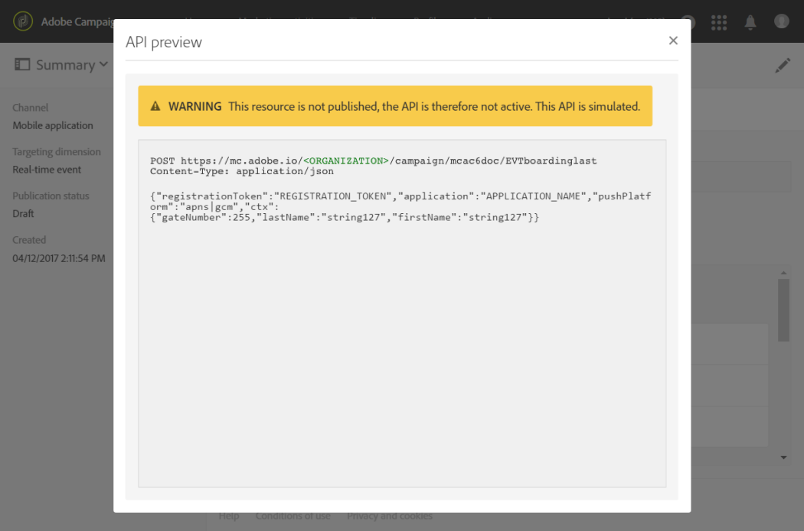
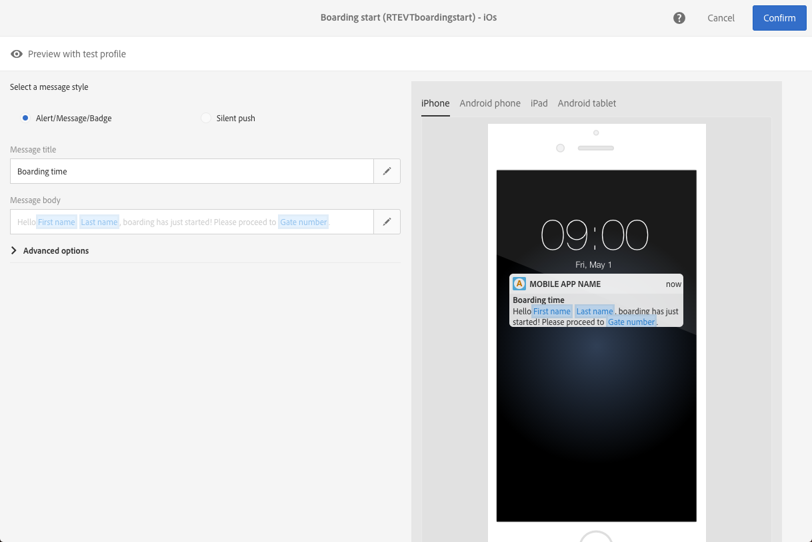
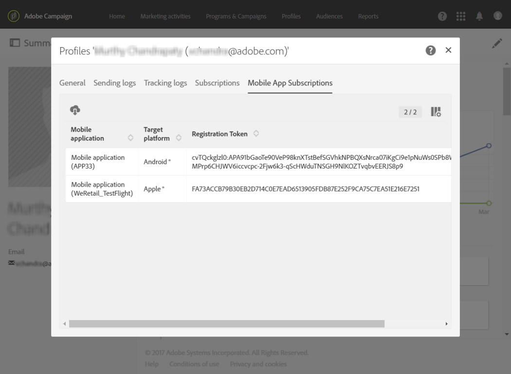

# 事务型推送通知{#transactional-push-notifications}

您可以使用Adobe Campaign在iOS和Android移动设备上发送事务推送通知。 您在Adobe Campaign中设置的移动设备应用程序会利用Experience CloudMobile SDK来接收这些消息。

>[!NOTE]
>
>推送渠道是可选的。 请核实您的许可协议。有关标准推送通知的更多信息，请参阅[关于推送通知](../../channels/using/about-push-notifications.md)。

要发送事务推送通知，您需要相应地配置Adobe Campaign。 请参阅[配置移动应用程序](../../administration/using/configuring-a-mobile-application.md)。

您可以发送两种类型的事务推送通知：

* [定向事件的事务推送通知](#transactional-push-notifications-targeting-an-event)
* [定向来自Adobe Campaign数据库](#transactional-push-notifications-targeting-a-profile) 的用户档案的事务推送通知

## 针对事件{#transactional-push-notifications-targeting-an-event}的事务型推送通知

您可以使用Adobe Campaign向选择从移动应用程序接收通知的所有用户&#x200B;**发送**&#x200B;匿名事务推送通知。

在这种情况下，仅使用事件本身包含的&#x200B;**数据来定义投放目标**。 没有利用来自Adobe Campaign集成用户档案数据库的数据。

### 配置基于事件的事务型推送通知{#configuring-event-based-transactional-push-notification}

要向选择从移动应用程序接收通知的所有用户发送事务型推送通知，您首先需要创建并配置一个事件，以定向事件本身中包含的数据。

>[!NOTE]
>
>您仍可以使用[事件属性](../../channels/using/configuring-transactional-event.md#defining-the-event-attributes)（事件中的数据）和[事件扩充](../../channels/using/configuring-transactional-event.md#enriching-the-transactional-message-content)（Campaign数据库中的数据）来个性化基于事件的事务型推送通知的内容。 请参阅[以下示例](#sending-event-based-transactional-push-notification)。

事件必须包含以下三个元素：

* **注册令牌**，该令牌是一个移动应用程序和一个设备的用户ID。 它可能与Adobe Campaign数据库中的任何用户档案都不对应。
* **移动应用程序名称**（所有设备均使用移动应用程序名称 — Android和iOS）。 这是在Adobe Campaign中配置的移动应用程序的ID，用于在用户设备上接收推送通知。 有关更多信息，请参阅[配置移动应用程序](../../administration/using/configuring-a-mobile-application.md)。
* **推送平台**（Android为“gcm”，iOS为“apns”）。

要配置事件，请执行以下步骤：

1. 创建事件配置时，选择&#x200B;**[!UICONTROL Push notification]**&#x200B;渠道和&#x200B;**[!UICONTROL Real-time event]**&#x200B;定向维度（请参阅[创建事件](../../channels/using/configuring-transactional-event.md#creating-an-event)）。
1. 向事件添加字段。 这将允许您个性化事务型消息（请参阅[定义事件属性](../../channels/using/configuring-transactional-event.md#defining-the-event-attributes)）。 在此示例中，定义“gateNumber”、“lastname”和“firstname”字段。
1. 您还可以扩充消息的内容。 为此，请添加表中链接到事件配置的字段（请参阅[扩充事件](../../channels/using/configuring-transactional-event.md#enriching-the-transactional-message-content)）。

   <!--Event-based transactional messaging is supposed to use only the data that are in the sent event to define the recipient and the message content personalization. However, you can enrich the content of your transactional message using information from the Adobe Campaign database.-->

1. [预览和发布事件](../../channels/using/publishing-transactional-event.md#previewing-and-publishing-the-event)。

   预览事件时，REST API包含用于定位投放的“registrationToken”、“application”和“pushPlatform”属性。

   

   发布事件后，将自动创建链接到新事件的事务型推送通知。 现在，您可以修改并发布刚刚创建的消息（请参阅[此部分](#sending-event-based-transactional-push-notification)）。

1. 将事件集成到您的网站中（请参阅[集成触发](../../channels/using/getting-started-with-transactional-msg.md#integrate-event-trigger)的事件）。

### 发送基于事件的事务型推送通知{#sending-event-based-transactional-push-notification}

例如，某航空公司希望邀请其移动应用程序用户前往相关登机口登机。

该公司将使用一个移动应用程序通过一个设备为每个用户发送一个事务推送通知（通过注册令牌标识）。

1. 请转至创建的事务型消息以对其进行编辑。请参阅[访问事务型消息](../../channels/using/editing-transactional-message.md#accessing-transactional-messages)。

   

1. 单击&#x200B;**[!UICONTROL Content]**&#x200B;块以修改消息的标题和正文。

1. 您可以插入个性化字段以添加在创建事件时定义的元素（请参阅[定义事件属性](../../channels/using/configuring-transactional-event.md#defining-the-event-attributes)）。

   

   要查找这些字段，请单击项目旁边的铅笔，单击&#x200B;**[!UICONTROL Insert personalization field]**&#x200B;并选择&#x200B;**[!UICONTROL Context]** > **[!UICONTROL Real-time event]** > **[!UICONTROL Event context]**。

   

   有关编辑推送通知内容的更多信息，请参阅[准备和发送推送通知](../../channels/using/preparing-and-sending-a-push-notification.md)。

1. 如果要使用来自Adobe Campaign数据库的其他信息，也可以扩充事务型消息的内容（请参阅[扩充事件](../../channels/using/configuring-transactional-event.md#enriching-the-transactional-message-content)）。

1. 保存更改并发布消息。请参阅[发布事务型消息](../../channels/using/publishing-transactional-message.md#publishing-a-transactional-message)。

1. 使用Adobe Campaign Standard REST API，在Android(gcm)上使用一个移动应用程序(WeFlight)（包含登入数据），将事件发送到注册令牌(ABCDEF123456789):

   ```
   {
     "registrationToken":"ABCDEF123456789",
     "application":"WeFlight",
     "pushPlatform":"gcm",
     "ctx":
     {
       "gateNumber":"Gate B18",
       "lastname":"Green",
       "firstname":"Jane"
     }
   }
   ```

   有关将事件触发集成到外部系统的更多信息，请参阅[集成事件触发](../../channels/using/getting-started-with-transactional-msg.md#integrate-event-trigger)。

如果存在注册令牌，则相应的用户将收到包含以下内容的事务推送通知：

*“你好，简·格林，刚刚开始登机！请转至B18门。&quot;*

## 定向用户档案{#transactional-push-notifications-targeting-a-profile}的事务推送通知

您可以向订阅了您移动应用程序的Adobe Campaign用户档案&#x200B;**发送事务推送通知**。 此投放可以包含[个性化字段](../../designing/using/personalization.md#inserting-a-personalization-field)，如直接从Adobe Campaign数据库检索的收件人的名字。

在这种情况下，事件必须包含一些字段&#x200B;**，以允许与Adobe Campaign数据库**&#x200B;中的用户档案进行协调。

定位用户档案时，每个移动应用程序和每个设备会发送一条事务推送通知。 例如，如果Adobe Campaign用户订阅了两个应用程序，则该用户将收到两个通知。 如果用户已订阅了使用两个不同设备的同一应用程序，则该用户将在每台设备上收到通知。

用户档案订阅的移动设备应用程序列于此用户档案的&#x200B;**[!UICONTROL Mobile App Subscriptions]**&#x200B;选项卡中。 要访问此选项卡，请选择一个配置文件并单击右侧的&#x200B;**[!UICONTROL Edit profile properties]**&#x200B;按钮。



有关访问和编辑用户档案的更多信息，请参阅[关于用户档案](../../audiences/using/about-profiles.md)。

### 配置基于用户档案的事务推送通知{#configuring-profile-based-transactional-push-notification}

要向订阅了您移动应用程序的Adobe Campaign用户档案发送事务推送通知，您首先需要创建并配置以Adobe Campaign数据库为目标的事件。

1. 创建事件配置时，选择&#x200B;**[!UICONTROL Push notification]**&#x200B;渠道和&#x200B;**[!UICONTROL Profile]**&#x200B;定向维度（请参阅[创建事件](../../channels/using/configuring-transactional-event.md#creating-an-event)）。

   默认情况下，事务型推送通知将发送到收件人订阅的所有移动应用程序。 要将推送通知发送到特定的移动设备应用程序，请在列表中选择该通知。 其他移动应用程序将被消息定向，但将被排除在发送之外。

   

1. 如果要个性化事务型消息，请向事件添加字段（请参阅[定义事件属性](../../channels/using/configuring-transactional-event.md#defining-the-event-attributes)）。

   >[!NOTE]
   >
   >必须至少添加一个字段才能创建扩充。 您无需创建其他字段，如&#x200B;**名字**&#x200B;和&#x200B;**姓氏**，因为您将能够使用Adobe Campaign数据库中的个性化字段。

1. 创建扩充，以便将事件链接到&#x200B;**[!UICONTROL Profile]**&#x200B;资源（请参阅[扩充事件](../../channels/using/configuring-transactional-event.md#enriching-the-transactional-message-content)），并选择此扩充作为&#x200B;**[!UICONTROL Targeting enrichment]**。

   >[!IMPORTANT]
   >
   >对于基于用户档案的事件，此步骤是必备的。

1. [预览和发布事件](../../channels/using/publishing-transactional-event.md#previewing-and-publishing-the-event)。

   预览事件时，REST API不包含指定注册令牌、应用程序名称和推送平台的属性，因为将从&#x200B;**[!UICONTROL Profile]**&#x200B;资源中检索这些令牌。

   发布事件后，将自动创建链接到新事件的事务型推送通知。 现在，您可以修改并发布刚刚创建的消息（请参阅[此部分](#sending-profile-based-transactional-push-notification)）。

1. 将事件集成到您的网站中（请参阅[集成触发](../../channels/using/getting-started-with-transactional-msg.md#integrate-event-trigger)的事件）。

### 发送基于用户档案的事务推送通知{#sending-profile-based-transactional-push-notification}

例如，某航空公司希望向订阅其移动应用程序的所有Adobe Campaign用户发送最后一次登机电话。

1. 请转至创建的事务型消息以对其进行编辑。请参阅[访问事务型消息](../../channels/using/editing-transactional-message.md#accessing-transactional-messages)。

1. 单击&#x200B;**[!UICONTROL Content]**&#x200B;块以修改消息的标题和正文。

   与基于实时事件的配置不同，您可以直接访问所有用户档案信息以个性化您的消息。 请参阅[插入个性化字段](../../designing/using/personalization.md#inserting-a-personalization-field)。

   有关编辑推送通知内容的更多信息，请参阅[准备和发送推送通知](../../channels/using/preparing-and-sending-a-push-notification.md)。

1. 保存更改并发布消息。请参阅[发布事务型消息](../../channels/using/publishing-transactional-message.md#publishing-a-transactional-message)。
1. 使用Adobe Campaign Standard REST API，将事件发送到用户档案：

   ```
   {
     "ctx":
     {
       "email":"janegreen@email.com",
       "gateNumber":"D16",
     }
   }
   ```

有关将事件触发集成到外部系统的更多信息，请参阅[集成事件触发](../../channels/using/getting-started-with-transactional-msg.md#integrate-event-trigger)。

相应用户接收事务推送通知，其中包括从Adobe Campaign数据库检索到的所有个性化元素。

>[!NOTE]
>
>没有注册令牌、应用程序和推送平台字段。 在本例中，使用email字段执行协调。

## 更改事务推送通知{#change-target-mapping}中的目标映射

事务型推送通知使用特定的[目标映射](../../administration/using/target-mappings-in-campaign.md)，其中包含发送此类投放所需的技术设置。

要更改此目标映射，请执行以下步骤：

1. 从事务型消息列表中，选择推送通知。

1. 在消息仪表板中，单击&#x200B;**[!UICONTROL Edit properties]**&#x200B;按钮。

   

1. 展开&#x200B;**[!UICONTROL Advanced parameters]**&#x200B;部分。

1. 单击 **[!UICONTROL Select a 'Target mapping' element]**。

   

1. 从列表中选择目标映射。

   >[!NOTE]
   >
   >在发送基于&#x200B;**用户档案的**&#x200B;事务推送通知时，要获得最佳投放准备时间和性能，请使用&#x200B;**[!UICONTROL Profile - Real-time event for Push (mapRtEventAppSubRcp)]**&#x200B;目标映射。

   

1. 确认更改并发布消息。 请参阅[发布事务型消息](../../channels/using/publishing-transactional-message.md#publishing-a-transactional-message)。

   >[!IMPORTANT]
   >
   >您必须再次发布消息才能使更改生效，否则仍将使用之前的目标映射。


