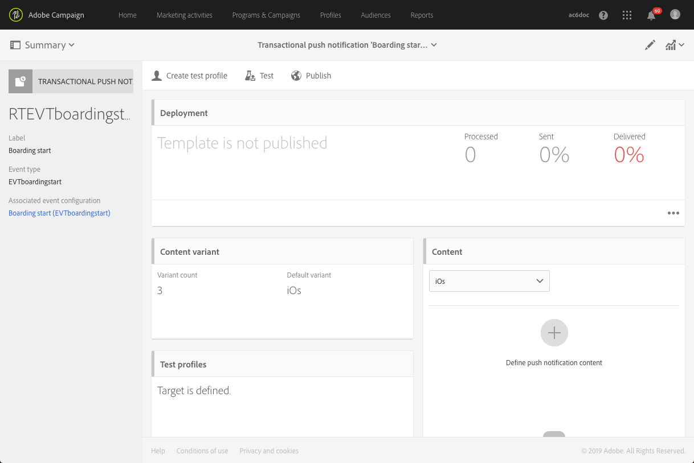

# 事务型推送通知{#transactional-push-notifications}

您可以使用Adobe Campaign在iOS和Android移动设备上发送事务推送通知。 通过利用Adobe CampaignMobile SDK在您以Experience Cloud设置的移动应用程序上接收这些消息。

>[!NOTE]
>
>推送渠道是可选的。 请核实您的许可协议。有关标准推送通知的更多信息，请参阅 [推送通知](../../channels/using/about-push-notifications.md)。

可以发送两种类型的事务推送通知：

* 针对事件的交易推送通知。
* 针对用户档案Adobe Campaign库中的的事务推送通知。

Once you have created and published an event (the cart abandonment explained in [this section](../../channels/using/getting-started-with-transactional-msg.md#transactional-messaging-operating-principle)), the corresponding transactional push notification is created automatically.

The configuration steps are presented in the [Configuring an event to send a transactional push notification](../../administration/using/configuring-transactional-messaging.md#use-case--configuring-an-event-to-send-a-transactional-message) section.

为了让事件触发发送事务型消息，您必须对消息进行个性化，然后测试并发布消息。

>[!NOTE]
>
>要访问事务型消息，您必须归属于 **[!UICONTROL Administrators (all units)]** 安全组。

## 针对事件的交易推送通知 {#transactional-push-notifications-targeting-an-event}

您可以向已选择接收移动应用程序通知的所有用户发送匿名交易推送通知。

在这种情况下，只使用事件本身包含的数据来定义投放目标。 未利用Adobe Campaign集成用户档案数据库中的数据。

### 发送针对事件的交易推送通知 {#sending-a-transactional-push-notification-targeting-an-----------event}

例如，航空公司公司希望邀请其移动应用程序用户前往相关登机口登机。

公司将使用一个移动应用程序通过一个设备为每个用户发送一个事务推送通知（用注册令牌标识）。

1. 请转至创建的事务型消息以对其进行编辑。请参阅[事件事务型消息](../../channels/using/event-transactional-messages.md)。

   

1. Click the **[!UICONTROL Content]** block to modify your message&#39;s title and body.

   您可以插入个性化字段以添加在创建事件时定义的元素。

   

   要查找这些字段，请单击项目旁边的铅笔，单 **[!UICONTROL Insert personalization field]** 击并选 **[!UICONTROL Context]** 择> **[!UICONTROL Real-time event]** > **[!UICONTROL Event context]**。

   

   有关编辑推送通知内容的详细信息，请 [参阅创建推送通知](../../channels/using/preparing-and-sending-a-push-notification.md)。

1. 保存更改并发布消息。请参阅[发布事务型消息](../../channels/using/event-transactional-messages.md#publishing-a-transactional-message)。

1. 使用Adobe Campaign StandardREST API在Android(gcm)上使用一个移动应用程序(WeFlight)将事件发送到注册令牌(ABCDEF123456789)，其中包含登记数据。

   ```
   {
     "registrationToken":"ABCDEF123456789",
     "application":"WeFlight",
     "pushPlatform":"gcm",
     "ctx":
     {
       "gateNumber":"Gate B18",
       "lastname":"Green",
       "firstname":"Jane"
     }
   }
   ```

   有关将事件触发集成到外部系统的详细信息，请参 [阅站点集成](../../administration/using/configuring-transactional-messaging.md#integrating-the-triggering-of-the-event-in-a-website)。

如果存在注册令牌，则相应的用户接收包括以下内容的事务推送通知：

“简·格林，您好，登机刚刚开始！ 请前往B18号门。”

## 针对用户档案的交易推送通知 {#transactional-push-notifications-targeting-a-profile}

您可以向订阅了移动应用程序的Adobe Campaign用户档案发送事务推送通知。 此投放可包 [含个性化](../../designing/using/personalization.md#inserting-a-personalization-field) 字段，如收件人的名字。

在这种情况下，事件必须包含一些字段，允许与Adobe Campaign库中的用户档案对帐。

定位用户档案时，每个移动应用程序和每个设备发送一个事务推送通知。 例如，如果Adobe Campaign用户订阅了两个应用程序，则此用户将收到两个通知。 如果用户订阅了使用两个不同设备的同一应用程序，则此用户将在每个设备上收到通知。

用户档案订阅的移动应用程序列在此用户档案 **[!UICONTROL Mobile App Subscriptions]** 的选项卡中。 要访问此选项卡，请选择用户档案，然 **[!UICONTROL Edit profile properties]** 后单击右侧的按钮。


有关访问和编辑用户档案的更多信息，请参阅 [用户档案](../../audiences/using/creating-profiles.md)。

### 发送针对用户档案的交易推送通知 {#sending-a-transactional-push-notification-targeting-a-----------profile}

例如，航空公司公司希望向订阅其移动应用程序的所有Adobe Campaign用户发送最后一次登机电话。

1. 请转至创建的事务型消息以对其进行编辑。请参阅[事件事务型消息](../../channels/using/event-transactional-messages.md)。

1. Click the **[!UICONTROL Content]** block to modify your message&#39;s title and body.

   与基于实时事件的配置不同，您可以直接访问所有用户档案信息以个性化您的信息。 请参阅[插入个性化字段](../../designing/using/personalization.md#inserting-a-personalization-field)。

   有关编辑推送通知内容的更多信息。 请参 [阅创建推送通知](../../channels/using/preparing-and-sending-a-push-notification.md)。

1. 保存更改并发布消息。请参阅[发布事务型消息](../../channels/using/event-transactional-messages.md#publishing-a-transactional-message)。
1. 使用Adobe Campaign StandardREST API，将事件发送给用户档案。

   ```
   {
     "ctx":
     {
       "email":"janegreen@email.com",
       "gateNumber":"D16",
     }
   }
   ```

   有关将事件触发集成到外部系统的详细信息，请参 [阅站点集成](../../administration/using/configuring-transactional-messaging.md#integrating-the-triggering-of-the-event-in-a-website)。

   >[!NOTE]
   >
   >没有注册令牌、应用程序和推送平台字段。 在此示例中，对帐是使用电子邮件字段执行的。
