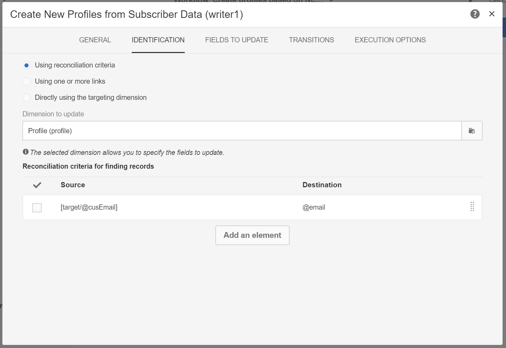

# 基于移动应用程序数据创建和更新用户档案信息

## 概述

本页介绍了开发工作流的步骤，该工作流会在移动设备应用程序按计划发送收集PII数据之后创建/更新用户档案数据。

* **PII** 表示“个人身份信息”。 它可以是任何数据，包括不会在Campaign数据库“用户档案”表中显示的信息，例如Analytics for Mobile [目标点](../../integrating/using/about-campaign-points-of-interest-data-integration.md). PII由移动设备应用程序开发人员定义，通常由营销人员定义。
* **收集PII** 是从移动应用程序对Adobe Campaign Standard中的Rest API进行HTTPPOST操作。

此用例的目标是创建或更新Campaign Standard配置文件（如果移动应用程序返回的PII数据包含与配置文件相关的数据）。

## 先决条件

在Campaign Standard中启用推送通知需要执行多个配置步骤，然后才能根据移动应用程序订阅数据创建或更新用户档案：

1. [创建移动应用程序](../../administration/using/configuring-a-mobile-application.md)
1. [将Adobe移动SDK与您的移动应用程序集成](../../administration/using/supported-mobile-use-cases.md).
1. [配置Adobe Campaign以发送推送通知](../../administration/using/configuring-a-mobile-application.md).

## 步骤1 — 扩展推送通知/订阅的用户档案资源

要使用PII数据创建或更新用户档案资源，您必须首先使用所需字段扩展用户档案资源。 操作步骤：

* 标识由移动设备应用程序发送的PII字段。
* 确定用于协调以将PII数据与用户档案数据关联的字段。

在此示例中， **[!UICONTROL Fields]** 部分反映由移动设备应用程序发送的PII数据。 此 **[!UICONTROL Link to profiles]** 部分指示用于将PII与用户档案数据关联的字段，其中 **cus电子邮件** 映射到 **@email**.

扩展时配置文件数据的映射 **[!UICONTROL Subscriptions to an Application]** 资源是只读的。 用于协调。 必须将用户档案输入到系统中，并输入必要的数据才能将用户档案与PII数据进行协调。 在本例中，用户档案的电子邮件地址必须与收集PII中的电子邮件匹配，才能进行协调：

* 从移动设备应用程序接收用户的收集PII，其名字为“Jane，姓氏为“Doe”，电子邮件地址为janedoe@doe.com。
* 另外，用户档案的数据必须存在（例如，数据必须手动输入或来自其他某个资源），其中用户档案的电子邮件地址为janedoe@doe.com。

**相关主题：**

* [将订阅扩展到应用程序资源](../../developing/using/extending-the-subscriptions-to-an-application-resource.md).
* [创建或扩展现有资源](../../developing/using/key-steps-to-add-a-resource.md).

## 第2步 — 创建工作流

在Campaign Standard中使用工作流可让管理员唯一地标识并同步AppSubscription（订阅者）数据和配置文件或收件人数据之间的数据。 虽然基于工作流的更新不会实时同步配置文件数据，但它不应导致任何不必要的数据库锁定或开销。

构建工作流的主要步骤包括：

1. 使用 **[!UICONTROL Query]** 或 **[!UICONTROL Incremental query]** 活动，以获取最新订阅的列表。
1. 使用 **[!UICONTROL Reconciliation]** 活动，以将PII数据与配置文件进行映射。
1. 添加一些验证流程。
1. 使用 **[!UICONTROL Update data]** 使用PII数据更新或创建用户档案。

此工作流中假定有以下要求：

* 已扩展的任何/所有字段应该可用于创建/更新用户档案表。
* 可以扩展配置文件表以支持本身不受支持的字段（例如，T恤尺寸）。
* AppSubscription表中任何为空的字段都不应在配置文件表中更新。
* AppSubscription表中更新的任何记录都应包含在工作流下次运行中。

要构建工作流，请将以下活动拖放到工作区中，并将它们链接在一起： **[!UICONTROL Start]**， **[!UICONTROL Scheduler]**， **[!UICONTROL Incremental query]**， **[!UICONTROL Update data]**.

然后按照以下步骤配置每个活动。

### 配置 **[!UICONTROL Scheduler]** 活动

在 **[!UICONTROL General]** 选项卡，设置 **[!UICONTROL Execution frequency]** （例如，“每日”）、 **[!UICONTROL Time]** (例如，“1”:00:上午00:00”)，以及 **[!UICONTROL Start]** （例如，今天的日期）。

### 配置 **[!UICONTROL Incremental query]** 活动。

1. 在 **[!UICONTROL Properties]** 选项卡，单击 **[!UICONTROL Select an element]** 图标 **[!UICONTROL Resource]** 字段，然后选择 **[!UICONTROL Subscriptions to an application (nms:appSubscriptionRcp:appSubscriptionRcpDetail)]** 元素。

   

1. 在 **[!UICONTROL Target]** 选项卡，拖动 **[!UICONTROL Mobile application]** 过滤器，然后选择移动设备应用程序名称。

   

1. 在 **[!UICONTROL Processed data]** 选项卡，选择 **[!UICONTROL Use a date field]**，然后添加 **[!UICONTROL Last modified (lastModified)]**  字段为 **[!UICONTROL Path to the date field]**.

   

### 配置 **[!UICONTROL Update data]** 活动。

1. 在 **[!UICONTROL Identification]** 选项卡，确保 **[!UICONTROL Dimension to update]** 字段设置为“用户档案（用户档案）”，然后单击 **[!UICONTROL Create element]** 按钮来添加字段作为协调条件。

   

1. 在 **[!UICONTROL Source]** 字段，从appSubscriptionRcp表中选择一个字段作为协调字段。 它可以是用户档案的电子邮件、crmId、marketingCloudId等。 在此示例中，使用“电子邮件(cusEmail)”字段。

1. 在 **[!UICONTROL Destination]** 字段中，从配置文件表中选择一个字段以协调appSubscriptionRcp表中的数据。 它可以是用户档案的电子邮件，也可以是任何扩展字段，如crmId、marketingCloudId等。 在此示例中，我们需要选择“电子邮件(email)”字段，以将其映射到appSubscriptionRcp表中的“电子邮件(cusEmail)”字段。

   

1. 在 **[!UICONTROL Fields to update]** 选项卡，单击 **[!UICONTROL Create element]** 按钮，然后映射来自appSubscriptionRcp表的字段(**[!UICONTROL Source]** 字段)，其中包含要在“用户档案”表格中更新的字段(**[!UICONTROL Destination]** 字段)。

1. 在 **[!UICONTROL Enabled if]** 字段中，添加表达式，以确保仅当源字段包含值时，才会更新用户档案表格中的相应字段。 要执行此操作，请从列表中选择字段，然后添加“！=&quot;&quot;表达式(如果“源”字段为 `[target/@cusEmail]` 在表达式编辑器中，确保键入 `[target/@cusEmail] != ''"`)。

   

>[!NOTE]
>
>在这种情况下，工作流会执行UPSERT，但因为它基于 **[!UICONTROL Incremental query]** 仅插入数据。 更改查询会影响插入或更新的数据。
>此外，要更新的字段选项卡中的设置确定在特定条件下插入或更新哪些字段。 这些设置对于每个应用程序或客户可能都是唯一的。
>配置这些设置时请务必小心，可能会产生意想不到的结果，因为根据appSubscriptionRcp数据更新配置文件中的记录可能会更改用户的个人信息，而无需进行验证。

添加要在配置文件中插入/更新的所有字段后，单击 **[!UICONTROL Confirm]**.

保存工作流，然后单击 **[!UICONTROL Start]** 以执行工作流。

