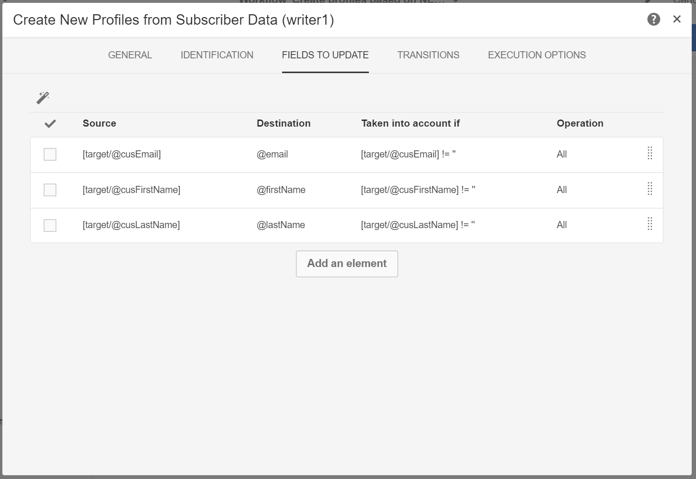

# 根据移动应用程序数据创建和更新配置文件信息

## 概述

本页介绍了开发一个工作流的步骤，该工作流在移动应用程序发送PII数据后，会根据预定的基础来创建/更新配置文件数据。

* **PII** 代表“个人识别信息”。它可以是任何数据，包括不显示在Campaign数据库中的信息(例如，用于Mobile [Point的](../../integrating/using/about-campaign-points-of-interest-data-integration.md)Analytics)中的信息。PII由Mobile App Developer定义，通常与营销人员一起定义。
* **收集PII** 是从移动应用程序到Adobe Campaign Standard中的Rest API的HTTP-POST操作。

此用例的目标是创建或更新Campaign Standard配置文件，如果移动应用程序返回的PII数据包含与配置文件相关的数据。

## 先决条件

在Campaign Standard中启用推送通知后，可遵循以下几个配置步骤，然后根据移动应用程序订阅数据创建或更新配置文件：

1. [创建移动应用程序](../../administration/using/configuring-a-mobile-application.md)
1. [将Adobe Mobile SDK与移动应用程序集成](https://helpx.adobe.com/campaign/kb/integrate-mobile-sdk.html)。
1. [配置Adobe Campaign以发送推送通知](https://helpx.adobe.com/campaign/kb/configuring-app-sdkv4.html)。

## 步骤-扩展推送通知/订阅的配置文件资源

要能够使用PII数据创建或更新配置文件资源，您必须首先使用所需字段扩展配置文件资源。要执行此操作，请执行以下操作：

* 识别移动应用程序发送的PII字段。
* 确定用于将PII数据与个人资料数据关联以关联PII数据的字段。

在此示例中， **[!UICONTROL Fields]** 部分反映了移动应用程序发送的PII数据。**[!UICONTROL Link to profiles]** 此部分指示用于将PII与Profile Data相关联的字段，其中 **CusEmail** 映射到 **@ email**。

在扩展 **[!UICONTROL Subscriptions to an Application]** 资源时，配置文件数据的映射是只读的。它用于进行调解。必须使用所需的数据向系统输入配置文件，以使配置文件与PII数据协调。在我们的情况下，配置文件的电子邮件地址必须与收集PII中的电子邮件相匹配才能进行调解：

* 从移动应用程序收到PII，其名字为“Jane，姓氏为Doe”，电子邮件地址为janedoe@doe.com。
* 此外，配置文件数据必须存在(例如，必须手动输入数据或已经来自其他资源)，该配置文件的电子邮件地址为janedoe@doe.com。

**相关主题：**

* [将订阅扩展到应用程序资源](../../developing/using/extending-the-subscriptions-to-an-application-resource.md)。
* [创建或扩展现有资源](../../developing/using/key-steps-to-add-a-resource.md)。

## 步骤-创建工作流

使用Campaign Standard中的工作流，管理员可以在AppSubscription(订阅者)数据与配置文件或收件人数据之间唯一标识和同步数据。虽然基于工作流的更新不会实时同步配置文件数据，但它不会造成任何数据库锁定或开销。

构建工作流的主要步骤有：

1. 使用 **[!UICONTROL Query]** 或 **[!UICONTROL Incremental query]** 活动获取最新订阅的列表。
1. 使用 **[!UICONTROL Reconciliation]** 活动通过配置文件映射PII数据。
1. 添加一些验证过程。
1. 使用一个 **[!UICONTROL Update data]** 更新或使用PII数据创建配置文件。

此工作流中假定有以下要求：

* 任何/所有已扩展的字段都应可用于创建/更新配置文件表。
* “配置文件”表可扩展到不受本机支持的支持字段(例如T恤大小)。
* AppSubscription表中的任何字段都不应在配置文件表中更新。
* 在AppSubscription表中更新的任何记录都应包含在下一运行流中。

要构建工作流，请按照以下步骤操作：

1. 将以下活动拖放到工作区中并将它们链接到一起：
   1. **[!UICONTROL Start]**
   1. **[!UICONTROL Scheduler]**
   1. **[!UICONTROL Incremental query]**
   1. **[!UICONTROL Update data]**
   

1. 配置 **[!UICONTROL Scheduler]** 活动。**[!UICONTROL General]** 在选项卡中，设置( **[!UICONTROL Execution frequency]** 例如，“Daily”)、the( **[!UICONTROL Time]** for example“AM1：00：00AM”)和( **[!UICONTROL Start]** 例如，今天的日期)。

   

1. 配置 **[!UICONTROL Incremental query]** 活动。
   1. **[!UICONTROL Properties]** 在选项卡中，单击 **[!UICONTROL Select an element]****[!UICONTROL Resource]** 字段的图标，然后选择 **[!UICONTROL Subscriptions to an application (nms:appSubscriptionRcp:appSubscriptionRcpDetail)]** 元素。

      

   1. **[!UICONTROL Target]** 在选项卡中，拖动 **[!UICONTROL Mobile application]** 过滤器，然后选择移动应用程序名称。

      

   1. **[!UICONTROL Processed data]** 在选项卡中，选择 **[!UICONTROL Use a date field]**，然后添加 **[!UICONTROL Last modified (lastModified)]** 字段 **[!UICONTROL Path to the date field]**。

      

1. 配置 **[!UICONTROL Update data]** 活动。
   1. **[!UICONTROL Identification]** 在选项卡中，确保 **[!UICONTROL Dimension to update]** 将字段设置为“配置文件(配置文件)”，然后单击 **[!UICONTROL Create element]** 按钮以将字段添加为一个定义条件。

      

   1. **[!UICONTROL Source]** 在字段中，从appsubscriptionRCP表中选择一个字段作为一个fix字段。它可以是配置文件的电子邮件、crMID、marketingCloudID等。在此示例案例中，我们将使用“电子邮件(CusEmail)”字段。
   1. 在 **[!UICONTROL Destination]** 字段中，从配置文件表中选择一个字段以协调appsubscriptionRCP表中的数据。它可以是配置文件的电子邮件，也可以是任何扩展字段，如crMID、marketingCloudID等。在此示例中，我们需要选择“电子邮件(电子邮件)”字段以将其与appsubscriptionRCP表中的“电子邮件(CusEmail)”字段映射。

      

   1. **[!UICONTROL Fields to update]** 在选项卡中，单击 **[!UICONTROL Create element]** 按钮，然后将来自appsubscriptionRCP表(**[!UICONTROL Source]** 字段)的字段映射到您要在配置文件表(**[!UICONTROL Destination]** 字段)中更新的字段。
   1. **[!UICONTROL Enabled if]** 在字段中添加一个表达式，以确保只有在源字段包含值时，配置文件表中的相应字段才会更新。为此，请从列表中选择字段，然后添加“！="表达式(如果“源”字段在 `[target/@cusEmail]` 表达式编辑器中确保键入) `[target/@cusEmail] != ''"`。

      

      >[!NOTE]
      >
      >在这种情况下，工作流会执行USERT，但由于只会插入增量查询数据，因此该工作流才会执行。更改查询可能会影响插入或更新的数据。
      >此外，“字段到更新”选项卡中的设置会确定在特定条件下插入或更新哪些字段。这些设置对于每个应用程序或客户都是唯一的。请注意配置这些设置时可能会产生意外后果，因为根据AppsubscriptionRCP数据更新配置文件中的记录可能会更改用户个人信息而无需验证。

   1. 添加配置文件中要插入/更新的所有字段时，单击 **[!UICONTROL Confirm]**。

      

1. 保存工作流，然后单击开始以启动工作流进程。

   
