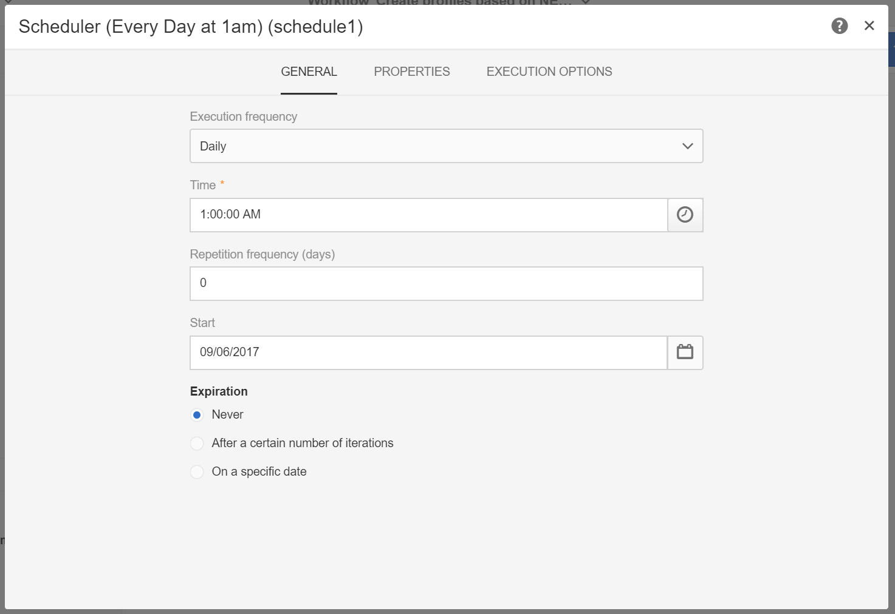

# 基于移动应用程序数据创建和更新用户档案信息

## 概述

本页介绍了开发工作流的步骤，该工作流在Mobile应用程序发送收集PII数据后按计划创建／更新用户档案数据。

* **PII** 代表“个人身份信息”。它可以是任何用户档案，包括活动数据库中未显示在表中的信息，例如，Analytics for Mobile [Points of Interest](../../integrating/using/about-campaign-points-of-interest-data-integration.md)。 PII由移动应用程序开发人员定义，通常由营销人员定义。
* **收** 集PII是从移动应用程序对Adobe Campaign Standard的Rest API进行的HTTPPOST操作。

此用例的目标是创建或更新Campaign Standard用户档案(如果移动应用程序返回的PII数据包含与用户档案相关的数据)。

## 先决条件

要启用Campaign Standard中的推送通知，需要执行几个配置步骤，然后才能根据移动应用程序订阅数据创建或更新用户档案:

1. [创建移动应用程序](../../administration/using/configuring-a-mobile-application.md)
1. [将AdobeMobile SDK与您的移动应用程序集成](https://helpx.adobe.com/cn/campaign/kb/integrate-mobile-sdk.html)。
1. [配置Adobe Campaign以发送推送通知](https://helpx.adobe.com/cn/campaign/kb/configuring-app-sdkv4.html)。

## 步骤1 —— 扩展推送通知/用户档案的订阅资源

要能够使用PII数据创建或更新用户档案资源，您必须首先使用所需字段扩展用户档案资源。 操作步骤：

* 标识由移动应用程序发送的PII字段。
* 确定用于对帐的字段，以将PII数据与用户档案数据关联。

在此示例中，**[!UICONTROL Fields]**&#x200B;部分反映由移动应用程序发送的PII数据。 **[!UICONTROL Link to profiles]**&#x200B;部分指示用于将PII与用户档案数据关联的字段，其中&#x200B;**cusEmail**&#x200B;映射到&#x200B;**@email**。

扩展&#x200B;**[!UICONTROL Subscriptions to an Application]**&#x200B;资源时用户档案数据的映射为READ-ONLY。 用于和解。 必须将用户档案输入到系统中，并包含必要的数据，以便将用户档案与PII数据进行协调。 在我们的情况下，用户档案的电子邮件地址必须与来自Collect PII的电子邮件匹配，以便进行协调：

* 收集PII是从移动应用程序接收的，用户的名字为“Jane”，姓氏为“Doe”，电子邮件地址为janedoe@doe.com。
* 另外，用户档案数据必须存在（例如，必须手动输入数据，或者已经来自其他资源）,用户档案的电子邮件地址为janedoe@doe.com。

**相关主题：**

* [将订阅扩展到应用程序资源](../../developing/using/extending-the-subscriptions-to-an-application-resource.md).
* [创建或扩展现有资源](../../developing/using/key-steps-to-add-a-resource.md)。

## 第2步——创建工作流

在Campaign Standard中使用工作流允许管理员唯一标识和同步AppSubscription（订阅者）数据与用户档案或收件人数据之间的数据。 虽然基于工作流的更新不会实时同步用户档案数据，但它不会造成任何不当的数据库锁定或开销。

构建工作流的主要步骤有：

1. 使用&#x200B;**[!UICONTROL Query]**&#x200B;或&#x200B;**[!UICONTROL Incremental query]**&#x200B;活动获取最新订阅的列表。
1. 使用&#x200B;**[!UICONTROL Reconciliation]**&#x200B;活动将PII数据与用户档案映射。
1. 添加一些验证过程。
1. 使用&#x200B;**[!UICONTROL Update data]**&#x200B;更新或创建带有PII用户档案的数据。

此工作流中采用以下要求：

* 已扩展的任何／所有字段应可用于创建／更新用户档案表。
* 用户档案表可以扩展为支持本机不支持的字段（例如，T恤衫大小）。
* AppSubscription表中为空的任何字段都不应在用户档案表中更新。
* 已在AppSubscription表中更新的任何记录都应包括在工作流的下次运行中。

要构建工作流，请将以下活动拖放到工作区中并将它们链接在一起：**[!UICONTROL Start]**、**[!UICONTROL Scheduler]**、**[!UICONTROL Incremental query]**、**[!UICONTROL Update data]**。

然后，按照以下步骤配置每个活动。

### 配置&#x200B;**[!UICONTROL Scheduler]**&#x200B;活动

在&#x200B;**[!UICONTROL General]**&#x200B;选项卡中，设置&#x200B;**[!UICONTROL Execution frequency]**（例如，“Daily”）、**[!UICONTROL Time]**（例如，“1:00:00 AM”）和&#x200B;**[!UICONTROL Start]**（例如，“Today&#39;s date”）。

### 配置&#x200B;**[!UICONTROL Incremental query]**&#x200B;活动。

1. 在&#x200B;**[!UICONTROL Properties]**&#x200B;选项卡中，单击&#x200B;**[!UICONTROL Resource]**&#x200B;字段的&#x200B;**[!UICONTROL Select an element]**&#x200B;图标，然后选择&#x200B;**[!UICONTROL Subscriptions to an application (nms:appSubscriptionRcp:appSubscriptionRcpDetail)]**&#x200B;元素。

   

1. 在&#x200B;**[!UICONTROL Target]**&#x200B;选项卡中，拖动&#x200B;**[!UICONTROL Mobile application]**&#x200B;过滤器，然后选择移动应用程序名称。

   

1. 在&#x200B;**[!UICONTROL Processed data]**&#x200B;选项卡中，选择&#x200B;**[!UICONTROL Use a date field]**，然后添加&#x200B;**[!UICONTROL Last modified (lastModified)]**&#x200B;字段作为&#x200B;**[!UICONTROL Path to the date field]**。

   

### 配置&#x200B;**[!UICONTROL Update data]**&#x200B;活动。

1. 在&#x200B;**[!UICONTROL Identification]**&#x200B;选项卡中，确保&#x200B;**[!UICONTROL Dimension to update]**&#x200B;字段设置为“用户档案(用户档案)”，然后单击&#x200B;**[!UICONTROL Create element]**&#x200B;按钮以添加字段作为协调条件。

   

1. 在&#x200B;**[!UICONTROL Source]**&#x200B;字段中，从appSubscriptionRcp表中选择一个字段作为对帐字段。 它可以是用户档案的电子邮件、crmId、marketingCloudId等。 在本示例中，我们将使用“电子邮件（自定义电子邮件）”字段。

1. 在&#x200B;**[!UICONTROL Destination]**&#x200B;字段中，从用户档案表中选择一个字段以协调appSubscriptionRcp表中的数据。 它可以是用户档案的电子邮件，也可以是任何扩展字段，如crmId、marketingCloudId等。 在此示例中，我们需要选择“电子邮件（电子邮件）”字段，将其与appSubscriptionRcp表中的“电子邮件（自定义电子邮件）”字段进行映射。

   

1. 在&#x200B;**[!UICONTROL Fields to update]**&#x200B;选项卡中，单击&#x200B;**[!UICONTROL Create element]**&#x200B;按钮，然后将appSubscriptionRcp表（**[!UICONTROL Source]**&#x200B;字段）中的字段与要在用户档案表（**[!UICONTROL Destination]**&#x200B;字段）中更新的字段进行映射。

1. 在&#x200B;**[!UICONTROL Enabled if]**&#x200B;字段中，添加一个表达式，以确保仅在源字段包含值时更新用户档案表中的相应字段。 为此，请从列表中选择字段，然后添加“!=&quot;&quot;表达式(如果表达式编辑器中的“源”字段为`[target/@cusEmail]`，请确保键入`[target/@cusEmail] != ''"`)。

   

>[!NOTE]
>
>在这种情况下，工作流执行UPSERT，但因为它基于&#x200B;**[!UICONTROL Incremental query]**数据，所以只插入。 更改查询会影响插入或更新哪些数据。
>此外，“要更新的字段”选项卡中的设置决定了在特定条件下插入或更新哪些字段。 这些设置对于每个应用程序或客户都可以是唯一的。
>配置这些设置时要小心，因为根据appSubscriptionRcp用户档案更新记录可能会在未经验证的情况下更改用户个人信息。

在用户档案中插入／更新的所有字段都已添加后，单击&#x200B;**[!UICONTROL Confirm]**。

保存工作流，然后单击&#x200B;**[!UICONTROL Start]**&#x200B;以执行工作流。

