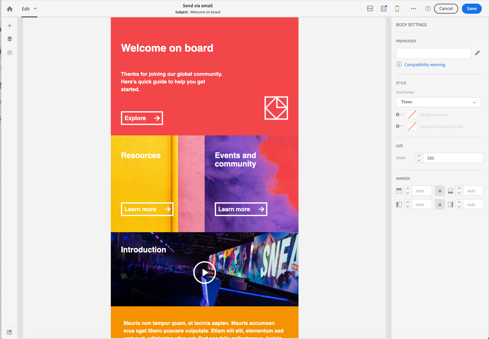

# 转换旧版编辑器电子邮件内容 {#converting-an-html-content}

开始使用Email Designer，并从旧版编辑器中创建的电子邮件HTML中构建可重用的模板和片段。

此用例允许您通过使用HTML电子邮件并在Email Designer中将其划分为HTML组件来创建Email Designer模板。

>[!NOTE]
>
>与兼容性模式一样，HTML组件也可编辑，但选项有限：您只能执行就地版本。

>[!IMPORTANT]
>
>此部分面向熟悉HTML代码的高级用户。

## 准备电子邮件内容

1. 选择HTML电子邮件。
1. 识别要划分HTML电子邮件的部分。
1. 从HTML中切出不同的块。

## 创建电子邮件结构

1. 打开&#x200B;**[!UICONTROL Email Designer]**&#x200B;以创建空的电子邮件内容。
1. 设置主体级别属性：背景颜色、宽度等 有关更多信息，请参阅[编辑电子邮件样式](../../designing/using/styles.md)。
1. 添加尽可能多的结构组件。 有关更多信息，请参阅[编辑电子邮件结构](../../designing/using/designing-from-scratch.md#defining-the-email-structure)。

## 添加HTML内容

1. 向每个结构组件添加一个HTML组件。 有关更多信息，请参阅[添加片段和组件](../../designing/using/designing-from-scratch.md#defining-the-email-structure)。
1. 将HTML复制并粘贴到每个组件中。

## 管理电子邮件的样式 {#manage-the-style-of-your-email}

1. 切换到&#x200B;**[!UICONTROL Mobile view]**。 有关更多信息，请参阅[此章节](../../designing/using/plain-text-html-modes.md#switching-to-mobile-view)。

1. 要修复此问题，请切换到源代码模式，然后将样式部分复制并粘贴到新样式部分中。 例如：

   ```
   <style type="text/css">
   a {text-decoration:none;}
   body {min-width:100% !important; margin:0 auto !important; padding:0 !important;}
   img {line-height:100%; text-decoration:none; -ms-interpolation-mode:bicubic;}
   ...
   </style>
   ```

   >[!NOTE]
   >
   >请确保在另一个自定义样式标记中将样式添加到此之后。
   >
   >请勿修改由Email Designer生成的CSS:
   >
   >* `<style data-name="default" type="text/css">(##)</style>`
   >* `<style data-name="supportIOS10" type="text/css">(##)</style>`
   >* `<style data-name="mediaIOS8" type="text/css">(##)</style>`
   >* `<style data-name="media-default-max-width-500px" type="text/css">(##)</style>`
   >* `<style data-name="media-default--webkit-min-device-pixel-ratio-0" type="text/css">(##)</style>`


1. 返回到移动设备视图，检查内容是否正确显示并保存更改。

## 用例

让我们尝试将在旧版编辑器中创建的此电子邮件转换为&#x200B;**[!UICONTROL Email Designer]**&#x200B;模板。

### 识别电子邮件的部分

我们可以在此电子邮件中识别11个部分。


要识别HTML的哪个部分是元素，您可以选择该元素。


要查看电子邮件的HTML版本，请单击&#x200B;**[!UICONTROL Show source]**。

### 创建电子邮件模板及其结构

1. 拖放&#x200B;**[!UICONTROL Structure components]**&#x200B;以反映电子邮件的布局。

1. 根据需要重复多次。 我们需要创建11个结构组件。

   

### 插入HTML内容组件

1. 在每个&#x200B;**[!UICONTROL Structure component]**&#x200B;中插入&#x200B;**[!UICONTROL HTML component]** 。

   

1. 对于每个部分，单击&#x200B;**[!UICONTROL Show source code]** 。

   

1. 插入HTML部分。

1. 单击 **[!UICONTROL Save]**。

您现在可以检查电子邮件的呈现。



### 管理样式以适合移动设备视图

1. 插入CSS元素以确保您的电子邮件适合移动设备视图。

1. 切换到源代码，并将样式部分复制并粘贴到新样式部分中。

有关更多信息，请参阅[管理电子邮件的样式](#manage-the-style-of-your-email)。

现在，您的旧版电子邮件可在Email Designer中使用。
