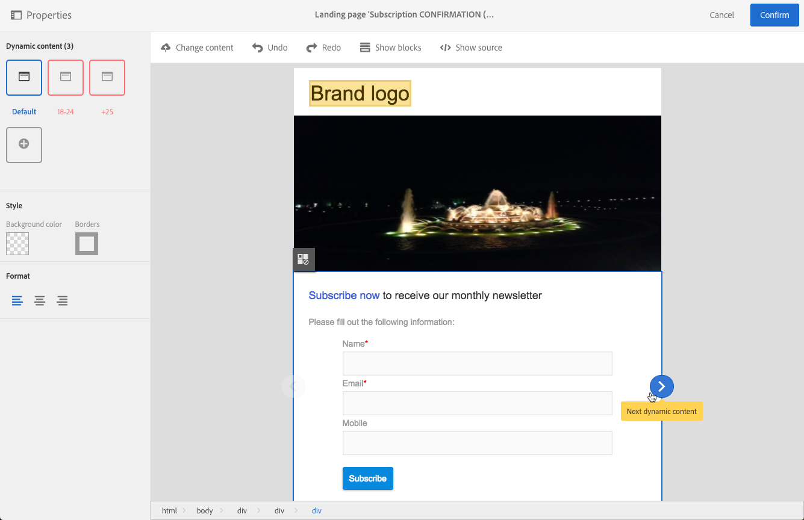

# Defining dynamic content in a landing page{#defining-dynamic-content-in-a-landing-page}

要在登陆页面中定义动态内容，请使用痕迹导航或直接单击某个元素来选择一个块。

某些块(如图像)无法直接选择。在这种情况下，请使用痕迹导航选择父块。然后，您可以修改该父元素中包含的所有元素，包括图像。条件将应用于父块中的所有子元素。

The breadcrumb is presented in the [Managing blocks](../../designing/using/managing-landing-page-structure-and-style.md) section.

在登陆页面中定义动态内容的下一步步骤类似于跟进电子邮件步骤。See [this section](../../designing/using/defining-dynamic-content-in-an-email.md).

>[!NOTE]
>
>如果变体元素以红色轮廓出现，则表示尚未定义表达式。

## Previewing dynamic content in a landing page {#previewing-dynamic-content-in-a-landing-page}

您可以在块的不同动态内容之间进行导航。要执行此操作，请执行以下操作：

1. 选择块。

   箭头显示在图像的左右两侧。

1. 单击右箭头可浏览可用的动态内容。

   

   每个侧边的箭头根据您是否达到最后一个或第一个可用动态内容而变暗。

   

1. To delete all the conditions applied to a block, select that block and click the **[!UICONTROL Disable dynamic content]** icon.
1. 选择要保留的动态内容。

   

在调色板中：

* 输入表达式的内容不再以红色轮廓显示，它们显示为灰色。
* 当前选择的内容以蓝色显示。

