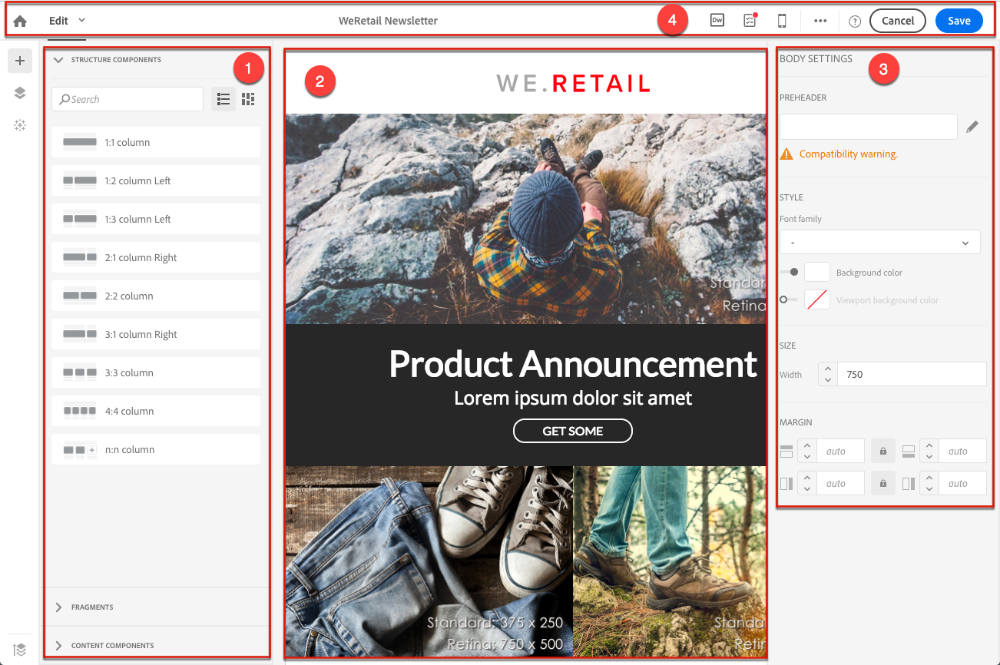

# Campaign Email Designer{#designing-content-in-adobe-campaign}

在 Adobe Campaign 中创建电子邮件后，您需要定义其内容。

Email Designer允许您通过拖放功能创建引人入胜的单独定制电子邮件
界面。 无论您是从头开始，还是利用现有内容片段或模板，请设计并优化每封电子邮件的所有内容（无论促销还是事务电子邮件均如此）。

Email Designer 旨在提供为响应式设计而优化的 HTML，因此使您能够直接通过用户界面轻松定义可视性条件和动态内容并将其应用于电子邮件、模板或片段。只需单击按钮，即可在拖放界面和HTML代码之间无缝切换。

通过 Email Designer，可以创建电子邮件内容和电子邮件内容模板。它与简单电子邮件、事务电子邮件、A/B 测试电子邮件、多语言电子邮件和定期电子邮件兼容。

<!--The Email Designer has more features than the Legacy Editor and is backward compatible.-->

 [在视频中了解Email Designer](#video)

* 要了解如何创建电子邮件内容，请参阅 [Email Designer 入门](../../designing/using/quick-start.md)。
* 有关 Email Designer 的概述，请参阅[使用 Email Designer](../../designing/using/designing-content-in-adobe-campaign.md)。
* 有关构建内容的更多信息：
   * 从头开始，请参阅[从头开始设计电子邮件](../../designing/using/designing-from-scratch.md)。
   * 使用现有内容，请参阅[使用现有内容进行设计](../../designing/using/using-existing-content.md)。
   * 使用 Creative Cloud 集成，请参阅[多解决方案电子邮件设计](../../designing/using/using-integrations.md)。
* 有关个性化的更多信息，请参阅[个性化](../../designing/using/personalization.md)。

创建电子邮件时，您可以选择使用预定义模板或从其他源加载现有内容。请参阅[选择现有内容](../../designing/using/using-existing-content.md#selecting-an-existing-content)。

要提高营销活动的效率，请对内容进行个性化。请参阅[插入个性化字段](../../designing/using/personalization.md#inserting-a-personalization-field)和[添加内容块](../../designing/using/personalization.md#adding-a-content-block)。

您还可以定义根据每个用户档案而异的动态内容。请参阅[在电子邮件中定义动态内容](../../designing/using/personalization.md#defining-dynamic-content-in-an-email)和[在登陆页中定义动态内容](../../channels/using/designing-a-landing-page.md#defining-dynamic-content-in-a-landing-page)。

通过链接和图像增强消息和登陆页。请参阅[插入链接](../../designing/using/links.md#inserting-a-link)和[插入图像](../../designing/using/images.md#inserting-images)。

## Email Designer 界面 {#email-designer-interface}

Email Designer 提供许多选项，使您能够创建、编辑和自定义内容的各个方面。

该界面由若干提供不同功能的区域组成：

从&#x200B;**调色板** (1) 中可用的元素将结构组件和内容片段拖放到主&#x200B;**工作区** (2) 中。在&#x200B;**工作区** (2) 中选择组件或元素，并从&#x200B;**设置**&#x200B;窗格 (3) 自定义其主要样式和显示特征。

从主&#x200B;**工具栏** (4) 访问更多常规选项和设置。

>[!NOTE]
>
>**设置**&#x200B;窗格可以根据屏幕分辨率和显示向左移动。

编辑器界面的&#x200B;**上下文工具栏**&#x200B;根据所选区域提供各种功能。工具栏中包含操作按钮和用于更改文本样式的按钮。执行的修改始终应用于所选区域。

### Email Designer 主页 {#email-designer-home-page}

[创建电子邮件](../../channels/using/creating-an-email.md)时，**[!UICONTROL Email Designer]** 主页会在选择电子邮件内容时自动显示。

通过 **[!UICONTROL Properties]** 选项卡，可以编辑电子邮件详细信息，如标签、发件人地址和姓名或电子邮件主题。您还可以通过单击屏幕顶部的电子邮件标签来访问此选项卡。

通过 **[!UICONTROL Templates]** 选项卡，可以从现成 HTML 内容或已创建的模板中进行选择，以快速开始设计电子邮件。请参阅[内容模板](../../designing/using/using-reusable-content.md#content-templates)。

通过 **[!UICONTROL Learn & support]** 选项卡，可以轻松访问相关文档和教程。

如果不选择模板，您还可以通过 Email Designer 主页选择开始设计内容的方式：

* 单击 **[!UICONTROL Create]** 按钮可从头开始创建新内容。请参阅[从头开始设计电子邮件内容](../../designing/using/designing-from-scratch.md#designing-an-email-content-from-scratch)。
* 单击 **[!UICONTROL Upload]** 按钮可从计算机上传文件。请参阅[从文件导入内容](../../designing/using/using-existing-content.md#importing-content-from-a-file)。
* 单击 **[!UICONTROL Import from URL]** 按钮可从 URL 检索现有内容。请参阅[从 URL 导入内容](../../designing/using/using-existing-content.md#importing-content-from-a-url)。

## 术语 {#terminology}

**模板**：模板是可为多个投放构建和重用的电子邮件的结构。

**片段**：片段是可在一封或多封电子邮件中引用的可重用组件。

**结构组件**：用于定义电子邮件布局的结构元素。

**内容组件**：内容组件是一旦放入电子邮件中即可编辑的原始空组件。

## 内容设计最佳实践 {#content-design-best-practices}

为正确使用 Email Designer 并尽可能简单地创建最佳电子邮件，我们建议应用以下原则：

* 在 HTML 的 &lt;head> 部分中使用内联样式，而不是单独的 CSS 和 CSS。通过使用内联样式，可以优化内容片段的保存和重用。

   请参阅[添加内联样式属性](../../designing/using/styles.md#adding-inline-styling-attributes)。

* 如果导入包含 HTML 内容的 ZIP 文件，请使用常规 CSS。不支持 SCSS 样式表。

* 通过创建并重用内容片段来保持营销活动的一致性，轻松实现品牌定位。

   请参阅[创建内容片段](../../designing/using/using-reusable-content.md#creating-a-content-fragment)。

* 编辑&#x200B;**电子邮件内容**&#x200B;时：

   在发送消息之前对其进行预览。Adobe Campaign 提供使用 Litmus 测试电子邮件呈现的方法。有关此方面的更多信息，请参阅[电子邮件呈现](../../sending/using/email-rendering.md)。

* Email designer不支持反向链接元标记。

下面的 Adobe Campaign 分步指南中介绍了有关消息的更多设计和一般最佳实践：[使用 Adobe Campaign 实施交付最佳实践](https://experienceleague.adobe.com/docs/campaign-standard/using/communication-channels/delivery-bestpractices/delivery-best-practices.html?lang=zh-Hans)。

### 更新片段 {#email-designer-updates}

Email Designer 正在不断改进。如果您从头开始创建、从现成模板创建电子邮件内容，或者如果您创建了片段，则下次打开内容时可能会收到以下更新消息：

Adobe 建议将内容更新为最新版本，以避免 CSS 冲突问题之类的问题。单击 **[!UICONTROL Update now]**.

如果在内容更新期间发生错误，请检查 HTML 并对其进行修正，然后再次运行此更新。

在涉及片段时，请注意以下事项：

* 如果要向新电子邮件或模板添加片段，并且如果收到此消息，则需要先更新此片段。

* 如果您有多个片段，则必须更新要在电子邮件内容中使用的每个片段。

* 为避免影响尚未准备好的当前电子邮件，可以选择不更新某些片段。

* 您仍可以发送电子邮件，其中已经使用了未更新的片段，但该片段不可编辑。

* 更新已准备好的电子邮件中使用的片段对这些电子邮件没有影响。

## Email Designer 限制 {#email-designer-limitations}

* 不能在片段中使用个性化字段。有关片段的更多信息，请参阅[此部分](../../designing/using/using-reusable-content.md#about-fragments)。

<!--* You cannot save directly as a fragment some content of an email that you are editing within the Email Designer. You need to copy-paste the HTML corresponding to that content into a new fragment. For more on this, see [Saving content as a fragment](../../designing/using/using-reusable-content.md#saving-content-as-a-fragment).-->

* 在编辑样式时，只有大多数电子邮件客户端正式支持的 Web 字体才可用。
* 无法将样式另存为主题以供将来重用。但是，CSS 样式可保存在内容模板或电子邮件中。有关样式的更多信息，请参阅[此部分](../../designing/using/styles.md)。
* Email designer不支持反向链接元标记。
* 替代对，即Unicode字符集的基本多语言平面中未包含的字符，不能以2个字节（16位）存储，需要编码为2个UTF-16字符。 这些字符包括一些中日韩表意文字、大多数表情符号和一些语言。 这些字符可能会导致动态文本中出现一些不兼容的问题。在发送消息之前，您需要执行强测试。

**相关主题**

* [创建电子邮件](../../channels/using/creating-an-email.md)
* [设计登陆页面](../../channels/using/designing-a-landing-page.md)
* [创建短信消息](../../channels/using/creating-an-sms-message.md)
* [创建和发送推送通知](../../channels/using/preparing-and-sending-a-push-notification.md)

## 教程视频 {#video}

此视频概述Email Designer。

>[!VIDEO](https://video.tv.adobe.com/v/22771?quality=12)

要开始使用Email Designer，请观看此[视频集](https://experienceleague.adobe.com/docs/campaign-learn/campaign-standard-tutorials/designing-content/email-designer/email-designer-overview.html#GettingStarted)，其中说明了Email Designer的一般功能以及如何从头开始或使用模板来设计电子邮件
