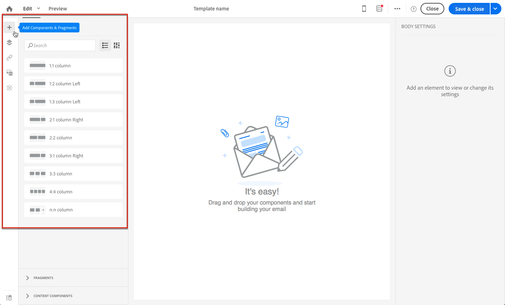
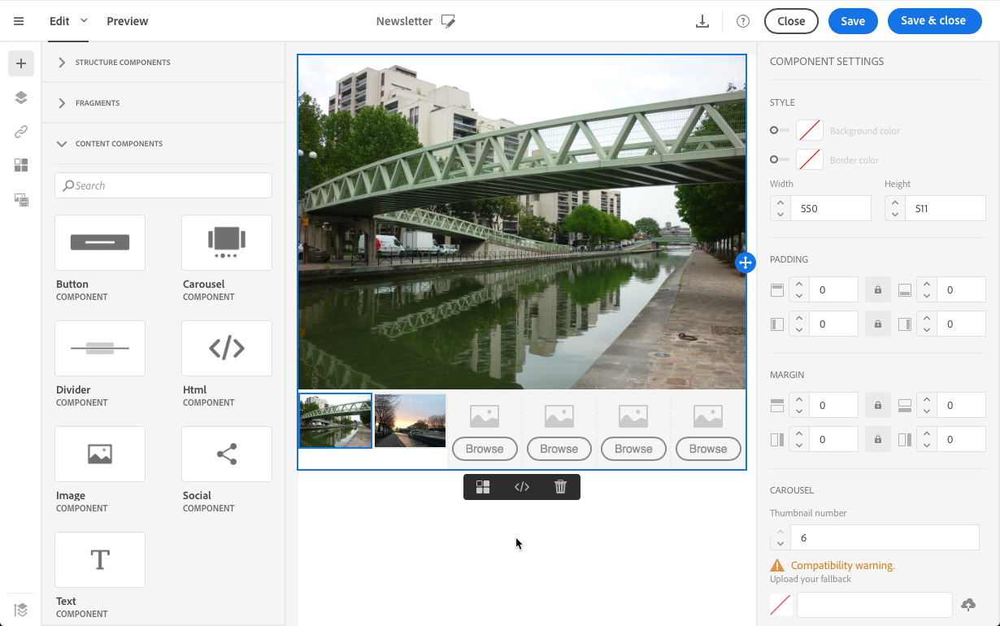
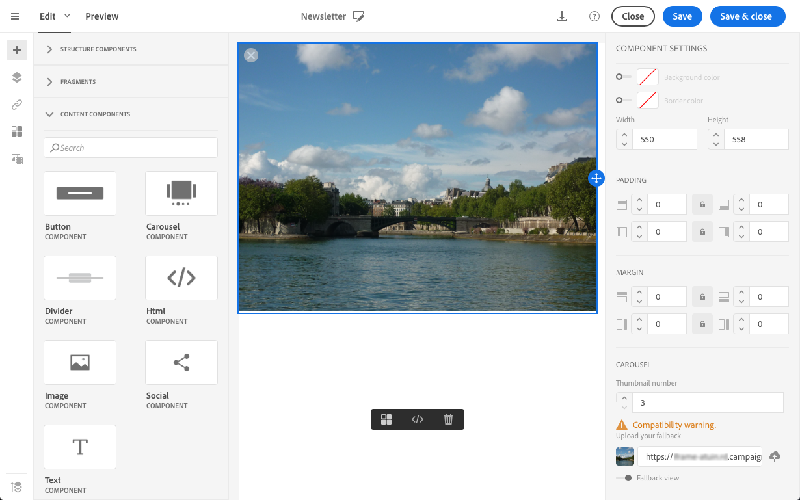

# 从头开始设计电子邮件 {#designing-an-email-content-from-scratch}

了解如何主控编辑电子邮件内容。 通过Email Designer，您可以创建电子邮件和模板，无论这些电子邮件和模板是否以您自己的预定义内容开头。

以下是使用Email Designer从头开始创建和设计电子邮件内容的主要步骤：

1. 创建电子邮件并打开其内容。
1. 添加结构组件以形成电子邮件。 请参阅[编辑电子邮件结构](#defining-the-email-structure)。
1. 在结构组件中插入内容组件和片段。 请参阅[添加片段和内容组件](#defining-the-email-structure)。
1. 添加图像并编辑电子邮件的文本。 请参阅[插入图像](../../designing/using/images.md#inserting-images)。
1. 通过添加个性化字段、链接等，个性化您的电子邮件。 请参阅[插入个性化字段](../../designing/using/personalization.md#inserting-a-personalization-field)、[插入链接](../../designing/using/links.md#inserting-a-link)和[在电子邮件中定义动态内容](../../designing/using/personalization.md#defining-dynamic-content-in-an-email)。
1. 定义电子邮件的主题行。 请参阅[个性化电子邮件的主题行](../../designing/using/subject-line.md#defining-the-subject-line-of-an-email)。
1. 预览电子邮件.
1. 保存内容，并在确保已定义受众并正确计划了发送后继续处理消息。

您也可以查看此[简介视频](https://video.tv.adobe.com/v/22771/?autoplay=true&hidetitle=true)。

>[!NOTE]
>
>为避免从头开始设计电子邮件内容，您可以使用现成的内容模板。 有关更多信息，请参阅[内容模板](../../designing/using/using-reusable-content.md#content-templates)。

## 定义电子邮件结构 {#defining-the-email-structure}

>[!CONTEXTUALHELP]
>id="ac_structure_components"
>title="关于结构组件"
>abstract="结构组件可定义电子邮件的布局。"

>[!CONTEXTUALHELP]
>id="ac_edition_columns"
>title="定义电子邮件列"
>abstract="Email Designer允许您通过定义列结构轻松定义电子邮件的布局。"

通过Email Designer，可轻松定义电子邮件的结构。 通过通过简单的拖放操作添加和移动结构元素，您可以在几秒内设计电子邮件的形状。

要编辑电子邮件的结构，请执行以下操作：

1. 打开现有内容或创建新的电子邮件内容。
1. 通过选择左侧的&#x200B;**+**&#x200B;图标访问&#x200B;**[!UICONTROL Structure components]**。

   

1. 拖放形成电子邮件形状所需的结构组件。

   

   在放置结构组件之前，使用蓝线可实现其确切位置。 您可以将其放置在任何其他组件的上方、中间或下方，但不能放在内部。

   >[!NOTE]
   >
   >请注意，列堆叠与所有电子邮件程序不兼容。 不支持时，不会堆叠列。
   >
   >将组件放入电子邮件中后，除非内部已放置内容组件或片段，否则将无法移动或删除组件。

1. 可使用由一个或多个列组成的多个结构组件。

   选择&#x200B;**[!UICONTROL n:n column]**&#x200B;组件以定义所选列数（在3到10之间）。 您还可以通过在每列底部移动箭头来定义每列的宽度。

   

   >[!NOTE]
   >
   >每个列大小不能低于结构组件总宽度的10%。 无法删除不为空的列。

定义结构后，您便可以向电子邮件中添加内容片段和组件。

## 使用预标头 {#preheader}

>[!CONTEXTUALHELP]
>id="ac_edition_preheader"
>title="使用预标头"
>abstract="利用预标题，可配置简短的摘要文本，以提高电子邮件的打开率。"

标题是在从收件箱中查看电子邮件时，主题行后面的简短摘要文本。 预标头提供了较高的打开率。

选择&#x200B;**[!UICONTROL Preheader]**&#x200B;编辑框并完成内容。

您可以在前标内容中添加&#x200B;**[!UICONTROL Content block]**、**[!UICONTROL Dynamic content]**&#x200B;或&#x200B;**[!UICONTROL Personalization fields]**。

>[!NOTE]
>
>请注意，preheader与所有电子邮件程序不兼容。 不支持时，将不显示预标头。

## 使用内容组件 {#about-content-components}

>[!CONTEXTUALHELP]
>id="ac_content_components"
>title="关于内容组件"
>abstract="内容组件是空内容占位符，您可以通过编辑来创建电子邮件。"

内容组件是一旦放入电子邮件中即可编辑的原始空组件。

您可以在结构组件中添加所需数量的内容组件。 也可以在结构组件内或将它们移动到其他结构组件。

以下是Email Designer中可用组件的列表：

### **[!UICONTROL Button]**

如果您需要使用多个按钮，而不是从头开始编辑每个按钮，则可以使用上下文工具栏复制&#x200B;**[!UICONTROL Button]**&#x200B;组件。

您还可以将按钮保存到可重复使用的片段中。 有关更多信息，请参阅[创建内容片段](../../designing/using/using-reusable-content.md#creating-a-content-fragment)和[将内容另存为片段](../../designing/using/using-reusable-content.md#saving-content-as-a-fragment)。

选择&#x200B;**[!UICONTROL Fallback view]**&#x200B;以在Email Designer中显示回退图像。

### **[!UICONTROL Text]**

使用此组件可在电子邮件中插入文本。 您可以在&#x200B;**[!UICONTROL Component Settings]**&#x200B;中调整文本的颜色、样式和大小。

### **[!UICONTROL Divider]**

使用此组件可在电子邮件中插入分隔线。 您可以在&#x200B;**[!UICONTROL Component Settings]**&#x200B;中选择断线的颜色、样式和大小。

### **[!UICONTROL HTML]**

使用此组件可复制粘贴现有HTML的不同部分。 这样，您就可以创建免费的模块化HTML组件。

>[!NOTE]
>
>自由HTML组件可编辑，但选项有限。 如果未嵌入所有样式，请确保在HTML代码的&#x200B;**head**&#x200B;部分中添加正确的CSS，否则电子邮件将无法响应。 使用&#x200B;**[!UICONTROL Preview]**&#x200B;按钮测试内容的响应性（请参阅[预览消息](../../sending/using/previewing-messages.md)）。

为了使外部内容与Email Designer兼容，Adobe建议从头开始创建消息，并将现有电子邮件中的内容复制到片段和组件中。

当您有无法重新创建的内容时，可以使用&#x200B;**[!UICONTROL Html]**&#x200B;内容组件从原始电子邮件中复制并粘贴HTML代码。 在继续操作之前，请确保您熟悉HTML。

>[!NOTE]
>
>新内容将不是原始电子邮件的确切副本，但以下步骤将指导您完成尽可能接近的消息创建过程。

**复制内容之前**

1. 在原始电子邮件中，确定部分中可重复使用的部分，这些部分对于您将要发送的每个电子邮件都是唯一的。
1. 保存您要使用的所有图像和资产。
1. 如果您熟悉HTML，请将原始HTML内容拆分为不同的部分。

### 视频 {#video-settings}

>[!CONTEXTUALHELP]
>id="ac_edition_video"
>title="视频设置"
>abstract="使用此组件可在电子邮件中插入视频。 请注意，视频并非适用于所有电子邮件客户端。 我们建议设置备用图像。"
>additional-url="https://www.emailonacid.com/blog/article/email-development/a_how_to_guide_to_embedding_html5_video_in_email/" text="其他信息"

将视频组件插入电子邮件的结构组件，然后在&#x200B;**[!UICONTROL Component Settings]**&#x200B;中输入视频链接。

>[!NOTE]
>
>请注意，视频与所有电子邮件程序不兼容。 不支持时，将显示回退。

### 图像

使用此组件可在电子邮件中插入图像。

将图像组件插入结构组件，然后单击浏览以从您的计算机上传图像文件。

### **[!UICONTROL Social]**

使用此组件可在电子邮件中插入指向社交媒体页面的链接。 您可以选择要显示的链接及其图标在&#x200B;**[!UICONTROL Component Settings]**&#x200B;中的大小。

### 轮播 {#carousel-settings}

>[!CONTEXTUALHELP]
>id="ac_edition_carousel"
>title="轮播设置"
>abstract="了解如何在内容中插入和配置轮播。请注意，轮播并非在所有电子邮件客户端上都可用，如果不支持，将显示回退图像。"

1. 将&#x200B;**[!UICONTROL Carousel]**&#x200B;组件拖放到结构组件中。
1. 浏览以从您的计算机中选择图像。

   

1. 从&#x200B;**[!UICONTROL Settings]**&#x200B;窗格中，设置轮播中所需的缩略图数量。
1. 从您的计算机中选择一个备用图像。

   

轮播组件与所有电子邮件程序不兼容。 当电子邮件不支持轮播时，请上传回退以显示图像。

>[!NOTE]
>
>轮播组件与以下电子邮件平台兼容：Apple Mail 7、Apple Mail 8、Outlook 2011 for Mac、Outlook 2016 for Mac、Mozilla Thunderbird、iPad和iPad mini iOS、iPhone iOS、Android、AOL（Chrome、Firefox和Safari）。

**相关主题**：

- [创建电子邮件](../../channels/using/creating-an-email.md)
- [选择消息的受众](../../audiences/using/selecting-an-audience-in-a-message.md)
- [计划消息发送](../../sending/using/about-scheduling-messages.md)
- [预览消息](../../sending/using/previewing-messages.md)
- [电子邮件渲染](../../sending/using/email-rendering.md)
