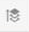

# 电子邮件设计人员常见问题

## 内容块和内容片段之间有何差异？

内容块和内容片段是多个电子邮件中常见的可重复使用的内容片段。 它们用于确保电子邮件的一致性，还用于优化／标准化电子邮件创建。 内容块和内容片段之间的差异是可能的自定义级别。

* 内容块是纯HTML，其中手动插入HTML代码（不是用户友好型UI，它是直接源代码）。 尽管它真正面向具有HTML知识的用户，但它允许内容片段中不提供个性化级别。

* 内容片段是通过电子邮件设计器使用其用户友好UI创建的可视内容。 但是，无法个性化内容。 如果需要个性化，则只能通过内容块进行个性化。

## 如何从HTML结构向元素添加填充？

可以使用HTML痕迹导航添加边距。

1. 在屏幕左下角，单击HTML痕迹导航。

   

1. 单击要添加边距的元素。
1. 单击HTML痕迹导航中的父标记。
您现在可以向此元素添加边距。

## 是否可以在电子邮件设计器中导入HTML内容？

您可以将自己的HTML内容上传到电子邮件设计器。 如果它尚未通过电子邮件设计器创建，它将以兼容模式加载，该模式旨在保留您的原始HTML，但通过UI限制某些版本功能。

有关详细信息，请参阅兼 [容性模式](../../designing/using/using-existing-content.md#compatibility-mode)

## 如何创建我的第一封电子邮件内容？

首先，从主页创建电子邮件。
然后，要向电子邮件中添加内容，您需要添加结构组件，并在其中插入内容组件。

有关详细信息，请参 [阅从头开始创建电子邮件](../../designing/using/quick-start.md#from-scratch-email)

## 为何需要更新片段？

Email Designer 正在不断改进。如果您从头开始、从现成模板创建电子邮件内容或创建片段，则可能需要将内容更新到最新版本以避免CSS冲突问题等问题。

有关详细信息，请参阅 [更新片段](../../designing/using/designing-content-in-adobe-campaign.md#email-designer-updates)

## 能否在主题中保存样式？

无法将样式另存为主题以供将来重用。但是，CSS 样式可保存在内容模板或电子邮件中。

有关详细信息，请参阅样 [式](../../designing/using/styles.md)

## 哪些字体可用？

在编辑样式时，默认情况下，只有大多数电子邮件客户端官方支持的Web字体可通过UI使用。 使用自定义字体需要更新HTML代码。
